## 概述

HTTP（HyperText Transfer Protocol）是互联网数据通信的基石。从 1991 年的 HTTP/0.9 到如今的 HTTP/3，协议经历了从简单到复杂、从低效到高性能的持续演进。每一次迭代都深刻影响了 Web 架构和工程实践。

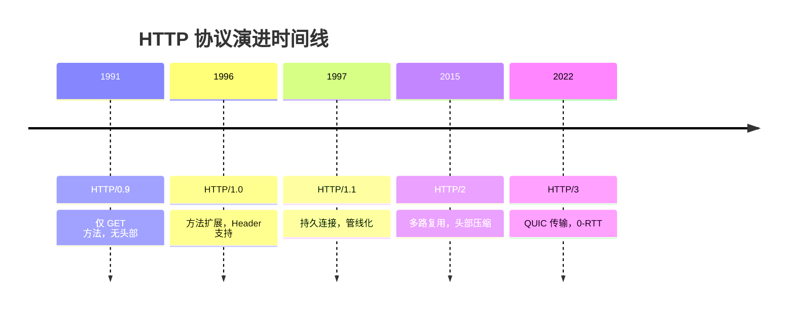

---

## HTTP/0.9 — 一切的开端

HTTP/0.9 极其简单：

- 仅支持 `GET` 方法
- 没有请求头和响应头
- 响应只能是 HTML
- 一次请求-响应后立即断开连接

```text
请求：GET /index.html
响应：<html>...</html>
```

**问题**：无法传输非 HTML 资源，无状态码，无缓存机制。

---

## HTTP/1.0 — 功能扩展

HTTP/1.0 引入了关键特性：

| 特性 | 说明 |
|------|------|
| 方法扩展 | GET、HEAD、POST |
| 请求/响应头 | Content-Type、Content-Length 等 |
| 状态码 | 200 OK、404 Not Found 等 |
| 多类型支持 | 不再限于 HTML |

```http
GET /index.html HTTP/1.0
Host: www.example.com
Accept: text/html

HTTP/1.0 200 OK
Content-Type: text/html
Content-Length: 1234

<html>...</html>
```

**核心问题**：每次请求都需要新建 TCP 连接，三次握手 + 慢启动带来巨大开销。

---

## HTTP/1.1 — 持久连接与管线化

### 持久连接（Persistent Connection）

HTTP/1.1 默认启用 `Connection: keep-alive`，一个 TCP 连接可以发送多个请求：

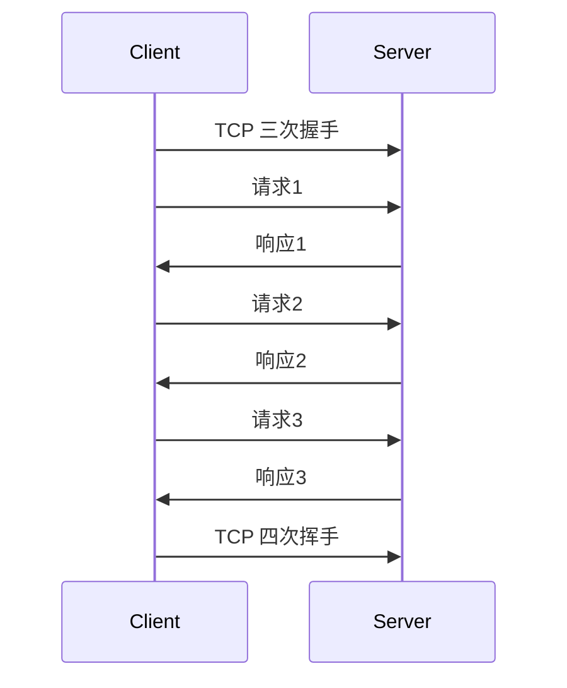

### 管线化（Pipelining）

管线化允许在未收到前一个响应时就发送下一个请求：

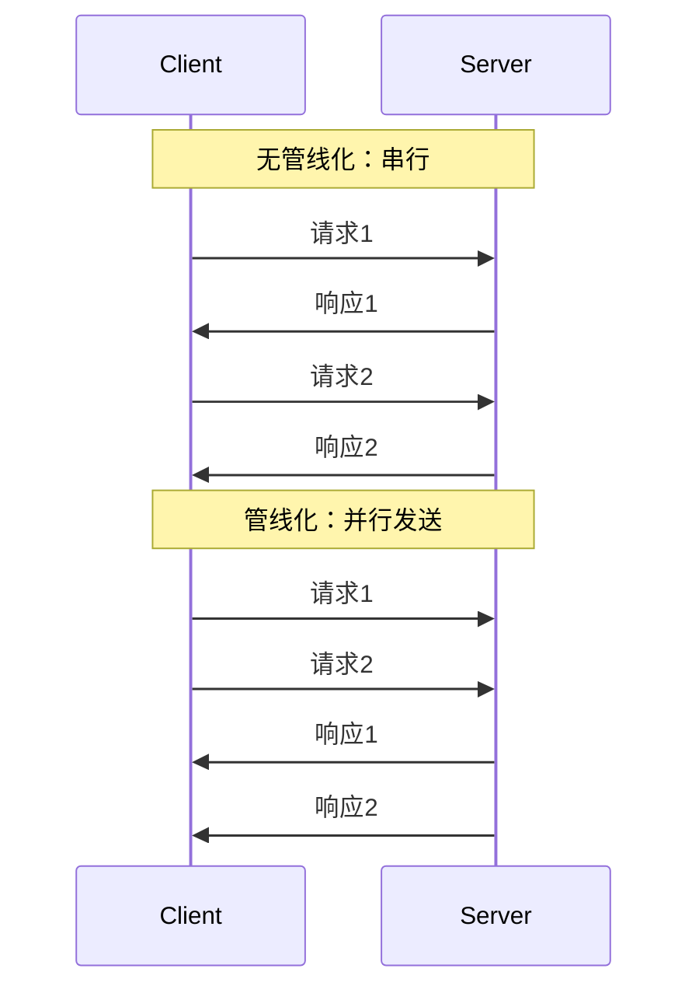

### HTTP/1.1 关键特性

| 特性 | 说明 |
|------|------|
| 持久连接 | 默认 keep-alive，减少 TCP 握手开销 |
| 管线化 | 允许连续发送请求（FIFO 响应） |
| 分块传输 | `Transfer-Encoding: chunked` |
| 缓存控制 | Cache-Control、ETag、If-None-Match |
| Host 头 | 支持虚拟主机 |
| 范围请求 | Range 请求支持断点续传 |

### 队头阻塞（Head-of-Line Blocking）

管线化存在严重的队头阻塞问题——如果第一个请求处理慢，后续所有请求都必须等待：

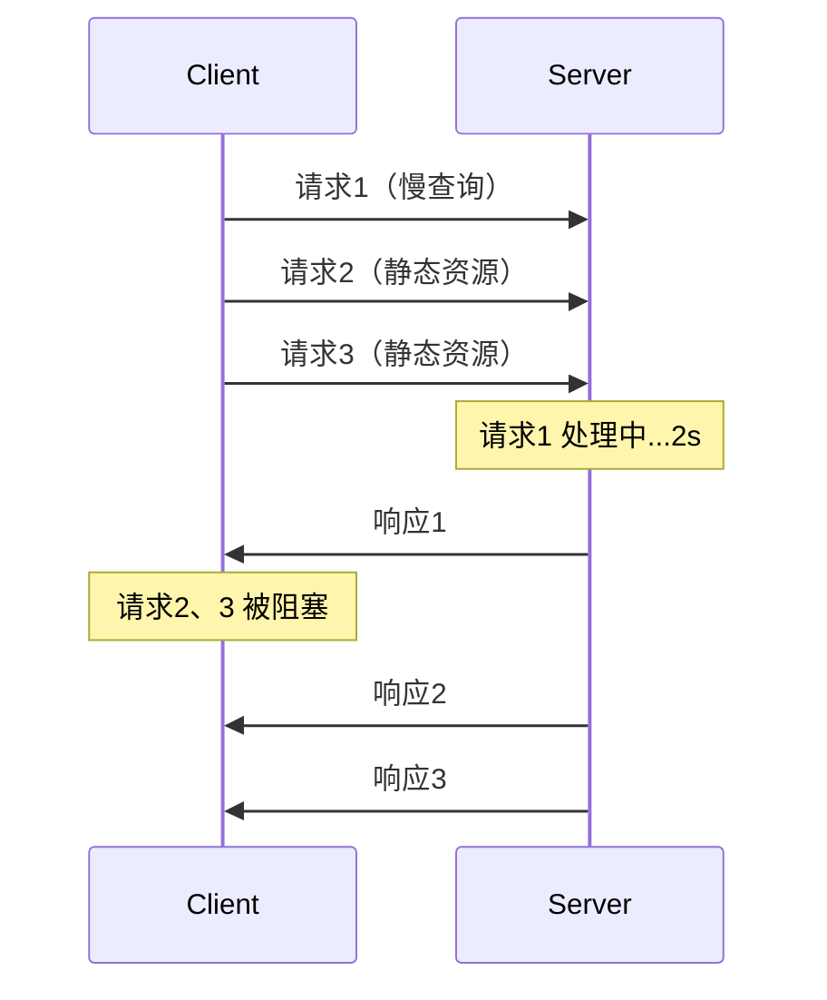

**工程实践**：浏览器通常采用 6 个并行 TCP 连接来缓解队头阻塞，但引入了额外的连接管理开销。

---

## HTTP/2 — 多路复用革命

### 核心概念

HTTP/2 在应用层引入了**帧（Frame）**和**流（Stream）**的概念：

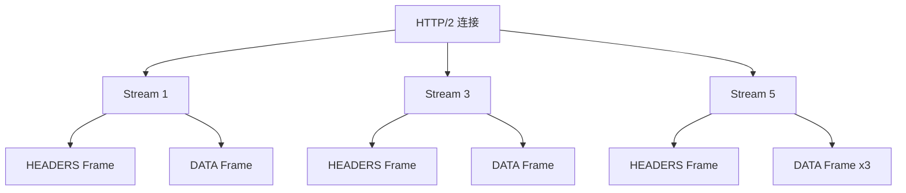

### 三大核心特性

#### 1. 多路复用（Multiplexing）

一个 TCP 连接上可以并行交错发送多个流的帧：

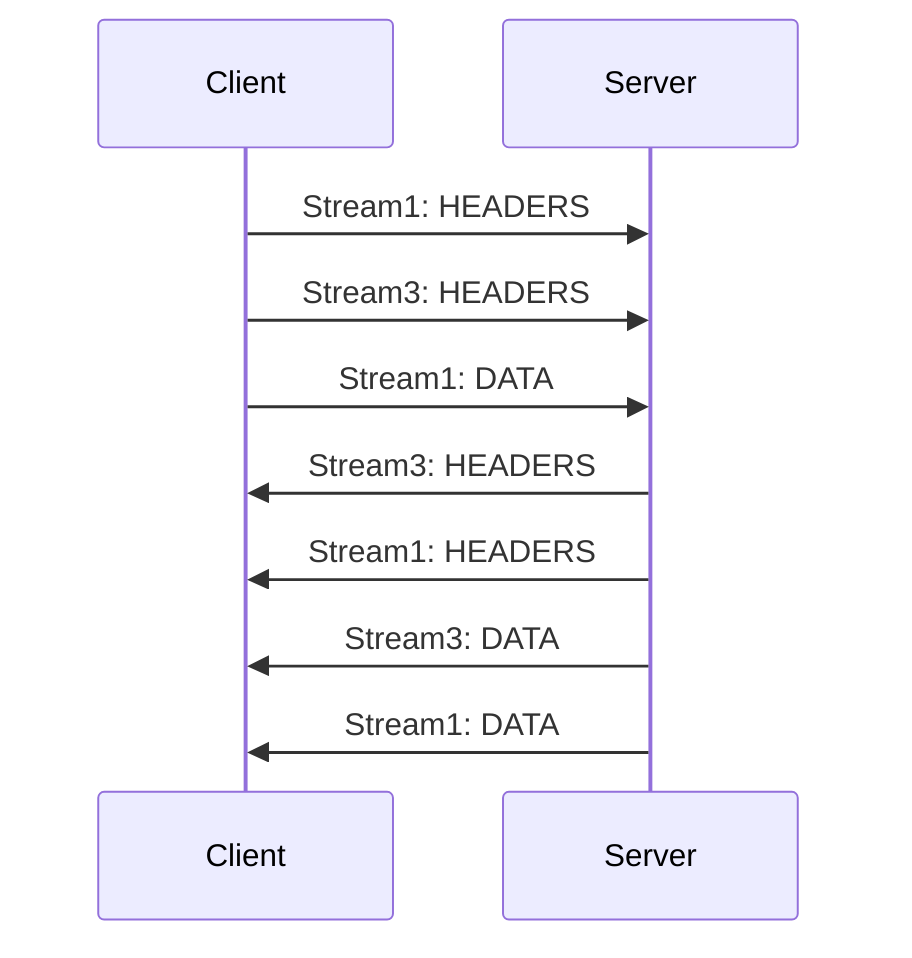

**关键**：不同流的帧可以交错传输，解决了应用层队头阻塞。

#### 2. 头部压缩（HPACK）

HTTP/1.1 每次请求都携带完整头部，大量重复字段浪费带宽。HPACK 使用：

- **静态表**：预定义 61 个常见头部字段
- **动态表**：基于连接历史动态维护
- **哈夫曼编码**：压缩字符串值

```text
静态表示例：
  Index  2  → :method GET
  Index  4  → :path /
  Index  16 → accept-encoding
  Index  49 → content-type

压缩前：:method: GET :path: / accept-encoding: gzip (约 50 bytes)
压缩后：0x82 0x84 0x90 (约 3 bytes)
```

#### 3. 服务器推送（Server Push）

服务器可以主动推送资源到客户端缓存：

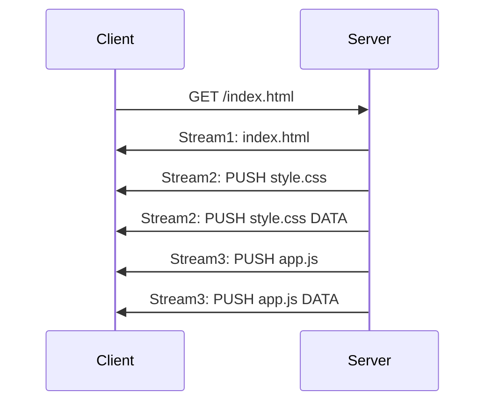

### HTTP/1.1 vs HTTP/2 对比

| 维度 | HTTP/1.1 | HTTP/2 |
|------|----------|--------|
| 连接复用 | 6 个并行 TCP 连接 | 单连接多路复用 |
| 头部处理 | 纯文本重复传输 | HPACK 压缩 |
| 请求优先级 | 无 | 权重与依赖 |
| 服务器推送 | 不支持 | 支持 |
| 传输单位 | 文本报文 | 二进制帧 |
| 队头阻塞 | 应用层 | 仅 TCP 层 |

### TCP 层队头阻塞

HTTP/2 解决了应用层队头阻塞，但 TCP 层的队头阻塞仍然存在：

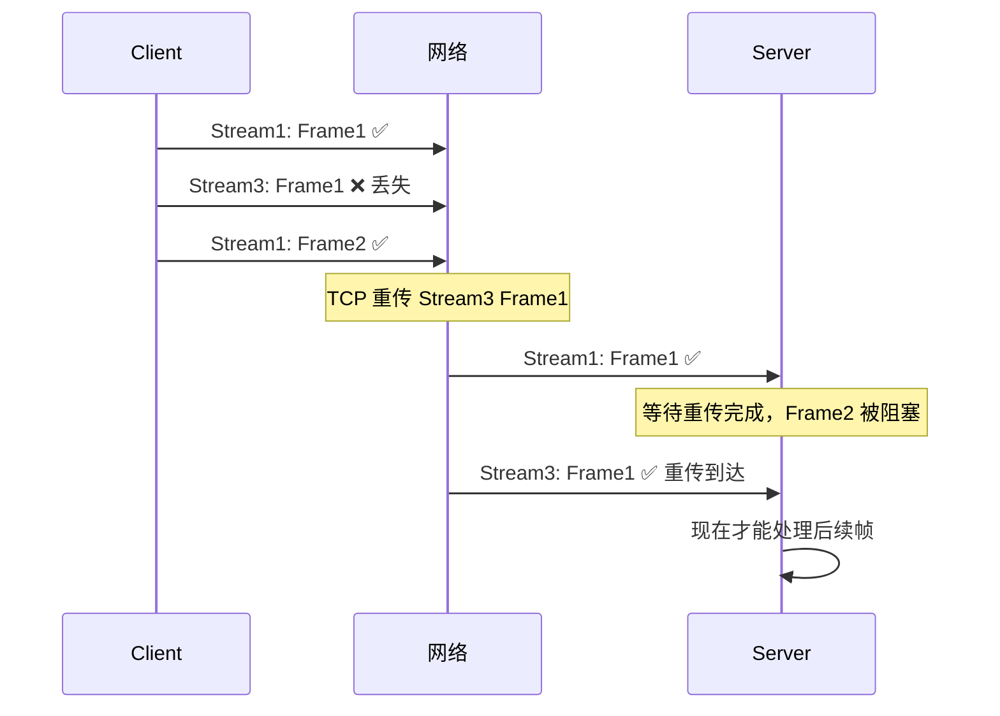

**一个 TCP 包丢失会阻塞所有流**，这是 HTTP/2 在高丢包率网络下性能退化的根本原因。

---

## HTTP/3 + QUIC — 传输层革命

### QUIC 协议

QUIC（Quick UDP Internet Connections）基于 UDP 构建，在用户态实现了可靠传输：

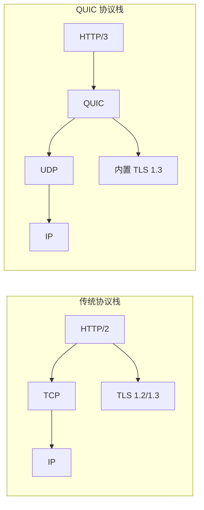

### QUIC 核心特性

#### 1. 连接迁移

TCP 连接由四元组（源IP、源端口、目标IP、目标端口）标识。网络切换时连接断开。QUIC 使用 **Connection ID** 标识连接：

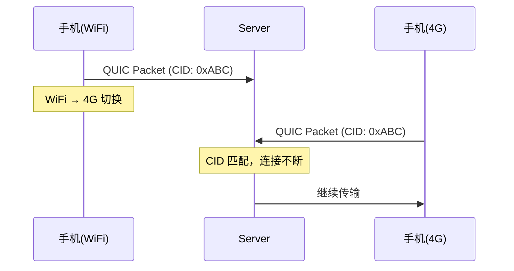

#### 2. 0-RTT 连接建立

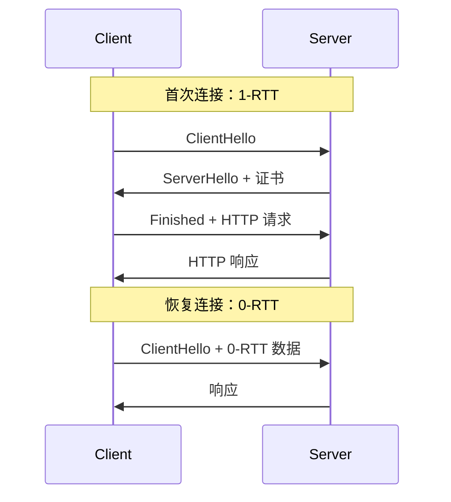

#### 3. 解决队头阻塞

QUIC 的流在传输层就是独立的，一个流的包丢失不影响其他流：

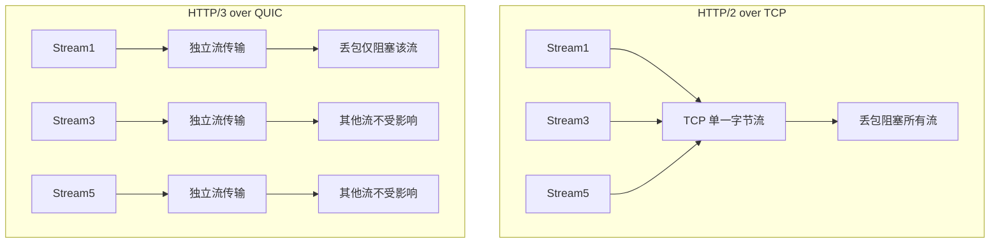

### HTTP/2 vs HTTP/3 对比

| 维度 | HTTP/2 | HTTP/3 |
|------|--------|--------|
| 传输层 | TCP | QUIC(UDP) |
| 队头阻塞 | TCP 层存在 | 完全消除 |
| 连接建立 | TCP + TLS = 2-3 RTT | 1-RTT / 0-RTT |
| 连接迁移 | 不支持 | CID 支持 |
| 拥塞控制 | 内核态 | 用户态，可定制 |
| 中间件兼容 | 好 | UDP 可能被拦截 |

---

## HTTPS — 安全层

### HTTPS 架构

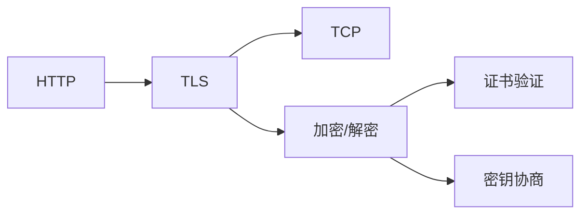

### TLS 在 HTTP 协议栈中的位置

```
+-------------------+
|    HTTP/1.1/2/3   |  应用层
+-------------------+
|       TLS         |  安全层
+-------------------+
|   TCP / QUIC      |  传输层
+-------------------+
|       IP          |  网络层
+-------------------+
```

### HTTPS 性能优化实践

| 优化手段 | 说明 | 效果 |
|----------|------|------|
| Session 复用 | TLS Session ID / Session Ticket | 减少 1-RTT |
| OCSP Stapling | 服务器附带证书状态 | 减少客户端验证延迟 |
| HSTS | 强制 HTTPS | 消除 302 跳转 |
| 证书链优化 | 减少中间证书层级 | 减少验证时间 |
| HTTP/2 | 多路复用 | 减少连接数 |
| 0-RTT | TLS 1.3 + QUIC | 恢复连接零延迟 |

---

## 工程实践：协议选型决策

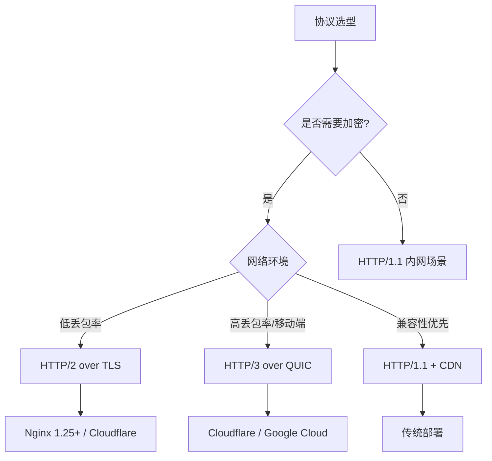

### Nginx 配置 HTTP/2

```nginx
server {
    listen 443 ssl http2;
    server_name example.com;

    ssl_certificate     /etc/ssl/cert.pem;
    ssl_certificate_key /etc/ssl/key.pem;

    # TLS 1.3
    ssl_protocols TLSv1.2 TLSv1.3;
    ssl_prefer_server_ciphers on;

    # HSTS
    add_header Strict-Transport-Security "max-age=31536000; includeSubDomains" always;

    # OCSP Stapling
    ssl_stapling on;
    ssl_stapling_verify on;
}
```

### Nginx 配置 HTTP/3（实验性）

```nginx
server {
    listen 443 quic reuseport;
    listen 443 ssl;
    http2 on;

    ssl_protocols TLSv1.3;

    # Alt-Svc 头声明 HTTP/3 支持
    add_header Alt-Svc 'h3=":443"; ma=86400';
}
```

---

## 全版本对比总览

| 特性 | HTTP/0.9 | HTTP/1.0 | HTTP/1.1 | HTTP/2 | HTTP/3 |
|------|----------|----------|----------|--------|--------|
| 方法 | GET | GET/HEAD/POST | 全部 | 全部 | 全部 |
| 头部 | 无 | 有 | 有 | HPACK压缩 | QPACK压缩 |
| 连接 | 短连接 | 短连接 | 持久连接 | 多路复用 | 多路复用 |
| 加密 | 无 | 无 | 可选 | 可选 | 强制TLS1.3 |
| 传输层 | TCP | TCP | TCP | TCP | QUIC/UDP |
| 队头阻塞 | N/A | 严重 | 应用层 | TCP层 | 无 |
| 连接建立 | 1-RTT | 1-RTT | 1-RTT | 2-3RTT | 0-1RTT |
| 服务器推送 | 无 | 无 | 无 | 有 | 有 |

---

## 面试 Q&A

**Q1: HTTP/1.1 的管线化为什么没有被广泛使用？**

A: 管线化要求响应按序返回（FIFO），导致队头阻塞问题。如果第一个请求响应慢，后续响应全部被阻塞。此外，代理服务器和中间件对管线化支持不一致，存在兼容性问题。浏览器大多默认禁用管线化。

**Q2: HTTP/2 多路复用是否意味着不需要域名分片了？**

A: 是的。HTTP/2 单连接即可并行传输多个流，域名分片反而有害——多个连接会分散拥塞窗口，降低吞吐量，且无法共享 HPACK 动态表。最佳实践是合并到同一域名下。

**Q3: HTTP/3 为什么选择 UDP 而不是改进 TCP？**

A: TCP 协议栈在操作系统内核中实现，升级需要修改内核并广泛部署，周期极长。中间网络设备（NAT、防火墙）对 TCP 行为有固定预期，修改可能导致兼容性问题。QUIC 选择在用户态基于 UDP 实现，可以快速迭代，且 UDP 穿透性好。

**Q4: 0-RTT 有什么安全风险？**

A: 0-RTT 数据可能遭受**重放攻击**。攻击者可以捕获并重放 0-RTT 请求，导致服务器重复执行操作（如重复支付）。因此 0-RTT 仅适用于幂等请求，非幂等操作应使用 1-RTT。

**Q5: 如何判断当前网站使用的 HTTP 版本？**

A: Chrome DevTools → Network 面板 → 右键列头 → 勾选 Protocol 列。也可以通过 `curl -I --http2` 或查看响应头中的 Alt-Svc 字段判断 HTTP/3 支持。

**Q6: HTTP/2 的服务器推送在实际中为什么使用较少？**

A: 服务器推送存在几个问题：(1) 服务器难以准确判断客户端是否已缓存该资源；(2) 推送的资源占用客户端缓存空间；(3) 中间代理可能不支持推送；(4) Chrome 已在 2023 年宣布移除 HTTP/2 Server Push 支持。替代方案是使用 `<link rel="preload">` 让客户端主动预加载。

<div class='context-nav'>
<a class='context-link prev' href='/software-fundamentals/posts/计算机网络-HTTPS优化/'><span class='context-label'>上一篇</span><span class='context-title'>HTTPS 如何优化</span></a>
<a class='context-link next' href='/software-fundamentals/posts/计算机网络-HTTP常见面试题/'><span class='context-label'>下一篇</span><span class='context-title'>HTTP 常见面试</span></a>
</div>
