## 1. 文件系统概述

文件系统是操作系统中负责持久化数据管理的子系统，将磁盘的块设备抽象为文件和目录的层次结构。

### 1.1 文件系统在 OS 中的位置

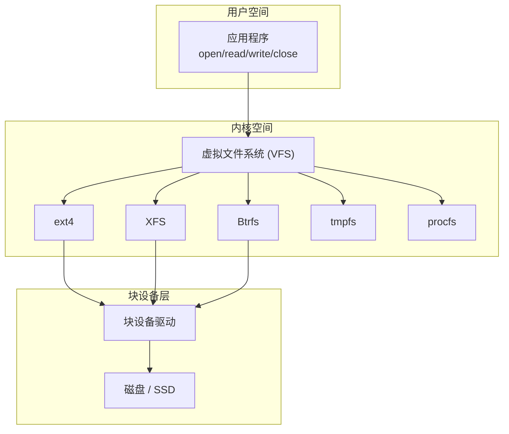

### 1.2 文件系统的核心功能

| 功能 | 描述 |
|------|------|
| 命名空间 | 提供文件/目录的层次化命名 |
| 存储管理 | 管理磁盘块的分配与回收 |
| 元数据管理 | 文件大小、权限、时间戳等 |
| 数据一致性 | 崩溃后保证文件系统一致性 |
| 访问控制 | 权限检查（rwx/ACL） |
| 缓存 | 页缓存提高访问性能 |

## 2. inode 与目录项

### 2.1 inode (索引节点)

inode 是文件系统中最重要的数据结构，存储文件的元数据和数据块指针。

```c
// 简化的 ext4 inode 结构
struct ext4_inode {
    __le16  i_mode;          // 文件类型和权限
    __le16  i_uid;           // 所有者UID
    __le32  i_size_lo;       // 文件大小(低32位)
    __le32  i_atime;         // 最后访问时间
    __le32  i_ctime;         // inode修改时间
    __le32  i_mtime;         // 文件内容修改时间
    __le32  i_dtime;         // 删除时间
    __le16  i_gid;           // 组GID
    __le16  i_links_count;   // 硬链接计数
    __le32  i_blocks_lo;     // 占用块数
    __le32  i_flags;         // 文件标志

    // 数据块指针 (经典12+1+1+1+1布局)
    __le32  i_block[EXT4_N_BLOCKS];  // 15个指针

    __le32  i_generation;    // 文件版本号
    __le32  i_file_acl_lo;   // ACL位置
};
```

### 2.2 数据块寻址

ext4 的 inode 使用多级间接寻址来支持大文件：

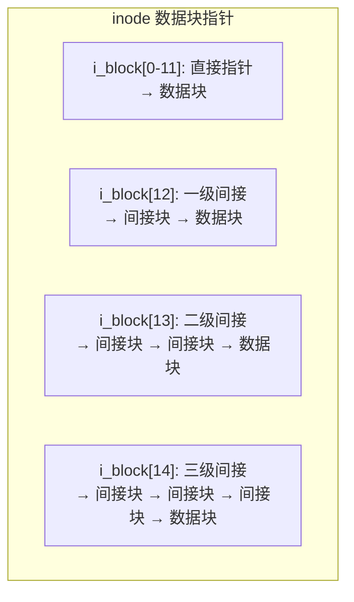

| 指针类型 | 块大小 4KB 时可寻址范围 | 说明 |
|----------|------------------------|------|
| 12个直接指针 | 48 KB | 小文件直接访问，无额外IO |
| 1个一级间接 | 4 MB | 1024个指针 × 4KB |
| 1个二级间接 | 4 GB | 1024² × 4KB |
| 1个三级间接 | 4 TB | 1024³ × 4KB |

> ext4 实际使用 Extent Tree 替代了传统间接块，大文件性能更好。

### 2.3 Extent Tree

ext4 引入 Extent 替代间接块，一个 Extent 描述一段连续的块：

```c
// ext4 extent 结构
struct ext4_extent {
    __le32  ee_block;     // 起始逻辑块号
    __le16  ee_len;       // extent长度(块数)
    __le16  ee_start_hi;  // 物理块号高16位
    __le32  ee_start_lo;  // 物理块号低32位
};

// 一个extent可描述最多 2^15 = 32768 个连续块 (128MB @ 4KB)
```

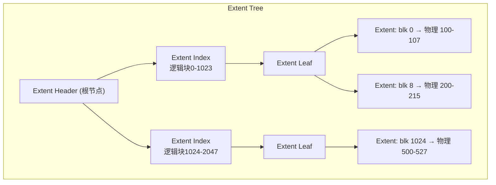

### 2.4 目录项 (dentry)

目录是特殊文件，内容是目录项列表，每个目录项映射文件名到 inode 号。

```c
// ext4 目录项结构
struct ext4_dir_entry_2 {
    __le32  inode;         // inode号 (0表示未使用)
    __le16  rec_len;       // 目录项长度
    __u8    name_len;      // 文件名长度
    __u8    file_type;     // 文件类型 (DT_REG/DT_DIR等)
    char    name[];        // 文件名 (最长255)
};
```

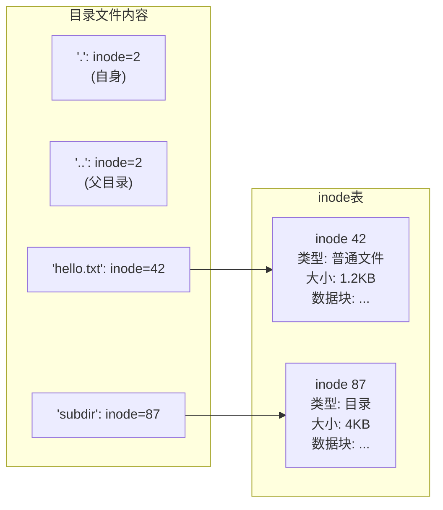

### 2.5 硬链接与软链接

| 特性 | 硬链接 | 软链接(符号链接) |
|------|--------|------------------|
| 本质 | 同一 inode 的多个目录项 | 独立 inode，内容是目标路径 |
| inode 号 | 相同 | 不同 |
| 跨文件系统 | 不可以 | 可以 |
| 链接目录 | 不可以 | 可以 |
| 原文件删除后 | 仍可访问 | 断裂(dangling link) |
| 创建命令 | `ln src dst` | `ln -s src dst` |

```bash
# 硬链接
$ ln /data/hello.txt /data/hello_hard.txt
$ ls -li /data/hello*.txt
42 -rw-r--r-- 2 user group 1200 May 26 10:00 /data/hello.txt
42 -rw-r--r-- 2 user group 1200 May 26 10:00 /data/hello_hard.txt
#  ↑ inode号相同    ↑ 硬链接计数=2

# 软链接
$ ln -s /data/hello.txt /data/hello_soft.txt
$ ls -li /data/hello*.txt
42 -rw-r--r-- 1 user group 1200 May 26 10:00 /data/hello.txt
99 lrwxrwxrwx 1 user group   15 May 26 10:01 /data/hello_soft.txt -> /data/hello.txt
#  ↑ inode号不同
```

## 3. ext4 文件系统结构

### 3.1 磁盘布局

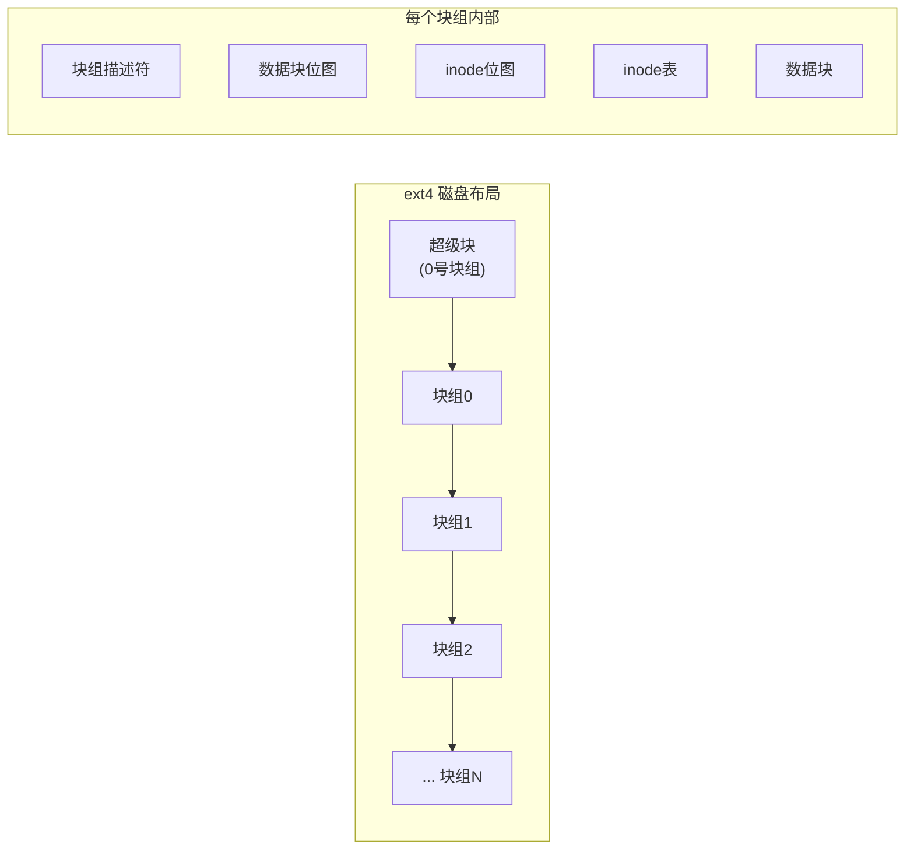

```c
// ext4 超级块 (简化)
struct ext4_super_block {
    __le32  s_inodes_count;       // inode总数
    __le32  s_blocks_count_lo;    // 块总数
    __le32  s_log_block_size;     // 块大小 (0=1K,1=2K,2=4K)
    __le32  s_blocks_per_group;   // 每组块数
    __le32  s_inodes_per_group;   // 每组inode数
    __le32  s_feature_compat;     // 兼容特性
    __le32  s_feature_incompat;   // 不兼容特性
    __le32  s_feature_ro_compat;  // 只读兼容特性
    __le16  s_inode_size;         // inode大小(通常256)
    char    s_volume_name[16];    // 卷标
};
```

### 3.2 块组的作用

ext4 将磁盘划分为块组(Block Group)，每个块组独立管理自己的 inode 和数据块：

| 组件 | 作用 |
|------|------|
| 块组描述符 | 记录该组内各组件的位置和空闲计数 |
| 数据块位图 | 记录组内哪些数据块空闲 (1bit/块) |
| inode 位图 | 记录组内哪些 inode 空闲 (1bit/inode) |
| inode 表 | 存放组内所有 inode |
| 数据块 | 存放文件内容 |

**局部性原理**：创建文件时，ext4 尽量将文件的 inode 和数据块分配在同一块组，减少磁头寻道。

### 3.3 ext4 关键特性

| 特性 | 描述 | 优势 |
|------|------|------|
| Extent | 替代间接块，连续块映射 | 大文件性能好，减少碎片 |
| 日志 (Journal) | 记录元数据/数据变更 | 崩溃恢复快 |
| 延迟分配 | 写入时不立即分配块 | 减少碎片，优化IO合并 |
| 在线碎片整理 | 运行时整理碎片 | 无需卸载文件系统 |
| 大文件支持 | 最大 16TB (4K块) | 支持大数据 |
| 无日志模式 | 可禁用日志 | 提升性能(牺牲安全性) |

## 4. 日志 (Journal) 机制

### 4.1 为什么需要日志

文件系统操作往往涉及多个磁盘块的修改（如创建文件需修改：目录块、inode位图、inode、数据块位图、数据块）。如果中途崩溃，可能导致不一致状态。

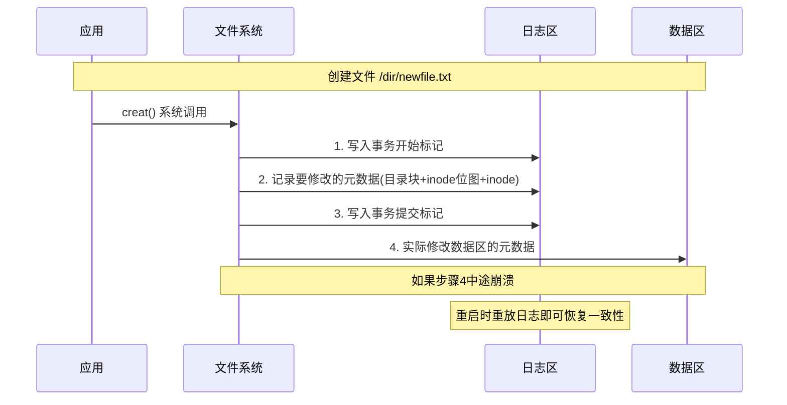

### 4.2 日志模式

| 模式 | 记录内容 | 安全性 | 性能 |
|------|----------|--------|------|
| Journal | 元数据 + 数据 | 最高 | 最低 |
| Ordered | 仅元数据(但保证数据先写) | 高 | 中 |
| Writeback | 仅元数据(不保证数据先写) | 低 | 最高 |

```bash
# 查看当前日志模式
$ dumpe2fs /dev/sda1 | grep "Filesystem features"
# 或
$ mount | grep ext4
/dev/sda1 on / type ext4 (rw,relatime,data=ordered)

# 设置日志模式
$ mount -o data=journal /dev/sda1 /mnt
$ mount -o data=writeback /dev/sda1 /mnt
```

### 4.3 日志的内部结构

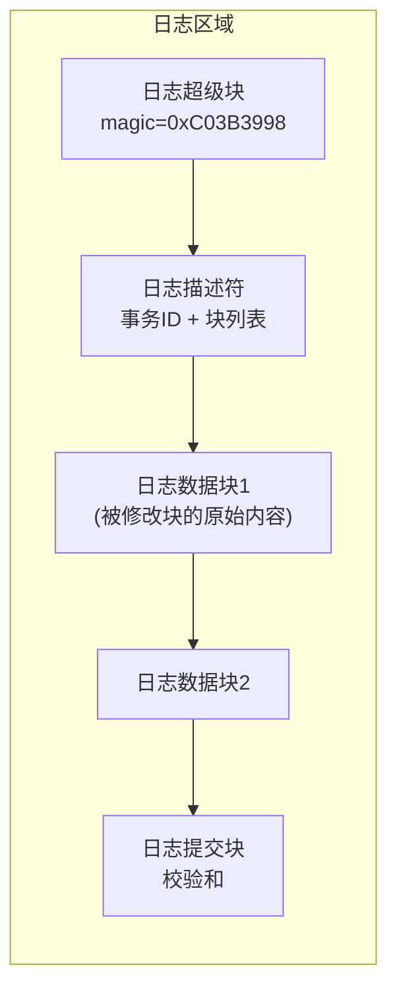

```c
// 日志事务的三个阶段
// 1. Journal Write: 将修改写入日志区
// 2. Journal Commit: 写入提交标记(保证原子性)
// 3. Checkpoint: 将修改写入数据区最终位置

// ext4 日志恢复流程
void journal_recover(journal_t *journal) {
    // Phase 1: 扫描日志，找到有效事务
    for each transaction in journal:
        if has_commit_block(transaction):
            add to replay_list

    // Phase 2: 重放所有已提交的事务
    for each transaction in replay_list:
        for each block in transaction:
            write_block(block.data, block.target_location)

    // Phase 3: 丢弃未完成的事务
    journal_reset(journal);
}
```

## 5. 虚拟文件系统 VFS

VFS 是内核提供的文件系统抽象层，使得不同文件系统可以用统一的接口访问。

### 5.1 VFS 四大对象

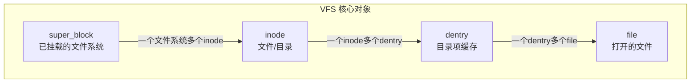

| 对象 | 作用 | 生命周期 |
|------|------|----------|
| super_block | 表示已挂载的文件系统实例 | 挂载到卸载 |
| inode | 表示一个文件/目录 | 从磁盘读取，可缓存 |
| dentry | 路径名到 inode 的映射 | 路径查找时创建，可回收 |
| file | 表示进程打开的文件 | open 到 close |

### 5.2 VFS 操作接口

```c
// super_operations: 文件系统级操作
struct super_operations {
    struct inode *(*alloc_inode)(struct super_block *sb);
    void (*destroy_inode)(struct inode *);
    void (*dirty_inode)(struct inode *, int flags);
    int (*write_inode)(struct inode *, struct writeback_control *);
    void (*evict_inode)(struct inode *);
    int (*statfs)(struct dentry *, struct kstatfs *);
    int (*remount_fs)(struct super_block *, int *, char *);
};

// inode_operations: 文件级操作
struct inode_operations {
    struct dentry *(*lookup)(struct inode *, struct dentry *, unsigned int);
    int (*create)(struct inode *, struct dentry *, umode_t, bool);
    int (*link)(struct dentry *, struct inode *, struct dentry *);
    int (*unlink)(struct inode *, struct dentry *);
    int (*mkdir)(struct inode *, struct dentry *, umode_t);
    int (*rename)(struct inode *, struct dentry *,
                  struct inode *, struct dentry *, unsigned int);
};

// file_operations: 文件IO操作
struct file_operations {
    loff_t (*llseek)(struct file *, loff_t, int);
    ssize_t (*read)(struct file *, char __user *, size_t, loff_t *);
    ssize_t (*write)(struct file *, const char __user *, size_t, loff_t *);
    int (*mmap)(struct file *, struct vm_area_struct *);
    int (*open)(struct inode *, struct file *);
    int (*release)(struct inode *, struct file *);
    int (*fsync)(struct file *, loff_t, loff_t, int);
};
```

### 5.3 路径查找过程

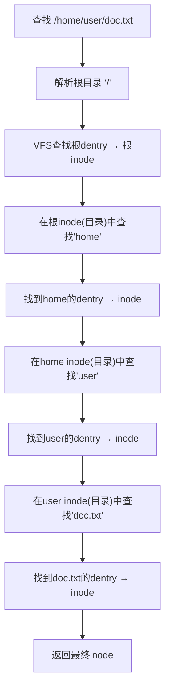

VFS 使用 dcache (目录项缓存) 加速路径查找，避免每次都读磁盘目录。

## 6. FUSE (Filesystem in Userspace)

FUSE 允许在用户空间实现文件系统，无需修改内核。

### 6.1 FUSE 架构

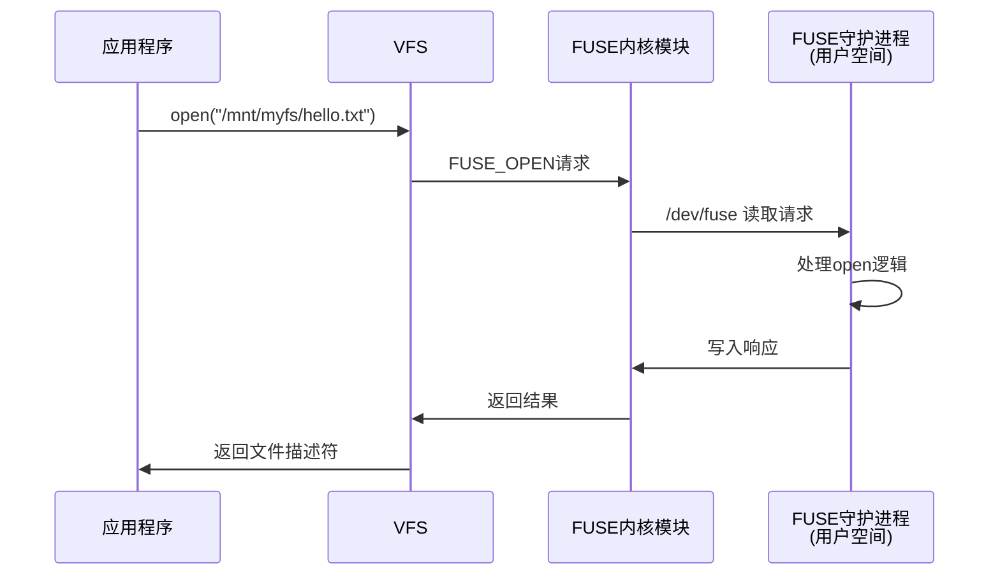

```c
// FUSE 用户空间实现示例
#include <fuse3/fuse.h>

static int myfs_getattr(const char *path, struct stat *stbuf,
                        struct fuse_file_info *fi) {
    memset(stbuf, 0, sizeof(struct stat));
    if (strcmp(path, "/") == 0) {
        stbuf->st_mode = S_IFDIR | 0755;
        stbuf->st_nlink = 2;
    } else if (strcmp(path, "/hello.txt") == 0) {
        stbuf->st_mode = S_IFREG | 0444;
        stbuf->st_nlink = 1;
        stbuf->st_size = 12;
    } else {
        return -ENOENT;
    }
    return 0;
}

static int myfs_read(const char *path, char *buf, size_t size,
                     off_t offset, struct fuse_file_info *fi) {
    const char *data = "Hello World\n";
    size_t len = strlen(data);
    if (offset < len) {
        if (offset + size > len) size = len - offset;
        memcpy(buf, data + offset, size);
    } else {
        size = 0;
    }
    return size;
}

static struct fuse_operations myfs_ops = {
    .getattr = myfs_getattr,
    .read    = myfs_read,
};

int main(int argc, char *argv[]) {
    return fuse_main(argc, argv, &myfs_ops, NULL);
}
```

### 6.2 FUSE 的优缺点

| 优点 | 缺点 |
|------|------|
| 开发调试方便 | 性能开销大（内核↔用户态切换） |
| 崩溃不影响内核 | 不适合高性能场景 |
| 可用任何语言实现 | 并发受限（/dev/fuse串行化） |
| 丰富的生态（sshfs/s3fs等） | 不支持 O_DIRECT 对齐要求 |

## 7. ZFS 与 Btrfs 简介

### 7.1 ZFS

ZFS (Zettabyte File System) 最初由 Sun 开发，以数据完整性为核心设计目标。

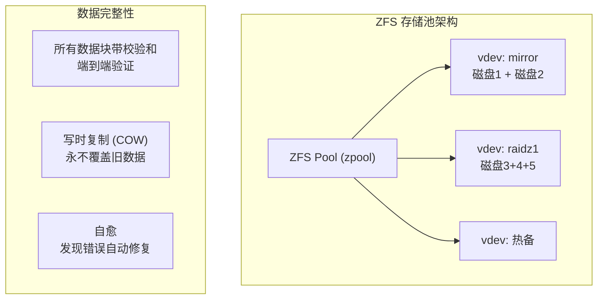

| 特性 | 描述 |
|------|------|
| 存储池 | 文件系统建立在存储池之上，动态扩展 |
| 写时复制 | 所有修改创建新块，旧块保留用于快照 |
| 校验和 | 每个数据块 256 位校验和，端到端验证 |
| 自愈 | 读数据时校验，发现错误用冗余副本修复 |
| 快照 | 瞬时创建，零空间开销（共享未修改块） |
| RAID-Z | 比 RAID5 更安全的软 RAID |
| 去重 | 可选的块级去重 |

### 7.2 Btrfs

Btrfs (B-tree File System) 是 Linux 原生的现代文件系统，目标是替代 ext4。

```c
// Btrfs 核心特性
// 1. COW B-tree: 所有元数据和数据使用B-tree + COW
// 2. 子卷: 类似独立文件系统的命名空间
// 3. 快照: 子卷的瞬时只读/读写快照
// 4. 在线平衡: 运行时重新分布数据
// 5. 透明压缩: 支持 lzo/zstd/lz4 压缩
// 6. 校验和: 元数据和数据都带校验 (crc32c)
```

```bash
# Btrfs 常用操作
# 创建文件系统
$ mkfs.btrfs /dev/sda1 /dev/sdb1

# 创建子卷
$ btrfs subvolume create /mnt/data/subvol1

# 创建快照
$ btrfs subvolume snapshot /mnt/data/subvol1 /mnt/data/snap1

# 在线平衡
$ btrfs balance start /mnt/data

# 透明压缩挂载
$ mount -o compress=zstd /dev/sda1 /mnt/data

# RAID1 创建
$ mkfs.btrfs -d raid1 -m raid1 /dev/sda1 /dev/sdb1
```

### 7.3 ext4 vs ZFS vs Btrfs 对比

| 特性 | ext4 | ZFS | Btrfs |
|------|------|-----|-------|
| 日志 | 有 | 有(内置) | 有(内置) |
| COW | 无 | 全局COW | 全局COW |
| 快照 | 无 | 有(瞬时) | 有(瞬时) |
| 校验和 | 无 | 有(端到端) | 有(元数据+数据) |
| 自愈 | 无 | 有 | 有(有限) |
| 内置RAID | 无 | RAID-Z | RAID0/1/5/6/10 |
| 子卷 | 无 | 有(zfs dataset) | 有 |
| 去重 | 无 | 有(可选) | 有(实验性) |
| 压缩 | 无 | 有(LZ4/ZSTD) | 有(LZO/ZSTD/LZ4) |
| 在线缩容 | 不支持 | 支持 | 支持 |
| 最大文件 | 16TB | 16EB | 16EB |
| Linux内核 | 原生 | 需DKMS/ZoL | 原生 |
| 成熟度 | 非常成熟 | 成熟(生产级) | 基本成熟 |
| 适用场景 | 通用 | 存储服务器/NAS | 桌面/服务器 |

## 8. 页缓存与 IO 路径

### 8.1 Linux IO 完整路径

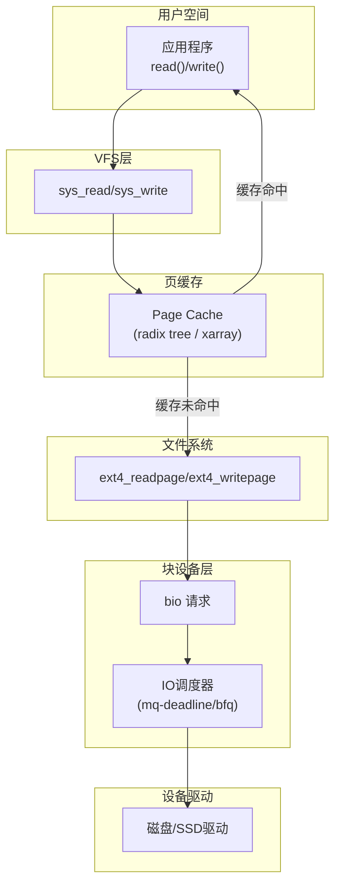

### 8.2 页缓存的关键参数

```bash
# 查看页缓存状态
$ cat /proc/meminfo | grep -E "Cached|Buffers|Dirty|Writeback"
Cached:          8234567 kB    # 页缓存大小
Buffers:          234567 kB    # 块设备缓冲区
Dirty:              5678 kB    # 待写回的脏页
Writeback:            12 kB    # 正在写回的页

# 调整脏页回写策略
$ sysctl vm.dirty_ratio = 20           # 脏页占总内存20%时强制写回
$ sysctl vm.dirty_background_ratio = 5 # 脏页占5%时开始后台写回
$ sysctl vm.dirty_writeback_centisecs = 500  # 每5秒唤醒写回线程
```

### 8.3 Direct IO vs Buffered IO

| 特性 | Buffered IO | Direct IO |
|------|-------------|-----------|
| 页缓存 | 经过 | 绕过 |
| 数据拷贝 | 2次(内核↔用户) | 1次(DMA直传) |
| 对齐要求 | 无 | 缓冲区/偏移/长度需对齐到块大小 |
| 适用场景 | 通用 | 数据库(自有缓存) |
| 一致性 | 内核保证 | 应用负责 |

```c
// Direct IO 示例
int fd = open("/data/large_file", O_RDONLY | O_DIRECT);

// 缓冲区必须对齐到块大小(通常512字节或4KB)
void *buf;
posix_memalign(&buf, 4096, 4096);  // 4KB对齐

// 偏移也必须对齐
ssize_t n = pread(fd, buf, 4096, offset);  // offset必须是4096的倍数
```

## 9. 面试 Q&A

**Q1: inode 和文件名是什么关系？为什么删除文件名后文件数据不一定消失？**

A: inode 存储文件的元数据和数据块指针，文件名存储在父目录的目录项中，目录项映射文件名→inode号。它们是多对一关系（硬链接）。删除文件名只是删除目录项并将 inode 的硬链接计数减1，只有当链接计数降为0且没有进程打开该文件时，才会真正释放 inode 和数据块。这就是为什么进程打开的文件被 rm 后仍然可以读写——inode 和数据块还在，直到进程关闭文件描述符。

**Q2: ext4 的日志为什么默认用 Ordered 模式而不是 Journal 模式？**

A: Journal 模式记录元数据和数据，安全性最高但性能最差——每个数据块都要写两次（日志+数据区）。Ordered 模式只记录元数据，但保证数据块先于元数据写入磁盘，这样即使崩溃，元数据指向的数据块要么是旧的完整数据，要么是新的完整数据，不会出现元数据指向未初始化数据块的情况。Ordered 在安全性和性能间取得了最佳平衡，是大多数工作负载的最佳选择。Writeback 模式虽然最快，但崩溃后可能出现文件内容被旧数据填充的问题。

**Q3: VFS 的 dcache 有什么作用？路径查找如何优化？**

A: dcache 缓存最近查找过的目录项(dentry)，将路径名映射到 inode，避免重复读磁盘目录。路径查找时，VFS 逐级解析路径分量，每级先查 dcache，命中则直接获取 inode，未命中才读磁盘目录并创建 dentry 缓存。dcache 使用 LRU 回收策略，内存紧张时释放最久未访问的 dentry。对于频繁访问的热路径（如 /usr/lib），dcache 命中率接近 100%，路径查找几乎零磁盘IO。

**Q4: FUSE 的性能瓶颈在哪里？如何优化？**

A: 主要瓶颈是内核↔用户态的上下文切换：每次文件操作都要经过 VFS→FUSE内核模块→/dev/fuse→用户态守护进程→/dev/fuse→FUSE内核模块→VFS 的完整路径。优化方案：(1) 增大 FUSE 的读写粒度（max_read/max_write）；(2) 启用 FUSE 的 writeback 缓存模式（写操作先缓存再批量提交）；(3) 启用 readdirplus（一次获取目录项+inode信息）；(4) 使用多线程 FUSE 守护进程并行处理请求；(5) 对于高性能需求，考虑内核态文件系统。

**Q5: Btrfs 的 COW 对数据库性能有什么影响？**

A: COW 导致严重的写放大和碎片化。数据库的随机写模式（如 InnoDB 的页更新）在 COW 下每次修改都要重写整个数据块+更新所有层级的 B-tree 节点，导致：(1) 写放大严重，实际写盘量远大于逻辑写入量；(2) 空间碎片化，COW 分配的新块可能不连续；(3) 性能随时间下降。解决方案：(1) 数据库使用 Direct IO 绕过页缓存；(2) 在 Btrfs 上禁用 COW（chattr +C）；(3) 使用 ext4 或 XFS 作为数据库文件系统。这也是为什么生产环境数据库仍首选 ext4/XFS。

**Q6: 如何理解文件系统的"一致性"？fsync() 保证了什么？**

A: 文件系统一致性有两层含义：(1) 元数据一致性——文件系统结构完整，无孤立 inode 或错误指针；(2) 数据一致性——应用写入的数据确实落盘。fsync() 保证调用返回后，文件的数据和元数据已持久化到磁盘（绕过页缓存写回），即使系统崩溃也不丢失。但 fsync() 不保证目录项的持久化——新创建的文件 fsync() 后，如果目录项未写回，崩溃后文件可能"消失"。需要同时对父目录调用 fsync() 才能保证新文件在崩溃后可被发现。这是很多数据库 WAL 实现的细节。
