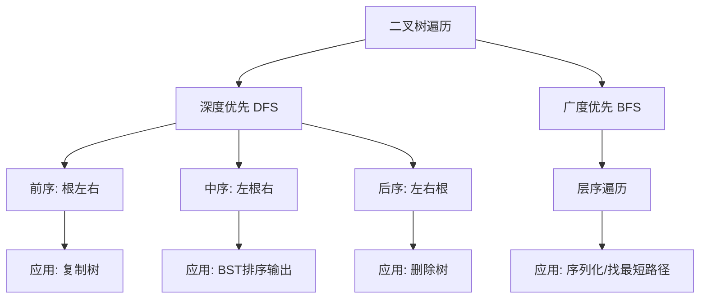
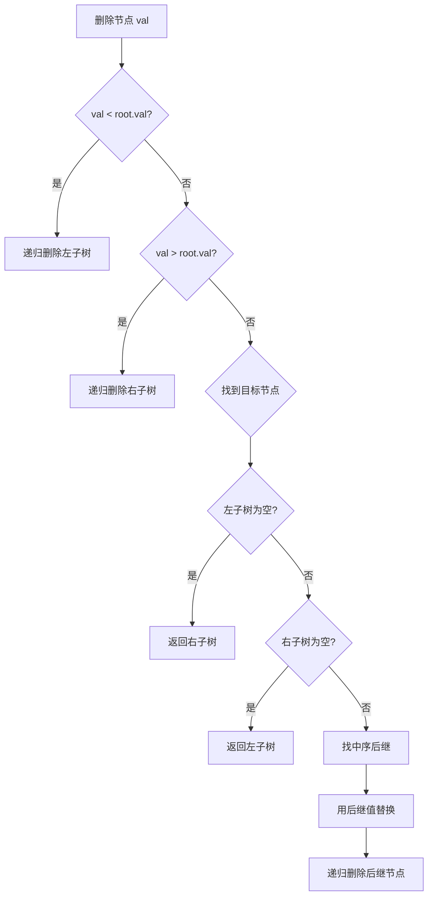
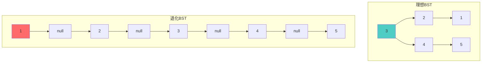
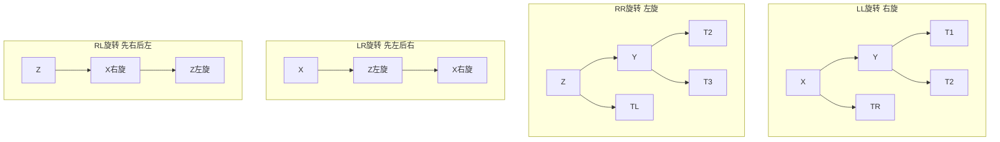
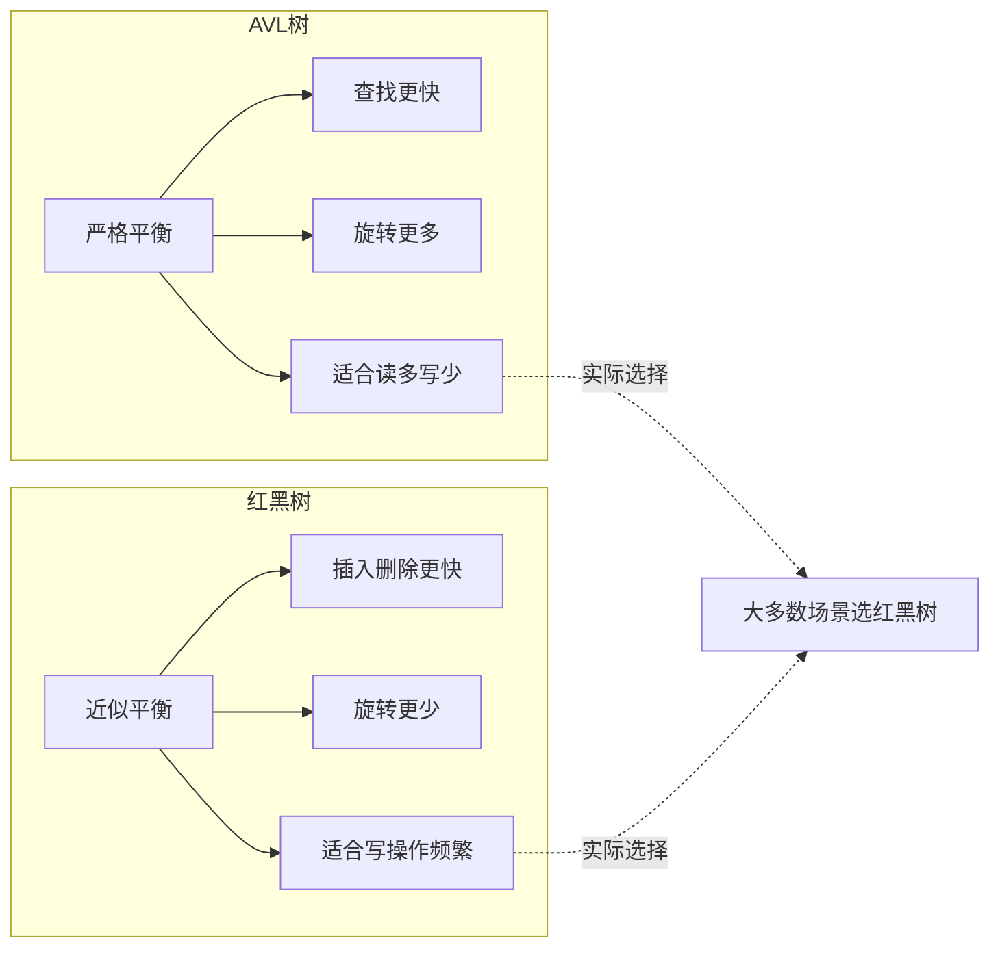
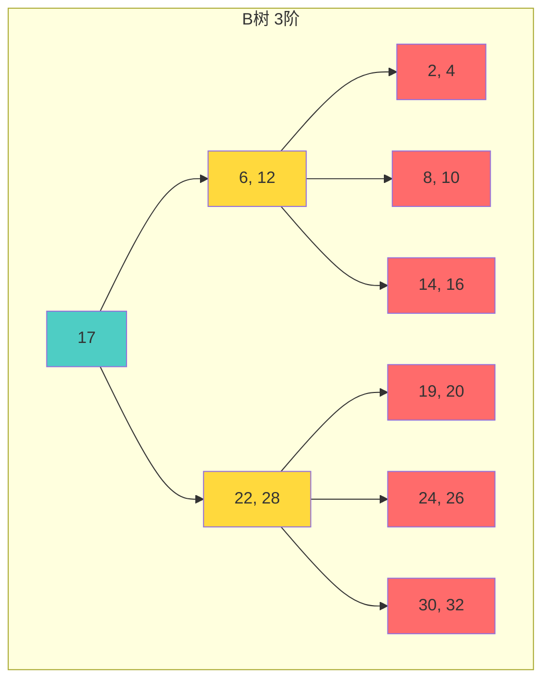
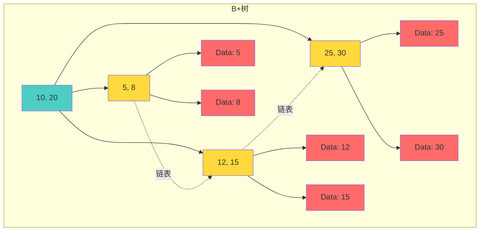

树形结构是数据结构中最优雅的发明之一——它用层次化的方式组织数据，让查找、插入、删除的时间复杂度从 O(n) 降到了 O(log n)。但树的世界远比想象中复杂：BST 会退化、AVL 需要频繁旋转、红黑树用变色减少旋转次数、B+ 树主宰了数据库索引。本文将带你深入理解这些核心数据结构。

---

## 一、二叉树全景概览

```mermaid
mindmap
  root((树形结构))
    二叉树
      基本性质
        第i层最多2^(i-1)个节点
        深度k最多2^k-1个节点
        叶子数=度2节点数+1
      遍历方式
        前序遍历
        中序遍历
        后序遍历
        层序遍历(BFS)
    二叉搜索树BST
      查找 O(log n)
      插入 O(log n)
      删除 O(log n)
      退化问题 O(n)
    平衡树
      AVL树
        严格平衡 高度差≤1
        LL/RR/LR/RL旋转
      红黑树
        近似平衡
        变色+旋转
        插入最多2次旋转
        删除最多3次旋转
    B族树
      B树
        多路搜索树
        所有叶子同一层
      B+树
        数据只在叶子
        叶子有序链表
        数据库索引首选
```

---

## 二、二叉树的基本性质与遍历

### 2.1 二叉树的性质

1. **第 i 层**最多有 $2^{i-1}$ 个节点（i ≥ 1）
2. **深度为 k** 的二叉树最多有 $2^k - 1$ 个节点
3. **叶子节点数 = 度为 2 的节点数 + 1**，即 $n_0 = n_2 + 1$
4. **完全二叉树**：除最后一层外，每一层都被完全填充，且最后一层的节点都靠左排列

### 2.2 遍历方式

```python
class TreeNode:
    def __init__(self, val=0, left=None, right=None):
        self.val = val
        self.left = left
        self.right = right
```

#### 递归实现

```python
def preorder_recursive(root):
    """前序遍历：根 → 左 → 右"""
    if not root:
        return []
    return [root.val] + preorder_recursive(root.left) + preorder_recursive(root.right)

def inorder_recursive(root):
    """中序遍历：左 → 根 → 右 — BST 中序 = 有序序列"""
    if not root:
        return []
    return inorder_recursive(root.left) + [root.val] + inorder_recursive(root.right)

def postorder_recursive(root):
    """后序遍历：左 → 右 → 根"""
    if not root:
        return []
    return postorder_recursive(root.left) + postorder_recursive(root.right) + [root.val]
```

#### 迭代实现

```python
def preorder_iterative(root):
    """前序遍历 — 迭代版"""
    if not root:
        return []
    stack, result = [root], []
    while stack:
        node = stack.pop()
        result.append(node.val)
        if node.right:
            stack.append(node.right)  # 先压右
        if node.left:
            stack.append(node.left)   # 后压左，先弹出
    return result

def inorder_iterative(root):
    """中序遍历 — 迭代版"""
    stack, result = [], []
    curr = root
    while stack or curr:
        while curr:
            stack.append(curr)
            curr = curr.left
        curr = stack.pop()
        result.append(curr.val)
        curr = curr.right
    return result

def postorder_iterative(root):
    """后序遍历 — 迭代版（利用前序的变形）"""
    if not root:
        return []
    stack, result = [root], []
    while stack:
        node = stack.pop()
        result.append(node.val)
        if node.left:
            stack.append(node.left)
        if node.right:
            stack.append(node.right)
    return result[::-1]  # 根右左 → 反转 → 左右根
```

#### 层序遍历（BFS）

```python
from collections import deque

def level_order(root):
    """层序遍历 — 按层输出"""
    if not root:
        return []
    queue = deque([root])
    result = []
    while queue:
        level_size = len(queue)
        level = []
        for _ in range(level_size):
            node = queue.popleft()
            level.append(node.val)
            if node.left:
                queue.append(node.left)
            if node.right:
                queue.append(node.right)
        result.append(level)
    return result
```

### 遍历方式对比



---

## 三、二叉搜索树（BST）

### 3.1 核心性质

对任意节点：
- 左子树所有节点的值 < 当前节点的值
- 右子树所有节点的值 > 当前节点的值
- 左右子树也分别是 BST

### 3.2 查找、插入、删除

```python
class BST:
    def __init__(self):
        self.root = None

    def search(self, val):
        curr = self.root
        while curr:
            if val == curr.val:
                return curr
            elif val < curr.val:
                curr = curr.left
            else:
                curr = curr.right
        return None

    def insert(self, val):
        if not self.root:
            self.root = TreeNode(val)
            return
        curr = self.root
        while curr:
            if val < curr.val:
                if not curr.left:
                    curr.left = TreeNode(val)
                    break
                curr = curr.left
            else:
                if not curr.right:
                    curr.right = TreeNode(val)
                    break
                curr = curr.right

    def delete(self, root, val):
        """BST 删除 — 最复杂的情况"""
        if not root:
            return None

        if val < root.val:
            root.left = self.delete(root.left, val)
        elif val > root.val:
            root.right = self.delete(root.right, val)
        else:
            # 找到了要删除的节点
            if not root.left:
                return root.right      # 只有右子树
            if not root.right:
                return root.left       # 只有左子树
            # 有两个子节点：找右子树最小值（中序后继）
            successor = self._min_value(root.right)
            root.val = successor.val
            root.right = self.delete(root.right, successor.val)

        return root

    def _min_value(self, node):
        while node.left:
            node = node.left
        return node
```



### 3.3 BST 的退化问题

当插入有序序列 `[1, 2, 3, 4, 5]` 时，BST 退化为链表：



**时间复杂度退化**：从 O(log n) 变成 O(n)。这就是为什么需要**平衡树**。

---

## 四、AVL 树

AVL 树是最早的自平衡二叉搜索树，由 Adelson-Velsky 和 Landis 于 1962 年提出。

### 4.1 平衡因子

每个节点的**平衡因子 = 左子树高度 - 右子树高度**，AVL 树要求所有节点的平衡因子为 -1、0 或 1。

### 4.2 四种旋转操作



```python
class AVLNode:
    def __init__(self, val):
        self.val = val
        self.left = None
        self.right = None
        self.height = 1

class AVLTree:
    def get_height(self, node):
        return node.height if node else 0

    def get_balance(self, node):
        return self.get_height(node.left) - self.get_height(node.right) if node else 0

    def update_height(self, node):
        node.height = 1 + max(self.get_height(node.left), self.get_height(node.right))

    def rotate_right(self, y):
        """LL 情况 — 右旋"""
        x = y.left
        T2 = x.right
        x.right = y
        y.left = T2
        self.update_height(y)
        self.update_height(x)
        return x

    def rotate_left(self, x):
        """RR 情况 — 左旋"""
        y = x.right
        T2 = y.left
        y.left = x
        x.right = T2
        self.update_height(x)
        self.update_height(y)
        return y

    def insert(self, root, val):
        # 标准 BST 插入
        if not root:
            return AVLNode(val)
        if val < root.val:
            root.left = self.insert(root.left, val)
        else:
            root.right = self.insert(root.right, val)

        # 更新高度
        self.update_height(root)

        # 检查平衡并旋转
        balance = self.get_balance(root)

        # LL
        if balance > 1 and val < root.left.val:
            return self.rotate_right(root)
        # RR
        if balance < -1 and val > root.right.val:
            return self.rotate_left(root)
        # LR
        if balance > 1 and val > root.left.val:
            root.left = self.rotate_left(root.left)
            return self.rotate_right(root)
        # RL
        if balance < -1 and val < root.right.val:
            root.right = self.rotate_right(root.right)
            return self.rotate_left(root)

        return root
```

---

## 五、红黑树

红黑树是一种近似平衡的二叉搜索树，通过着色和旋转来维持平衡。

### 5.1 五条性质

```mermaid
graph TD
    P1[性质1: 每个节点是红色或黑色]
    P2[性质2: 根节点是黑色]
    P3[性质3: 每个叶子节点NIL是黑色]
    P4[性质4: 红色节点的两个子节点都是黑色<br/>不能有连续红色节点]
    P5[性质5: 从任一节点到其所有叶子NIL<br/>的路径上黑节点数相同]

    P1 --> P2 --> P3 --> P4 --> P5

    P5 -.推论.-> H[树高 ≤ 2 × log₂(n+1)]
```

### 5.2 插入操作的修复

插入的新节点**总是红色**，然后检查是否违反性质 4（连续红节点），分三种情况修复：

| 情况 | 条件 | 处理方式 |
|------|------|---------|
| Case 1 | 叔叔是红色 | 父+叔变黑，祖父变红，上溯检查 |
| Case 2 | 叔叔是黑色，当前是右孩子 | 左旋父节点，转为 Case 3 |
| Case 3 | 叔叔是黑色，当前是左孩子 | 右旋祖父 + 变色 |

```python
class RBNode:
    def __init__(self, val, color='red'):
        self.val = val
        self.color = color  # 'red' or 'black'
        self.left = None
        self.right = None
        self.parent = None

class RedBlackTree:
    def insert_fixup(self, z):
        while z.parent and z.parent.color == 'red':
            if z.parent == z.parent.parent.left:
                uncle = z.parent.parent.right

                if uncle and uncle.color == 'red':
                    # Case 1: 叔叔是红色
                    z.parent.color = 'black'
                    uncle.color = 'black'
                    z.parent.parent.color = 'red'
                    z = z.parent.parent
                else:
                    if z == z.parent.right:
                        # Case 2: 叔叔是黑色，z 是右孩子
                        z = z.parent
                        self.rotate_left(z)
                    # Case 3: 叔叔是黑色，z 是左孩子
                    z.parent.color = 'black'
                    z.parent.parent.color = 'red'
                    self.rotate_right(z.parent.parent)
            else:
                # 对称情况
                uncle = z.parent.parent.left
                if uncle and uncle.color == 'red':
                    z.parent.color = 'black'
                    uncle.color = 'black'
                    z.parent.parent.color = 'red'
                    z = z.parent.parent
                else:
                    if z == z.parent.left:
                        z = z.parent
                        self.rotate_right(z)
                    z.parent.color = 'black'
                    z.parent.parent.color = 'red'
                    self.rotate_left(z.parent.parent)

        self.root.color = 'black'  # 确保根为黑色
```

### 5.3 AVL vs 红黑树性能对比



| 维度 | AVL 树 | 红黑树 |
|------|--------|--------|
| 平衡策略 | 高度差 ≤ 1 | 最长路径 ≤ 2 × 最短路径 |
| 查找性能 | 更优（更平衡） | 稍差 |
| 插入性能 | 需要更多旋转 | 最多 2 次旋转 |
| 删除性能 | 需要 O(log n) 次旋转 | 最多 3 次旋转 |
| 空间开销 | 存储高度（额外 int） | 存储颜色（1 bit） |
| 典型应用 | 内存数据库索引 | C++ std::map, Java TreeMap |
| 适用场景 | 读多写少 | 读写均衡或写多读少 |

---

## 六、B 树与 B+ 树

### 6.1 B 树

B 树是一种多路搜索树，适合磁盘存储：



### 6.2 B+ 树

B+ 树是 B 树的变体，**所有数据都存储在叶子节点**，叶子节点之间用链表连接：



### 6.3 B 树 vs B+ 树对比

| 维度 | B 树 | B+ 树 |
|------|------|-------|
| 数据存储 | 所有节点都存数据 | 仅叶子节点存数据 |
| 内节点作用 | 内节点既索引又存数据 | 内节点仅作索引 |
| 范围查询 | 需要中序遍历整棵树 | 叶子链表直接顺序扫描 |
| 查询稳定性 | 不稳定（可能在任意层命中） | 稳定（必须到叶子层） |
| 磁盘 I/O | 较高（节点存数据，扇区利用率低） | 较低（节点纯索引，更紧凑） |
| 数据库应用 | 较少 | MySQL InnoDB 默认索引结构 |
| 文件数量 | 叶子数量不定 | 叶子数量 = 数据量 |

**为什么数据库偏爱 B+ 树？**
1. **范围查询高效**：叶子链表使范围扫描只需 O(k)（k 为结果数量）
2. **磁盘 I/O 少**：内节点不存数据，每个节点可以容纳更多 key，树更矮
3. **查询性能稳定**：每次查询都到叶子层，性能可预期

---

## 七、工程实践中的应用

### 7.1 C++ std::map / std::set

底层实现：**红黑树**

```cpp
#include <map>
std::map<int, std::string> m;
m[3] = "three";
m[1] = "one";
m[2] = "two";
// 遍历时自动按 key 排序: 1, 2, 3
```

**为什么选红黑树而不是 AVL？**
- std::map 的插入/删除操作频繁，红黑树旋转次数少
- 查找性能差异在实际场景中不显著

### 7.2 Java TreeMap

底层实现：**红黑树**（`java.util.TreeMap`）

```java
TreeMap<Integer, String> map = new TreeMap<>();
map.put(3, "three");
map.put(1, "one");
map.put(2, "two");
// map.keySet() → [1, 2, 3]

// 范围查询
SortedMap<Integer, String> sub = map.subMap(1, true, 2, true);
// sub → {1=one, 2=two}
```

### 7.3 字典树（Trie）的工程应用

```python
class TrieNode:
    def __init__(self):
        self.children = {}
        self.is_end = False

class Trie:
    def __init__(self):
        self.root = TrieNode()

    def insert(self, word):
        node = self.root
        for ch in word:
            if ch not in node.children:
                node.children[ch] = TrieNode()
            node = node.children[ch]
        node.is_end = True

    def search(self, word):
        node = self.root
        for ch in word:
            if ch not in node.children:
                return False
            node = node.children[ch]
        return node.is_end

    def starts_with(self, prefix):
        node = self.root
        for ch in prefix:
            if ch not in node.children:
                return False
            node = node.children[ch]
        return True
```

**实际应用场景**：
- **搜索引擎自动补全**：用户输入"app"，返回 "apple", "application", "appstore"
- **IP 路由表查找**：最长前缀匹配
- **拼写检查**：快速验证单词是否存在

---

## 八、面试 Q&A

### Q1: BST 的三种删除场景分别是什么？

**A**: 
1. **叶子节点**：直接删除，父节点对应指针设为 null
2. **只有一个子节点**：用子节点替换当前节点
3. **有两个子节点**：找到中序后继（右子树最小值）或中序前驱（左子树最大值），用其值替换当前节点，然后递归删除后继/前驱节点

> 为什么选后继/前驱？因为它们要么没有左子树（后继），要么没有右子树（前驱），可以退化为场景 1 或 2。

### Q2: 为什么红黑树选择近似平衡而不是严格平衡？

**A**: 
- 严格平衡（如 AVL）虽然查找更快，但插入/删除时需要更多旋转来维持平衡
- 红黑树的五条性质保证了树高 ≤ 2log(n+1)，这个"足够平衡"使得：
  - 查找性能只比 AVL 略差
  - 插入最多 2 次旋转，删除最多 3 次旋转
  - 在读写混合场景中总体性能更好

这是一种**工程上的权衡**：牺牲一点查找性能，换取更好的写入性能。

### Q3: 中序遍历 BST 为什么得到有序序列？能否不递归实现？

**A**: 因为 BST 的性质保证了"左 < 根 < 右"，中序遍历恰好按"左→根→右"的顺序访问，所以输出有序。

非递归实现使用显式栈模拟递归调用：

```python
def inorder_iterative(root):
    stack, result = [], []
    curr = root
    while stack or curr:
        while curr:
            stack.append(curr)
            curr = curr.left  # 一直向左
        curr = stack.pop()
        result.append(curr.val)
        curr = curr.right  # 转向右子树
    return result
```

### Q4: 如何验证一棵树是合法的 BST？

**A**: 不能简单地检查每个节点是否满足"左 < 根 < 右"，还需要考虑祖先节点的约束。

```python
def is_valid_bst(root, low=float('-inf'), high=float('inf')):
    if not root:
        return True
    if root.val <= low or root.val >= high:
        return False
    return (is_valid_bst(root.left, low, root.val) and
            is_valid_bst(root.right, root.val, high))
```

### Q5: B+ 树的叶子链表是如何支持范围查询的？

**A**: 例如查询 `[10, 30]` 范围内的所有数据：
1. 从根节点查找 key = 10，到达对应叶子节点
2. 从该叶子节点开始，沿着链表向右扫描
3. 直到遇到第一个 > 30 的 key，停止扫描

```
时间复杂度: O(log_m N + k)
其中 m 是 B+ 树的阶, N 是总数据量, k 是结果数量
```

这比在 B 树中做中序遍历高效得多，因为不需要回溯。

### Q6: 给定前序和中序遍历，能否重建唯一的二叉树？后序呢？

**A**: 
- **前序 + 中序 → 可以唯一确定**：前序的第一个元素是根，在中序中找到根的位置，左边是左子树，右边是右子树，递归即可。
- **后序 + 中序 → 可以唯一确定**：后序的最后一个元素是根。
- **前序 + 后序 → 不能唯一确定**：无法区分左右子树的边界（除非是满二叉树）。

```python
def build_tree(preorder, inorder):
    if not preorder or not inorder:
        return None
    root_val = preorder[0]
    root = TreeNode(root_val)
    mid = inorder.index(root_val)  # 根在中序中的位置
    root.left = build_tree(preorder[1:mid+1], inorder[:mid])
    root.right = build_tree(preorder[mid+1:], inorder[mid+1:])
    return root
```

---

## 九、总结

树形数据结构的选择原则：

| 场景 | 推荐结构 |
|------|---------|
| 需要有序数据、读写均衡 | 红黑树 |
| 读多写少、查找性能敏感 | AVL 树 |
| 数据库索引、范围查询 | B+ 树 |
| 前缀匹配、自动补全 | 字典树（Trie） |
| 快速查找、无需排序 | 哈希表 |

理解每种结构的底层原理和适用场景，才能在工程实践中做出正确的选择。

<div class='context-nav'>
<a class='context-link prev disabled'><span class='context-label'>上一篇</span><span class='context-title'>暂无</span></a>
<a class='context-link next' href='/software-fundamentals/posts/数据结构-二叉树与遍历/'><span class='context-label'>下一篇</span><span class='context-title'>二叉树与遍历</span></a>
</div>
