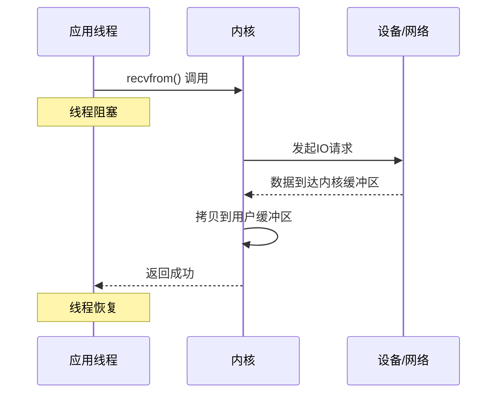
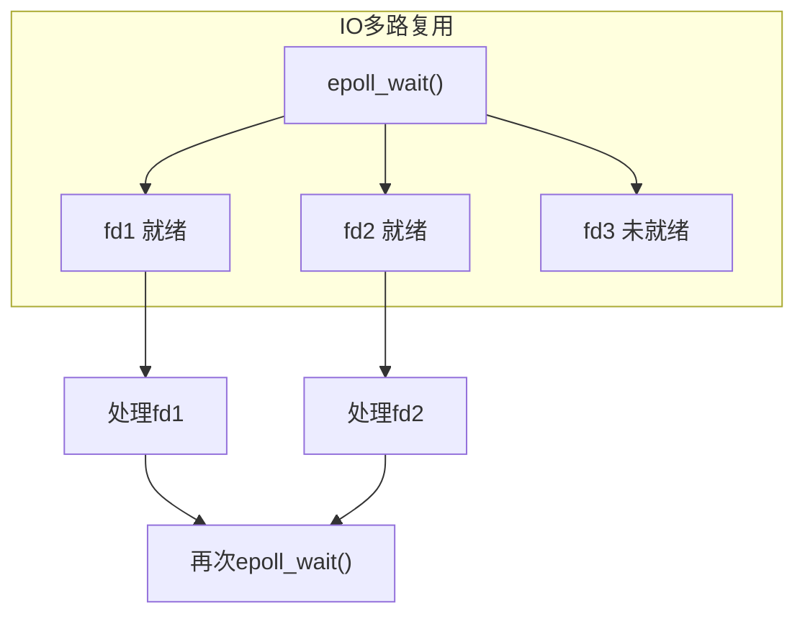
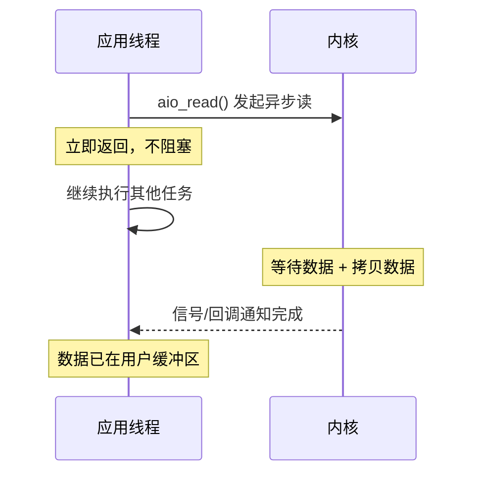
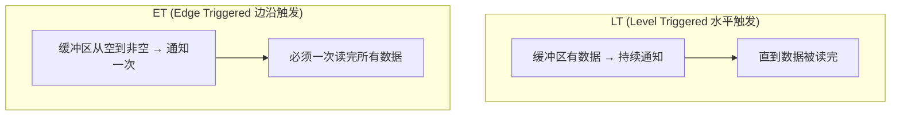
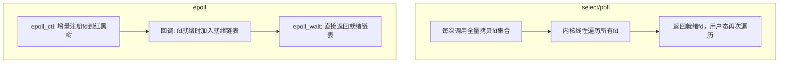
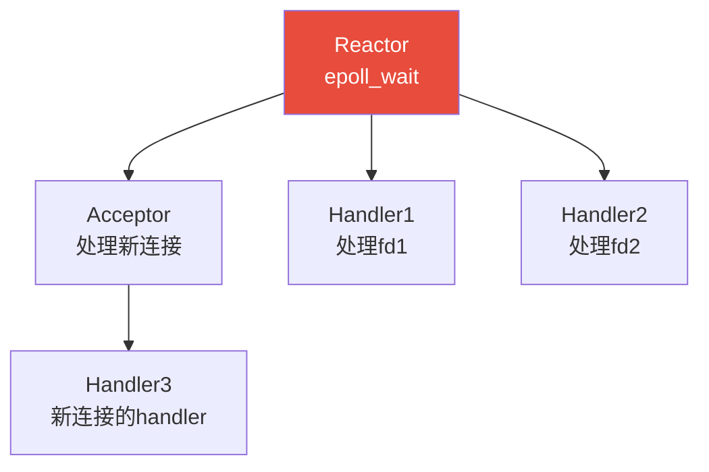
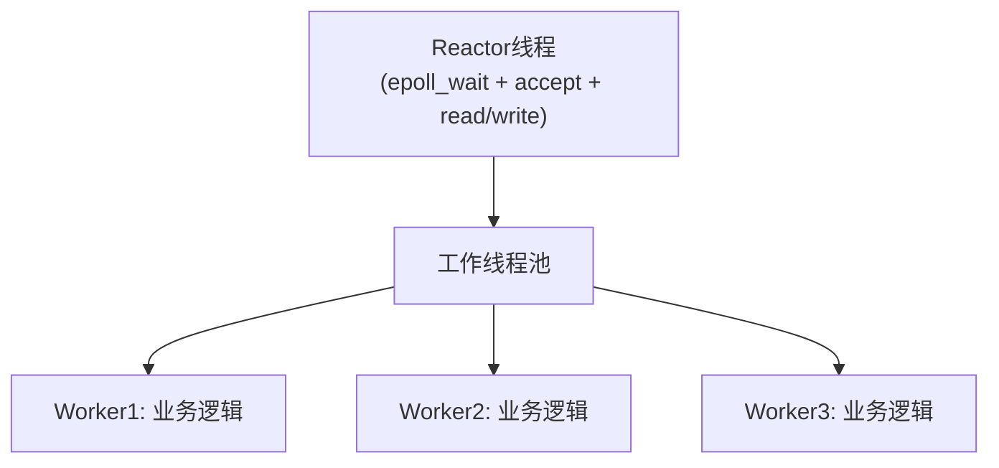
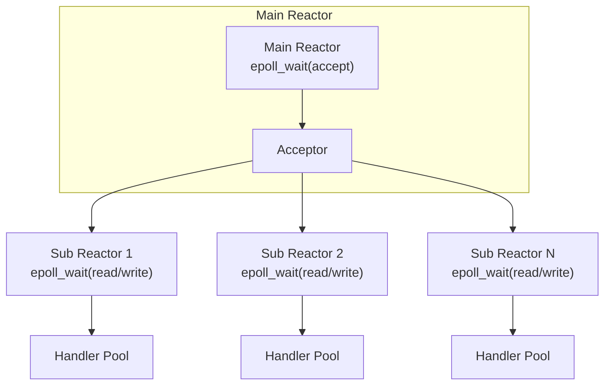
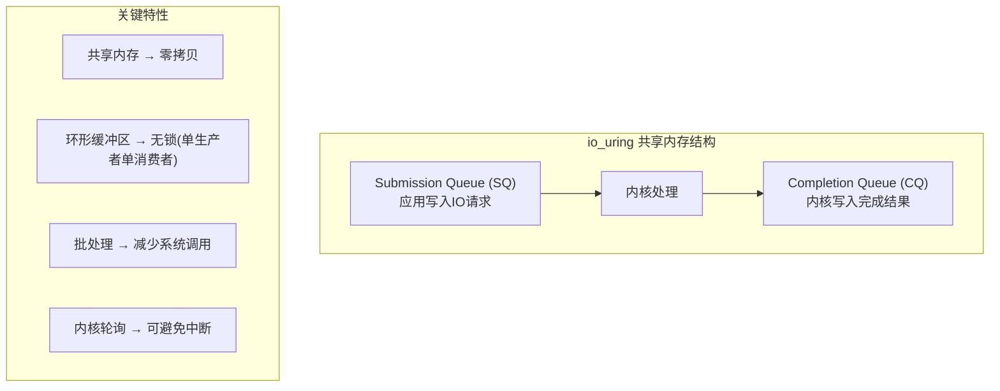
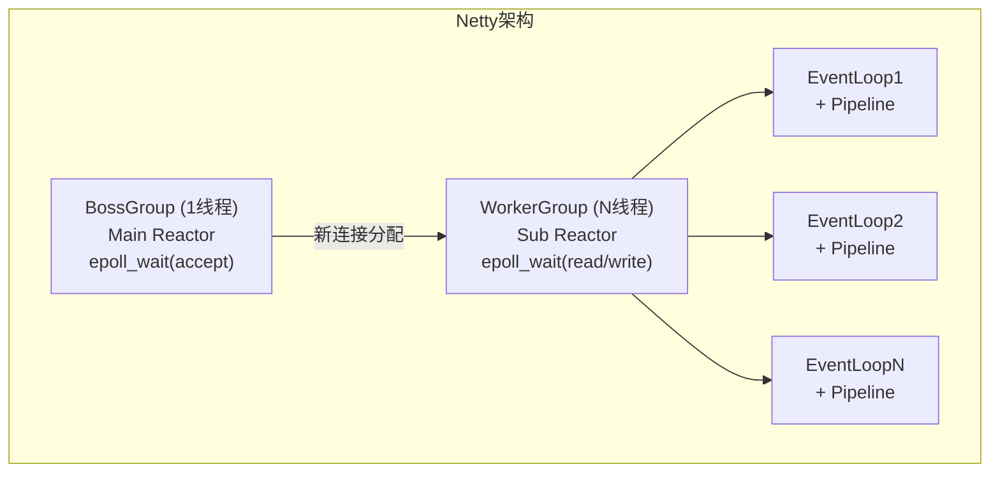

## 1. IO 模型概述

IO 操作是应用程序与外部设备交互的桥梁，理解 IO 模型对构建高性能网络服务至关重要。

### 1.1 IO 操作的本质

一次 IO 操作涉及两个阶段：


五种 IO 模型的区别就在于如何处理这两个阶段。

### 1.2 五种 IO 模型对比

| IO 模型 | 阶段1：等待数据 | 阶段2：数据拷贝 | 是否阻塞 |
|---------|----------------|----------------|----------|
| 阻塞 IO | 阻塞等待 | 阻塞拷贝 | 全程阻塞 |
| 非阻塞 IO | 轮询检查 | 阻塞拷贝 | 部分阻塞 |
| IO 多路复用 | 阻塞等待(可同时监听多个) | 阻塞拷贝 | 部分阻塞 |
| 信号驱动 IO | 信号通知 | 阻塞拷贝 | 部分阻塞 |
| 异步 IO | 不等待 | 内核自动拷贝 | 不阻塞 |

## 2. 五种 IO 模型详解

### 2.1 阻塞 IO (Blocking IO)

最传统的模型，调用后线程阻塞直到操作完成。



```c
// 阻塞IO示例
int sockfd = socket(AF_INET, SOCK_STREAM, 0);
// 默认阻塞模式
char buf[1024];
int n = recvfrom(sockfd, buf, sizeof(buf), 0, NULL, NULL);
// 如果没有数据，线程会一直阻塞在这里
```

**问题**：一个线程只能处理一个连接，多连接需要多线程，线程开销大。

### 2.2 非阻塞 IO (Non-blocking IO)

将 socket 设为非阻塞模式，没有数据时立即返回 EWOULDBLOCK 错误。

```c
// 非阻塞IO设置
int flags = fcntl(sockfd, F_GETFL, 0);
fcntl(sockfd, F_SETFL, flags | O_NONBLOCK);

// 轮询读取
while (1) {
    int n = recvfrom(sockfd, buf, sizeof(buf), 0, NULL, NULL);
    if (n > 0) {
        // 处理数据
        process(buf, n);
    } else if (errno == EWOULDBLOCK) {
        // 没有数据，做其他事或继续轮询
        do_other_work();
    } else {
        // 错误
        break;
    }
}
```

**问题**：轮询(busy-waiting)浪费 CPU，且延迟不可控。

### 2.3 IO 多路复用 (IO Multiplexing)

用一个线程同时监听多个文件描述符，哪个就绪就处理哪个。



这是后文重点讨论的内容。

### 2.4 信号驱动 IO (Signal-driven IO)

内核在数据就绪时发送 SIGIO 信号通知应用。

```c
// 信号驱动IO设置
struct sigaction sa;
sa.sa_handler = sigio_handler;
sigaction(SIGIO, &sa, NULL);

fcntl(sockfd, F_SETOWN, getpid());
int flags = fcntl(sockfd, F_GETFL, 0);
fcntl(sockfd, F_SETFL, flags | O_ASYNC);

// 信号处理函数
void sigio_handler(int signo) {
    // 数据就绪，执行读取
    int n = recvfrom(sockfd, buf, sizeof(buf), 0, NULL, NULL);
    // 注意：recvfrom仍然是阻塞拷贝
}
```

**问题**：信号处理函数中可调用的函数受限（信号安全），且 TCP 场景信号过于频繁。

### 2.5 异步 IO (Asynchronous IO)

真正的异步 IO：发起请求后立即返回，内核完成两个阶段后通知应用。



```c
// Linux AIO (libaio)
struct iocb cb = {0};
io_prep_pread(&cb, fd, buf, sizeof(buf), 0);

struct iocb *cbs[1] = {&cb};
io_submit(aio_ctx, 1, cbs);  // 提交异步请求，立即返回

// 稍后检查完成事件
struct io_event events[1];
int n = io_getevents(aio_ctx, 1, 1, events, NULL);
```

## 3. select / poll / epoll 详解

### 3.1 select

```c
int select(int nfds, fd_set *readfds, fd_set *writefds,
           fd_set *exceptfds, struct timeval *timeout);
```

```c
// select 使用示例
fd_set readfds;
struct timeval timeout;

while (1) {
    FD_ZERO(&readfds);
    int maxfd = 0;
    for (int i = 0; i < n_clients; i++) {
        FD_SET(clients[i], &readfds);
        if (clients[i] > maxfd) maxfd = clients[i];
    }

    timeout.tv_sec = 5;
    timeout.tv_usec = 0;

    int ready = select(maxfd + 1, &readfds, NULL, NULL, &timeout);

    for (int i = 0; i < n_clients && ready > 0; i++) {
        if (FD_ISSET(clients[i], &readfds)) {
            handle_client(clients[i]);
            ready--;
        }
    }
}
```

**select 的缺陷**：

| 问题 | 原因 | 影响 |
|------|------|------|
| FD 数量限制 | FD_SETSIZE = 1024 (编译时固定) | 无法支持大量连接 |
| O(n) 遍历 | 每次调用需遍历所有 fd | 性能随连接数线性下降 |
| 数据拷贝 | 每次调用需从用户态拷贝 fd_set 到内核 | 重复拷贝开销 |
| 重复初始化 | 返回后修改 fd_set，需重新构建 | 编程不便 |

### 3.2 poll

```c
int poll(struct pollfd *fds, nfds_t nfds, int timeout);

struct pollfd {
    int   fd;         /* 文件描述符 */
    short events;     /* 感兴趣的事件 */
    short revents;    /* 返回的事件 */
};
```

```c
// poll 使用示例
struct pollfd fds[MAX_CLIENTS];

while (1) {
    int n_fds = setup_poll_fds(fds, clients, n_clients);
    int ready = poll(fds, n_fds, 5000);

    for (int i = 0; i < n_fds && ready > 0; i++) {
        if (fds[i].revents & POLLIN) {
            handle_client(fds[i].fd);
            ready--;
        }
    }
}
```

**poll vs select**：

| 特性 | select | poll |
|------|--------|------|
| FD 数量限制 | 1024 (FD_SETSIZE) | 无硬限制 |
| 接口设计 | 位图 fd_set | 结构体数组 |
| 事件分离 | 输入输出参数混用 | events/revents 分离 |
| 内核遍历 | O(n) 全量扫描 | O(n) 全量扫描 |
| 拷贝开销 | 每次全量拷贝 | 每次全量拷贝 |

poll 解决了 select 的 FD 数量限制和接口设计问题，但 **O(n) 遍历和全量拷贝** 的核心问题未解决。

### 3.3 epoll

epoll 是 Linux 的高效 IO 多路复用机制，采用 **事件驱动** 模型。

```c
int epoll_create1(int flags);                    // 创建epoll实例
int epoll_ctl(int epfd, int op, int fd,          // 注册/修改/删除fd
              struct epoll_event *event);
int epoll_wait(int epfd, struct epoll_event *events,  // 等待事件
               int maxevents, int timeout);
```

```c
// epoll 完整使用示例
int epfd = epoll_create1(EPOLL_CLOEXEC);

// 注册监听socket
struct epoll_event ev;
ev.events = EPOLLIN;
ev.data.fd = listen_fd;
epoll_ctl(epfd, EPOLL_CTL_ADD, listen_fd, &ev);

// 事件循环
struct epoll_event events[MAX_EVENTS];
while (1) {
    int nready = epoll_wait(epfd, events, MAX_EVENTS, -1);

    for (int i = 0; i < nready; i++) {
        if (events[i].data.fd == listen_fd) {
            // 新连接
            int conn_fd = accept(listen_fd, NULL, NULL);
            setnonblocking(conn_fd);

            ev.events = EPOLLIN | EPOLLET;  // 边沿触发
            ev.data.fd = conn_fd;
            epoll_ctl(epfd, EPOLL_CTL_ADD, conn_fd, &ev);
        } else {
            // 处理已连接socket的数据
            handle_client(events[i].data.fd);
        }
    }
}
```

### 3.4 epoll 的两种触发模式



| 特性 | LT (水平触发) | ET (边沿触发) |
|------|---------------|---------------|
| 通知条件 | 缓冲区有数据就通知 | 缓冲区状态变化时通知一次 |
| 读取方式 | 每次读一部分即可 | 必须循环读直到 EAGAIN |
| 编程难度 | 简单 | 较高（需处理部分读） |
| 效率 | 可能多次唤醒 | 减少唤醒次数 |
| 适用场景 | 通用 | 高性能场景 |

```c
// ET模式必须循环读取
void handle_client_et(int fd) {
    char buf[1024];
    while (1) {
        int n = recv(fd, buf, sizeof(buf), 0);
        if (n > 0) {
            process(buf, n);
        } else if (n == 0) {
            // 连接关闭
            close(fd);
            break;
        } else {
            if (errno == EAGAIN || errno == EWOULDBLOCK) {
                // 数据已全部读完，正常退出
                break;
            }
            // 其他错误
            close(fd);
            break;
        }
    }
}
```

### 3.5 epoll 高效的原因



| 优化点 | select/poll | epoll |
|--------|-------------|-------|
| 数据结构 | 数组/位图 | 红黑树 + 就绪链表 |
| 注册 | 每次调用全量传入 | epoll_ctl 增量注册 |
| 内核遍历 | O(n) 全量扫描 | O(1) 回调通知 |
| 返回结果 | 所有 fd 的状态 | 仅就绪的 fd |
| 时间复杂度 | O(n) | O(活跃fd数) |

**关键机制**：epoll 通过回调函数在 fd 就绪时将事件加入就绪链表，epoll_wait 只需返回链表内容，无需遍历所有 fd。

### 3.6 三者性能对比

$$
\text{select/poll 时间} = O(n) \times t_{\text{检查}}
$$

$$
\text{epoll 时间} = O(k) \times t_{\text{返回}} + O(\log n) \times t_{\text{注册}}
$$

其中 $n$ 是总 fd 数，$k$ 是活跃 fd 数。当 $k \ll n$ 时（如 Web 服务器，万级连接但活跃的很少），epoll 优势巨大。

| 连接数 | 活跃数 | select | poll | epoll |
|--------|--------|--------|------|-------|
| 100 | 100 | 快 | 快 | 快 |
| 1,000 | 100 | 中 | 中 | 快 |
| 10,000 | 100 | 慢 | 慢 | 快 |
| 100,000 | 100 | 不可用 | 很慢 | 快 |

## 4. Reactor 模式

Reactor 是基于 IO 多路复用的经典并发模式，将事件驱动与业务逻辑解耦。

### 4.1 单 Reactor 单线程



**问题**：一个线程处理所有事件，业务逻辑慢会阻塞整个循环。

### 4.2 单 Reactor 多线程



### 4.3 主从 Reactor 多线程



```c
// 主从Reactor伪代码
// Main Reactor
void main_reactor_loop(int listen_fd) {
    int epfd = epoll_create1(0);
    struct epoll_event ev = {.events = EPOLLIN, .data.fd = listen_fd};
    epoll_ctl(epfd, EPOLL_CTL_ADD, listen_fd, &ev);

    while (1) {
        epoll_wait(epfd, events, 1, -1);
        int conn_fd = accept(listen_fd, NULL, NULL);
        // 分配给Sub Reactor (轮询或最少连接)
        int sub_idx = conn_fd % n_sub_reactors;
        dispatch_to_sub_reactor(sub_reactors[sub_idx], conn_fd);
    }
}

// Sub Reactor
void sub_reactor_loop(sub_reactor_t *sr) {
    while (1) {
        int nready = epoll_wait(sr->epfd, sr->events, MAX_EVENTS, -1);
        for (int i = 0; i < nready; i++) {
            if (sr->events[i].events & EPOLLIN) {
                // 读取数据，提交到工作线程池处理业务
                submit_to_worker_pool(sr->pool, sr->events[i].data.fd);
            }
        }
    }
}
```

## 5. io_uring

io_uring 是 Linux 5.1 引入的新一代异步 IO 框架，设计目标是提供真正的全异步 IO。

### 5.1 io_uring 核心设计



```c
// io_uring 基本使用
#include <liburing.h>

void io_uring_example() {
    struct io_uring ring;
    io_uring_queue_init(256, &ring, 0);

    // 提交异步读请求
    struct io_uring_sqe *sqe = io_uring_get_sqe(&ring);
    io_uring_prep_read(sqe, fd, buf, sizeof(buf), 0);
    io_uring_submit(&ring);

    // 等待完成
    struct io_uring_cqe *cqe;
    io_uring_wait_cqe(&ring, &cqe);
    int result = cqe->res;
    io_uring_cqe_seen(&ring, cqe);

    io_uring_queue_exit(&ring);
}
```

### 5.2 io_uring vs epoll

| 特性 | epoll | io_uring |
|------|-------|----------|
| 模型 | 事件通知 + 同步读写 | 真正异步提交/完成 |
| 系统调用 | 每次操作需系统调用 | 批量提交，减少系统调用 |
| 数据拷贝 | 需要内核→用户态拷贝 | 可用固定缓冲区零拷贝 |
| 适用场景 | 网络IO为主 | 网络 + 文件IO |
| 成熟度 | 非常成熟 | 快速演进中 |
| 编程复杂度 | 中等 | 较高（但liburing简化了） |

## 6. Java NIO 与 Netty

### 6.1 Java NIO 核心组件

```java
// Java NIO 核心: Selector + Channel + Buffer
Selector selector = Selector.open();
ServerSocketChannel serverChannel = ServerSocketChannel.open();
serverChannel.configureBlocking(false);
serverChannel.bind(new InetSocketAddress(8080));
serverChannel.register(selector, SelectionKey.OP_ACCEPT);

while (true) {
    selector.select();  // 阻塞等待事件
    Set<SelectionKey> selectedKeys = selector.selectedKeys();
    Iterator<SelectionKey> iter = selectedKeys.iterator();

    while (iter.hasNext()) {
        SelectionKey key = iter.next();
        if (key.isAcceptable()) {
            SocketChannel client = serverChannel.accept();
            client.configureBlocking(false);
            client.register(selector, SelectionKey.OP_READ);
        } else if (key.isReadable()) {
            SocketChannel client = (SocketChannel) key.channel();
            ByteBuffer buffer = ByteBuffer.allocate(1024);
            int n = client.read(buffer);
            if (n == -1) {
                client.close();
            } else {
                buffer.flip();
                process(buffer);
            }
        }
        iter.remove();
    }
}
```

### 6.2 Netty 的 Reactor 实现

Netty 采用主从 Reactor 多线程模型：

```java
// Netty 服务端启动
EventLoopGroup bossGroup = new NioEventLoopGroup(1);    // Main Reactor
EventLoopGroup workerGroup = new NioEventLoopGroup();    // Sub Reactor

ServerBootstrap b = new ServerBootstrap();
b.group(bossGroup, workerGroup)
 .channel(NioServerSocketChannel.class)
 .childHandler(new ChannelInitializer<SocketChannel>() {
     @Override
     protected void initChannel(SocketChannel ch) {
         ch.pipeline()
           .addLast(new LengthFieldBasedFrameDecoder(1024, 0, 4))
           .addLast(new StringDecoder())
           .addLast(new MyBusinessHandler());  // 业务处理
     }
 });

ChannelFuture f = b.bind(8080).sync();
f.channel().closeFuture().sync();
```



### 6.3 Netty 关键优化

| 优化 | 描述 | 效果 |
|------|------|------|
| ByteBuf 池化 | PooledByteBufAllocator 复用缓冲区 | 减少GC压力 |
| 零拷贝 | CompositeByteBuf 组合多个缓冲区 | 避免内存拷贝 |
| 空闲检测 | IdleStateHandler 检测连接空闲 | 及时清理无效连接 |
| EPOLL 模式 | Netty 封装了 epoll | 比NIO更高效 |
| IO 读写与业务分离 | 可指定业务线程组 | 防止业务阻塞IO |

## 7. 面试 Q&A

**Q1: epoll 的 LT 和 ET 模式有什么区别？什么时候用 ET？**

A: LT 在缓冲区有数据时持续通知，ET 只在缓冲区状态变化时通知一次。ET 模式下必须循环读取直到 EAGAIN，否则可能丢失数据。ET 的优势是减少内核到用户态的唤醒次数，适合高并发、每次读取量可控的场景。但 ET 编程更复杂，容易漏读。一般建议：除非有明确的性能瓶颈，否则使用 LT 更安全。Nginx 使用 ET 模式，Netty 默认 LT。

**Q2: 为什么 epoll 比 select 快？核心原因是什么？**

A: 三个核心原因：(1) **避免全量遍历**：select/poll 每次调用需要内核遍历所有 fd，epoll 通过回调机制只在 fd 就绪时加入就绪链表，epoll_wait 直接返回就绪链表；

(2) **避免重复拷贝**：select/poll 每次调用需要将 fd 集合从用户态拷贝到内核态，epoll 通过 epoll_ctl 增量注册，只需拷贝一次；

(3) **返回结果精确**：select/poll 返回后需要遍历所有 fd 找出就绪的，epoll 只返回就绪的 fd。

当活跃连接比例低时（C10K问题），epoll 优势巨大。

**Q3: 什么是惊群效应？epoll 如何处理？**

A: 惊群效应是指多个进程/线程同时 epoll_wait 同一个 fd，当事件就绪时所有进程都被唤醒，但只有一个能处理，其余白跑一趟。Linux 4.5 引入了 EPOLLEXCLUSIVE 标志，只唤醒一个进程。Nginx 的 accept_mutex 也是一种解决方案——通过互斥锁确保同一时刻只有一个 worker 处理 accept。

对于已连接 socket 的读事件，每个 fd 只注册到一个 worker 的 epoll，不存在惊群。

**Q4: io_uring 会取代 epoll 吗？**

A: 短期内不会。epoll 在网络 IO 场景已经非常成熟高效，io_uring 的主要优势在于：(1) 文件 IO 的真正异步（epoll 不支持普通文件）；

(2) 减少系统调用次数（批量提交）；

(3) 可选的内核轮询模式（SQPOLL）避免系统调用。

但 io_uring 编程模型更复杂，需要 Linux 5.1+，且仍在快速演进中。

对于纯网络 IO 场景，epoll 仍然是首选。io_uring 更适合需要同时处理网络和文件 IO 的高性能场景。

**Q5: Reactor 模式中，为什么要把 accept 和 read/write 分开到不同的 Reactor？**

A: 分离的好处：(1) **防止 accept 被阻塞**：如果 Sub Reactor 中的业务处理耗时，不会影响新连接的接收；

(2) **资源隔离**：accept 通常很快，但 read/write 可能涉及编解码和业务逻辑，分开后互不影响；

(3) **扩展性好**：可以根据负载独立调整 Main/Sub Reactor 的线程数。Netty 的 bossGroup 只需 1 个线程，workerGroup 可以多个，就是这个道理。

**Q6: Java NIO 的 Selector 在 Linux 上为什么有时候会空轮询(CPU 100%)？**

A: 这是 JDK 的一个已知 Bug（JDK-6403933），根源是 Linux epoll 的一个特性：当 epoll_wait 监听的 fd 被对端关闭时，epoll 会返回一个事件但对应的 fd 已经无效，导致 Selector.select() 立即返回 0，形成无限循环。Netty 通过检测空轮询次数（默认 512 次）后重建 Selector 来解决此问题。JDK 8u60+ 和 JDK 11 已修复此问题。
<div class='context-nav'>
<a class='context-link prev' href='/software-fundamentals/posts/操作系统-IO多路复用-select-poll-epoll/'><span class='context-label'>上一篇</span><span class='context-title'>I/O 多路复用：select/poll/epoll</span></a>
<a class='context-link next' href='/software-fundamentals/posts/操作系统-Linux内核vs-Windows内核/'><span class='context-label'>下一篇</span><span class='context-title'>Linux 内核 vs Windows 内核</span></a>
</div>
