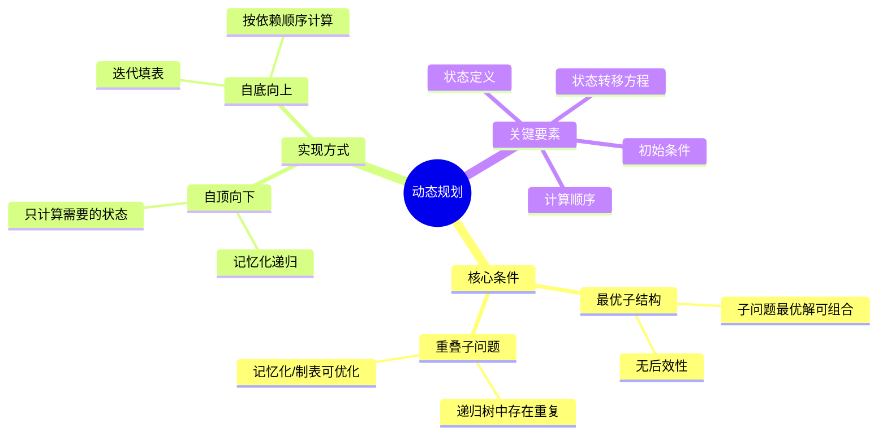
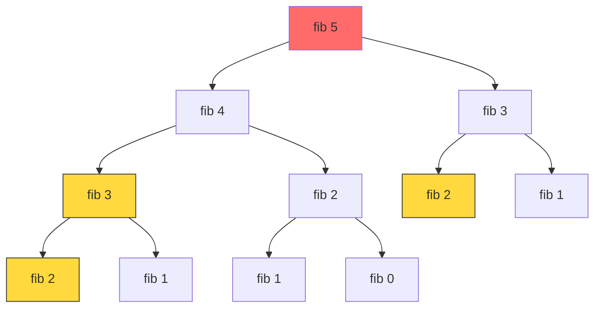
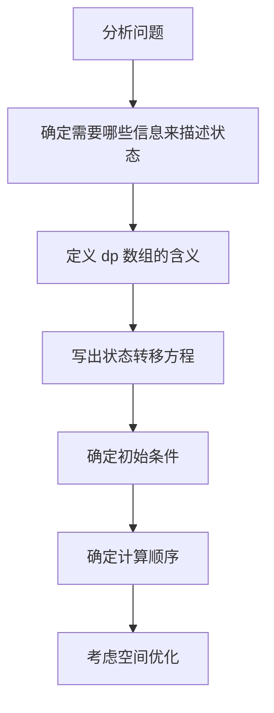

动态规划（Dynamic Programming，简称 DP）是算法中最令人又爱又恨的领域之一。说它难，是因为状态转移方程往往需要"灵光一现"；说它简单，是因为一旦掌握了方法论，大部分 DP 问题都有迹可循。本文将从本质出发，带你系统掌握动态规划。

---

## 一、动态规划的本质

### 1.1 两个核心条件

一个问题能用动态规划解决，必须同时满足：

**最优子结构**：问题的最优解包含子问题的最优解。即我们可以通过子问题的最优解推导出原问题的最优解。

**重叠子问题**：在递归求解过程中，相同的子问题会被反复计算。这是使用 DP 的动机所在——通过记忆化避免重复计算。



### 1.2 斐波那契数列：DP 的引入动机

```python
# 暴力递归 — 指数级时间复杂度 O(2^n)
def fib_naive(n):
    if n <= 1:
        return n
    return fib_naive(n - 1) + fib_naive(n - 2)

# 记忆化递归 — 自顶向下 O(n)
def fib_memo(n, memo=None):
    if memo is None:
        memo = {}
    if n in memo:
        return memo[n]
    if n <= 1:
        return n
    memo[n] = fib_memo(n - 1, memo) + fib_memo(n - 2, memo)
    return memo[n]

# 迭代 — 自底向上 O(n)
def fib_iter(n):
    if n <= 1:
        return n
    dp = [0] * (n + 1)
    dp[1] = 1
    for i in range(2, n + 1):
        dp[i] = dp[i - 1] + dp[i - 2]
    return dp[n]

# 空间优化 — O(1) 空间
def fib_optimal(n):
    if n <= 1:
        return n
    prev2, prev1 = 0, 1
    for _ in range(2, n + 1):
        curr = prev1 + prev2
        prev2, prev1 = prev1, curr
    return prev1
```

递归树的重复计算问题：



> 图中 `fib(3)` 被计算了 2 次，`fib(2)` 被计算了 3 次。这就是重叠子问题的直观体现。

---

## 二、状态定义的方法论

### 2.1 最后一步法

**核心思想**：假设你已经知道问题的答案，那么"最后一步"做了什么？

以**零钱兑换**为例：要凑出金额 amount，最后一步一定是用了某一种硬币 coin，那么问题转化为：凑出 `amount - coin` 的最少硬币数 + 1。

### 2.2 子问题法

**核心思想**：将原问题缩小规模，定义子问题是什么。

以**最长递增子序列**为例：`dp[i]` 表示以 `nums[i]` 结尾的最长递增子序列长度。子问题：对于每个 j < i，如果 `nums[j] < nums[i]`，那么 `dp[i] = max(dp[i], dp[j] + 1)`。

### 2.3 状态定义的三步走



---

## 三、经典问题详解

### 3.1 0-1 背包问题

有 n 个物品，每个物品有重量 w[i] 和价值 v[i]，背包容量为 W。每个物品只能选或不选，求最大价值。

```python
def knapsack_01(weights, values, W):
    n = len(weights)
    # dp[i][j] 表示前 i 个物品，容量为 j 时的最大价值
    dp = [[0] * (W + 1) for _ in range(n + 1)]

    for i in range(1, n + 1):
        for j in range(W + 1):
            if j < weights[i - 1]:
                dp[i][j] = dp[i - 1][j]  # 装不下
            else:
                dp[i][j] = max(
                    dp[i - 1][j],                    # 不选
                    dp[i - 1][j - weights[i-1]] + values[i-1]  # 选
                )

    return dp[n][W]
```

#### 空间优化：滚动数组

```python
def knapsack_01_optimized(weights, values, W):
    dp = [0] * (W + 1)
    for i in range(len(weights)):
        # 必须从右向左遍历，否则会重复使用同一物品
        for j in range(W, weights[i] - 1, -1):
            dp[j] = max(dp[j], dp[j - weights[i]] + values[i])
    return dp[W]
```

```mermaid
graph LR
    subgraph 二维DP
        A[dp[i-1][...]] --> B[dp[i][...]]
    end

    subgraph 一维优化
        C[dp数组] --> C
        C -->|从右向左更新| C
    end

    A -.优化为.-> C
    B -.优化为.-> C

    subgraph 关键
        D[从右向左遍历防止<br/>同一物品被重复使用]
    end
```

### 3.2 最长公共子序列（LCS）

```python
def longest_common_subsequence(text1, text2):
    m, n = len(text1), len(text2)
    dp = [[0] * (n + 1) for _ in range(m + 1)]

    for i in range(1, m + 1):
        for j in range(1, n + 1):
            if text1[i - 1] == text2[j - 1]:
                dp[i][j] = dp[i - 1][j - 1] + 1
            else:
                dp[i][j] = max(dp[i - 1][j], dp[i][j - 1])

    # 回溯构造 LCS
    lcs = []
    i, j = m, n
    while i > 0 and j > 0:
        if text1[i - 1] == text2[j - 1]:
            lcs.append(text1[i - 1])
            i -= 1
            j -= 1
        elif dp[i - 1][j] > dp[i][j - 1]:
            i -= 1
        else:
            j -= 1

    return ''.join(reversed(lcs))

# 示例
print(longest_common_subsequence("abcde", "ace"))  # 输出: "ace"
```

### 3.3 最长递增子序列（LIS）

```python
def length_of_lis(nums):
    if not nums:
        return 0
    n = len(nums)
    dp = [1] * n  # 每个元素自身构成长度为1的递增子序列

    for i in range(1, n):
        for j in range(i):
            if nums[j] < nums[i]:
                dp[i] = max(dp[i], dp[j] + 1)

    return max(dp)

# O(n log n) 优化：贪心 + 二分查找
def length_of_lis_optimal(nums):
    tails = []  # tails[i] 表示长度为 i+1 的递增子序列的最小末尾
    for num in nums:
        # 用二分查找找到 num 应该插入的位置
        left, right = 0, len(tails)
        while left < right:
            mid = (left + right) // 2
            if tails[mid] < num:
                left = mid + 1
            else:
                right = mid
        if left == len(tails):
            tails.append(num)
        else:
            tails[left] = num
    return len(tails)
```

### 3.4 编辑距离（Levenshtein Distance）

```python
def min_distance(word1, word2):
    m, n = len(word1), len(word2)
    dp = [[0] * (n + 1) for _ in range(m + 1)]

    # 初始条件
    for i in range(m + 1):
        dp[i][0] = i  # 删除 i 个字符
    for j in range(n + 1):
        dp[0][j] = j  # 插入 j 个字符

    for i in range(1, m + 1):
        for j in range(1, n + 1):
            if word1[i - 1] == word2[j - 1]:
                dp[i][j] = dp[i - 1][j - 1]  # 无需操作
            else:
                dp[i][j] = 1 + min(
                    dp[i - 1][j],     # 删除
                    dp[i][j - 1],     # 插入
                    dp[i - 1][j - 1]  # 替换
                )

    return dp[m][n]
```

```mermaid
stateDiagram-v2
    [*] --> 定义状态
    定义状态 --> dp[i][j]: word1前i个字符到word2前j个字符的最少操作数
    dp[i][j]: word1前i个字符到word2前j个字符的最少操作数 --> 状态转移
    状态转移 --> 字符相同: word1[i]==word2[j]
    字符相同: word1[i]==word2[j] --> dp[i][j] = dp[i-1][j-1]
    状态转移 --> 字符不同: word1[i]!=word2[j]
    字符不同: word1[i]!=word2[j] --> dp[i][j] = 1 + min(删除, 插入, 替换)
    dp[i][j] = dp[i-1][j-1] --> 初始条件
    dp[i][j] = 1 + min(删除, 插入, 替换) --> 初始条件
    初始条件 --> dp[i][0] = i, dp[0][j] = j
```

### 3.5 零钱兑换（完全背包）

```python
def coin_change(coins, amount):
    dp = [float('inf')] * (amount + 1)
    dp[0] = 0

    for coin in coins:
        for i in range(coin, amount + 1):
            dp[i] = min(dp[i], dp[i - coin] + 1)

    return dp[amount] if dp[amount] != float('inf') else -1
```

> 与 0-1 背包的区别：内层循环**从左到右**遍历，因为每种硬币可以使用无限次。

---

## 四、背包问题三种变体对比

```mermaid
graph TD
    A[背包问题] --> B[0-1 背包]
    A --> C[完全背包]
    A --> D[多重背包]

    B --> B1[每种物品只有1个]
    C --> C1[每种物品无限个]
    D --> D1[每种物品有count[i]个]

    B --> B2[内层从右到左]
    C --> C2[内层从左到右]
    D --> D2[拆分为0-1背包或单调队列优化]

    B2 --> B3[dp[j] = max(dp[j], dp[j-w] + v)]
    C2 --> C3[dp[j] = max(dp[j], dp[j-w] + v)]
    D2 --> D3[二进制拆分后转为0-1背包]
```

| 维度 | 0-1 背包 | 完全背包 | 多重背包 |
|------|---------|---------|---------|
| 物品数量 | 每种 1 个 | 每种无限个 | 每种 count[i] 个 |
| 内层循环方向 | 从右到左 | 从左到右 | 拆分后从右到左 |
| 状态转移 | `max(dp[j], dp[j-w]+v)` | `max(dp[j], dp[j-w]+v)` | 同 0-1 背包 |
| 时间复杂度 | O(n × W) | O(n × W) | O(n × W × count) |
| 优化方式 | 滚动数组 | 滚动数组 | 二进制拆分 / 单调队列 |
| 典型场景 | 选或不选的物品 | 可重复使用的资源 | 限量供应的商品 |

### 多重背包的二进制拆分

```python
def knapsack_multiple(weights, values, counts, W):
    # 将每种物品拆分成 1, 2, 4, ..., 2^k, remainder 份
    new_weights, new_values = [], []
    for w, v, c in zip(weights, values, counts):
        k = 1
        while k <= c:
            new_weights.append(k * w)
            new_values.append(k * v)
            c -= k
            k *= 2
        if c > 0:
            new_weights.append(c * w)
            new_values.append(c * v)

    # 转为 0-1 背包
    return knapsack_01_optimized(new_weights, new_values, W)
```

---

## 五、空间优化技巧

### 5.1 滚动数组

当 `dp[i]` 只依赖于 `dp[i-1]` 时，可以用一维数组替代二维数组。

```python
# 二维版本
def unique_paths_2d(m, n):
    dp = [[1] * n for _ in range(m)]
    for i in range(1, m):
        for j in range(1, n):
            dp[i][j] = dp[i-1][j] + dp[i][j-1]
    return dp[m-1][n-1]

# 一维版本
def unique_paths_1d(m, n):
    dp = [1] * n
    for i in range(1, m):
        for j in range(1, n):
            dp[j] += dp[j - 1]  # dp[j] = dp[j](上一行) + dp[j-1](当前行)
    return dp[n - 1]
```

### 5.2 状态压缩

在某些问题中，我们甚至不需要完整的 dp 数组，只需要几个变量。

```python
# 斐波那契 — 从 O(n) 空间到 O(1)
def fib_2d(n):
    dp = [0] * (n + 1)
    dp[1] = 1
    for i in range(2, n + 1):
        dp[i] = dp[i - 1] + dp[i - 2]
    return dp[n]

def fib_compressed(n):
    a, b = 0, 1
    for _ in range(n):
        a, b = b, a + b
    return a
```

### 5.3 空间优化的陷阱

```mermaid
flowchart TD
    A[考虑空间优化] --> B{dp[i] 依赖哪些状态?}
    B -->|仅 dp[i-1]| C[可用一维数组]
    B -->|dp[i-1] 和 dp[i-2]| D[可用两个变量]
    B -->|多个不相关状态| E[可能无法优化]

    C --> F{遍历方向?}
    F -->|从左到右| G[可能覆盖未使用状态]
    F -->|从右到左| H[安全]

    G --> I[注意: 0-1背包必须从右到左]
    H --> J[可以安全压缩]
    D --> J
    E --> K[保持二维数组]
```

---

## 六、自顶向下 vs 自底向上

| 维度 | 自顶向下（记忆化递归） | 自底向上（迭代） |
|------|---------------------|----------------|
| 计算顺序 | 按需计算 | 按依赖顺序全部计算 |
| 栈空间 | 需要递归栈 O(n) | 无递归开销 |
| 实现难度 | 更直观，容易写 | 需要考虑遍历顺序 |
| 冗余计算 | 只计算可达状态 | 可能计算无用状态 |
| 适用场景 | 状态空间大、很多状态不可达 | 状态空间紧凑、都需要计算 |
| 调试难度 | 容易理解 | 需要考虑边界 |

```python
# 自顶向下 — 以 LCS 为例
def lcs_memo(s1, s2):
    memo = {}
    def dp(i, j):
        if i == 0 or j == 0:
            return 0
        if (i, j) in memo:
            return memo[(i, j)]
        if s1[i-1] == s2[j-1]:
            memo[(i, j)] = 1 + dp(i-1, j-1)
        else:
            memo[(i, j)] = max(dp(i-1, j), dp(i, j-1))
        return memo[(i, j)]
    return dp(len(s1), len(s2))

# 自底向上 — 以 LCS 为例
def lcs_iter(s1, s2):
    m, n = len(s1), len(s2)
    dp = [[0] * (n + 1) for _ in range(m + 1)]
    for i in range(1, m + 1):
        for j in range(1, n + 1):
            if s1[i-1] == s2[j-1]:
                dp[i][j] = 1 + dp[i-1][j-1]
            else:
                dp[i][j] = max(dp[i-1][j], dp[i][j-1])
    return dp[m][n]
```

---

## 七、面试 Q&A

### Q1: 如何判断一个问题是否可以用动态规划解决？

**A**: 问自己三个问题：
1. **是否有最优子结构？** 问题的最优解能否由子问题的最优解组合而成？
2. **是否有重叠子问题？** 暴力递归时是否有大量重复计算？
3. **是否有明确的边界条件？** 是否能定义最小规模的问题的答案？

如果三个答案都是"是"，那么大概率可以用 DP 解决。

### Q2: 动态规划与贪心算法的区别是什么？

**A**: 

| 维度 | 动态规划 | 贪心算法 |
|------|---------|---------|
| 决策方式 | 考虑所有选择，取最优 | 每次选局部最优 |
| 全局最优 | 保证 | 不一定保证 |
| 效率 | 通常 O(n²) 或 O(n × W) | 通常 O(n log n) 或 O(n) |
| 适用性 | 更广 | 需要证明贪心选择性质 |

**经典对比**：0-1 背包用 DP，但分数背包（可以取物品的一部分）用贪心即可。

### Q3: LIS 的 O(n log n) 算法为什么正确？tails 数组的含义是什么？

**A**: `tails[i]` 存储长度为 `i+1` 的所有递增子序列中，**最小的末尾元素值**。

关键性质：`tails` 数组一定是有序的（递增的）。因为如果存在长度为 3 的递增子序列末尾是 5，那么必然存在长度为 2 的递增子序列末尾 ≤ 5。

```
输入: [10, 9, 2, 5, 3, 7, 101, 18]

处理 10: tails = [10]
处理 9:  tails = [9]     (9 替换 10)
处理 2:  tails = [2]     (2 替换 9)
处理 5:  tails = [2, 5]  (5 扩展)
处理 3:  tails = [2, 3]  (3 替换 5)
处理 7:  tails = [2, 3, 7]
处理 101: tails = [2, 3, 7, 101]
处理 18: tails = [2, 3, 7, 18] (18 替换 101)
```

最终 LIS 长度 = `len(tails)` = 4。注意 `tails` 本身不是 LIS，但长度是正确的。

### Q4: 编辑距离中为什么有 +1？三种操作如何对应状态转移？

**A**: +1 代表执行了一次操作：
- **删除**：`dp[i-1][j] + 1` — word1 删除一个字符，变成了 word1[0..i-2] 到 word2[0..j-1] 的子问题
- **插入**：`dp[i][j-1] + 1` — word1 插入一个字符，相当于 word1[0..i-1] 到 word2[0..j-2] 的子问题
- **替换**：`dp[i-1][j-1] + 1` — 两个字符都消耗，替换后变为更小的子问题

### Q5: 背包问题中为什么 0-1 背包从右到左遍历，完全背包从左到右？

**A**: 这是面试高频问题。

- **0-1 背包从右到左**：保证每个物品只被使用一次。如果从左到右，`dp[j]` 会用到刚更新过的 `dp[j-w]`（已经包含当前物品），导致同一物品被重复使用。
- **完全背包从左到右**：恰好利用了这个特性，允许同一物品被使用多次。

```python
# 0-1 背包：从右到左，dp[j-w] 是上一轮的值（不含当前物品）
for i in range(n):
    for j in range(W, weights[i] - 1, -1):
        dp[j] = max(dp[j], dp[j - weights[i]] + values[i])

# 完全背包：从左到右，dp[j-w] 可能已包含当前物品
for coin in coins:
    for i in range(coin, amount + 1):
        dp[i] = min(dp[i], dp[i - coin] + 1)
```

### Q6: 如何输出 DP 问题的具体方案（而不只是最优值）？

**A**: 两种常见方法：

**方法 1：记录选择路径**

```python
def knapsack_with_path(weights, values, W):
    n = len(weights)
    dp = [[0] * (W + 1) for _ in range(n + 1)]
    choice = [[False] * (W + 1) for _ in range(n + 1)]

    for i in range(1, n + 1):
        for j in range(W + 1):
            if j >= weights[i-1] and dp[i-1][j-weights[i-1]] + values[i-1] > dp[i-1][j]:
                dp[i][j] = dp[i-1][j-weights[i-1]] + values[i-1]
                choice[i][j] = True  # 记录了"选"这个决策
            else:
                dp[i][j] = dp[i-1][j]

    # 回溯构造方案
    selected = []
    j = W
    for i in range(n, 0, -1):
        if choice[i][j]:
            selected.append(i - 1)
            j -= weights[i - 1]

    return dp[n][W], list(reversed(selected))
```

**方法 2：从 dp 表反推**

无需额外空间，通过比较 `dp[i][j]` 和 `dp[i-1][j]` 判断是否选择了第 i 个物品。

---

## 八、总结

动态规划的核心不在于背模板，而在于理解：

1. **为什么用 DP**：最优子结构 + 重叠子问题
2. **怎么定义状态**：最后一步法 / 子问题法
3. **怎么写转移方程**：考虑所有可能的"最后一步"
4. **怎么优化空间**：滚动数组 / 状态压缩

掌握这些思维框架，DP 就不再是"灵光一现"，而是有迹可循的系统方法。
