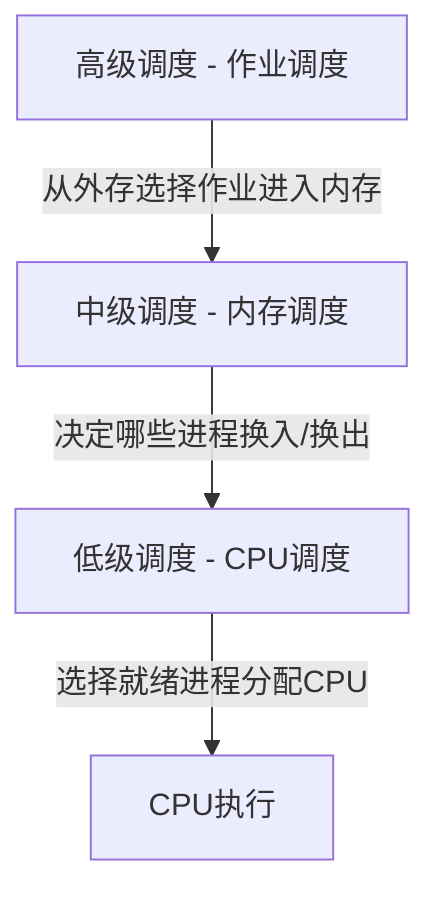
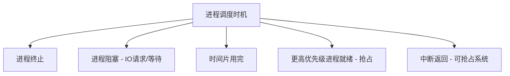
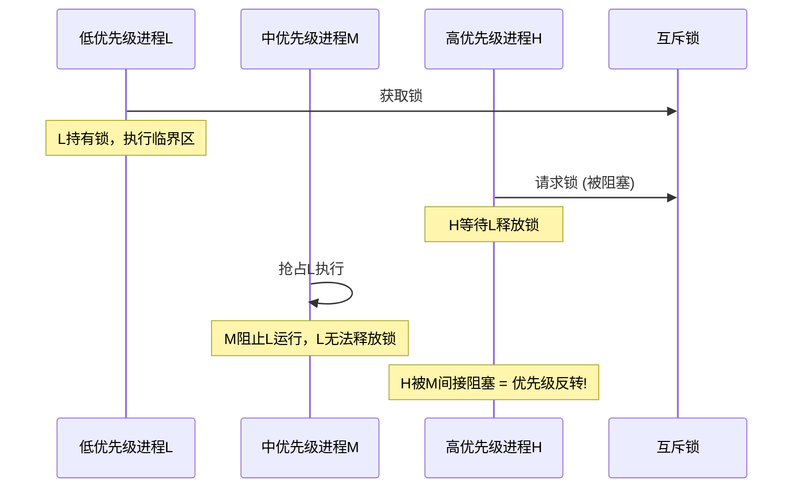
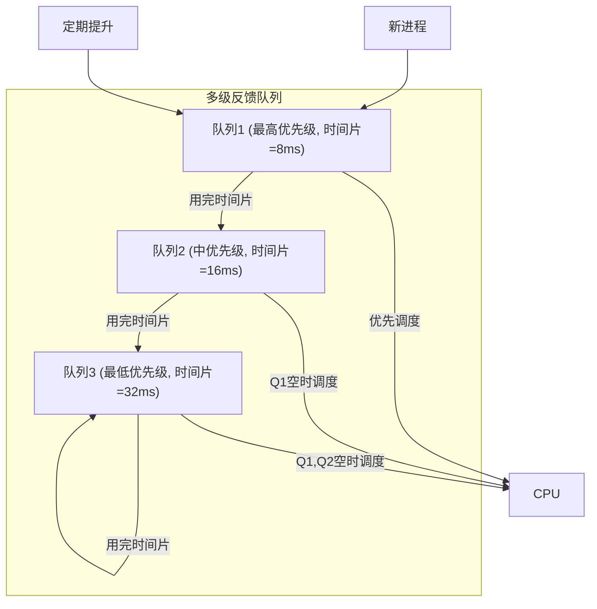
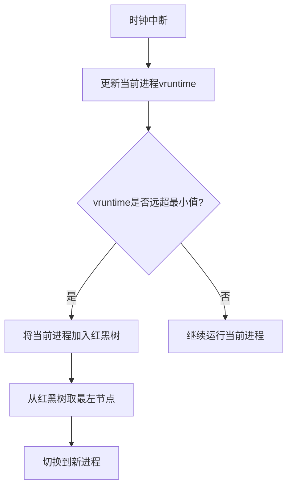
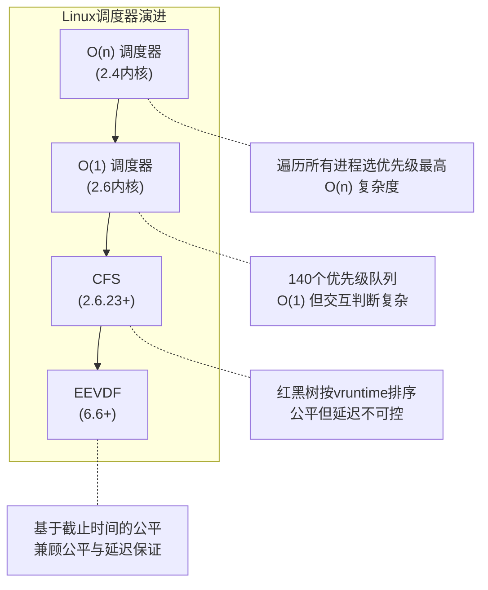

## 1. 调度概述

进程调度是操作系统的核心功能之一，决定哪个就绪进程获得 CPU 的使用权。调度的质量直接影响系统的吞吐量、响应时间和公平性。

### 1.1 调度的层次



| 调度层次 | 频率 | 功能 | 典型场景 |
|----------|------|------|----------|
| 高级调度 | 秒~分钟级 | 从后备队列选择作业调入内存 | 批处理系统 |
| 中级调度 | 毫秒级 | 进程换入换出（内存紧张时） | 交换区管理 |
| 低级调度 | 微秒级 | 选择就绪进程分配 CPU | 所有系统 |

### 1.2 调度目标

不同系统对调度的优化目标不同：

| 指标 | 含义 | 批处理系统 | 交互式系统 | 实时系统 |
|------|------|------------|------------|----------|
| CPU 利用率 | CPU 忙碌时间占比 | ★★★ | ★★ | ★ |
| 吞吐量 | 单位时间完成进程数 | ★★★ | ★★ | ★ |
| 周转时间 | 提交到完成的时间 | ★★★ | ★ | ★ |
| 等待时间 | 就绪队列中等待时间 | ★ | ★★ | ★ |
| 响应时间 | 提交到首次响应时间 | ★ | ★★★ | ★★ |
| 可预测性 | 响应时间的确定性 | ★ | ★ | ★★★ |
| 截止时间 | 是否满足截止时间 | ★ | ★ | ★★★ |

### 1.3 调度时机



## 2. 经典调度算法

### 2.1 FCFS (First Come First Served)

最简单的调度算法，按就绪顺序分配 CPU。

**特点**：非抢占式，实现简单（FIFO 队列）

```
进程: P1(24ms), P2(3ms), P3(3ms)  到达顺序: P1, P2, P3

P1: ████████████████████████ (0-24)
P2:                          ███    (24-27)
P3:                             ███ (27-30)

平均等待时间 = (0 + 24 + 27) / 3 = 17ms
```

**护航效应 (Convoy Effect)**：短进程排在长进程后面，等待时间远超自身执行时间。

### 2.2 SJF (Shortest Job First) / SRTF

选择预计执行时间最短的进程优先执行。

- **SJF**：非抢占式，选择就绪队列中执行时间最短的
- **SRTF**：抢占式，新到达进程若比当前进程剩余时间短则抢占

```
进程: P1(24ms, t=0), P2(3ms, t=0), P3(3ms, t=0)

SJF 排序: P2, P3, P1
P2: ███       (0-3)
P3:    ███    (3-6)
P1:      ████████████████████████ (6-30)

平均等待时间 = (6 + 0 + 3) / 3 = 3ms  ← 远优于FCFS的17ms
```

**SRTF 示例**：

```
进程: P1(8ms, t=0), P2(4ms, t=1), P3(2ms, t=2)

P1: █              ████████ (0-1, 7-14)
P2:  ████                   (1-5)  ← t=1到达，4<8，抢占P1
P3:     ██                  (5-7)  ← t=2到达，2<7，排在P2后
```

**SJF/SRTF 的理论最优性**：可证明 SJF 在非抢占算法中平均等待时间最小，SRTF 在所有算法中平均等待时间最小。但实际无法实现——无法预知进程的执行时间。

### 2.3 RR (Round Robin, 时间片轮转)

就绪进程按 FIFO 排队，每个进程执行一个时间片后轮到下一个。

```c
// RR 调度器核心逻辑
void rr_schedule(runqueue_t *rq) {
    if (rq->current->time_slice <= 0) {
        // 时间片用完，移到队列尾部
        list_move_tail(&rq->current->list, &rq->queue);
        // 重置时间片
        rq->current->time_slice = rq->time_quantum;
    }
    // 从队列头部取下一个进程
    rq->current = list_first_entry(&rq->queue, task_t, list);
}
```

**时间片大小的权衡**：

| 时间片 | 优点 | 缺点 |
|--------|------|------|
| 过大 | 上下文切换少 | 退化为 FCFS，响应差 |
| 过小 | 响应快 | 上下文切换开销大 |
| 适中 | 平衡响应和效率 | 需要根据负载调整 |

经验法则：时间片应使上下文切换开销占比 < 1%，典型值 10-100ms。

### 2.4 优先级调度

为每个进程分配优先级，优先级高的先执行。

```c
// 优先级调度 - 多个优先级队列
typedef struct {
    list_head_t queues[MAX_PRIORITY];  // 每个优先级一个队列
    int nr_active;                      // 活跃进程数
} prio_array_t;

task_t *pick_next_task(prio_array_t *array) {
    // 找到最高优先级的非空队列
    int idx = find_first_bit(array->bitmap);
    return list_first_entry(&array->queues[idx], task_t, list);
}
```

**优先级反转问题**：



**解决方案 - 优先级继承协议**：当高优先级进程等待低优先级进程持有的锁时，低优先级进程临时继承高优先级。

### 2.5 多级反馈队列 (MLFQ)

MLFQ 是最接近实际系统使用的经典算法，核心思想：

1. 多个优先级不同的队列
2. 新进程进入最高优先级队列
3. 用完时间片后降级到更低优先级队列
4. 低优先级队列时间片更长
5. 定期将所有进程提升到最高优先级（防止饥饿）



**MLFQ 的自适应特性**：

| 进程类型 | 行为 | MLFQ 效果 |
|----------|------|-----------|
| IO 密集型 | 频繁阻塞，用不完时间片 | 保持在高优先级，响应快 |
| CPU 密集型 | 持续使用 CPU | 逐渐降到低优先级，长时间片 |

## 3. CFS - Linux 完全公平调度器

CFS (Completely Fair Scheduler) 是 Linux 2.6.23 以来的默认调度算法，核心思想：**模拟理想公平调度器**。

### 3.1 理想公平调度

理想情况下，每个进程应获得 $\frac{1}{n}$ 的 CPU 时间。CFS 使用虚拟运行时间 (vruntime) 追踪每个进程获得的 CPU 时间份额：

$$
\text{vruntime}_i = \text{vruntime}_i + \frac{\Delta t \times \text{NICE\_0\_LOAD}}{\text{weight}_i}
$$

其中 weight 由 nice 值决定：

| Nice 值 | 权重 | CPU 份额比 |
|---------|------|------------|
| -5 | 3121 | 1.56x |
| 0 | 1024 | 1.00x |
| 5 | 335 | 0.33x |
| 10 | 110 | 0.11x |

### 3.2 CFS 核心数据结构 - 红黑树

```c
// CFS 就绪队列
struct cfs_rq {
    struct rb_root_cached tasks_timeline;  // 红黑树根
    unsigned int nr_running;               // 运行进程数
    u64 min_vruntime;                      // 最小vruntime
    struct sched_entity *curr;             // 当前运行实体
};

// 调度实体
struct sched_entity {
    struct rb_node run_node;     // 红黑树节点
    u64 vruntime;                // 虚拟运行时间
    u64 sum_exec_runtime;        // 实际运行时间
    struct load_weight load;     // 权重
};
```

### 3.3 CFS 调度流程



```c
// CFS 选择下一个进程
static struct sched_entity *pick_next_entity(struct cfs_rq *cfs_rq)
{
    // 红黑树最左节点 = vruntime最小
    struct rb_node *left = rb_first_cached(&cfs_rq->tasks_timeline);
    return rb_entry(left, struct sched_entity, run_node);
}

// 计算调度周期
static u64 sched_period(unsigned long nr_running)
{
    u64 period = sysctl_sched_min_granularity;  // 最小粒度
    // 进程多时按比例扩展
    if (nr_running > sched_nr_latency)
        period *= nr_running;
    return period;
}
```

### 3.4 CFS vs 传统调度器

| 特性 | O(1) 调度器 | CFS |
|------|-------------|-----|
| 数据结构 | 优先级数组 (140个队列) | 红黑树 |
| 时间复杂度 | O(1) 选择 | O(log n) 选择 |
| 时间片 | 固定计算 | 动态（基于vruntime差值） |
| 公平性 | 依赖启发式规则 | 数学保证公平 |
| 交互式进程识别 | 复杂的启发式判断 | 自然区分（IO进程vruntime增长慢） |

## 4. 实时调度

实时系统要求任务在 **截止时间** 前完成，调度正确性不仅看结果，还要看时间。

### 4.1 实时任务模型

| 参数 | 含义 |
|------|------|
| $r_i$ | 释放时间（任务就绪时间） |
| $C_i$ | 最坏执行时间 (WCET) |
| $D_i$ | 相对截止时间 |
| $T_i$ | 周期（周期任务） |
| $P_i$ | 优先级 |

### 4.2 EDF (Earliest Deadline First)

动态优先级调度，截止时间最近的任务优先级最高。

**可调度性条件**（对于 $n$ 个周期任务）：

$$
\sum_{i=1}^{n} \frac{C_i}{T_i} \leq 1
$$

即 CPU 利用率不超过 100% 即可调度——EDF 是理论上最优的单处理器实时调度算法。

```c
// EDF 调度器核心逻辑
task_t *edf_pick_next(edf_rq_t *rq) {
    task_t *earliest = NULL;
    list_for_each_entry(task, &rq->queue, list) {
        if (!earliest || task->deadline < earliest->deadline) {
            earliest = task;
        }
    }
    return earliest;
}
```

### 4.3 RMS (Rate Monotonic Scheduling)

静态优先级调度，周期越短优先级越高。

**可调度性条件**：

$$
\sum_{i=1}^{n} \frac{C_i}{T_i} \leq n(2^{1/n} - 1)
$$

当 $n \to \infty$ 时，上界趋近于 $\ln 2 \approx 0.693$。

| 任务数 $n$ | 利用率上界 |
|------------|-----------|
| 1 | 1.000 |
| 2 | 0.828 |
| 3 | 0.780 |
| 5 | 0.743 |
| $\infty$ | 0.693 |

### 4.4 EDF vs RMS 对比

| 特性 | EDF | RMS |
|------|-----|-----|
| 优先级 | 动态（随截止时间变化） | 静态（由周期决定） |
| 最优性 | 单核最优 | 静态优先级中最优 |
| CPU利用率上界 | 100% | ~69.3% |
| 实现复杂度 | 较高 | 较低 |
| 过载行为 | 不可预测（多米诺效应） | 可预测（低优先级先丢） |
| Linux 支持 | SCHED_DEADLINE | SCHED_FIFO/RT |

### 4.5 Linux 实时调度策略

```c
// Linux 实时调度策略
#define SCHED_FIFO    1  // 实时先进先出，不主动让出则一直运行
#define SCHED_RR      2  // 实时轮转，同优先级间轮转
#define SCHED_DEADLINE 6 // 截止时间调度 (EDF变体)

// 设置实时优先级
struct sched_param param = { .sched_priority = 99 };  // 1-99, 99最高
sched_setscheduler(pid, SCHED_FIFO, &param);

// SCHED_DEADLINE 设置
struct sched_attr attr = {
    .size = sizeof(attr),
    .sched_policy = SCHED_DEADLINE,
    .sched_runtime  = 10 * 1000000,  // 10ms 运行时间
    .sched_deadline = 30 * 1000000,  // 30ms 截止时间
    .sched_period   = 30 * 1000000,  // 30ms 周期
};
sched_setattr(pid, &attr, 0);
```

## 5. 调度器实现考量

### 5.1 上下文切换开销

```mermaid
graph LR
    subgraph "上下文切换过程"
        A[保存当前进程寄存器] --> B[切换地址空间(TLB刷新)]
        B --> C[恢复新进程寄存器]
        C --> D[缓存预热/冷启动]
    end
```

| 开销来源 | 典型耗时 | 说明 |
|----------|----------|------|
| 寄存器保存/恢复 | ~0.1μs | 纯硬件开销 |
| 地址空间切换 | ~1μs | 含 TLB 刷新 |
| 缓存失效 | ~5-50μs | 取决于工作集大小 |
| 内核调度逻辑 | ~1-5μs | 选择下一个进程 |

### 5.2 负载均衡

多核系统需要将任务均衡分配到各 CPU：

```c
// Linux 负载均衡触发条件
// 1. 定期均衡 (sched_period)
// 2. CPU空闲时拉取 (idle_balance)
// 3. 进程唤醒时选择最空闲CPU (select_task_rq)

static int load_balance(int this_cpu, struct rq *this_rq)
{
    // 1. 找到最忙的CPU
    struct rq *busiest = find_busiest_queue(this_rq->sd);
    // 2. 计算需要迁移的负载量
    unsigned long imbalance = calculate_imbalance(this_rq, busiest);
    // 3. 从最忙CPU迁移任务到当前CPU
    move_tasks(this_rq, busiest, imbalance);
}
```

### 5.3 调度器可扩展性



## 6. 面试 Q&A

**Q1: 为什么 CFS 用红黑树而不是哈希表或跳表？**

A: CFS 需要频繁执行三种操作：(1) 找到 vruntime 最小的进程（最左节点），(2) 插入新进程，(3) 删除运行中进程。红黑树这三种操作都是 O(log n)，且最左节点查找 O(1)（缓存了指针）。哈希表无法高效找最小值；跳表虽然也能 O(log n)，但空间开销更大且缓存不友好。红黑树在平衡性和实际性能间取得了最佳折中。

**Q2: MLFQ 如何避免饥饿问题？**

A: MLFQ 通过两种机制避免饥饿：(1) 优先级提升(Priority Boost)：定期将所有进程提升到最高优先级队列，确保低优先级进程也能获得 CPU；(2) 在一些变体中，等待时间过长的进程自动提升优先级。Linux CFS 则通过 vruntime 天然避免了饥饿——vruntime 越小的进程越先运行，长时间等待的进程 vruntime 增长慢，自然会获得调度机会。

**Q3: 实时调度中 EDF 的"多米诺效应"是什么？如何应对？**

A: 当系统过载时，一个任务错过截止时间后，其截止时间被推迟，导致其他任务的截止时间也更紧迫，引发连锁错过。应对方案：(1) 资源预留——只接受可调度的任务；(2) 降级处理——过载时丢弃低优先级任务；(3) 混合策略——硬实时用 RMS（过载时低优先级先丢，行为可预测），软实时用 EDF。

**Q4: 时间片轮转中时间片大小如何确定？**

A: 时间片大小需要权衡响应时间和上下文切换开销。经验法则：(1) 上下文切换开销应小于时间片的 1%，若切换开销 0.1ms，时间片至少 10ms；(2) 时间片不宜过大，否则交互式进程响应延迟增加；(3) 现代 Linux CFS 不使用固定时间片，而是根据进程数和权重动态计算目标延迟，每个进程获得的时间片 = 目标延迟 × (权重/总权重)，最小保证 sched_min_granularity（默认 0.75ms）。

**Q5: 优先级反转如何解决？除了优先级继承还有什么方案？**

A: 三种主要方案：(1) 优先级继承协议(PIP)：持锁进程临时继承等待者的优先级，Linux mutex 默认支持；(2) 优先级天花板协议(PCP)：锁的优先级天花板为所有可能获取该锁的进程的最高优先级，获取锁时提升到天花板，避免反转发生；(3) 中断禁用：在临界区禁用中断（仅适用于内核态短临界区）。PCP 比 PIP 更强——它还能避免死锁，但实现更复杂。

**Q6: 多核调度中，进程应该在哪 个 CPU 上运行？**

A: 需要考虑缓存亲和性和负载均衡的平衡。Linux 的策略：(1) 尽量让进程在之前运行的 CPU 上继续运行（缓存热），通过 sched_setaffinity 可绑定 CPU；(2) 当 CPU 间负载差异超过阈值时触发负载均衡迁移；(3) 进程唤醒时，select_task_rq_fair 选择最空闲的 CPU，但优先选择当前 CPU 的超线程兄弟或同一 NUMA 节点。核心原则：**缓存亲和性优先，负载均衡其次**。
