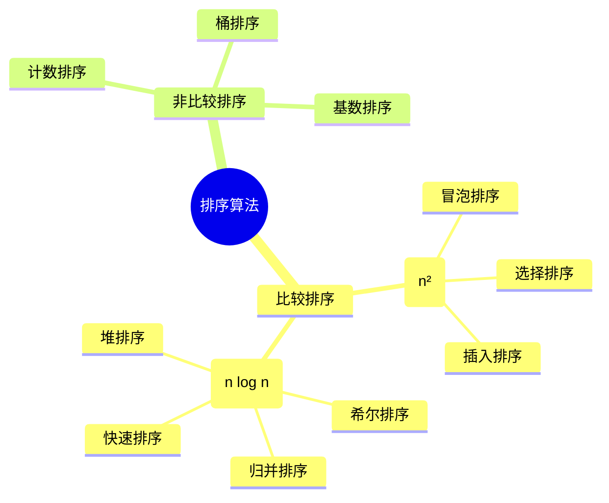
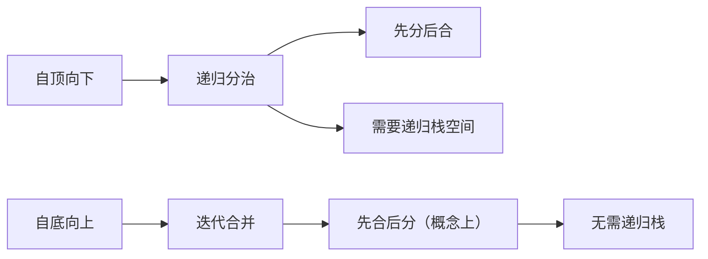
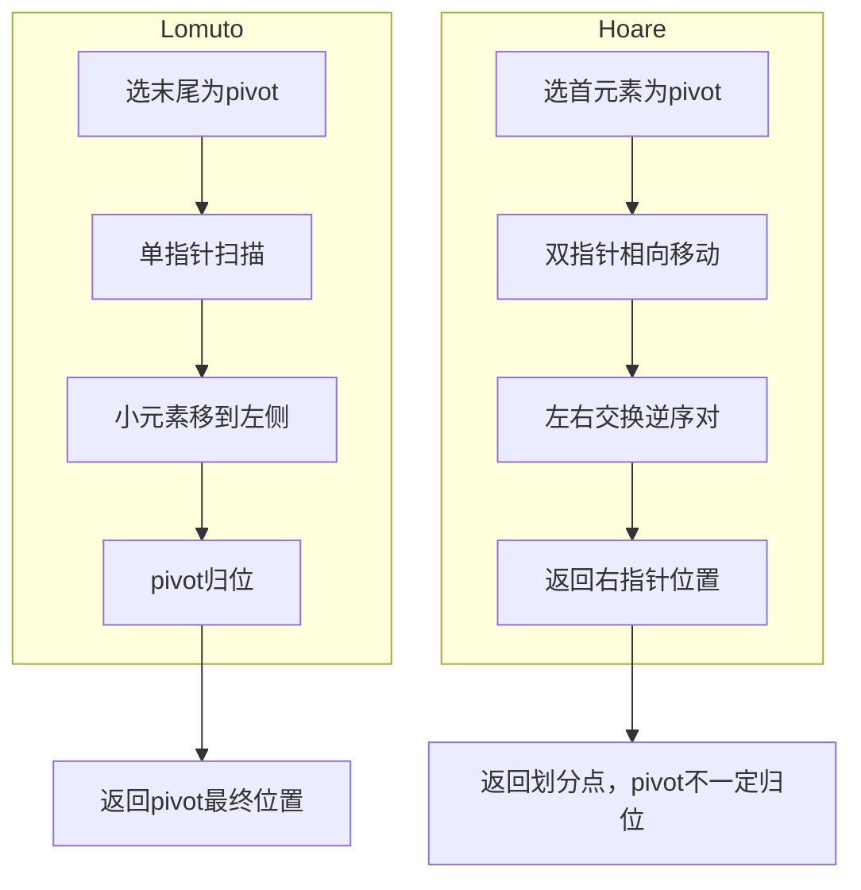
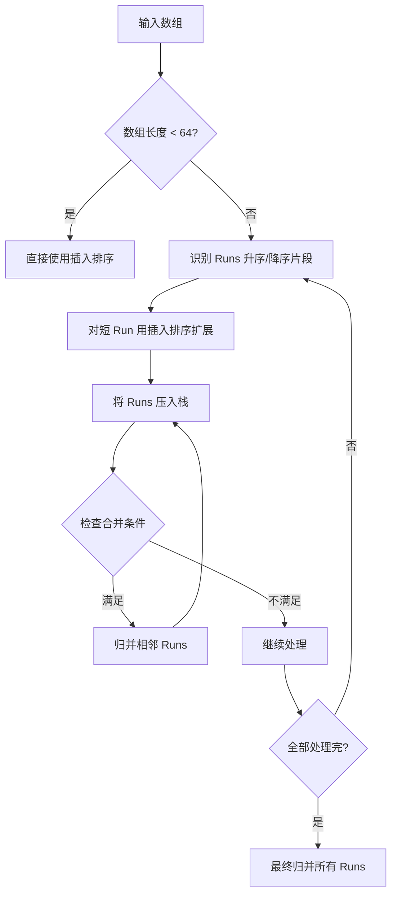
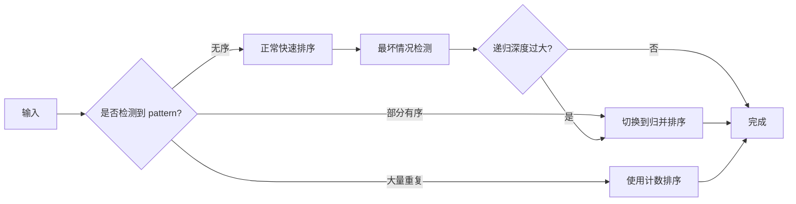
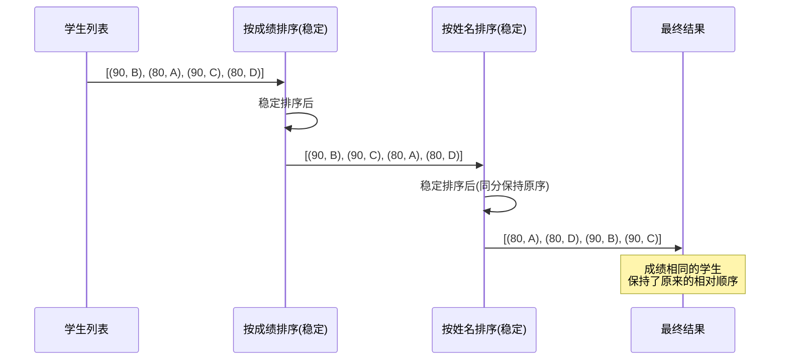

排序算法是计算机科学中最基础、也是面试最高频的知识点之一。从 O(n²) 的朴素算法到 O(n log n) 的高效算法，再到线性时间复杂度的非比较排序，排序的世界远比"调用一个 sort 函数"丰富得多。本文将从理论到工程实践，对排序算法做一次系统性梳理。

---

## 一、排序算法全景概览



### 什么是排序的稳定性？

稳定性是指：对于相等的元素，排序后它们的相对顺序保持不变。这在多级排序（先按年龄排序，再按成绩排序）中至关重要。

---

## 二、基础排序算法 O(n²)

### 2.1 冒泡排序（Bubble Sort）

通过相邻元素两两比较，将最大值"冒泡"到末尾。

```python
def bubble_sort(arr):
    n = len(arr)
    for i in range(n):
        swapped = False
        for j in range(0, n - i - 1):
            if arr[j] > arr[j + 1]:
                arr[j], arr[j + 1] = arr[j + 1], arr[j]
                swapped = True
        if not swapped:  # 提前终止优化
            break
    return arr
```

**优化点**：加入 `swapped` 标志，当数组已经有序时可以提前退出，最好情况时间复杂度降至 O(n)。

### 2.2 选择排序（Selection Sort）

每次从未排序部分选出最小值，放到已排序部分的末尾。

```python
def selection_sort(arr):
    n = len(arr)
    for i in range(n):
        min_idx = i
        for j in range(i + 1, n):
            if arr[j] < arr[min_idx]:
                min_idx = j
        arr[i], arr[min_idx] = arr[min_idx], arr[i]
    return arr
```

**特点**：无论输入如何，比较次数恒为 n(n-1)/2，交换次数最多 n-1 次。

### 2.3 插入排序（Insertion Sort）

将元素逐个插入已排序序列的合适位置，类似打扑克时理牌。

```python
def insertion_sort(arr):
    for i in range(1, len(arr)):
        key = arr[i]
        j = i - 1
        while j >= 0 and arr[j] > key:
            arr[j + 1] = arr[j]
            j -= 1
        arr[j + 1] = key
    return arr
```

**优势**：对近乎有序的数据非常高效，最好情况 O(n)，是 Timsort 的核心组件之一。

---

## 三、高效排序算法 O(n log n)

### 3.1 希尔排序（Shell Sort）

插入排序的改进版，通过设定间隔（gap）进行分组插入排序。

```python
def shell_sort(arr):
    n = len(arr)
    gap = n // 2
    while gap > 0:
        for i in range(gap, n):
            temp = arr[i]
            j = i
            while j >= gap and arr[j - gap] > temp:
                arr[j] = arr[j - gap]
                j -= gap
            arr[j] = temp
        gap //= 2
    return arr
```

**Gap 序列选择**：
- Shell 原始序列：n/2, n/4, ..., 1 → 最坏 O(n²)
- Hibbard 序列：2^k - 1 → 最坏 O(n^(3/2))
- Sedgewick 序列：最优可达 O(n^(4/3))

### 3.2 归并排序（Merge Sort）

基于分治思想，将数组不断二分后合并。

```python
def merge_sort(arr):
    if len(arr) <= 1:
        return arr
    mid = len(arr) // 2
    left = merge_sort(arr[:mid])
    right = merge_sort(arr[mid:])
    return merge(left, right)

def merge(left, right):
    result = []
    i = j = 0
    while i < len(left) and j < len(right):
        if left[i] <= right[j]:  # <= 保证稳定性
            result.append(left[i])
            i += 1
        else:
            result.append(right[j])
            j += 1
    result.extend(left[i:])
    result.extend(right[j:])
    return result
```

#### 自顶向下 vs 自底向上



```python
# 自底向上归并排序（迭代版）
def merge_sort_bottom_up(arr):
    n = len(arr)
    size = 1
    while size < n:
        for left in range(0, n, 2 * size):
            mid = min(left + size, n)
            right = min(left + 2 * size, n)
            arr[left:right] = merge(arr[left:mid], arr[mid:right])
        size *= 2
    return arr
```

### 3.3 快速排序（Quick Sort）

选择 pivot 进行分区，递归排序左右两部分。

```python
# Lomuto 分区方案
def quick_sort_lomuto(arr, low=0, high=None):
    if high is None:
        high = len(arr) - 1
    if low < high:
        pi = lomuto_partition(arr, low, high)
        quick_sort_lomuto(arr, low, pi - 1)
        quick_sort_lomuto(arr, pi + 1, high)
    return arr

def lomuto_partition(arr, low, high):
    pivot = arr[high]  # 选最后一个元素作为 pivot
    i = low - 1
    for j in range(low, high):
        if arr[j] <= pivot:
            i += 1
            arr[i], arr[j] = arr[j], arr[i]
    arr[i + 1], arr[high] = arr[high], arr[i + 1]
    return i + 1
```

#### Lomuto vs Hoare 分区策略对比



| 维度 | Lomuto 分区 | Hoare 分区 |
|------|------------|-----------|
| Pivot 选择 | 通常选末尾元素 | 通常选首元素 |
| 指针策略 | 单指针从左扫描 | 双指针相向而行 |
| 交换次数 | 较多 | 较少（更高效） |
| 等值元素处理 | 全部归入一侧 | 分布在两侧 |
| 递归返回值 | pivot 的最终位置 | 右指针 j 的位置 |
| 稳定性 | 不稳定 | 不稳定 |

```python
# Hoare 分区方案
def quick_sort_hoare(arr, low=0, high=None):
    if high is None:
        high = len(arr) - 1
    if low < high:
        pi = hoare_partition(arr, low, high)
        quick_sort_hoare(arr, low, pi)      # 注意：是 pi 不是 pi-1
        quick_sort_hoare(arr, pi + 1, high)
    return arr

def hoare_partition(arr, low, high):
    pivot = arr[low]
    i, j = low - 1, high + 1
    while True:
        while True:
            i += 1
            if arr[i] >= pivot:
                break
        while True:
            j -= 1
            if arr[j] <= pivot:
                break
        if i >= j:
            return j
        arr[i], arr[j] = arr[j], arr[i]
```

### 3.4 堆排序（Heap Sort）

利用大顶堆的性质，每次取出堆顶最大值。

```python
def heap_sort(arr):
    n = len(arr)

    # 建堆：从最后一个非叶子节点开始下沉
    for i in range(n // 2 - 1, -1, -1):
        heapify(arr, n, i)

    # 逐个提取元素
    for i in range(n - 1, 0, -1):
        arr[0], arr[i] = arr[i], arr[0]  # 堆顶与末尾交换
        heapify(arr, i, 0)               # 对新堆顶下沉
    return arr

def heapify(arr, n, i):
    """下沉操作：维护以 i 为根的大顶堆"""
    largest = i
    left = 2 * i + 1
    right = 2 * i + 2

    if left < n and arr[left] > arr[largest]:
        largest = left
    if right < n and arr[right] > arr[largest]:
        largest = right

    if largest != i:
        arr[i], arr[largest] = arr[largest], arr[i]
        heapify(arr, n, largest)  # 递归下沉
```

```mermaid
graph TD
    A[heap_sort 入口] --> B[建堆阶段]
    B --> C[从 n/2-1 到 0 遍历]
    C --> D[对每个节点调用 heapify 下沉]
    D --> E[建堆完成：arr[0] 是最大值]

    E --> F[排序阶段]
    F --> G[交换 arr[0] 与 arr[i]]
    G --> H[对新的 arr[0] 调用 heapify]
    H --> I[i 减 1]
    I --> J{i > 0?}
    J -->|是| G
    J -->|否| K[排序完成]
```

**建堆时间复杂度**：O(n)（不是 O(n log n)，因为底层节点下沉距离短）

---

## 四、非比较排序 O(n)

### 4.1 计数排序（Counting Sort）

适用于数据范围较小的整数排序。

```python
def counting_sort(arr):
    if not arr:
        return arr
    min_val, max_val = min(arr), max(arr)
    count = [0] * (max_val - min_val + 1)

    for num in arr:
        count[num - min_val] += 1

    result = []
    for i, c in enumerate(count):
        result.extend([i + min_val] * c)
    return result
```

### 4.2 桶排序（Bucket Sort）

将数据分到有限数量的桶中，每个桶单独排序后合并。

```python
def bucket_sort(arr, bucket_size=5):
    if not arr:
        return arr
    min_val, max_val = min(arr), max(arr)
    bucket_count = (max_val - min_val) // bucket_size + 1
    buckets = [[] for _ in range(bucket_count)]

    for num in arr:
        buckets[(num - min_val) // bucket_size].append(num)

    result = []
    for bucket in buckets:
        result.extend(sorted(bucket))  # 桶内用任意排序
    return result
```

### 4.3 基数排序（Radix Sort）

按位排序，从低位到高位（LSD）或从高位到低位（MSD）。

```python
def radix_sort(arr):
    if not arr:
        return arr
    max_num = max(arr)
    digit = 0
    while 10 ** digit <= max_num:
        buckets = [[] for _ in range(10)]
        for num in arr:
            digit_val = (num // (10 ** digit)) % 10
            buckets[digit_val].append(num)
        arr = [num for bucket in buckets for num in bucket]
        digit += 1
    return arr
```

---

## 五、复杂度对比总览

| 算法 | 最好时间 | 最坏时间 | 平均时间 | 空间复杂度 | 稳定性 |
|------|---------|---------|---------|-----------|--------|
| 冒泡排序 | O(n) | O(n²) | O(n²) | O(1) | ✅ 稳定 |
| 选择排序 | O(n²) | O(n²) | O(n²) | O(1) | ❌ 不稳定 |
| 插入排序 | O(n) | O(n²) | O(n²) | O(1) | ✅ 稳定 |
| 希尔排序 | O(n log n) | O(n²) | O(n log² n) | O(1) | ❌ 不稳定 |
| 归并排序 | O(n log n) | O(n log n) | O(n log n) | O(n) | ✅ 稳定 |
| 快速排序 | O(n log n) | O(n²) | O(n log n) | O(log n) | ❌ 不稳定 |
| 堆排序 | O(n log n) | O(n log n) | O(n log n) | O(1) | ❌ 不稳定 |
| 计数排序 | O(n + k) | O(n + k) | O(n + k) | O(k) | ✅ 稳定 |
| 桶排序 | O(n + k) | O(n²) | O(n + k) | O(n + k) | ✅ 稳定 |
| 基数排序 | O(d(n+k)) | O(d(n+k)) | O(d(n+k)) | O(n + k) | ✅ 稳定 |

> 其中 k 为数据范围，d 为位数

---

## 六、工程实践中的排序算法

### 6.1 Python Timsort

Timsort 是 Python 和 Java（Arrays.sort for objects）的默认排序，结合了插入排序和归并排序。



**核心特性**：
- 利用现实数据中已有的有序片段（Run）
- 小片段用插入排序（局部性好）
- 大片段用归并排序（稳定 O(n log n)）
- 保证稳定性

### 6.2 Rust pdqsort（Pattern-Defeating Quicksort）

Rust 标准库 `sort_unstable` 使用的算法：



**设计哲学**：在快速排序的基础上，增加对特殊输入模式的检测与回退策略，确保最坏情况仍然是 O(n log n)。

### 6.3 Java Dual-Pivot Quicksort

Java 7 之后 `Arrays.sort` 对基本类型使用的排序：

```java
// 双轴快速排序核心思路
// 选择两个 pivot: p1 < p2
// 将数组分为三部分: <p1, p1~p2, >p2
// 分别递归排序
void dualPivotQuicksort(int[] a, int left, int right) {
    // 1. 选择两个pivot
    // 2. 三路分区
    // 3. 递归处理三个分区
    // 4. 对短数组回退到插入排序
}
```

**优势**：相比单 pivot，双 pivot 减少了比较次数，在现代 CPU 缓存架构下性能更优。

---

## 七、稳定性在实际应用中的意义



**经典场景**：
1. **多级排序**：先按部门排序，再按薪资排序 → 必须稳定
2. **增量更新**：已按时间排序的数据，新增后按优先级排序 → 稳定排序保持时间顺序
3. **数据库查询**：ORDER BY 多字段时，稳定性保证结果可预期

---

## 八、面试 Q&A

### Q1: 快速排序在最坏情况下时间复杂度是多少？如何避免？

**A**: 最坏情况为 O(n²)，发生在每次选择的 pivot 都是最大或最小值时（如已排序数组选首元素为 pivot）。

**避免策略**：
1. **三数取中法**：取首、中、尾三个元素的中位数作为 pivot
2. **随机选择 pivot**：将最坏情况的概率降到极低
3. **三向切分**：对大量重复元素使用 Dijkstra 的三向分区
4. **切换到其他算法**：如 Introsort，递归深度超过 log n 时切换到堆排序

### Q2: 为什么堆排序在实际中不如快速排序常用？

**A**: 
1. **缓存不友好**：堆排序的访问模式是跳跃式的（i → 2i+1 → 2i+2），缓存命中率低
2. **常数因子大**：虽然都是 O(n log n)，堆排序的比较和交换次数更多
3. **不稳定**：无法保持相等元素的相对顺序
4. **快速排序的优化成熟**：三向切分、缓存优化等技术让快排在实际中更快

但堆排序有独特优势：空间复杂度 O(1) 且最坏情况保证 O(n log n)，适用于对最坏性能敏感的场景。

### Q3: 归并排序和快速排序的核心区别是什么？

**A**:

| 维度 | 归并排序 | 快速排序 |
|------|---------|---------|
| 分治策略 | 先分（均匀二分）再治（归并时排序） | 先治（分区时排序）再分 |
| 工作量分配 | 归并阶段做主要工作 | 分区阶段做主要工作 |
| 空间复杂度 | O(n) 需要额外空间 | O(log n) 递归栈 |
| 稳定性 | 稳定 | 不稳定 |
| 最坏情况 | O(n log n) 有保证 | O(n²) 需要防护 |
| 链表排序 | 非常适合 O(1) 额外空间 | 不适合 |

### Q4: 什么情况下使用非比较排序？

**A**: 当满足以下条件之一时：
1. **数据范围有限**：如 [0, 100] 的整数排序 → 计数排序
2. **数据分布均匀**：浮点数均匀分布 → 桶排序
3. **多位整数/字符串**：且位数不太大 → 基数排序

**核心前提**：需要知道数据的分布特征，且空间复杂度可接受。

### Q5: 如何对 10 亿个整数排序，内存只有 2GB？

**A**: 这是经典的外排序问题：

1. **分块**：每次读取 2GB 数据到内存，使用快速排序
2. **写回磁盘**：排序后的块写入临时文件，得到约 5 个有序文件
3. **多路归并**：使用最小堆进行 K 路归并，每次从每个文件读一块
4. **优化**：使用败者树替代堆进行 K 路归并，减少比较次数

```python
# K路归并的核心思路
import heapq

def k_way_merge(file_streams):
    heap = []
    for i, stream in enumerate(file_streams):
        val = next(stream, None)
        if val is not None:
            heapq.heappush(heap, (val, i))

    while heap:
        val, idx = heapq.heappop(heap)
        yield val
        next_val = next(file_streams[idx], None)
        if next_val is not None:
            heapq.heappush(heap, (next_val, idx))
```

### Q6: Timsort 为什么适合真实世界的数据？

**A**: Timsort 的核心洞察是**真实数据往往包含局部有序片段**（称为 Runs）。

- 对升序或降序片段进行识别和反转
- 小片段用插入排序（在近乎有序时接近 O(n)）
- 大片段用归并排序（保证 O(n log n) 上界）
- 维护一个不变量：栈中 Runs 的长度满足特定约束，确保归并的平衡性

这使得 Timsort 在最好情况（已排序）下达到 O(n)，最坏情况 O(n log n)，且保持稳定。

---

## 九、总结

排序算法的选择并非"越快越好"，而需要综合考虑：

| 场景 | 推荐算法 |
|------|---------|
| 小规模数据（n < 50） | 插入排序 |
| 一般场景、追求平均性能 | 快速排序 / 双轴快排 |
| 需要稳定性 | 归并排序 / Timsort |
| 最坏性能保证 | 堆排序 / Introsort |
| 整数排序、数据范围小 | 计数排序 / 基数排序 |
| 大数据外排序 | 多路归并 |

理解每种算法的适用场景和底层原理，才能在工程实践中做出最优选择。
