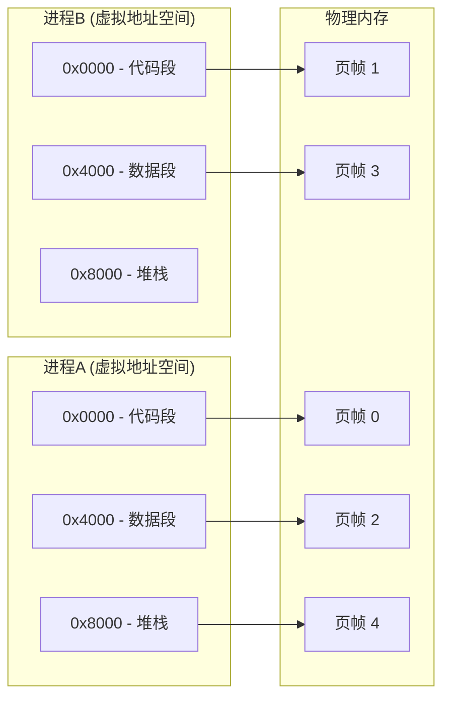
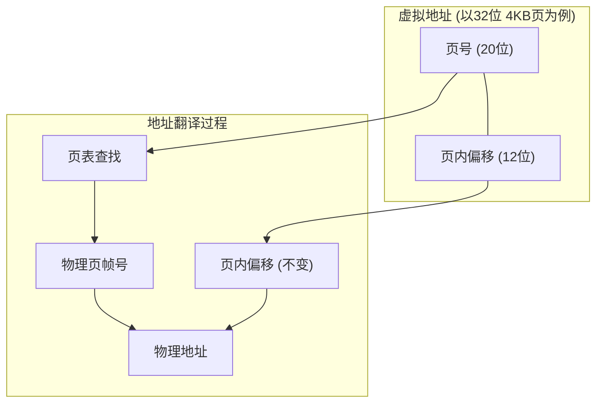
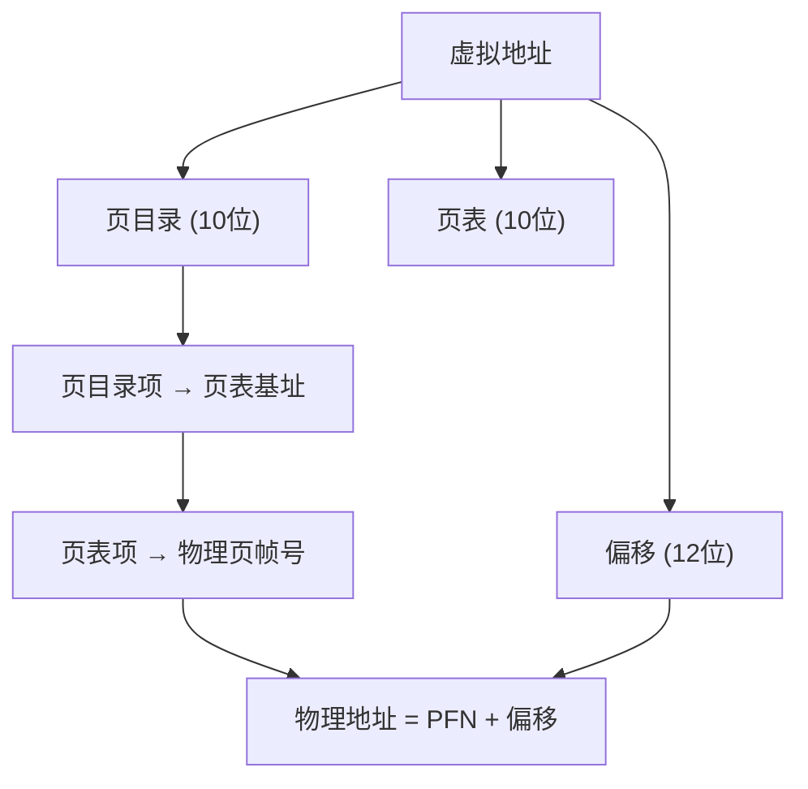
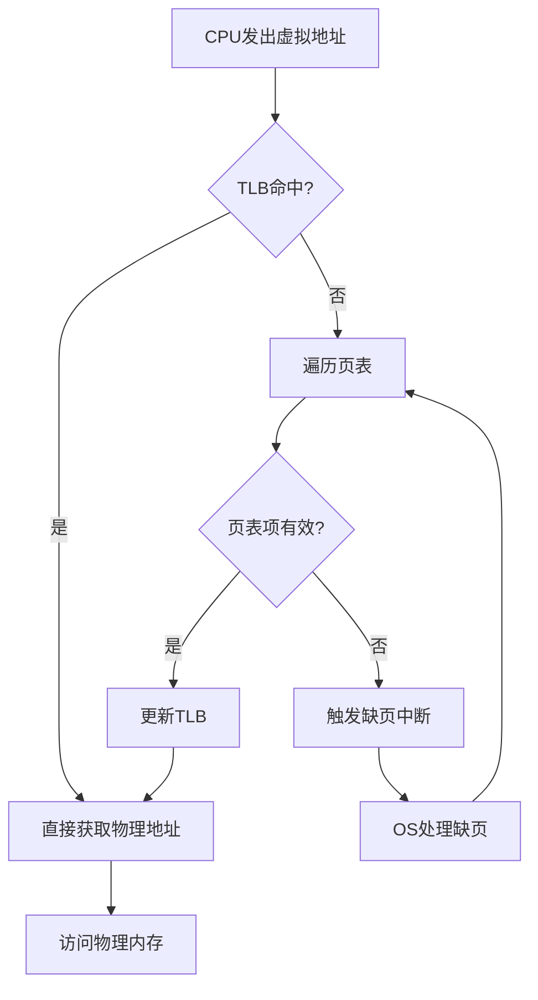
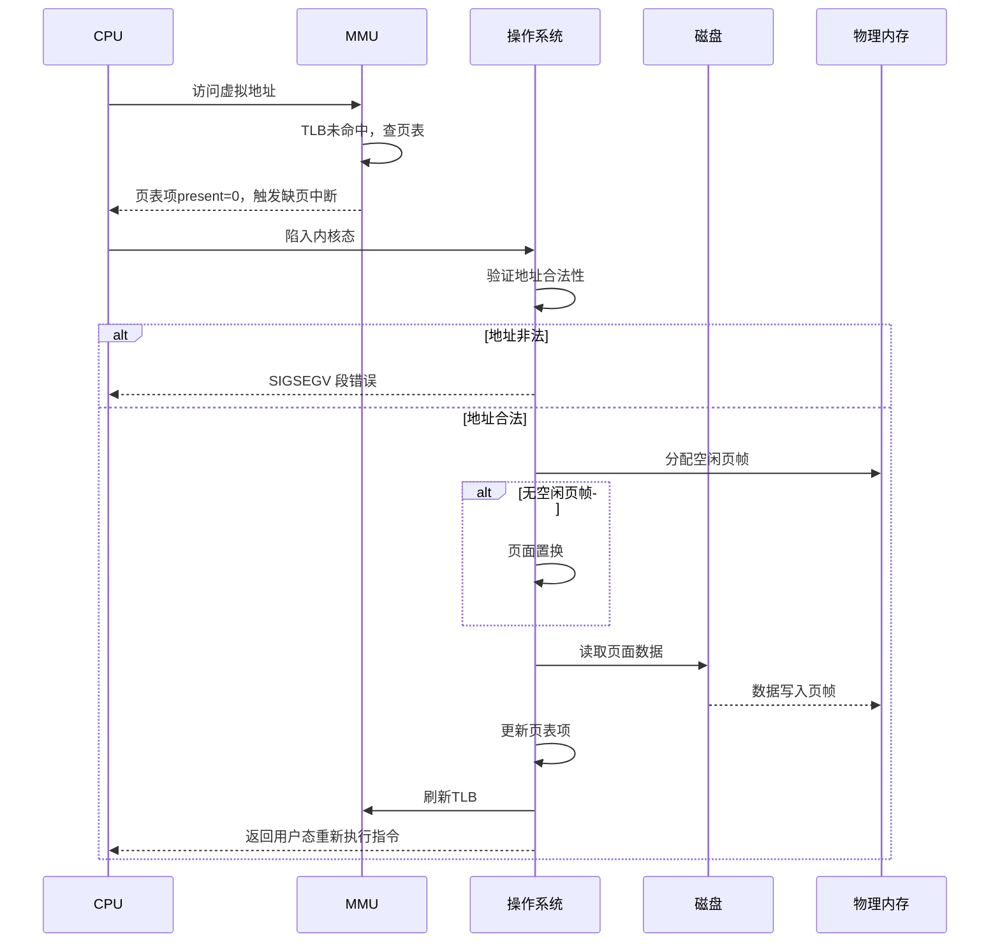
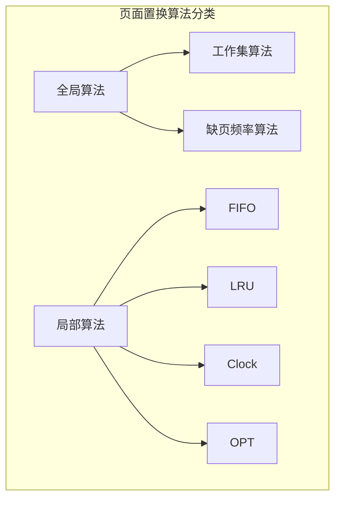
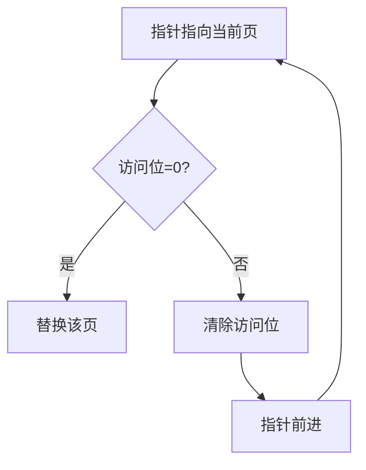
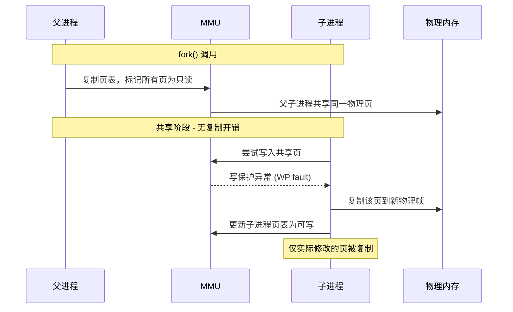
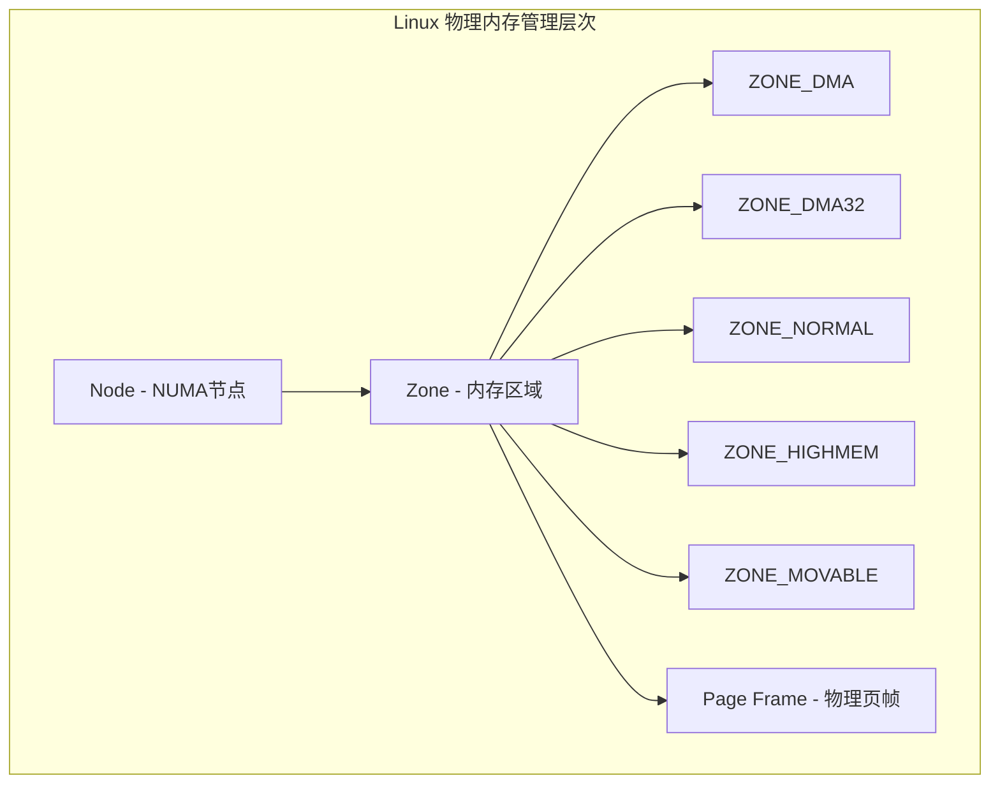
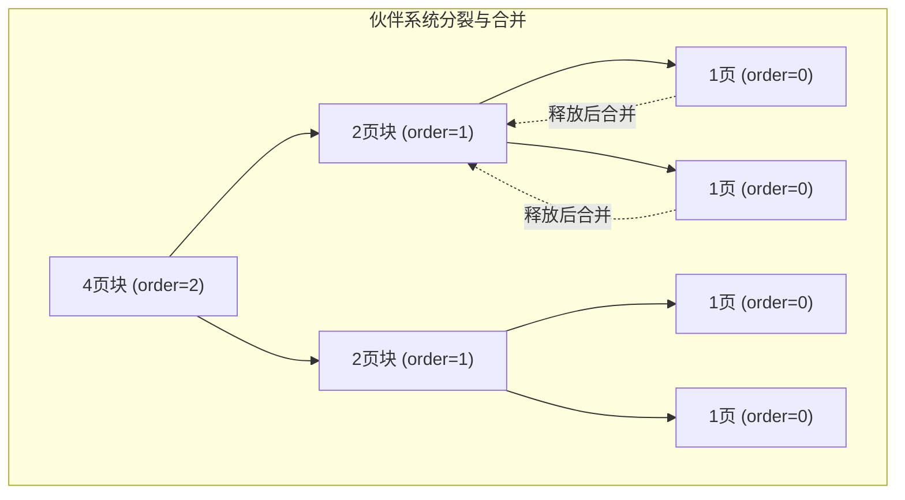

## 1. 虚拟内存概述

虚拟内存是现代操作系统最核心的抽象之一，它为每个进程提供了一个独立的、连续的、私有的地址空间，使得进程无需关心物理内存的实际布局。

### 1.1 为什么需要虚拟内存

在没有虚拟内存的系统中，程序直接操作物理地址，这带来了三大问题：

| 问题 | 描述 | 后果 |
|------|------|------|
| 地址冲突 | 多个程序使用相同地址 | 数据互相覆盖 |
| 内存不足 | 物理内存有限 | 无法运行大程序 |
| 安全隔离 | 进程可直接访问其他进程内存 | 恶意读取/篡改数据 |

虚拟内存通过 **地址空间抽象** 解决了上述问题：



### 1.2 虚拟内存的核心能力

- **隔离性**：每个进程拥有独立地址空间，互不干扰
- **扩展性**：虚拟地址空间可远大于物理内存（借助磁盘交换）
- **共享性**：不同虚拟页可映射到同一物理页（共享库、COW）
- **简化链接/加载**：程序总是从固定地址开始链接，无需关心物理布局

## 2. 分页机制

分页是虚拟内存最主流的实现方式，将虚拟地址空间划分为固定大小的 **页(Page)**，将物理内存划分为同样大小的 **页帧(Page Frame)**。

### 2.1 页与页帧



关键参数计算（以 32 位系统、4KB 页为例）：

$$
\text{虚拟页数} = \frac{2^{32}}{4 \times 2^{10}} = 2^{20} = 1,048,576 \text{ 页}
$$

$$
\text{页内偏移位数} = \log_2(4096) = 12 \text{ 位}
$$

### 2.2 页表结构

每个进程都有自己的页表，由操作系统维护，MMU 硬件执行查找：

```c
// 简化的页表项结构 (x86架构)
typedef struct {
    uint32_t present    : 1;   // 页是否在物理内存中
    uint32_t rw         : 1;   // 读/写权限
    uint32_t user       : 1;   // 用户/内核权限
    uint32_t pwt        : 1;   // 写穿透
    uint32_t pcd        : 1;   // 禁用缓存
    uint32_t accessed   : 1;   // 是否被访问过
    uint32_t dirty      : 1;   // 是否被修改过
    uint32_t pat        : 1;   // 页属性表
    uint32_t global     : 1;   // 全局页
    uint32_t available  : 3;   // 供OS使用
    uint32_t pfn        : 20;  // 物理页帧号
} pte_t;
```

## 3. 多级页表

单级页表的问题在于：32 位系统需要 $2^{20}$ 个页表项，每项 4 字节，仅页表就占 4MB，且必须连续存放。

### 3.1 二级页表



二级页表的核心优势：**按需分配**。只有实际使用的虚拟页才需要分配页表页，未使用的虚拟地址范围不需要页表页。

### 3.2 多级页表的空间开销对比

| 地址位数 | 页大小 | 级数 | 页表项总数 | 页表总空间 |
|----------|--------|------|------------|------------|
| 32 位 | 4KB | 2 级 | 最多 $2^{20}$ | 最多 4MB |
| 64 位 | 4KB | 4 级 | 最多 $2^{52}$ | 按需分配 |

### 3.3 Linux 的四级页表

Linux 内核使用四级页表结构：

```
PGD (Page Global Directory)
 └─ PUD (Page Upper Directory)
     └─ PMD (Page Middle Directory)
         └─ PTE (Page Table Entry)
             └─ 物理页帧
```

```c
// Linux 内核页表遍历 (简化)
static inline pte_t *pte_offset_map(pmd_t *pmd, unsigned long address)
{
    return (pte_t *)pmd_page_vaddr(*pmd) + pte_index(address);
}

// 完整的地址翻译路径
pgd_t *pgd = pgd_offset(mm, address);
p4d_t *p4d = p4d_offset(pgd, address);
pud_t *pud = pud_offset(p4d, address);
pmd_t *pmd = pmd_offset(pud, address);
pte_t *pte = pte_offset_map(pmd, address);
```

## 4. TLB（Translation Lookaside Buffer）

每次内存访问都需要查页表，多级页表意味着多次内存访问。TLB 是 MMU 中的高速缓存，缓存最近的虚拟-物理地址映射。

### 4.1 TLB 工作流程



### 4.2 TLB 的关键指标

$$
\text{有效访存时间} = t_{TLB} + \text{命中率} \times t_{内存} + (1 - \text{命中率}) \times (t_{内存} \times (级数 + 1))
$$

假设 TLB 访问时间 1ns，内存访问时间 100ns，4 级页表，TLB 命中率 99%：

$$
EAT = 1 + 0.99 \times 100 + 0.01 \times (100 \times 5) = 1 + 99 + 5 = 105 \text{ ns}
$$

### 4.3 TLB 一致性问题

当进程切换时，TLB 中的映射属于前一个进程，需要处理：

| 方案 | 描述 | 优缺点 |
|------|------|--------|
| 全部刷新 | 上下文切换时清空 TLB | 简单但性能差 |
| ASID 标记 | TLB 项附加地址空间标识符 | 硬件支持，性能好 |
| 软件管理 | OS 决定何时刷新哪些 TLB 项 | 灵活但复杂 |

## 5. 缺页中断

当 CPU 访问的虚拟页不在物理内存中时，触发缺页中断（Page Fault），由操作系统负责处理。

### 5.1 缺页中断处理流程



### 5.2 缺页中断 vs 普通中断

| 特性 | 缺页中断 | 普通中断 |
|------|----------|----------|
| 触发时机 | 指令执行期间 | 指令执行之间 |
| 处理时间 | 毫秒级（涉及磁盘IO） | 微秒级 |
| 指令重启 | 需要重新执行该指令 | 从下一条指令继续 |
| 频率 | 取决于内存压力 | 取决于外部事件 |

## 6. 页面置换算法

当物理内存不足时，需要选择一个页面换出。页面置换算法的目标是 **最小化缺页率**。

### 6.1 算法对比



| 算法 | 原理 | 优点 | 缺点 | 实际应用 |
|------|------|------|------|----------|
| OPT | 替换未来最久不使用的页 | 理论最优 | 无法实现（需预知未来） | 作为理论基准 |
| FIFO | 替换最早进入内存的页 | 实现简单 | Belady 异常，性能差 | 很少单独使用 |
| LRU | 替换最近最少使用的页 | 接近OPT性能 | 精确实现开销大 | 硬件近似实现 |
| Clock | LRU的近似，环形链表 | 实现简单，性能较好 | 近似LRU | 广泛使用 |

### 6.2 FIFO 与 Belady 异常

FIFO 算法存在 Belady 异常：分配更多页帧反而缺页率更高。

```
引用串: 1, 2, 3, 4, 1, 2, 5, 1, 2, 3, 4, 5

3个页帧: 缺页次数 = 9
4个页帧: 缺页次数 = 10  ← Belady异常！
```

### 6.3 LRU 实现

精确 LRU 需要维护一个按访问时间排序的链表，每次访问都要更新，开销为 $O(n)$。

```c
// 简化的LRU缓存实现
typedef struct lru_node {
    unsigned long page_num;
    struct list_head list;  // 内核双向链表
} lru_node_t;

void lru_access(lru_cache_t *cache, unsigned long page_num) {
    lru_node_t *node = find_node(cache, page_num);
    if (node) {
        // 命中：移到链表头部（最近使用）
        list_move(&node->list, &cache->head);
    } else {
        // 未命中
        if (cache->size >= cache->capacity) {
            // 淘汰链表尾部（最久未使用）
            lru_node_t *victim = list_last_entry(&cache->head, lru_node_t, list);
            list_del(&victim->list);
            free(victim);
            cache->size--;
        }
        // 新节点插入链表头部
        lru_node_t *new_node = malloc(sizeof(lru_node_t));
        new_node->page_num = page_num;
        list_add(&new_node->list, &cache->head);
        cache->size++;
    }
}
```

### 6.4 Clock 算法（二次机会算法）

Clock 算法是 LRU 的实用近似，使用环形链表 + 访问位：



```c
// Clock算法核心逻辑
int clock_replace(page_t *pages, int n, int *hand) {
    while (1) {
        if (pages[*hand].referenced == 0) {
            int victim = *hand;
            *hand = (*hand + 1) % n;
            return victim;
        }
        pages[*hand].referenced = 0;  // 给予第二次机会
        *hand = (*hand + 1) % n;
    }
}
```

改进型 Clock 算法考虑访问位 (R) 和修改位 (M)，优先淘汰 R=0, M=0 的页面：

| 优先级 | R | M | 说明 |
|--------|---|---|------|
| 1（最先淘汰） | 0 | 0 | 未访问未修改 |
| 2 | 0 | 1 | 未访问但已修改（需写回磁盘） |
| 3 | 1 | 0 | 已访问未修改 |
| 4（最后淘汰） | 1 | 1 | 已访问已修改 |

## 7. 写时复制 (Copy-On-Write, COW)

COW 是虚拟内存的重要优化，fork() 时不立即复制父进程的内存页，而是共享物理页并标记为只读，仅在写入时才实际复制。



```c
// Linux 内核中 COW 的处理 (简化)
static vm_fault_t do_wp_page(struct vm_fault *vmf) {
    struct page *old_page = vmf->page;

    if (page_count(old_page) == 1) {
        // 只有一个人使用，直接改为可写
        wp_page_reuse(vmf);
        return VM_FAULT_WRITE;
    }

    // 多人共享，需要复制
    struct page *new_page = alloc_page_vma(GFP_HIGHUSER, ...);
    copy_user_highpage(new_page, old_page, ...);

    // 更新页表指向新页
    entry = pte_mkwrite(pte_mkdirty(mk_pte(new_page, ...)));
    set_pte_at(vmf->vma->vm_mm, vmf->address, vmf->pte, entry);

    // 减少旧页引用计数
    page_remove_rmap(old_page, false);
    return VM_FAULT_WRITE;
}
```

### 7.1 COW 的典型应用

| 场景 | 描述 | 收益 |
|------|------|------|
| fork() | 子进程继承父进程地址空间 | 避免完整内存复制 |
| mmap 共享 | 多进程映射同一文件 | 节省物理内存 |
| 内存去重 (KSM) | 内核扫描相同页面合并 | 虚拟化场景节省内存 |

## 8. Linux 内存管理

### 8.1 Linux 物理内存管理



### 8.2 伙伴系统 (Buddy System)

Linux 使用伙伴系统管理物理页帧，以 2 的幂次方为单位分配：

```c
// 伙伴系统分配
struct page *alloc_pages(gfp_t gfp_mask, unsigned int order) {
    // order=0 → 1页, order=1 → 2页, order=2 → 4页...
    // 从对应order的空闲链表查找
    // 若无空闲，从更大order分裂
}

// 伙伴合并
static inline unsigned long find_buddy_pfn(unsigned long pfn, unsigned int order) {
    return pfn ^ (1 << order);  // 异或找伙伴
}
```



### 8.3 Slab 分配器

伙伴系统最小分配一页，对于小对象开销太大。Slab 在伙伴系统之上提供小对象缓存：

```c
// Slab 分配器层次
kmem_cache   →  Slab  →  Object
   ↑              ↑          ↑
 描述某种      包含若干个    实际分配的
 类型的对象    物理页帧      小对象

// 常用API
struct kmem_cache *kmem_cache_create(const char *name, size_t size, ...);
void *kmem_cache_alloc(struct kmem_cache *cachep, gfp_t flags);
void kmem_cache_free(struct kmem_cache *cachep, void *objp);
```

### 8.4 进程地址空间布局

```
高地址 ┌──────────────────────┐
       │     内核空间          │ ← 所有进程共享
       ├──────────────────────┤ 0xFFFF800000000000 (x86_64)
       │     栈 (↓ 向下增长)   │
       │                      │
       │     ↕ 空洞            │
       │                      │
       │     内存映射区 (mmap) │ ← 共享库、文件映射
       │     (↑ 向上增长)      │
       ├──────────────────────┤
       │     堆 (↑ 向上增长)   │ ← brk/sbrk 扩展
       ├──────────────────────┤
       │     BSS段 (未初始化)  │
       │     数据段 (已初始化)  │
       │     代码段 (只读)     │
低地址 └──────────────────────┘ 0x0000000000000000
```

## 9. 面试 Q&A

**Q1: 虚拟内存和物理内存的关系是什么？**

A: 虚拟内存是操作系统提供的地址空间抽象，通过页表映射到物理内存。多个进程的虚拟地址可以映射到不同的物理地址（隔离），也可以映射到相同的物理地址（共享）。虚拟内存还可以映射到磁盘上的交换空间，实现内存超分配。

**Q2: 为什么需要多级页表？单级页表有什么问题？**

A: 单级页表必须连续存放且覆盖整个虚拟地址空间。32位系统4KB页需要1M个页表项（4MB），64位系统更是天文数字。多级页表通过按需分配解决了这个问题：只有实际使用的地址范围才需要分配页表页，大幅节省内存。代价是增加了地址翻译的访存次数，但TLB可以缓解这个问题。

**Q3: TLB 命中率对系统性能有多大影响？**

A: 影响非常大。假设4级页表，TLB未命中需要4次额外内存访问。如果内存访问100ns，TLB命中率从99%降到95%，有效访存时间从约105ns增加到约125ns，性能下降约16%。对于频繁访问大量不同页面的工作负载（如数据库），TLB命中率尤为关键，大页(HugePage)就是为了减少TLB压力。

**Q4: COW 在什么场景下最有价值？fork() 后立即 exec() 会不会浪费？**

A: COW 在 fork() 后子进程继续运行（而非立即 exec）时最有价值，如 Redis 的 RDB 持久化。fork() 后立即 exec() 的情况下，COW 的开销很小——仅复制了页表（而非物理页），exec() 会替换整个地址空间。Linux 还做了优化：fork() 时可以标记整个地址空间为"即将丢弃"，避免不必要的COW。

**Q5: 页面置换算法中，为什么 LRU 在实际系统中很少精确实现？**

A: 精确LRU需要在每次内存访问时更新排序结构，即使使用硬件计数器也有巨大开销。实际系统使用近似LRU：Clock算法（二次机会）只需访问位，Linux的活跃/非活跃链表通过定期扫描实现近似LRU。这些近似算法在大多数工作负载下性能接近LRU，但实现开销低得多。

**Q6: Linux 的伙伴系统和 Slab 分配器各解决什么问题？**

A: 伙伴系统解决物理页帧的分配与回收，以2的幂次方为单位，优点是无外部碎片但可能内部碎片。Slab在伙伴系统之上解决小对象分配问题，通过对象缓存复用已分配的页帧，避免反复分配/释放导致的内部碎片和性能开销。两者配合：Slab从伙伴系统获取页帧，再切分为小对象。
