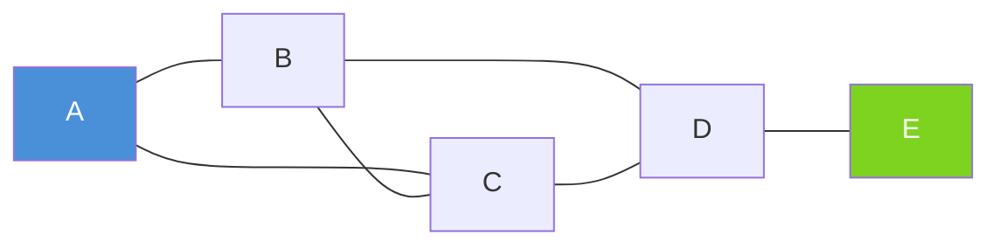
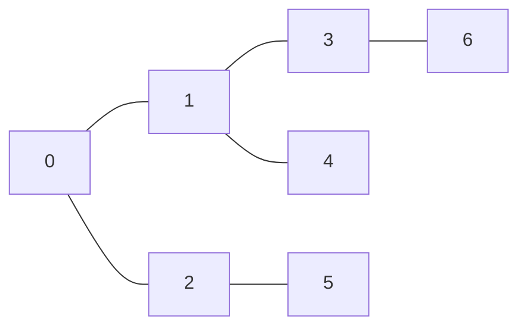
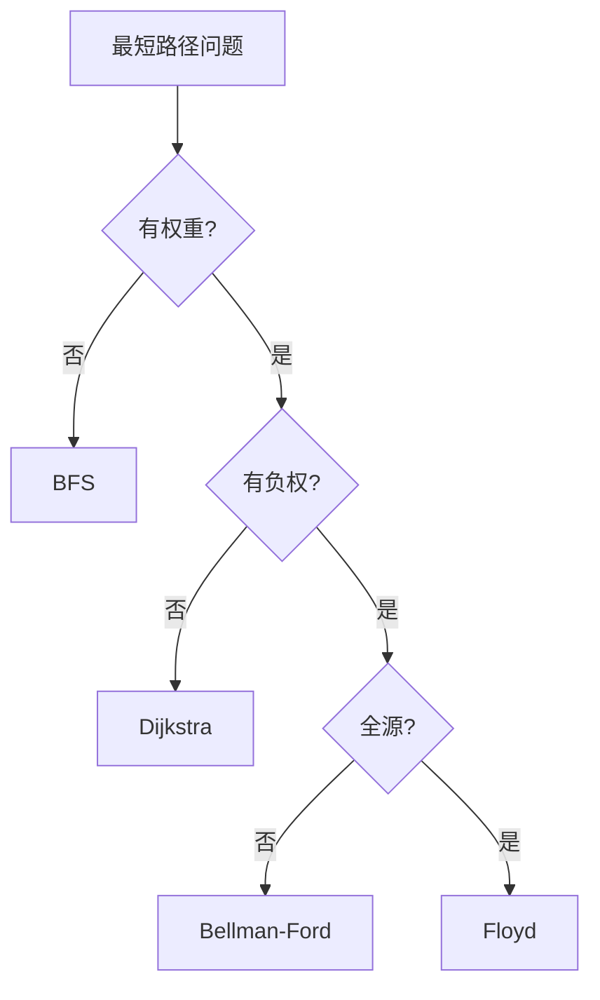
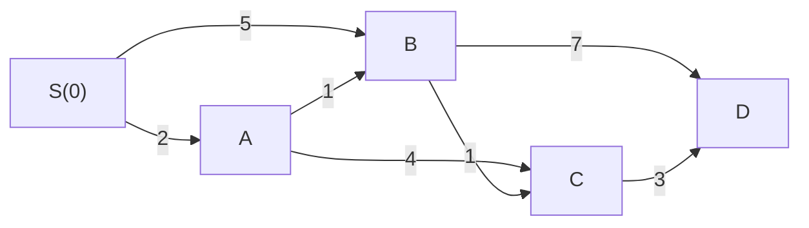
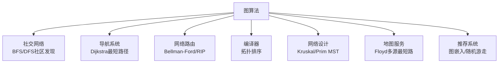
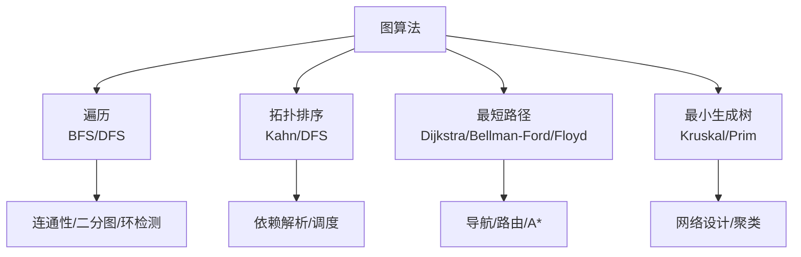

## 1. 图的基本概念

图（Graph）是由顶点（Vertex）和边（Edge）组成的非线性数据结构，用于描述事物之间的关系。



### 1.1 图的分类

| 类型 | 定义 | 示例 |
|:-----|:-----|:-----|
| 无向图 | 边没有方向 | 社交网络 |
| 有向图 | 边有方向 | 网页链接 |
| 加权图 | 边有权重 | 路网距离 |
| 无权图 | 边无权重 | 关系存在与否 |
| 稀疏图 | $|E| \ll |V|^2$ | 社交网络 |
| 稠密图 | $|E| \approx |V|^2$ | 完全图 |

### 1.2 度的概念

- **无向图**：顶点的度 = 与之相连的边数
- **有向图**：入度（指向该顶点的边数）+ 出度（从该顶点出发的边数）
- 握手定理：$\sum_{v} \deg(v) = 2|E|$

## 2. 图的表示

### 2.1 邻接矩阵

用二维数组 `adj[i][j]` 表示顶点 $i$ 到 $j$ 是否有边（或权重）。

```cpp
// 邻接矩阵表示
const int INF = 1e9;
vector<vector<int>> adj(n, vector<int>(n, INF));
// 添加边
adj[u][v] = w;  // 有向图
adj[u][v] = adj[v][u] = w;  // 无向图
```

### 2.2 邻接表

每个顶点维护一个链表/向量，存储其所有邻居。

```cpp
// 邻接表表示
vector<vector<pair<int, int>>> adj(n);  // (邻居, 权重)
// 添加边
adj[u].push_back({v, w});  // 有向图
adj[u].push_back({v, w});
adj[v].push_back({u, w});  // 无向图
```

### 2.3 两种表示对比

| 特性 | 邻接矩阵 | 邻接表 |
|:-----|:---------|:-------|
| 空间 | $O(V^2)$ | $O(V+E)$ |
| 判断边是否存在 | $O(1)$ | $O(\deg(v))$ |
| 遍历邻居 | $O(V)$ | $O(\deg(v))$ |
| 添加边 | $O(1)$ | $O(1)$ |
| 适用场景 | 稠密图 | 稀疏图 |
| 缓存友好性 | ✅ 连续内存 | ❌ 指针跳跃 |

> **工程选择**：大多数实际问题（社交网络、路网）都是稀疏图，优先使用邻接表。
{: .prompt-tip}

## 3. 图的遍历

### 3.1 广度优先搜索（BFS）

**核心思想**：逐层扩展，使用队列实现。常用于求无权图最短路径。



BFS 访问顺序：0 → 1,2 → 3,4,5 → 6

```cpp
vector<int> bfs(int start, const vector<vector<int>>& adj) {
    int n = adj.size();
    vector<int> dist(n, -1);
    queue<int> q;
    dist[start] = 0;
    q.push(start);
    while (!q.empty()) {
        int u = q.front(); q.pop();
        for (int v : adj[u]) {
            if (dist[v] == -1) {
                dist[v] = dist[u] + 1;
                q.push(v);
            }
        }
    }
    return dist;
}
```

**BFS 性质**：
- 时间复杂度：$O(V + E)$
- 空间复杂度：$O(V)$
- 求无权图最短路径
- 可检测二分图

### 3.2 深度优先搜索（DFS）

**核心思想**：沿一条路径深入到底，回溯后探索其他分支。使用递归或栈实现。

```cpp
void dfs(int u, const vector<vector<int>>& adj, vector<bool>& visited, vector<int>& order) {
    visited[u] = true;
    order.push_back(u);
    for (int v : adj[u]) {
        if (!visited[v]) dfs(v, adj, visited, order);
    }
}
```

**DFS 的三种时间戳**（用于高级应用）：

```cpp
int timer = 0;
void dfs(int u, const vector<vector<int>>& adj,
         vector<int>& tin, vector<int>& tout) {
    tin[u] = ++timer;       // 进入时间
    for (int v : adj[u]) {
        if (!tin[v]) dfs(v, adj, tin, tout);
    }
    tout[u] = ++timer;      // 离开时间
}
```

### 3.3 BFS vs DFS

| 特性 | BFS | DFS |
|:-----|:----|:----|
| 数据结构 | 队列 | 栈/递归 |
| 空间 | $O(w)$（最大宽度） | $O(h)$（最大深度） |
| 最短路径 | ✅ 无权图 | ❌ |
| 拓扑排序 | Kahn 算法 | 逆后序 |
| 连通性 | ✅ | ✅ |
| 环检测 | ✅ | ✅ |
| 适合场景 | 层次遍历、最短路径 | 回溯、拓扑排序 |

## 4. 拓扑排序

**适用条件**：有向无环图（DAG）

### 4.1 Kahn 算法（BFS 方式）

```cpp
vector<int> topologicalSort(const vector<vector<int>>& adj) {
    int n = adj.size();
    vector<int> indegree(n, 0);
    for (int u = 0; u < n; ++u)
        for (int v : adj[u]) ++indegree[v];

    queue<int> q;
    for (int i = 0; i < n; ++i)
        if (indegree[i] == 0) q.push(i);

    vector<int> order;
    while (!q.empty()) {
        int u = q.front(); q.pop();
        order.push_back(u);
        for (int v : adj[u]) {
            if (--indegree[v] == 0) q.push(v);
        }
    }
    // 若 order.size() != n，说明有环
    return order.size() == n ? order : vector<int>{};
}
```

### 4.2 DFS 方式（逆后序）

```cpp
bool dfs(int u, const vector<vector<int>>& adj,
         vector<int>& state, vector<int>& order) {
    state[u] = 1;  // 正在访问
    for (int v : adj[u]) {
        if (state[v] == 1) return false;  // 发现环
        if (state[v] == 0 && !dfs(v, adj, state, order)) return false;
    }
    state[u] = 2;  // 访问完成
    order.push_back(u);
    return true;
}

vector<int> topologicalSortDFS(const vector<vector<int>>& adj) {
    int n = adj.size();
    vector<int> state(n, 0), order;
    for (int i = 0; i < n; ++i)
        if (state[i] == 0 && !dfs(i, adj, state, order)) return {};
    reverse(order.begin(), order.end());
    return order;
}
```

### 4.3 应用场景

- **编译依赖**：Makefile、Maven 依赖解析
- **课程安排**：LeetCode 207/210
- **任务调度**：并行任务执行顺序
- **数据流分析**：编译器优化

## 5. 最短路径算法

### 5.1 算法对比总览

| 算法 | 适用图 | 时间复杂度 | 负权边 | 负权环 |
|:-----|:-------|:----------|:------:|:------:|
| BFS | 无权图 | $O(V+E)$ | ❌ | ❌ |
| Dijkstra | 非负权图 | $O((V+E)\log V)$ | ❌ | ❌ |
| Bellman-Ford | 任意权图 | $O(VE)$ | ✅ | 可检测 |
| Floyd | 任意权图 | $O(V^3)$ | ✅ | 可检测 |
| SPFA | 任意权图 | $O(VE)$ 最坏 | ✅ | 可检测 |



### 5.2 Dijkstra 算法

**核心思想**：贪心策略，每次选择当前距离最小的未访问顶点，松弛其邻居。

```cpp
vector<int> dijkstra(int src, const vector<vector<pair<int,int>>>& adj) {
    int n = adj.size();
    vector<int> dist(n, INT_MAX);
    // 优先队列：(距离, 顶点)，小根堆
    priority_queue<pair<int,int>, vector<pair<int,int>>, greater<>> pq;
    dist[src] = 0;
    pq.push({0, src});
    while (!pq.empty()) {
        auto [d, u] = pq.top(); pq.pop();
        if (d > dist[u]) continue;  // 过期节点，跳过
        for (auto [v, w] : adj[u]) {
            if (dist[u] + w < dist[v]) {
                dist[v] = dist[u] + w;
                pq.push({dist[v], v});
            }
        }
    }
    return dist;
}
```

**关键点**：
- 不能处理负权边（贪心策略失效）
- `if (d > dist[u]) continue` 是重要的优化（懒惰删除）
- 使用优先队列实现，复杂度 $O((V+E)\log V)$

**Dijkstra 执行过程示例**：



| 步骤 | 选中 | dist[S] | dist[A] | dist[B] | dist[C] | dist[D] |
|:----:|:----:|:-------:|:-------:|:-------:|:-------:|:-------:|
| 初始 | — | 0 | ∞ | ∞ | ∞ | ∞ |
| 1 | S | 0 | 2 | 5 | ∞ | ∞ |
| 2 | A | 0 | 2 | 3 | 6 | ∞ |
| 3 | B | 0 | 2 | 3 | 4 | 10 |
| 4 | C | 0 | 2 | 3 | 4 | 7 |
| 5 | D | 0 | 2 | 3 | 4 | 7 |

### 5.3 Bellman-Ford 算法

**核心思想**：对所有边进行 $V-1$ 轮松弛操作。第 $i$ 轮松弛保证找到最多经过 $i$ 条边的最短路径。

```cpp
vector<int> bellmanFord(int src, int n, const vector<tuple<int,int,int>>& edges) {
    vector<int> dist(n, INT_MAX);
    dist[src] = 0;
    // V-1 轮松弛
    for (int i = 0; i < n - 1; ++i) {
        bool updated = false;
        for (auto [u, v, w] : edges) {
            if (dist[u] != INT_MAX && dist[u] + w < dist[v]) {
                dist[v] = dist[u] + w;
                updated = true;
            }
        }
        if (!updated) break;  // 提前终止优化
    }
    // 检测负权环
    for (auto [u, v, w] : edges) {
        if (dist[u] != INT_MAX && dist[u] + w < dist[v]) {
            return {};  // 存在负权环
        }
    }
    return dist;
}
```

**SPFA 优化**：用队列维护发生松弛的顶点，避免无效松弛。

```cpp
vector<int> spfa(int src, int n, const vector<vector<pair<int,int>>>& adj) {
    vector<int> dist(n, INT_MAX), cnt(n, 0);
    vector<bool> inQueue(n, false);
    queue<int> q;
    dist[src] = 0; q.push(src); inQueue[src] = true;
    while (!q.empty()) {
        int u = q.front(); q.pop();
        inQueue[u] = false;
        for (auto [v, w] : adj[u]) {
            if (dist[u] + w < dist[v]) {
                dist[v] = dist[u] + w;
                if (!inQueue[v]) {
                    if (++cnt[v] >= n) return {};  // 负权环
                    q.push(v); inQueue[v] = true;
                }
            }
        }
    }
    return dist;
}
```

### 5.4 Floyd-Warshall 算法

**核心思想**：动态规划，逐步考虑中间顶点 $k$，更新所有顶点对的最短路径。

**状态转移**：$dist[i][j] = \min(dist[i][j], dist[i][k] + dist[k][j])$

```cpp
vector<vector<int>> floyd(int n, vector<vector<int>>& dist) {
    // dist[i][j] 初始化为直接边的权重，无边为 INF，dist[i][i] = 0
    for (int k = 0; k < n; ++k)
        for (int i = 0; i < n; ++i)
            for (int j = 0; j < n; ++j)
                if (dist[i][k] < INT_MAX && dist[k][j] < INT_MAX)
                    dist[i][j] = min(dist[i][j], dist[i][k] + dist[k][j]);
    return dist;
}
```

> **Floyd 的枚举顺序必须是 k-i-j**，因为 $k$ 是"允许经过的中间顶点集合"，必须在外层循环逐步扩大。
{: .prompt-warning}

**检测负权环**：如果 Floyd 执行后 `dist[i][i] < 0`，说明存在负权环。

## 6. 最小生成树（MST）

### 6.1 定义

给定连通无向图，选取 $V-1$ 条边使所有顶点连通且总权重最小。

### 6.2 Kruskal 算法

**核心思想**：贪心，按边权从小到大选取，用并查集避免成环。

```cpp
struct Edge { int u, v, w; };

int kruskal(int n, vector<Edge>& edges) {
    sort(edges.begin(), edges.end(),
         [](const Edge& a, const Edge& b) { return a.w < b.w; });
    vector<int> parent(n);
    iota(parent.begin(), parent.end(), 0);

    function<int(int)> find = [&](int x) {
        return parent[x] == x ? x : parent[x] = find(parent[x]);
    };
    auto unite = [&](int x, int y) {
        int px = find(x), py = find(y);
        if (px == py) return false;
        parent[px] = py;
        return true;
    };

    int mstWeight = 0, edgeCount = 0;
    for (auto& e : edges) {
        if (unite(e.u, e.v)) {
            mstWeight += e.w;
            if (++edgeCount == n - 1) break;
        }
    }
    return edgeCount == n - 1 ? mstWeight : -1;  // -1 表示图不连通
}
```

**复杂度**：$O(E \log E)$（排序主导）

### 6.3 Prim 算法

**核心思想**：从一个顶点出发，逐步将最近的未加入顶点加入 MST。

```cpp
int prim(int n, const vector<vector<pair<int,int>>>& adj) {
    vector<int> minDist(n, INT_MAX);
    vector<bool> inMST(n, false);
    priority_queue<pair<int,int>, vector<pair<int,int>>, greater<>> pq;
    minDist[0] = 0;
    pq.push({0, 0});
    int mstWeight = 0, count = 0;
    while (!pq.empty() && count < n) {
        auto [d, u] = pq.top(); pq.pop();
        if (inMST[u]) continue;
        inMST[u] = true;
        mstWeight += d;
        ++count;
        for (auto [v, w] : adj[u]) {
            if (!inMST[v] && w < minDist[v]) {
                minDist[v] = w;
                pq.push({w, v});
            }
        }
    }
    return mstWeight;
}
```

**复杂度**：$O((V+E)\log V)$（优先队列实现）

### 6.4 Kruskal vs Prim

| 特性 | Kruskal | Prim |
|:-----|:--------|:-----|
| 策略 | 边贪心 | 顶点贪心 |
| 数据结构 | 并查集 | 优先队列 |
| 时间复杂度 | $O(E \log E)$ | $O((V+E)\log V)$ |
| 适合 | 稀疏图 | 稠密图 |
| 实现难度 | 较简单 | 较简单 |

## 7. 工程应用

### 7.1 应用场景汇总



### 7.2 典型工程案例

| 应用 | 图算法 | 说明 |
|:-----|:-------|:-----|
| Google Maps | Dijkstra/A* | 实时最短路径 |
| 网络协议 RIP | Bellman-Ford | 距离向量路由 |
| 网络协议 OSPF | Dijkstra | 链路状态路由 |
| Maven/Gradle | 拓扑排序 | 依赖解析 |
| 电路设计 | Kruskal/Prim | 最小布线成本 |
| 社交推荐 | BFS/随机游走 | 好友推荐 |
| 垃圾回收 | DFS | 可达性分析 |

### 7.3 A* 算法（Dijkstra 的启发式扩展）

Dijkstra 盲目向所有方向扩展，A* 使用启发函数引导搜索方向。

```cpp
// A* 算法框架
vector<int> astar(int src, int target,
                  const vector<vector<pair<int,int>>>& adj,
                  function<int(int)> heuristic) {
    int n = adj.size();
    vector<int> g(n, INT_MAX);  // 实际代价
    priority_queue<pair<int,int>, vector<pair<int,int>>, greater<>> pq;
    g[src] = 0;
    pq.push({heuristic(src), src});  // f = g + h
    while (!pq.empty()) {
        auto [f, u] = pq.top(); pq.pop();
        if (u == target) break;  // 找到目标
        if (f - heuristic(u) > g[u]) continue;  // 过期节点
        for (auto [v, w] : adj[u]) {
            int newG = g[u] + w;
            if (newG < g[v]) {
                g[v] = newG;
                pq.push({newG + heuristic(v), v});
            }
        }
    }
    return g;
}
```

> **启发函数 $h(v)$ 的选择**：必须满足 $h(v) \le$ 实际最短距离（可容许性）。地图中常用欧几里得距离或曼哈顿距离。
{: .prompt-info}

## 8. 面试 Q&A

**Q1：Dijkstra 为什么不能处理负权边？**

Dijkstra 基于贪心策略，一旦确定某顶点的最短距离就不再更新。负权边可能导致后续通过负权边得到更短路径，违反贪心选择性质。

例如：$A \to B$ 权重 5，$A \to C$ 权重 2，$C \to B$ 权重 -4。Dijkstra 先确定 $C$ 的距离为 2，然后确定 $B$ 的距离为 5（未考虑 $C \to B$ 的负权边），但实际 $A \to C \to B$ 的距离为 -2。

**Q2：什么时候用 BFS 代替 Dijkstra？**

当所有边权重相同时，BFS 就是 Dijkstra 的特化版本，且更高效（$O(V+E)$ vs $O((V+E)\log V)$）。

**Q3：如何检测有向图中的环？**

三种方法：
1. **DFS 三色标记**：0=未访问，1=正在访问，2=已完成。遇到状态 1 的节点说明有环
2. **Kahn 拓扑排序**：排序后顶点数 < 总顶点数，说明有环
3. **并查集**：仅适用于无向图

**Q4：Floyd 算法的枚举顺序为什么必须是 k-i-j？**

Floyd 的本质是 DP：$dp[k][i][j]$ = 只允许经过顶点 $0 \sim k$ 时，$i$ 到 $j$ 的最短路径。$k$ 在外层循环表示逐步放宽中间顶点的限制。如果 $k$ 在内层，会使用尚未更新的路径信息，导致结果错误。

**Q5：Kruskal 中并查集的路径压缩和按秩合并有多重要？**

| 优化 | 单次操作复杂度 |
|:-----|:-------------:|
| 无优化 | $O(n)$ |
| 路径压缩 | $O(\log n)$ |
| 按秩合并 | $O(\log n)$ |
| 两者结合 | $O(\alpha(n))$ ≈ $O(1)$ |

$\alpha(n)$ 是反阿克曼函数，增长极慢，实际可视为常数。

**Q6：如何求有向图的强连通分量？**

**Tarjan 算法**：DFS 中维护 `dfn`（时间戳）和 `low`（能回溯到的最早时间戳），当 `low[u] == dfn[u]` 时弹栈得到一个 SCC。

**Kosaraju 算法**：两遍 DFS——第一遍在原图上 DFS 记录逆后序，第二遍在反图上按逆后序 DFS，每棵 DFS 树就是一个 SCC。

## 9. 总结



图算法是解决关系型问题的利器。选择合适的算法取决于图的特性（有向/无向、权重正负、稀疏/稠密）和问题需求（单源/全源、最短路/生成树）。理解算法的适用条件和限制，比记住代码模板更重要。
