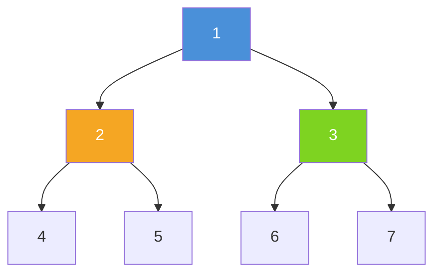
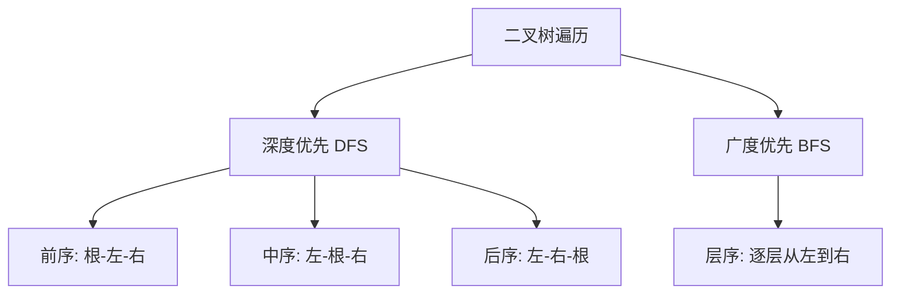
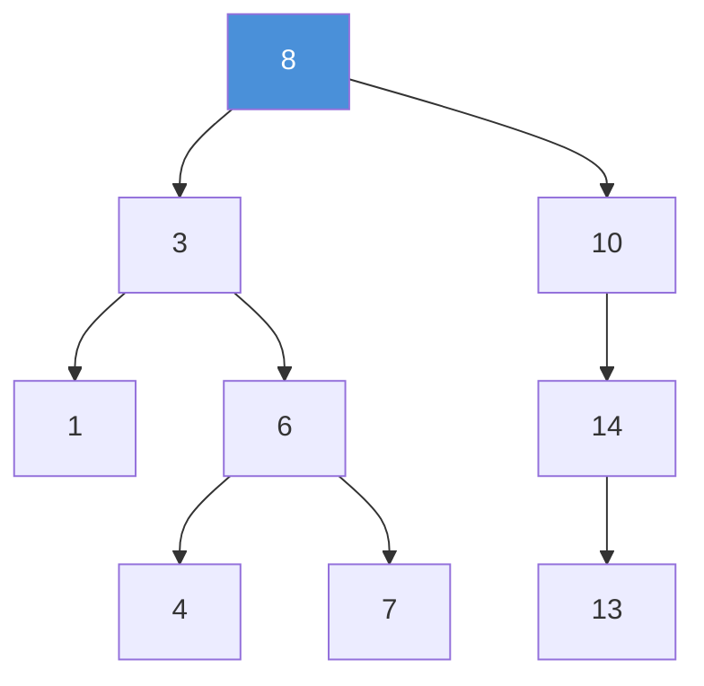
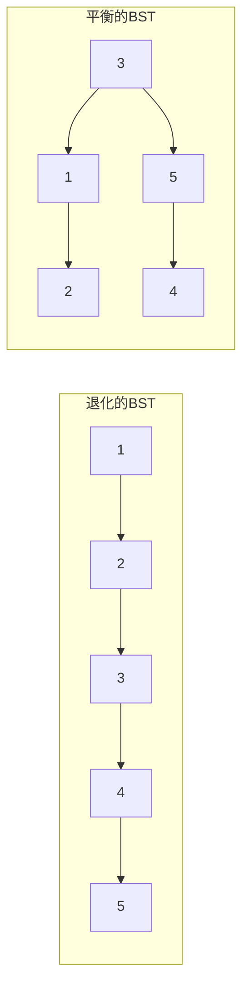
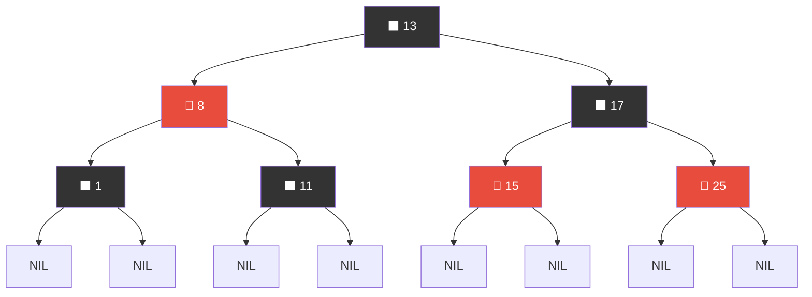
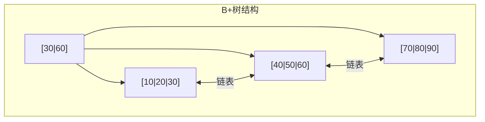
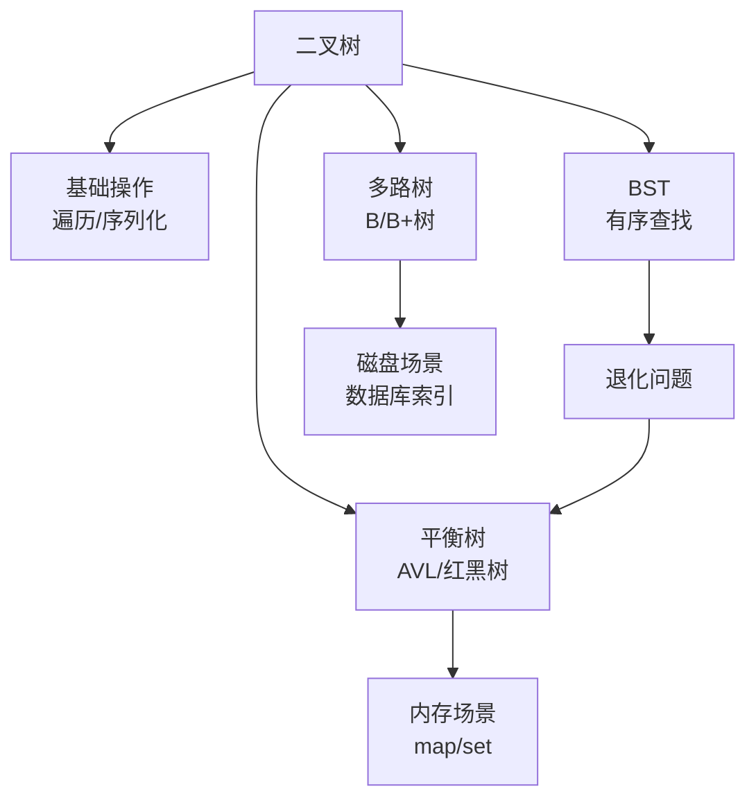

## 1. 二叉树基础

### 1.1 定义与基本概念

二叉树是每个节点最多有两个子节点的树结构。它是数据结构中最重要的非线性结构之一。

```cpp
struct TreeNode {
    int val;
    TreeNode* left;
    TreeNode* right;
    TreeNode(int x) : val(x), left(nullptr), right(nullptr) {}
};
```



### 1.2 特殊二叉树

| 类型 | 定义 | 特点 |
|:-----|:-----|:-----|
| 满二叉树 | 每个节点要么是叶子，要么有两个子节点 | 节点数 $= 2^h - 1$ |
| 完全二叉树 | 除最后一层外全满，最后一层从左到右连续 | 堆的底层结构 |
| 完美二叉树 | 所有层都满 | 节点数 $= 2^h - 1$ |
| 二叉搜索树 | 左 < 根 < 右 | 中序遍历有序 |
| 平衡二叉树 | 左右子树高度差 ≤ 1 | 保证 $O(\log n)$ 操作 |

### 1.3 重要性质

- 第 $i$ 层最多 $2^{i-1}$ 个节点（$i \ge 1$）
- 高度为 $h$ 的二叉树最多 $2^h - 1$ 个节点
- $n$ 个节点的完全二叉树高度为 $\lfloor \log_2 n \rfloor + 1$
- 叶子节点数 $n_0$ 与度为 2 的节点数 $n_2$ 的关系：$n_0 = n_2 + 1$

## 2. 二叉树遍历

### 2.1 遍历方式总览



| 遍历方式 | 顺序 | 应用场景 |
|:---------|:-----|:---------|
| 前序 | 根→左→右 | 序列化/反序列化、表达式前缀 |
| 中序 | 左→根→右 | BST 有序输出、表达式中缀 |
| 后序 | 左→右→根 | 释放树内存、表达式后缀、计算子树信息 |
| 层序 | 逐层从左到右 | 按层处理、最短路径 |

### 2.2 前序遍历

**递归实现**：

```cpp
void preorder(TreeNode* root, vector<int>& res) {
    if (!root) return;
    res.push_back(root->val);     // 访问根
    preorder(root->left, res);    // 遍历左
    preorder(root->right, res);   // 遍历右
}
```

**迭代实现（栈）**：

```cpp
vector<int> preorderTraversal(TreeNode* root) {
    vector<int> res;
    stack<TreeNode*> stk;
    if (root) stk.push(root);
    while (!stk.empty()) {
        TreeNode* node = stk.top(); stk.pop();
        res.push_back(node->val);
        // 先压右再压左，保证左先出栈
        if (node->right) stk.push(node->right);
        if (node->left)  stk.push(node->left);
    }
    return res;
}
```

### 2.3 中序遍历

**递归实现**：

```cpp
void inorder(TreeNode* root, vector<int>& res) {
    if (!root) return;
    inorder(root->left, res);
    res.push_back(root->val);
    inorder(root->right, res);
}
```

**迭代实现（模拟递归栈）**：

```cpp
vector<int> inorderTraversal(TreeNode* root) {
    vector<int> res;
    stack<TreeNode*> stk;
    TreeNode* cur = root;
    while (cur || !stk.empty()) {
        while (cur) {              // 一路向左
            stk.push(cur);
            cur = cur->left;
        }
        cur = stk.top(); stk.pop(); // 弹出
        res.push_back(cur->val);    // 访问
        cur = cur->right;           // 转右
    }
    return res;
}
```

### 2.4 后序遍历

**递归实现**：

```cpp
void postorder(TreeNode* root, vector<int>& res) {
    if (!root) return;
    postorder(root->left, res);
    postorder(root->right, res);
    res.push_back(root->val);
}
```

**迭代实现（方法：前序"根右左"再反转）**：

```cpp
vector<int> postorderTraversal(TreeNode* root) {
    vector<int> res;
    stack<TreeNode*> stk;
    if (root) stk.push(root);
    while (!stk.empty()) {
        TreeNode* node = stk.top(); stk.pop();
        res.push_back(node->val);
        // 前序是"根左右"，这里改为"根右左"
        if (node->left)  stk.push(node->left);
        if (node->right) stk.push(node->right);
    }
    reverse(res.begin(), res.end());  // 反转得到"左右根"
    return res;
}
```

**迭代实现（方法：统一写法，prev 指针）**：

```cpp
vector<int> postorderTraversal(TreeNode* root) {
    vector<int> res;
    stack<TreeNode*> stk;
    TreeNode* cur = root;
    TreeNode* prev = nullptr;  // 上一个访问的节点
    while (cur || !stk.empty()) {
        while (cur) {
            stk.push(cur);
            cur = cur->left;
        }
        cur = stk.top();
        if (cur->right && cur->right != prev) {
            cur = cur->right;  // 右子树未访问，转右
        } else {
            res.push_back(cur->val);
            prev = cur;
            stk.pop();
            cur = nullptr;     // 关键：不再向左走
        }
    }
    return res;
}
```

### 2.5 层序遍历（BFS）

```cpp
vector<vector<int>> levelOrder(TreeNode* root) {
    vector<vector<int>> res;
    if (!root) return res;
    queue<TreeNode*> q;
    q.push(root);
    while (!q.empty()) {
        int size = q.size();
        vector<int> level;
        for (int i = 0; i < size; ++i) {
            TreeNode* node = q.front(); q.pop();
            level.push_back(node->val);
            if (node->left)  q.push(node->left);
            if (node->right) q.push(node->right);
        }
        res.push_back(level);
    }
    return res;
}
```

### 2.6 遍历复杂度对比

| 遍历方式 | 时间复杂度 | 空间复杂度（递归） | 空间复杂度（迭代） |
|:---------|:----------:|:------------------:|:------------------:|
| 前序 | $O(n)$ | $O(h)$ | $O(h)$ |
| 中序 | $O(n)$ | $O(h)$ | $O(h)$ |
| 后序 | $O(n)$ | $O(h)$ | $O(h)$ |
| 层序 | $O(n)$ | — | $O(w)$（最大宽度） |

> $h$ 为树高，$w$ 为最大层宽。最坏 $h = n$（链状），最好 $h = \log n$（平衡）。
{: .prompt-info}

## 3. 二叉搜索树（BST）

### 3.1 定义与性质

- 左子树所有节点值 < 根节点值
- 右子树所有节点值 > 根节点值
- 左右子树也是 BST
- **中序遍历得到有序序列**



### 3.2 BST 基本操作

**查找**：$O(\log n)$ 平均，$O(n)$ 最坏

```cpp
TreeNode* search(TreeNode* root, int val) {
    if (!root || root->val == val) return root;
    if (val < root->val) return search(root->left, val);
    return search(root->right, val);
}
```

**插入**：

```cpp
TreeNode* insert(TreeNode* root, int val) {
    if (!root) return new TreeNode(val);
    if (val < root->val) root->left = insert(root->left, val);
    else if (val > root->val) root->right = insert(root->right, val);
    return root;
}
```

**删除**（最复杂）：

```cpp
TreeNode* deleteNode(TreeNode* root, int key) {
    if (!root) return nullptr;
    if (key < root->val) {
        root->left = deleteNode(root->left, key);
    } else if (key > root->val) {
        root->right = deleteNode(root->right, key);
    } else {
        // 找到要删除的节点
        if (!root->left) return root->right;  // 只有右子树
        if (!root->right) return root->left;  // 只有左子树
        // 两个子树：用后继节点替换
        TreeNode* succ = root->right;
        while (succ->left) succ = succ->left;
        root->val = succ->val;
        root->right = deleteNode(root->right, succ->val);
    }
    return root;
}
```

> **删除策略**：叶子直接删；一个子树用子树替代；两个子树用**前驱**（左子树最大）或**后继**（右子树最小）替换。
{: .prompt-tip}

## 4. 平衡二叉树

### 4.1 为什么需要平衡？

BST 在有序插入时退化为链表，操作复杂度从 $O(\log n)$ 退化为 $O(n)$。平衡树通过旋转操作维持树的高度平衡。



### 4.2 AVL 树

**定义**：任意节点的左右子树高度差（平衡因子）的绝对值不超过 1。

**四种旋转操作**：

| 失衡类型 | 条件 | 修复操作 |
|:---------|:-----|:---------|
| LL | 左子树的左子树过深 | 右旋 |
| RR | 右子树的右子树过深 | 左旋 |
| LR | 左子树的右子树过深 | 先左旋再右旋 |
| RL | 右子树的左子树过深 | 先右旋再左旋 |

```cpp
// 右旋
TreeNode* rotateRight(TreeNode* y) {
    TreeNode* x = y->left;
    y->left = x->right;
    x->right = y;
    // 更新高度
    y->height = 1 + max(getHeight(y->left), getHeight(y->right));
    x->height = 1 + max(getHeight(x->left), getHeight(x->right));
    return x;
}

// 左旋
TreeNode* rotateLeft(TreeNode* x) {
    TreeNode* y = x->right;
    x->right = y->left;
    y->left = x;
    x->height = 1 + max(getHeight(x->left), getHeight(x->right));
    y->height = 1 + max(getHeight(y->left), getHeight(y->right));
    return y;
}

// AVL 插入
TreeNode* avlInsert(TreeNode* node, int val) {
    if (!node) return new TreeNode(val);
    if (val < node->val) node->left = avlInsert(node->left, val);
    else if (val > node->val) node->right = avlInsert(node->right, val);
    else return node;  // 不允许重复

    node->height = 1 + max(getHeight(node->left), getHeight(node->right));
    int bf = getBalance(node);  // 平衡因子

    // LL
    if (bf > 1 && val < node->left->val)  return rotateRight(node);
    // RR
    if (bf < -1 && val > node->right->val) return rotateLeft(node);
    // LR
    if (bf > 1 && val > node->left->val) {
        node->left = rotateLeft(node->left);
        return rotateRight(node);
    }
    // RL
    if (bf < -1 && val < node->right->val) {
        node->right = rotateRight(node->right);
        return rotateLeft(node);
    }
    return node;
}
```

### 4.3 红黑树

**定义与性质**：

1. 每个节点是红色或黑色
2. 根节点是黑色
3. 叶子节点（NIL）是黑色
4. 红色节点的两个子节点都是黑色（不能有连续红节点）
5. 从任一节点到其所有叶子的路径上，黑色节点数相同（黑高相同）



**红黑树 vs AVL 树**：

| 特性 | AVL 树 | 红黑树 |
|:-----|:-------|:-------|
| 平衡严格度 | 严格（高度差 ≤ 1） | 近似（黑高相同） |
| 查找效率 | 更优（更矮） | 略逊 |
| 插入旋转 | 最多 2 次旋转 | 最多 2 次旋转 |
| 删除旋转 | 最多 $O(\log n)$ 次旋转 | 最多 3 次旋转 |
| 适用场景 | 查找密集 | 插入/删除密集 |
| 工程应用 | Windows 进程地址空间 | C++ std::map/set、Java TreeMap |

> **为什么 C++ STL 选择红黑树而非 AVL？** STL 的 map/set 需要频繁插入删除，红黑树在删除时最多 3 次旋转，而 AVL 可能需要 $O(\log n)$ 次旋转。查找的微小性能损失换来插入删除的显著提升。
{: .prompt-info}

## 5. B 树与 B+ 树

### 5.1 B 树

**定义**：一种多路平衡搜索树，每个节点可以有多个子节点和多个关键字。

- 阶为 $m$ 的 B 树：每个节点最多 $m$ 个子节点，最少 $\lceil m/2 \rceil$ 个子节点
- 所有叶子在同一层
- 非叶节点存储关键字和子节点指针

### 5.2 B+ 树

与 B 树的区别：

| 特性 | B 树 | B+ 树 |
|:-----|:-----|:------|
| 数据存储 | 所有节点都存数据 | 只有叶子存数据 |
| 叶子链表 | 无 | 有（双向链表） |
| 查找路径 | 可能提前终止 | 必须到叶子 |
| 范围查询 | 需要中序遍历 | 顺着链表扫描 |



### 5.3 为什么数据库用 B+ 树？

- **磁盘友好**：节点大小等于磁盘页（通常 4KB），减少 I/O 次数
- **范围查询高效**：叶子链表支持顺序扫描
- **查询稳定**：每次查询都走到叶子，路径长度一致
- **3~4 层 B+ 树即可存储千万级数据**

> 一棵 3 层、阶为 1000 的 B+ 树可存储 $1000^3 = 10^9$ 条记录，只需 3 次磁盘 I/O。
{: .prompt-tip}

## 6. 实际应用

| 数据结构 | 应用场景 |
|:---------|:---------|
| BST | 基础教学、简单查找 |
| AVL | 内存数据库、Windows 虚拟内存管理 |
| 红黑树 | C++ map/set、Java TreeMap/HashSet、Linux CFS 调度器、epoll |
| B/B+ 树 | MySQL InnoDB、PostgreSQL、文件系统 |
| 字典树（Trie） | 自动补全、拼写检查、IP 路由表 |
| 线段树 | 区间查询/更新（RMQ、区间求和） |

## 7. 面试 Q&A

**Q1：递归遍历和迭代遍历哪个好？**

递归更简洁直观，但有栈溢出风险（树很深时）；迭代更安全，但代码复杂。工程中推荐迭代，面试中递归更快写对。

**Q2：如何判断一棵二叉树是否是 BST？**

中序遍历检查是否严格递增，或递归时传递上下界：

```cpp
bool isValidBST(TreeNode* root, long lo = LONG_MIN, long hi = LONG_MAX) {
    if (!root) return true;
    if (root->val <= lo || root->val >= hi) return false;
    return isValidBST(root->left, lo, root->val) &&
           isValidBST(root->right, root->val, hi);
}
```

**Q3：红黑树为什么能保证 $O(\log n)$ 的操作复杂度？**

由性质 5（黑高相同）和性质 4（无连续红节点），最长路径不超过最短路径的 2 倍。因此 $h \le 2 \log_2(n+1)$。

**Q4：AVL 树和红黑树如何选择？**

- 查找远多于修改 → AVL（更矮，查找更快）
- 修改频繁 → 红黑树（删除旋转次数少）
- 需要严格平衡保证 → AVL

**Q5：B+ 树和哈希索引如何选择？**

| 场景 | B+ 树 | 哈希索引 |
|:-----|:------|:---------|
| 等值查询 | $O(\log n)$ | $O(1)$ ✅ |
| 范围查询 | ✅ 链表扫描 | ❌ 不支持 |
| 排序 | ✅ 有序存储 | ❌ 无序 |
| 最值 | ✅ 首尾叶子 | ❌ 需全表扫描 |

**Q6：如何序列化和反序列化二叉树？**

前序遍历 + 空节点标记：

```cpp
// 序列化
void serialize(TreeNode* root, ostringstream& out) {
    if (!root) { out << "# "; return; }
    out << root->val << " ";
    serialize(root->left, out);
    serialize(root->right, out);
}

// 反序列化
TreeNode* deserialize(istringstream& in) {
    string val; in >> val;
    if (val == "#") return nullptr;
    TreeNode* node = new TreeNode(stoi(val));
    node->left = deserialize(in);
    node->right = deserialize(in);
    return node;
}
```

## 8. 总结



二叉树是理解更复杂数据结构的基础。从遍历到平衡，从内存到磁盘，树的变种各有侧重。理解每种树的设计动机和权衡，比死记硬背旋转操作更重要。

<div class='context-nav'>
<a class='context-link prev' href='/software-fundamentals/posts/数据结构-二叉树与平衡树/'><span class='context-label'>上一篇</span><span class='context-title'>数据结构：二叉树与平衡树深入解析</span></a>
<a class='context-link next' href='/software-fundamentals/posts/数据结构-二叉树与遍历全面解析/'><span class='context-label'>下一篇</span><span class='context-title'>数据结构：二叉树与遍历全面解析</span></a>
</div>
