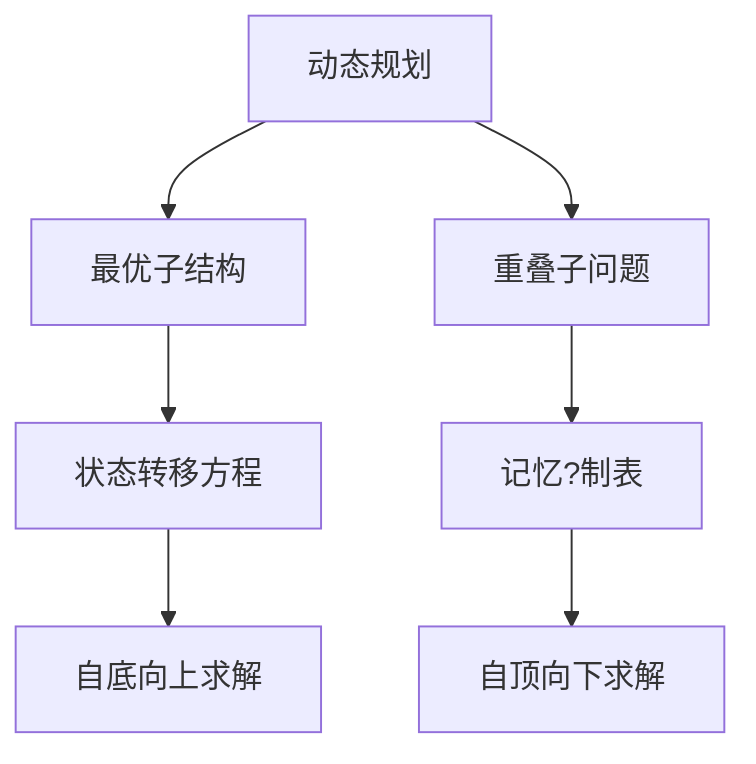
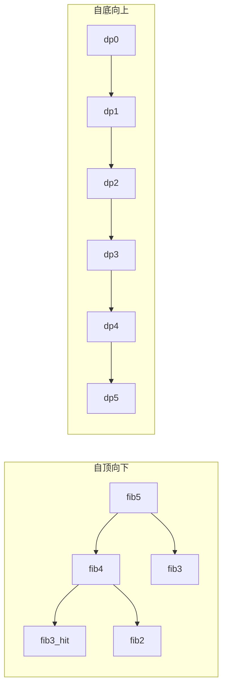
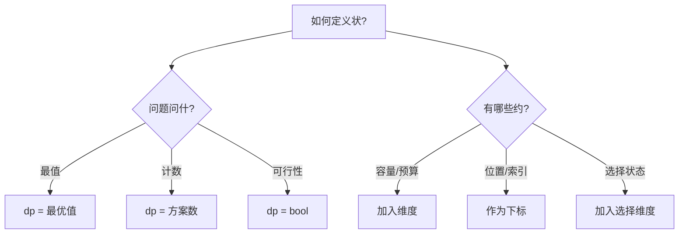
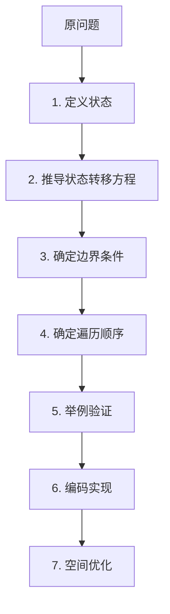

## 1. 动态规划的本质

动态规划（Dynamic Programming, DP）是将复杂问题分解为重叠子问题，通过存储子问题的解来避免重复计算的算法范式?

### 1.1 两大核心性质

| 性质 | 含义 | 判断方法 |
|:-----|:-----|:---------|
| **最优子结构** | 问题的最优解包含子问题的最优解 | 假设子问题已最优，能否推出原问题最?|
| **重叠子问?* | 递归求解时同一子问题被反复计算 | 画出递归树，观察是否有重复节?|



### 1.2 DP vs 贪心 vs 分治

| 特征 | 动态规?| 贪心 | 分治 |
|:-----|:---------|:-----|:-----|
| 子问题独立?| 子问题重?| 无回?| 子问题独?|
| 最优解保证 | ?全局最?| ?局部最?| ?合并即最?|
| 典型问题 | 背包、LCS | 活动选择、Huffman | 归并排序、FFT |
| 复杂?| 通常多项?| 通常线?| 通常 $O(n \log n)$ |

## 2. 两种实现方式

### 2.1 自顶向下（记忆化搜索?

```cpp
// 斐波那契数列 - 记忆化搜?
int fib(int n, vector<int>& memo) {
    if (n <= 1) return n;
    if (memo[n] != -1) return memo[n];  // 命中缓存
    return memo[n] = fib(n - 1, memo) + fib(n - 2, memo);
}
```

**优点**：只计算实际需要的子问题，代码直观
**缺点**：递归栈开销，可能栈溢出

### 2.2 自底向上（迭代制表）

```cpp
// 斐波那契数列 - 迭代制表
int fib(int n) {
    if (n <= 1) return n;
    vector<int> dp(n + 1);
    dp[0] = 0; dp[1] = 1;
    for (int i = 2; i <= n; ++i)
        dp[i] = dp[i - 1] + dp[i - 2];
    return dp[n];
}
```

**优点**：无递归开销，易于空间优?
**缺点**：可能计算不需要的子问?



## 3. 经典问题详解

### 3.1 斐波那契数列（入门）

**状态定?*?dp[i]$ = ?$i$ 个斐波那契数

**状态转?*?dp[i] = dp[i-1] + dp[i-2]$

**空间优化**：只需前两个?

```cpp
int fib(int n) {
    if (n <= 1) return n;
    int prev2 = 0, prev1 = 1;
    for (int i = 2; i <= n; ++i) {
        int curr = prev1 + prev2;
        prev2 = prev1;
        prev1 = curr;
    }
    return prev1;
}
```

> **空间优化核心思想**：如?$dp[i]$ 只依赖前 $k$ 个状态，就可以用滚动变量代替整个数组?
{: .prompt-tip}

### 3.2 0-1 背包问题

**问题描述**：有 $n$ 个物品，重量 $w_i$，价?$v_i$，背包容?$W$，每个物品最多选一次，求最大价值?

**状态定?*?dp[i][j]$ = 从前 $i$ 个物品中选，容量?$j$ 时的最大价?

**状态转?*?

$$dp[i][j] = \max(dp[i-1][j], \quad dp[i-1][j-w_i] + v_i) \quad \text{if } j \ge w_i$$

```cpp
int knapsack01(const vector<int>& w, const vector<int>& v, int W) {
    int n = w.size();
    vector<vector<int>> dp(n + 1, vector<int>(W + 1, 0));
    for (int i = 1; i <= n; ++i) {
        for (int j = 0; j <= W; ++j) {
            dp[i][j] = dp[i - 1][j];  // 不选第i?
            if (j >= w[i - 1])
                dp[i][j] = max(dp[i][j], dp[i - 1][j - w[i - 1]] + v[i - 1]);
        }
    }
    return dp[n][W];
}
```

**一维空间优?*（逆序遍历！）?

```cpp
int knapsack01(const vector<int>& w, const vector<int>& v, int W) {
    vector<int> dp(W + 1, 0);
    for (int i = 0; i < n; ++i)
        for (int j = W; j >= w[i]; --j)  // 必须逆序?
            dp[j] = max(dp[j], dp[j - w[i]] + v[i]);
    return dp[W];
}
```

> **为什么逆序?* 正序遍历会导致同一物品被多次选取（变成完全背包）。逆序保证 $dp[j-w_i]$ 用的还是上一轮的值?
{: .prompt-warning}

**背包问题变体对比**?

| 类型 | 每个物品 | 内层循环方向 | 状态转?|
|:-----|:--------:|:----------:|:---------|
| 0-1 背包 | ???| 逆序 | $dp[j] = \max(dp[j], dp[j-w]+v)$ |
| 完全背包 | 选任意次 | 正序 | $dp[j] = \max(dp[j], dp[j-w]+v)$ |
| 多重背包 | 选有限次 | 二进制拆?| 转化为多?-1背包 |

### 3.3 最长公共子序列（LCS?

**问题描述**：给定两个序列，求它们最长的公共子序列长度?

**状态定?*?dp[i][j]$ = $s_1$ ?$i$ 个字符与 $s_2$ ?$j$ 个字符的 LCS 长度

**状态转?*?

$$dp[i][j] = \begin{cases} dp[i-1][j-1] + 1 & \text{if } s_1[i-1] = s_2[j-1] \\ \max(dp[i-1][j], dp[i][j-1]) & \text{otherwise} \end{cases}$$

```cpp
int lcs(const string& s1, const string& s2) {
    int m = s1.size(), n = s2.size();
    vector<vector<int>> dp(m + 1, vector<int>(n + 1, 0));
    for (int i = 1; i <= m; ++i) {
        for (int j = 1; j <= n; ++j) {
            if (s1[i - 1] == s2[j - 1])
                dp[i][j] = dp[i - 1][j - 1] + 1;
            else
                dp[i][j] = max(dp[i - 1][j], dp[i][j - 1]);
        }
    }
    return dp[m][n];
}
```

**输出具体 LCS**：通过回溯 $dp$ 表，?$dp[m][n]$ 向左上追踪?

### 3.4 最长递增子序列（LIS?

**方法一?O(n^2)$ DP**

```cpp
int lis(const vector<int>& nums) {
    int n = nums.size();
    vector<int> dp(n, 1);  // dp[i] = 以nums[i]结尾的LIS长度
    int ans = 1;
    for (int i = 1; i < n; ++i) {
        for (int j = 0; j < i; ++j) {
            if (nums[j] < nums[i])
                dp[i] = max(dp[i], dp[j] + 1);
        }
        ans = max(ans, dp[i]);
    }
    return ans;
}
```

**方法二：$O(n \log n)$ 贪心 + 二分**

```cpp
int lis(const vector<int>& nums) {
    vector<int> tails;  // tails[i] = 长度为i+1的LIS的最小末?
    for (int x : nums) {
        auto it = lower_bound(tails.begin(), tails.end(), x);
        if (it == tails.end()) tails.push_back(x);
        else *it = x;
    }
    return tails.size();
}
```

> **tails 数组的含?*：维护各个长?LIS 的最小末尾元素。tails 一定是严格递增的，因此可以用二分查找?
{: .prompt-info}

### 3.5 编辑距离（Edit Distance?

**问题描述**：将 $s_1$ 转换?$s_2$ 所需的最少操作次数（插入、删除、替换）?

**状态定?*?dp[i][j]$ = $s_1$ ?$i$ 个字符变?$s_2$ ?$j$ 个字符的最少操作数

**状态转?*?

$$dp[i][j] = \begin{cases} dp[i-1][j-1] & \text{if } s_1[i-1] = s_2[j-1] \\ 1 + \min(dp[i-1][j-1], dp[i-1][j], dp[i][j-1]) & \text{otherwise} \end{cases}$$

分别对应：替换、删除、插入?

```cpp
int editDistance(const string& s1, const string& s2) {
    int m = s1.size(), n = s2.size();
    vector<vector<int>> dp(m + 1, vector<int>(n + 1));
    for (int i = 0; i <= m; ++i) dp[i][0] = i;  // 删除
    for (int j = 0; j <= n; ++j) dp[0][j] = j;  // 插入
    for (int i = 1; i <= m; ++i) {
        for (int j = 1; j <= n; ++j) {
            if (s1[i - 1] == s2[j - 1])
                dp[i][j] = dp[i - 1][j - 1];
            else
                dp[i][j] = 1 + min({dp[i-1][j-1], dp[i-1][j], dp[i][j-1]});
        }
    }
    return dp[m][n];
}
```

### 3.6 零钱兑换（Coin Change?

**问题描述**：给定面?$coins$ 和金?$amount$，求凑出 $amount$ 的最少硬币数?

**状态定?*?dp[j]$ = 凑出金额 $j$ 的最少硬币数

**状态转?*?dp[j] = \min_{c \in coins}(dp[j-c] + 1)$，若 $j \ge c$

```cpp
int coinChange(const vector<int>& coins, int amount) {
    const int INF = 1e9;
    vector<int> dp(amount + 1, INF);
    dp[0] = 0;
    for (int j = 1; j <= amount; ++j) {
        for (int c : coins) {
            if (j >= c && dp[j - c] != INF)
                dp[j] = min(dp[j], dp[j - c] + 1);
        }
    }
    return dp[amount] == INF ? -1 : dp[amount];
}
```

> **零钱兑换?完全背包"的变?*：每种硬币可无限使用，求最小值而非最大值?
{: .prompt-tip}

## 4. 状态定义技?

### 4.1 状态定义方法论



### 4.2 常见状态定义模?

| 模式 | 状态定?| 典型问题 |
|:-----|:---------|:---------|
| 线?DP | $dp[i]$ = 以位?$i$ 结尾的最优?| LIS、最大子数组?|
| 区间 DP | $dp[i][j]$ = 区间 $[i,j]$ 的最优?| 矩阵链乘法、戳气球 |
| 背包 DP | $dp[i][j]$ = ?$i$ 个物品容?$j$ 的最优?| 0-1背包、完全背?|
| 树形 DP | $dp[u][s]$ = 节点 $u$ 状?$s$ 的最优?| 树的最大独立集 |
| 状态压?DP | $dp[s]$ = 集合状?$s$ 的最优?| TSP、棋盘覆?|

### 4.3 区间 DP 示例：矩阵链乘法

**状态转?*?dp[i][j] = \min_{i \le k < j}(dp[i][k] + dp[k+1][j] + p_{i-1} \cdot p_k \cdot p_j)$

```cpp
int matrixChainOrder(const vector<int>& p) {
    int n = p.size() - 1;  // 矩阵个数
    vector<vector<int>> dp(n, vector<int>(n, 0));
    for (int len = 2; len <= n; ++len) {       // 区间长度
        for (int i = 0; i + len - 1 < n; ++i) { // 区间起点
            int j = i + len - 1;                 // 区间终点
            dp[i][j] = INT_MAX;
            for (int k = i; k < j; ++k) {
                int cost = dp[i][k] + dp[k+1][j] + p[i]*p[k+1]*p[j+1];
                dp[i][j] = min(dp[i][j], cost);
            }
        }
    }
    return dp[0][n - 1];
}
```

## 5. 空间优化技?

### 5.1 滚动数组

?$dp[i]$ 只依?$dp[i-1]$（或前几行），可以用两个数组交替使用?

```cpp
// LCS 空间优化：O(min(m,n))
int lcs(const string& s1, const string& s2) {
    if (s1.size() < s2.size()) return lcs(s2, s1);  // 短的做列
    int n = s2.size();
    vector<int> prev(n + 1, 0), curr(n + 1, 0);
    for (int i = 1; i <= (int)s1.size(); ++i) {
        for (int j = 1; j <= n; ++j) {
            if (s1[i-1] == s2[j-1]) curr[j] = prev[j-1] + 1;
            else curr[j] = max(prev[j], curr[j-1]);
        }
        swap(prev, curr);
    }
    return prev[n];
}
```

### 5.2 状态压?

用二进制表示集合状态，常用?NP-hard 问题的精确求解?

```cpp
// TSP 旅行商问?
int tsp(const vector<vector<int>>& dist) {
    int n = dist.size();
    const int FULL = (1 << n) - 1;
    vector<vector<int>> dp(1 << n, vector<int>(n, INT_MAX / 2));
    dp[1][0] = 0;  // 从城?出发
    for (int s = 1; s <= FULL; ++s) {
        for (int u = 0; u < n; ++u) {
            if (!(s & (1 << u))) continue;
            for (int v = 0; v < n; ++v) {
                if (s & (1 << v)) continue;
                dp[s | (1 << v)][v] = min(dp[s | (1 << v)][v], dp[s][u] + dist[u][v]);
            }
        }
    }
    int ans = INT_MAX;
    for (int u = 1; u < n; ++u)
        ans = min(ans, dp[FULL][u] + dist[u][0]);
    return ans;
}
```

## 6. DP 解题框架



**遍历顺序原则**?
- 计算 $dp[i][j]$ 时，它依赖的状态必须已经计算过
- 二维 DP 通常：外层循环从左到?从上到下
- 背包类：注意一维优化时的遍历方?

## 7. 面试 Q&A

**Q1：如何判断一个问题是否可以用 DP 解决?*

检查两个性质?
1. **最优子结构**：能否将问题拆解为子问题，且子问题的最优解能组合出原问题的最优解
2. **重叠子问?*：递归树中是否有大量重复计?

如果只有最优子结构没有重叠子问??分治；如果贪心选择性质成立 ?贪心?

**Q2：DP 和记忆化搜索有什么区别？选哪个？**

| 方面 | DP（制表） | 记忆化搜?|
|:-----|:----------|:----------|
| 方向 | 自底向上 | 自顶向下 |
| 计算 | 所有子问题 | 只算需要的 |
| 栈溢?| 不会 | 可能 |
| 调试 | 较难 | 较易 |
| 推荐 | 常规问题 | 状态空间稀疏时 |

**Q3?-1 背包为什么内层循环必须逆序?*

一维优化时?dp[j]$ 依赖 $dp[j-w_i]$。如果正序遍历，$dp[j-w_i]$ 可能在同一轮已经被更新过（即第 $i$ 个物品已经被选过），导致同一物品被多次选取。逆序保证使用的是上一轮的值?

**Q4：如何输?DP 的具体方案？**

两种方法?
1. **回溯?*：从最终状态沿转移路径回溯
2. **记录?*：额外维?$choice$ 数组，记录每步的决策

**Q5：编辑距离的三种操作分别对应什么？**

- $dp[i-1][j-1] + 1$：替?$s_1[i]$ ?$s_2[j]$
- $dp[i-1][j] + 1$：删?$s_1[i]$
- $dp[i][j-1] + 1$：在 $s_1$ 的位?$i$ 插入 $s_2[j]$

## 8. 总结

动态规划的精髓在于**状态定?*?*状态转移方?*。掌握常见模式（线性、区间、背包、树形、状压），辅以大量练习，才能在面试和竞赛中游刃有余?


