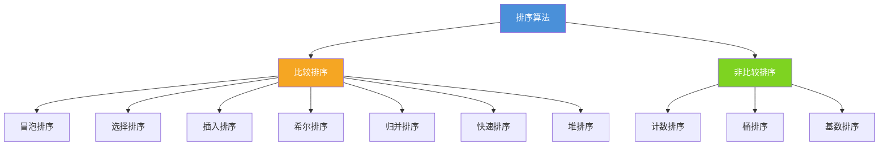
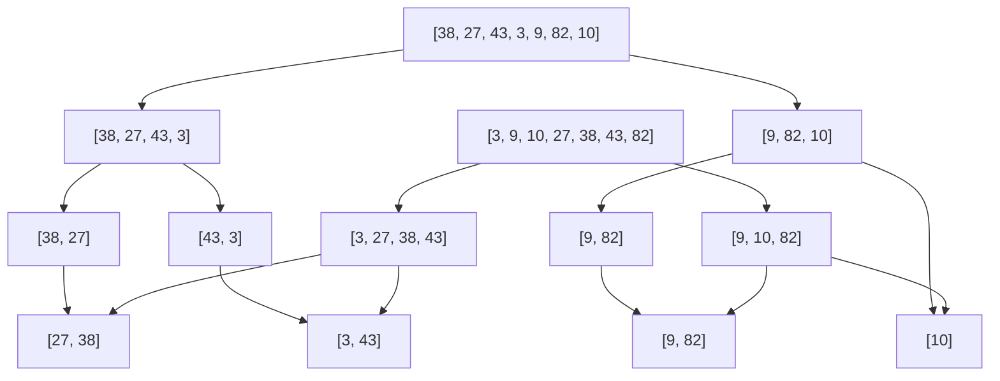
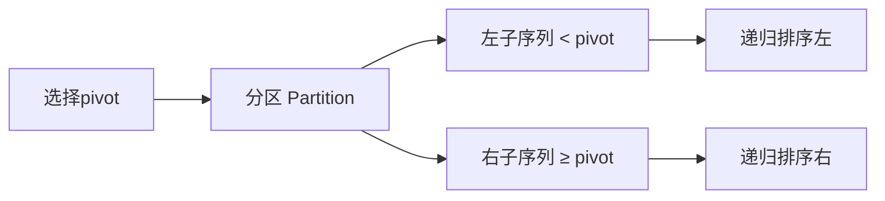
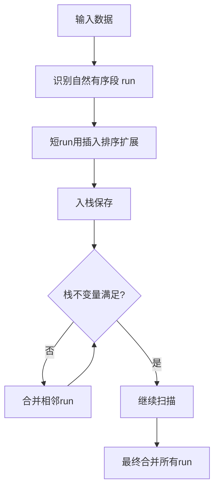
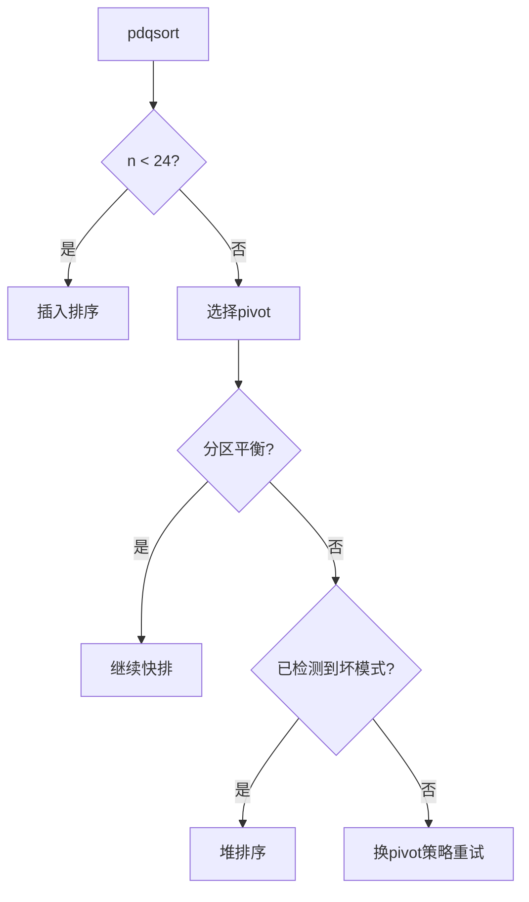
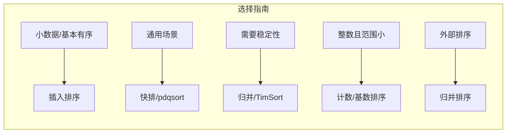

## 1. 排序算法总览

排序是计算机科学中最基础也最重要的操作之一。从数据库查询优化到搜索引擎结果排名，排序无处不在。本文将从原理、复杂度、稳定性、工程实现等多个维度，全面解析十大经典排序算法。



### 1.1 比较排序 vs 非比较排序

- **比较排序**：通过比较元素间的大小关系决定相对位置，时间复杂度下界为 $O(n \log n)$
- **非比较排序**：利用元素的固有属性（如数值范围）进行排序，可突破 $O(n \log n)$ 下界

## 2. 算法复杂度与稳定性对比

| 算法 | 平均时间 | 最坏时间 | 最好时间 | 空间复杂度 | 稳定性 |
|:-----|:--------:|:--------:|:--------:|:----------:|:------:|
| 冒泡排序 | $O(n^2)$ | $O(n^2)$ | $O(n)$ | $O(1)$ | ✅ 稳定 |
| 选择排序 | $O(n^2)$ | $O(n^2)$ | $O(n^2)$ | $O(1)$ | ❌ 不稳定 |
| 插入排序 | $O(n^2)$ | $O(n^2)$ | $O(n)$ | $O(1)$ | ✅ 稳定 |
| 希尔排序 | $O(n^{1.3})$ | $O(n^2)$ | $O(n \log n)$ | $O(1)$ | ❌ 不稳定 |
| 归并排序 | $O(n \log n)$ | $O(n \log n)$ | $O(n \log n)$ | $O(n)$ | ✅ 稳定 |
| 快速排序 | $O(n \log n)$ | $O(n^2)$ | $O(n \log n)$ | $O(\log n)$ | ❌ 不稳定 |
| 堆排序 | $O(n \log n)$ | $O(n \log n)$ | $O(n \log n)$ | $O(1)$ | ❌ 不稳定 |
| 计数排序 | $O(n+k)$ | $O(n+k)$ | $O(n+k)$ | $O(k)$ | ✅ 稳定 |
| 桶排序 | $O(n+k)$ | $O(n^2)$ | $O(n)$ | $O(n+k)$ | ✅ 稳定 |
| 基数排序 | $O(d(n+k))$ | $O(d(n+k))$ | $O(d(n+k))$ | $O(n+k)$ | ✅ 稳定 |

> **稳定性**：若 $a_i = a_j$ 且排序前 $a_i$ 在 $a_j$ 之前，排序后 $a_i$ 仍在 $a_j$ 之前，则称该排序算法稳定。
{: .prompt-info}

## 3. 基础排序算法

### 3.1 冒泡排序（Bubble Sort）

**核心思想**：相邻元素两两比较，将较大元素逐步"冒泡"到数组末尾。

```cpp
void bubbleSort(vector<int>& arr) {
    int n = arr.size();
    for (int i = 0; i < n - 1; ++i) {
        bool swapped = false;  // 优化：无交换则提前终止
        for (int j = 0; j < n - 1 - i; ++j) {
            if (arr[j] > arr[j + 1]) {
                swap(arr[j], arr[j + 1]);
                swapped = true;
            }
        }
        if (!swapped) break;
    }
}
```

**优化策略**：
- 记录最后一次交换位置，减少内层循环范围
- 鸡尾酒排序（双向冒泡），处理"乌龟"元素

### 3.2 选择排序（Selection Sort）

**核心思想**：每轮从未排序区间选出最小元素，放到已排序区间末尾。

```cpp
void selectionSort(vector<int>& arr) {
    int n = arr.size();
    for (int i = 0; i < n - 1; ++i) {
        int minIdx = i;
        for (int j = i + 1; j < n; ++j) {
            if (arr[j] < arr[minIdx]) minIdx = j;
        }
        if (minIdx != i) swap(arr[i], arr[minIdx]);
    }
}
```

> **为什么不稳定？** 例如 `[5a, 5b, 3]`，第一轮将 3 与 5a 交换，5a 和 5b 的相对顺序被破坏。
{: .prompt-warning}

### 3.3 插入排序（Insertion Sort）

**核心思想**：将未排序元素逐个插入到已排序序列的正确位置。

```cpp
void insertionSort(vector<int>& arr) {
    int n = arr.size();
    for (int i = 1; i < n; ++i) {
        int key = arr[i];
        int j = i - 1;
        while (j >= 0 && arr[j] > key) {
            arr[j + 1] = arr[j];  // 元素后移
            --j;
        }
        arr[j + 1] = key;
    }
}
```

**适用场景**：小规模数据或基本有序的数据，是许多高级排序的子过程。

### 3.4 希尔排序（Shell Sort）

**核心思想**：分组插入排序，先按大间隔分组排序，逐步缩小间隔至1。

```cpp
void shellSort(vector<int>& arr) {
    int n = arr.size();
    for (int gap = n / 2; gap > 0; gap /= 2) {
        for (int i = gap; i < n; ++i) {
            int key = arr[i];
            int j = i;
            while (j >= gap && arr[j - gap] > key) {
                arr[j] = arr[j - gap];
                j -= gap;
            }
            arr[j] = key;
        }
    }
}
```

**间隔序列**选择影响性能：
- Shell 原始：$n/2, n/4, \ldots, 1$ → 最坏 $O(n^2)$
- Hibbard：$2^k - 1$ → 最坏 $O(n^{1.5})$
- Sedgewick：$4^k + 3 \cdot 2^{k-1} + 1$ → 最坏 $O(n^{4/3})$

## 4. 高级排序算法

### 4.1 归并排序（Merge Sort）

**核心思想**：分治策略，将数组递归拆分为子数组，排序后合并。



**C++ 实现**：

```cpp
void merge(vector<int>& arr, int left, int mid, int right) {
    vector<int> tmp(right - left + 1);
    int i = left, j = mid + 1, k = 0;
    while (i <= mid && j <= right) {
        tmp[k++] = arr[i] <= arr[j] ? arr[i++] : arr[j++];
    }
    while (i <= mid)  tmp[k++] = arr[i++];
    while (j <= right) tmp[k++] = arr[j++];
    for (int p = 0; p < k; ++p) arr[left + p] = tmp[p];
}

void mergeSort(vector<int>& arr, int left, int right) {
    if (left >= right) return;
    int mid = left + (right - left) / 2;
    mergeSort(arr, left, mid);
    mergeSort(arr, mid + 1, right);
    merge(arr, left, mid, right);
}
```

**工程优化**：
- 小区间切换插入排序（通常阈值 ≤ 15）
- 避免频繁分配临时数组，预分配一块辅助空间
- 原地归并（复杂，实际少用）

### 4.2 快速排序（Quick Sort）

**核心思想**：选取基准（pivot），将数组分为小于和大于 pivot 的两部分，递归排序。



**C++ 实现（三路快排）**：

```cpp
// 三路快排：处理大量重复元素的场景
void quickSort3Way(vector<int>& arr, int lo, int hi) {
    if (lo >= hi) return;
    // 小区间切换插入排序
    if (hi - lo <= 15) {
        for (int i = lo + 1; i <= hi; ++i) {
            int key = arr[i], j = i - 1;
            while (j >= lo && arr[j] > key) { arr[j+1] = arr[j]; --j; }
            arr[j+1] = key;
        }
        return;
    }
    int pivot = arr[lo + rand() % (hi - lo + 1)];  // 随机选pivot
    int lt = lo, gt = hi, i = lo;
    while (i <= gt) {
        if (arr[i] < pivot)      swap(arr[lt++], arr[i++]);
        else if (arr[i] > pivot) swap(arr[i], arr[gt--]);
        else                     ++i;
    }
    // arr[lo..lt-1] < pivot, arr[lt..gt] == pivot, arr[gt+1..hi] > pivot
    quickSort3Way(arr, lo, lt - 1);
    quickSort3Way(arr, gt + 1, hi);
}
```

**Pivot 选择策略**：

| 策略 | 优点 | 缺点 |
|:-----|:-----|:-----|
| 首元素 | 简单 | 有序数据退化为 $O(n^2)$ |
| 随机选择 | 概率保证 | 随机数开销 |
| 三数取中 | 实践效果好 | 额外比较 |
| 五数取中 | 更均匀 | 开销增大 |

### 4.3 堆排序（Heap Sort）

**核心思想**：利用最大堆性质，反复取出堆顶最大元素放到末尾。

```cpp
void heapify(vector<int>& arr, int n, int i) {
    int largest = i;
    int left = 2 * i + 1, right = 2 * i + 2;
    if (left < n && arr[left] > arr[largest])  largest = left;
    if (right < n && arr[right] > arr[largest]) largest = right;
    if (largest != i) {
        swap(arr[i], arr[largest]);
        heapify(arr, n, largest);
    }
}

void heapSort(vector<int>& arr) {
    int n = arr.size();
    // 建堆：从最后一个非叶节点开始
    for (int i = n / 2 - 1; i >= 0; --i) heapify(arr, n, i);
    // 逐个提取最大元素
    for (int i = n - 1; i > 0; --i) {
        swap(arr[0], arr[i]);
        heapify(arr, i, 0);
    }
}
```

## 5. 非比较排序算法

### 5.1 计数排序（Counting Sort）

```cpp
vector<int> countingSort(const vector<int>& arr, int maxVal) {
    vector<int> count(maxVal + 1, 0), output(arr.size());
    for (int x : arr) ++count[x];
    for (int i = 1; i <= maxVal; ++i) count[i] += count[i - 1];  // 前缀和
    for (int i = arr.size() - 1; i >= 0; --i) {  // 逆序保证稳定性
        output[--count[arr[i]]] = arr[i];
    }
    return output;
}
```

### 5.2 桶排序（Bucket Sort）

将元素分配到有限数量的桶中，每个桶内单独排序后合并。

```cpp
void bucketSort(vector<float>& arr, int bucketCount) {
    vector<vector<float>> buckets(bucketCount);
    float maxVal = *max_element(arr.begin(), arr.end());
    float minVal = *min_element(arr.begin(), arr.end());
    float range = maxVal - minVal + 1e-6;
    for (float x : arr) {
        int idx = min((int)((x - minVal) / range * bucketCount), bucketCount - 1);
        buckets[idx].push_back(x);
    }
    int i = 0;
    for (auto& b : buckets) {
        sort(b.begin(), b.end());  // 桶内排序
        for (float x : b) arr[i++] = x;
    }
}
```

### 5.3 基数排序（Radix Sort）

按位排序，从最低有效位到最高有效位（LSD）。

```cpp
void radixSort(vector<int>& arr) {
    int maxVal = *max_element(arr.begin(), arr.end());
    for (int exp = 1; maxVal / exp > 0; exp *= 10) {
        vector<int> output(arr.size());
        int count[10] = {};
        for (int x : arr) ++count[(x / exp) % 10];
        for (int i = 1; i < 10; ++i) count[i] += count[i - 1];
        for (int i = arr.size() - 1; i >= 0; --i) {
            int d = (arr[i] / exp) % 10;
            output[--count[d]] = arr[i];
        }
        arr = output;
    }
}
```

## 6. 工程中的排序

### 6.1 TimSort

Python、Java（对象排序）、Android 等默认使用的排序算法，由 Tim Peters 于 2002 年设计。

**核心思想**：归并排序 + 插入排序的混合体，利用数据中已有的有序片段（run）。



**关键特性**：
- **自适应**：对部分有序数据接近 $O(n)$
- **稳定**：保持相等元素的原始顺序
- **最坏** $O(n \log n)$，**最好** $O(n)$
- Run 最小长度：32～64（取决于实现）

### 6.2 pdqsort（Pattern-Defeating Quicksort）

Rust、Go 1.19+、C++ Boost 等使用的排序算法。

**核心思想**：在快排基础上，检测并应对各种"坏模式"。

| 模式 | 检测方式 | 应对策略 |
|:-----|:---------|:---------|
| 有序/逆序 | 分区不平衡 | 切换插入排序 |
| 大量重复 | pivot 选择后全等 | 三路分区 |
| 最坏情况 | 递归深度过大 | 切换堆排序 |
| 小数组 | $n < 24$ | 插入排序 |



### 6.3 各语言默认排序一览

| 语言 | 默认排序算法 | 稳定性 |
|:-----|:------------|:------:|
| Python | TimSort | ✅ |
| Java (对象) | TimSort | ✅ |
| Java (基本类型) | Dual-Pivot Quicksort | ❌ |
| C++ std::stable_sort | 归并排序变体 | ✅ |
| C++ std::sort | Introsort (快排+堆排) | ❌ |
| Rust | pdqsort | ❌ |
| Go 1.19+ | pdqsort | ❌ |

## 7. 面试 Q&A

**Q1：为什么快速排序平均比归并排序快？**

虽然两者平均复杂度都是 $O(n \log n)$，但快排的常数因子更小：
- 快排是原地排序，缓存友好（局部性原理）
- 归并排序需要额外 $O(n)$ 空间，频繁的内存分配和数据拷贝开销大
- 快排的内循环非常紧凑：比较 + 交换

**Q2：什么场景下选择归并排序而非快速排序？**

- 需要稳定排序时（如多关键字排序）
- 链表排序（归并排序天然适合链表，快排不适合）
- 外部排序（数据量大到无法全部装入内存）
- 对最坏时间复杂度有严格要求时

**Q3：排序稳定性在工程中重要吗？**

非常重要！例如：
- 数据库多列排序：先按薪资排序，再按部门排序，第二次排序必须稳定才能保持第一次的结果
- 交易系统：同一时间的交易需要保持原始顺序

**Q4：如何对 10GB 数据排序（内存只有 1GB）？**

外部排序：
1. 将 10GB 数据分批读入内存，每批 1GB，排序后写入临时文件（10 个有序文件）
2. 使用败者树（Loser Tree）进行 10 路归并
3. 每次只从每个文件读入一个缓冲页，归并后输出

**Q5：C++ std::sort 用的是什么算法？**

Introsort（内省排序）：
- 正常情况使用快排
- 递归深度超过 $2 \log_2 n$ 时切换为堆排序（避免最坏情况）
- 小区间切换插入排序
- C++ 标准不保证稳定性

## 8. 总结



排序算法的选择没有银弹，需要根据数据特征、规模、稳定性要求和内存限制综合考量。理解每种算法的本质，才能在工程中做出正确决策。
