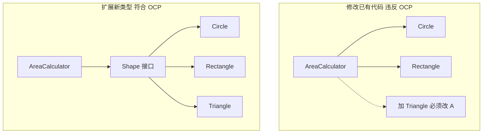
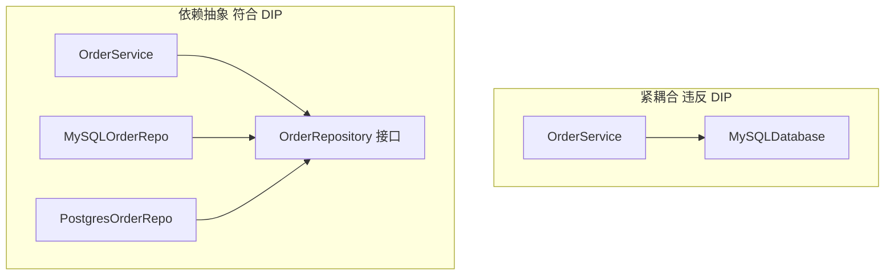
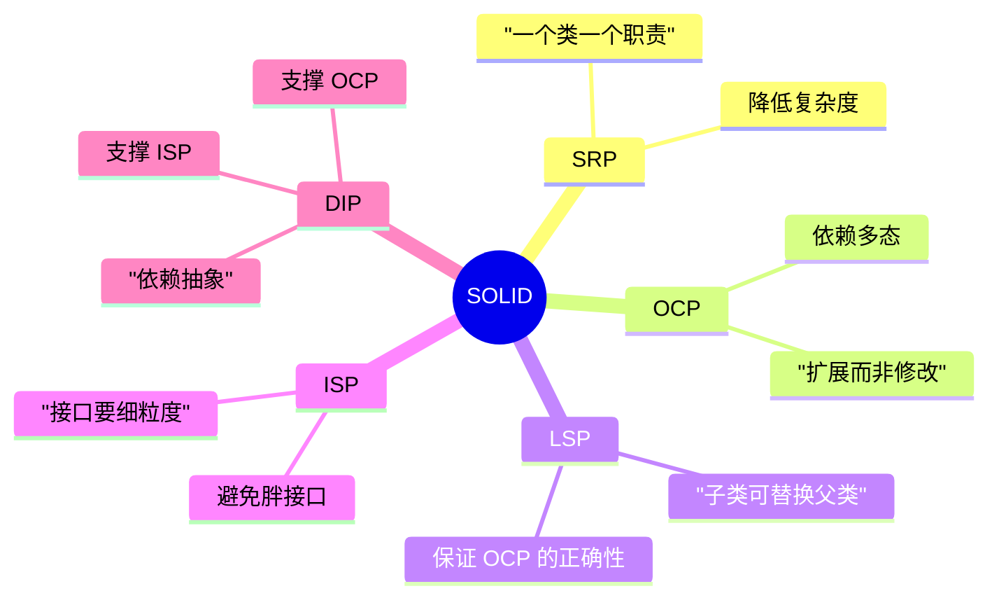

## 为什么需要"设计原则"？

> "好代码和烂代码都能运行。区别在于，好代码让下一个维护者能在几分钟内理解和修改；烂代码让下一个维护者诅咒你。"

软件的**生命周期成本**主要在**维护阶段**。让代码容易被理解和修改，是软件设计的核心目标。

**SOLID 原则**由 Robert C. Martin（Uncle Bob）总结，是面向对象设计的五个基本原则。它们不是硬性规则，而是**评估代码质量的思维工具**。

---

## SOLID 五原则速览

| 首字母 | 原则 | 英文 | 一句话概括 |
|-------|------|------|-----------|
| **S** | 单一职责 | Single Responsibility | 一个类只做一件事 |
| **O** | 开闭原则 | Open/Closed | 对扩展开放，对修改关闭 |
| **L** | 里氏替换 | Liskov Substitution | 子类必须能替换父类 |
| **I** | 接口隔离 | Interface Segregation | 不强迫依赖不需要的方法 |
| **D** | 依赖反转 | Dependency Inversion | 依赖抽象，不依赖具体 |

---

## S: 单一职责原则（SRP）

> **一个类/模块应该只有一个改变的理由。**

**反例**：一个 `UserService` 同时负责：
- 用户注册（业务逻辑）
- 发送欢迎邮件（通知）
- 写入数据库（持久化）
- 格式化 JSON 响应（序列化）

```java
// ❌ 违反 SRP: 一个类承担了太多职责
class UserService {
    void register(String name, String email) {
        // 1. 业务逻辑: 验证邮箱格式
        if (!email.contains("@")) throw new InvalidEmail();
        
        // 2. 持久化: 写入数据库
        db.execute("INSERT INTO users ...");
        
        // 3. 通知: 发送邮件
        emailSender.send("欢迎注册...", email);
        
        // 4. 序列化: 构造 JSON 响应
        return "{\"name\":\"" + name + "\"}";
    }
}
```

问题：如果要换邮件服务商、换数据库、改 JSON 格式，都需要修改 `UserService`。**一个类有多个变化理由 = 高维护成本**。

**重构后**：
```java
// ✅ 每个类只做一件事
class UserService {
    private UserValidator validator;
    private UserRepository repo;
    private NotificationService notifier;
    private UserResponseFormatter formatter;
    
    UserResponse register(String name, String email) {
        validator.validateEmail(email);
        User user = repo.save(new User(name, email));
        notifier.sendWelcomeEmail(user);
        return formatter.format(user);
    }
}
```

> **判断技巧**：试着用一句话描述这个类/函数的作用。如果你用了"和"，大概率违反了 SRP。
{: .prompt-tip }

---

## O: 开闭原则（OCP）

> **对扩展开放，对修改关闭。**

即：**新增功能应该通过添加新代码实现，而不是修改已有代码**。

**反例**：计算不同形状的面积：
```java
// ❌ 新增一种形状必须修改 AreaCalculator
class AreaCalculator {
    double calculate(Object shape) {
        if (shape instanceof Circle) {
            Circle c = (Circle) shape;
            return PI * c.radius * c.radius;
        } else if (shape instanceof Rectangle) {
            Rectangle r = (Rectangle) shape;
            return r.width * r.height;
        }
        // 每次新增形状, 都要在这里加一个 else if...
        // 违反 OCP: 修改已有代码来支持新功能
    }
}
```

**重构后**（多态实现 OCP）：
```java
// ✅ 新增形状只需新建一个类, 不修改已有代码
interface Shape {
    double area();
}

class Circle implements Shape {
    double area() { return PI * radius * radius; }
}

class Rectangle implements Shape {
    double area() { return width * height; }
}

class Triangle implements Shape {       // 新增: 只加新代码
    double area() { return base * height / 2; }
}

class AreaCalculator {
    double calculate(Shape shape) {      // 这段代码永远不用改
        return shape.area();
    }
}
```



---

## L: 里氏替换原则（LSP）

> **子类对象必须能在不改变程序正确性的前提下替换父类对象。**

这是对**继承关系**的约束。如果 `B extends A`，那么所有使用 `A` 的地方换成 `B` 之后，程序行为不应该出问题。

**经典反例：正方形不是长方形？**

```java
class Rectangle {
    protected int width, height;
    void setWidth(int w) { width = w; }
    void setHeight(int h) { height = h; }
    int area() { return width * height; }
}

// ❌ 看起来很合理, 但实际上违反了 LSP
class Square extends Rectangle {
    @Override
    void setWidth(int w)  { width = w; height = w; }  // 偷偷改了 height
    
    @Override
    void setHeight(int h) { width = h; height = h; }  // 偷偷改了 width
}

void test(Rectangle r) {
    r.setWidth(5);
    r.setHeight(10);
    assert r.area() == 50;   // 传入 Square 时, area() 返回 100 !
}
```

**问题**：`Square` 改变了父类的**行为契约**——设置 width 不应该影响 height。Square 虽然从几何上"是一个"Rectangle，但在代码中**不能**替换它。

> **LSP 的本质**：子类不能比父类**更强的前置条件**，也不能有**更弱的后置条件**。换句话说：子类答应的不能比父类少，要求的不能比父类多。
{: .prompt-info }

---

## I: 接口隔离原则（ISP）

> **不应该强迫客户端依赖它们不需要的方法。**

**反例**：一个"全能"的 `Worker` 接口：
```java
// ❌ 强迫所有员工依赖 eat() 和 sleep()
interface Worker {
    void work();
    void eat();      // 机器人不需要吃饭
    void attendMeeting();  // 独立贡献者不需要开会
    void sleep();    // 机器人也不需要睡觉
}

class HumanEmployee implements Worker {
    // 正常实现所有方法
}

class RobotEmployee implements Worker {
    void work() { ... }           // ✅ 需要
    
    void eat() { /* 机器人不吃饭 */ }   // ❌ 被迫实现
    void attendMeeting() { /* 也不开会 */ } // ❌ 被迫实现
    void sleep() { /* 也不睡觉 */ }      // ❌ 被迫实现
}
```

**重构后**（接口细分）：
```java
// ✅ 细粒度接口, 按需实现
interface Workable {
    void work();
}

interface Feedable {
    void eat();
}

interface MeetingAttendee {
    void attendMeeting();
}

interface Sleepable {
    void sleep();
}

class Human implements Workable, Feedable, MeetingAttendee, Sleepable { ... }
class Robot implements Workable { ... }  // 只依赖 work()
```

---

## D: 依赖反转原则（DIP）

> **1. 高层模块不应该依赖低层模块，两者都应该依赖抽象。**
> **2. 抽象不应该依赖细节，细节应该依赖抽象。**

换句话说：**面向接口编程，不面向实现编程。**

**反例**：业务逻辑直接依赖具体的数据库：
```java
// ❌ 高层依赖低层: OrderService 直接依赖 MySQL
class OrderService {
    private MySQLDatabase db = new MySQLDatabase();  // 紧耦合
    
    void saveOrder(Order order) {
        db.execute("INSERT INTO orders ...");
    }
    // 如果以后换 PostgreSQL? 必须修改 OrderService
}
```

**重构后**（依赖抽象）：
```java
// ✅ 双方都依赖接口
interface OrderRepository {          // 抽象
    void save(Order order);
}

class MySQLOrderRepo implements OrderRepository { ... }  // 细节
class PostgresOrderRepo implements OrderRepository { ... } // 细节

class OrderService {
    private OrderRepository repo;    // 依赖抽象
    
    // 通过构造注入, 不关心具体实现
    OrderService(OrderRepository repo) {
        this.repo = repo;
    }
    
    void saveOrder(Order order) {
        repo.save(order);
    }
}
```



**DIP 带来的好处**：
- ✅ 可测试性：单元测试可以用 `MockOrderRepository`，不需要真实数据库
- ✅ 可扩展性：换数据库只需新增一个实现类
- ✅ 解耦：业务逻辑不关心持久化细节

> **DIP 是依赖注入（DI）和控制反转（IoC）容器的理论基础**。Spring、Guice、Dagger 这些框架都是为了自动化地"组装"依赖关系。
{: .prompt-info }

---

## SOLID 之间的关系

这五个原则不是孤立的，而是相互支持的：



- **DIP 是粘合剂**：让 OCP 和 ISP 成为可能
- **LSP 是护栏**：保证你写的继承关系不会破坏 OCP
- **SRP 是基础**：如果一个类有太多职责，后面所有原则都会失效

---

## 设计模式：不是银弹，是工具箱

GoF 23 种设计模式常被误解为"模板"。**设计模式的价值不在于模板代码，而在于其中蕴含的设计思想**。

### 核心思想分类

| 思想 | 相关模式 | 本质 |
|------|---------|------|
| **封装变化** | Strategy, State, Template Method | 把易变部分抽离出来 |
| **组合优于继承** | Decorator, Composite, Bridge | 用对象组合代替类继承 |
| **解耦** | Observer, Mediator, Command | 减少模块间的直接依赖 |
| **延迟实例化** | Factory, Builder, Singleton, Prototype | 灵活控制对象创建 |
| **统一接口** | Adapter, Facade, Proxy | 用统一接口隐藏复杂性 |

### 模式不是互相排斥的

一个好的设计经常同时使用多个模式：

- **Repository 模式** = Factory + Strategy + DIP
- **MVC** = Observer（View 监听 Model）+ Strategy（不同 Controller）+ Composite（View 树）
- **ORM** = Unit of Work + Identity Map + Lazy Load（Proxy）

> **学习设计模式的正确姿势**：不是记住 23 个模板，而是理解每个模式**解决什么问题**、**在什么约束下有效**、**有什么 trade-off**。当你下次遇到类似问题时，脑子里就有了参考方案。
{: .prompt-tip }

---

## 常见面试问题

**Q1：用一句话解释每个 SOLID 原则？**

> SRP = 一个类一个职责；OCP = 扩展开放修改关闭；LSP = 子类能替换父类；ISP = 接口要小；DIP = 依赖抽象。

**Q2：组合优于继承这句话是什么意思？**

> 继承是白盒复用（子类能看到父类实现细节），紧耦合，且编译时确定。组合是黑盒复用，松耦合，运行时可替换。优先用组合，继承只在"真正的 is-a 且需要多态"时使用。

**Q3：什么情况下会违反 LSP？**

> 1) 子类抛出父类没有的异常；2) 子类实现空方法（"我不需要这个"）；3) 子类弱化了前置/后置条件；4) 经典的"正方形不是长方形"问题。

**Q4：依赖注入和依赖反转是什么关系？**

> DIP 是原则（"依赖抽象"），DI 是实现 DIP 的技术手段（"把依赖从外面传进来，不要自己 new"），IoC 容器是自动化 DI 的框架。

**Q5：设计模式过时了吗？**

> 具体的模式代码可能因语言而异（比如函数式语言天然不需要 Strategy），但模式背后的思想——封装变化、解耦、降低复杂度——是永恒的。

---

## 小结

| 原则/模式 | 核心思想 | 价值 |
|----------|---------|------|
| **SRP** | 一个类一个改变理由 | 降低复杂度 |
| **OCP** | 扩展而非修改 | 降低变更风险 |
| **LSP** | 子类可替换父类 | 保证多态的正确性 |
| **ISP** | 接口要细粒度 | 避免胖接口的副作用 |
| **DIP** | 依赖抽象而非具体 | 解耦、可测试、可扩展 |
| **设计模式** | 常见设计问题的已知方案 | 提供沟通词汇和参考思路 |

**关于设计，最重要的三件事**：

1. **知道为什么**：不要为了用模式而用模式。每一个设计决策都应该回答"这个设计解决了什么具体问题？"
2. **知道取舍**：每一个设计都有 trade-off。依赖注入解耦了，但增加了一层间接；继承复用了代码，但紧耦合。
3. **简单优先**：KISS (Keep It Simple, Stupid)。YAGNI (You Aren't Gonna Need It)。不要过度设计，等到变化发生时再重构。

下一篇我们将讨论 **架构模式：分层架构、事件驱动、微服务的本质取舍**。
