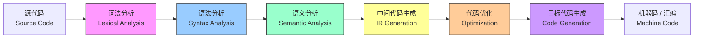
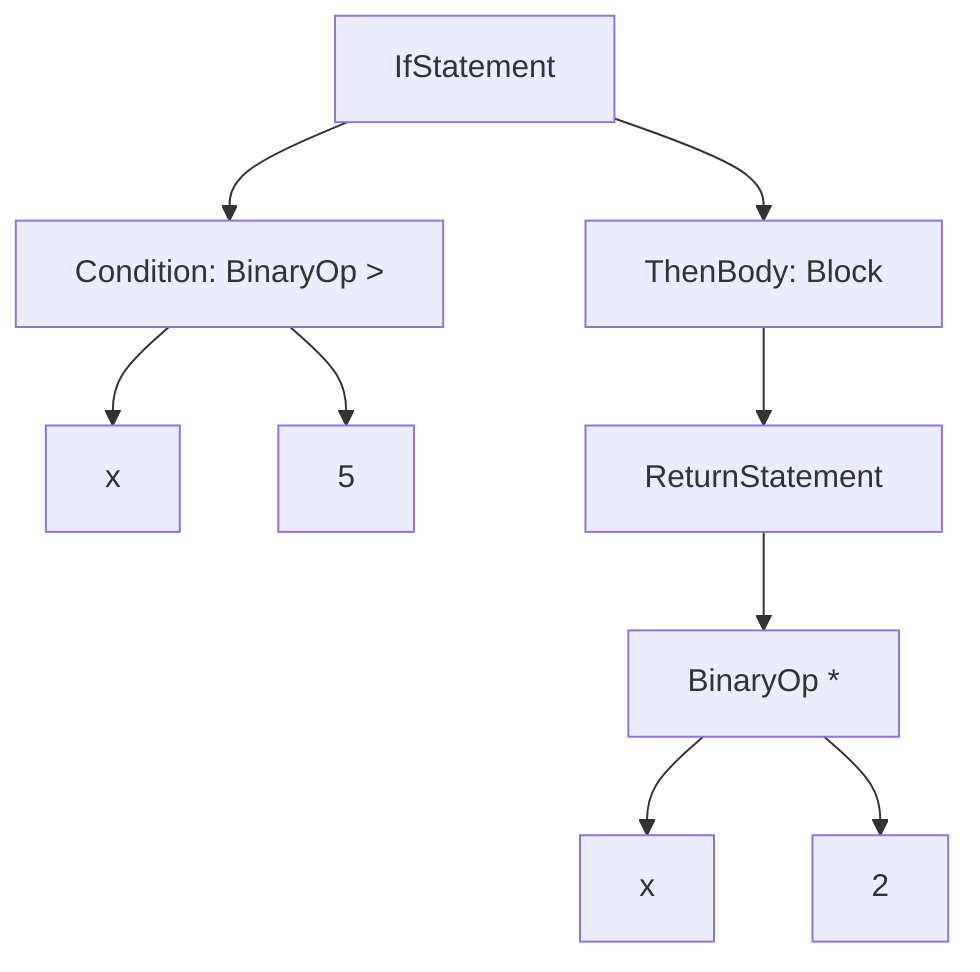

## 什么是编译器？

**编译器（Compiler）** 是一种把**高级语言源代码**翻译成**目标机器代码**（或字节码）的程序。

```
         编译器
源代码 ───────────► 可执行程序
 foo.c              a.out / foo.exe
```

理解编译器原理的意义：

- 写出**更高质量**的代码（知道编译器能做什么优化，哪些是反优化）
- 调试**难以理解**的 bug（未定义行为、内存布局问题）
- 设计**自己的**领域专用语言（DSL）
- 理解现代编程语言的**本质差异**

---

## 编译器的经典流水线

一个传统编译器通常包含以下阶段：



| 阶段 | 输入 | 输出 | 核心任务 |
|------|------|------|---------|
| **词法分析** | 字符流 | Token 流 | 识别关键字、标识符、常量 |
| **语法分析** | Token 流 | 抽象语法树 AST | 验证语法结构合法性 |
| **语义分析** | AST | 带类型注解的 AST | 类型检查、作用域检查 |
| **IR 生成** | 带类型 AST | 中间表示 (IR) | 把高级语言翻译成与机器无关的中间代码 |
| **优化** | IR | 更优的 IR | 常量折叠、死代码消除、循环优化... |
| **代码生成** | IR | 目标机器汇编 / 机器码 | 寄存器分配、指令选择 |

前端（Frontend）= 词法 + 语法 + 语义  
中端（Middle End）= IR 生成 + 优化  
后端（Backend）= 目标代码生成

---

## 阶段一：词法分析（Lexing）

词法分析器（Lexer / Scanner）把字符流切成一个个**Token**（词法单元）。

**输入**（C 代码片段）：
```c
if (x > 5) {
    return x * 2;
}
```

**输出**（Token 流）：

| Token 类型 | 值 | 位置 |
|-----------|---|------|
| KEYWORD | `if` | 行 1, 列 1 |
| LPAREN | `(` | 行 1, 列 4 |
| IDENT | `x` | 行 1, 列 5 |
| GT | `>` | 行 1, 列 7 |
| NUMBER | `5` | 行 1, 列 9 |
| RPAREN | `)` | 行 1, 列 10 |
| LBRACE | `{` | 行 1, 列 12 |
| KEYWORD | `return` | 行 2, 列 5 |
| IDENT | `x` | 行 2, 列 12 |
| STAR | `*` | 行 2, 列 14 |
| NUMBER | `2` | 行 2, 列 16 |
| SEMI | `;` | 行 2, 列 17 |
| RBRACE | `}` | 行 3, 列 1 |

### 词法分析器的实现

最简单的实现是一个**有穷自动机（DFA）**，配合一张关键字表。

**伪代码**：
```
while 未到文件末尾:
    跳过空白和注释
    if 当前是字母:
        读取完整标识符, 查询关键字表
        输出 KEYWORD 或 IDENT token
    elif 当前是数字:
        读取完整数字
        输出 NUMBER token
    elif 当前是符号:
        可能多读一个字符 (如 >= 是 GE, 不是 GT + ASSIGN)
        输出对应运算符 token
```

**工业级实现**：使用 `flex` / `lex` 等工具，通过正则表达式描述 Token 规则，工具自动生成 DFA。

---

## 阶段二：语法分析（Parsing）

语法分析器（Parser）接收 Token 流，构建**抽象语法树（AST）**，验证语法是否合法。

**输入**（Token 流）：`if` `(` `x` `>` `5` `)` `{` `return` `x` `*` `2` `;` `}`

**输出**（AST）：



### 常见的解析算法

| 算法 | 特点 | 代表工具 |
|------|------|---------|
| **LL(k)** | 自顶向下，左递归需消除，需改写文法 | ANTLR, 手写递归下降 |
| **LR(k)** | 自底向上，功能强，处理左递归自然 | yacc, bison |
| **GLR** | 广义 LR，能处理歧义文法 | Bison 支持 |
| **Packrat** | 记忆化 PEG 解析器，支持任意回溯 | 各种语言的 PEG 库 |

**递归下降解析（Recursive Descent）** 是最容易手写的算法，每个语法规则对应一个函数：

```python
def parse_if_statement(tokens):
    expect(tokens, 'if')
    expect(tokens, '(')
    cond = parse_expression(tokens)
    expect(tokens, ')')
    body = parse_block(tokens)
    return IfStatement(cond, body)
```

---

## 阶段三：语义分析（Semantic Analysis）

语法正确不代表语义正确。语义分析器的任务：

### 1. 符号表（Symbol Table）构建

记录每个标识符的声明位置、类型、作用域、可见性。

### 2. 类型检查（Type Checking）

```c
int a = "hello";    // 类型错误: 不能把字符串赋给 int
int b = 5 / 0;      // 常量表达式错误: 除以零
void f() { return 1; } // 返回值类型不匹配
```

### 3. 作用域检查

```c
{
    int x = 5;
    {
        int x = 10; // 内层 shadow 外层, 合法但需记录
        printf("%d", x); // 打印 10
    }
    printf("%d", y);    // 错误: y 未声明
}
```

### 4. 其它检查

- 数组下标是否为整数
- 函数调用参数个数/类型匹配
- `break` / `continue` 是否在循环内
- `switch` case 是否有重复

经过语义分析后，AST 上会挂上类型注解：

```mermaid
graph TD
    A["+ : int"] --> B["5 : int"]
    A --> C["3.14 : double"]
    note over C: 隐式转换为 int
```

---

## 阶段四：中间代码生成（IR Generation）

把带类型的 AST 翻译成**中间表示（Intermediate Representation）**。

IR 是一种"三不像"：不像高级语言那么抽象，不像机器码那么具体。

常见形式：**三地址码（Three-Address Code）**

```
t1 = x * 2
t2 = y + t1
return t2
```

**SSA（Static Single Assignment）形式**：每个变量只赋值一次，极大地方便优化。LLVM IR 就是 SSA 形式：

```llvm
define i32 @multiply_add(i32 %x, i32 %y) {
    %t1 = mul i32 %x, 2
    %t2 = add i32 %y, %t1
    ret i32 %t2
}
```

> **LLVM** 是最成功的现代编译器基础设施。它提供了一套通用的 IR + 优化器 + 多种目标后端。Clang（C/C++ 前端）、Rustc、Swift 编译器都基于 LLVM。
{: .prompt-info }

---

## 阶段五：代码优化

优化是编译器最"有学问"的部分。优化器接收 IR，输出"更好"的 IR——更少的指令、更少的内存访问、更少的分支预测失败。

### 常见优化举例

**1. 常量折叠（Constant Folding）**
```
// 优化前
x = 2 * 3 + 4;

// 优化后
x = 10;
```

**2. 死代码消除（Dead Code Elimination, DCE）**
```
// 优化前
void f() {
    int a = 5;   // a 从未被使用
    int b = a*2; // b 也未被使用
    return;
}

// 优化后
void f() { return; }
```

**3. 循环不变式外提（Loop-Invariant Code Motion）**
```
// 优化前
for (int i = 0; i < n; i++) {
    arr[i] = a * b + c; // a*b+c 在循环内不变
}

// 优化后
int tmp = a * b + c;
for (int i = 0; i < n; i++) {
    arr[i] = tmp;
}
```

**4. 函数内联（Inlining）**
```
// 优化前
inline int square(int x) { return x * x; }
y = square(5);

// 优化后 (内联展开)
y = 5 * 5;   // 然后常量折叠 → y = 25;
```

**5. 强度削弱（Strength Reduction）**
```
// 优化前: 乘法需要多个周期
x = i * 4;

// 优化后: 左移一个周期完成
x = i << 2;
```

### 优化级别（以 GCC/Clang 为例）

| 级别 | 含义 | 典型效果 |
|------|------|---------|
| `-O0` | 不优化，保留调试信息 | 编译快，调试友好 |
| `-O1` | 基础优化 | 代码更小更快，仍可调试 |
| `-O2` | 标准优化，生产环境默认 | 显著性能提升 |
| `-O3` | 激进优化 | 可能牺牲代码大小和可预测性 |
| `-Os` | 优化大小 | 嵌入式/移动端 |
| `-Ofast` | 最快，可能违反 IEEE 浮点标准 | 数值计算密集场景 |

> 开启高优化级别的编译器会做出大胆假设。例如 `-O2` 会假设你的代码**没有未定义行为（Undefined Behavior）**。如果实际上有 UB（比如有符号整数溢出、解引用空指针），优化器可能产生和你直觉完全不同的结果——这就是 debug 版正常但 release 版崩溃的常见原因。
{: .prompt-warning }

---

## 阶段六：目标代码生成

把优化后的 IR 翻译成目标机器的汇编指令。

核心子问题：

### 1. 指令选择（Instruction Selection）

把 IR 操作映射到具体的 CPU 指令。

```
IR: t = a + b

可能的 x86 选择:
    mov eax, [a]
    add eax, [b]
    mov [t], eax
```

### 2. 寄存器分配（Register Allocation）

现代 CPU 只有十几个通用寄存器（x86-64 有 16 个，其中 3-4 个还有特殊用途），但程序中有成百上千个变量。**寄存器分配器**决定哪些变量放在寄存器里，哪些"溢出"（spill）到内存。

这通常通过**图着色算法**解决：把变量作为节点，冲突关系（两个变量在同一时刻需要存活）作为边，用 K 种颜色（K = 可用寄存器数）给图着色。

```mermaid
graph TD
    A[a] --- B[b]
    A --- C[c]
    B --- C
    B --- D[d]
    C --- D
    
    style A fill:#f99
    style B fill:#9f9
    style C fill:#99f
    style D fill:#f99
    
    note over A,B,C,D: 3 种颜色可着色, 需要 3 个寄存器
```

### 3. 指令调度（Instruction Scheduling）

重排指令顺序以隐藏**流水线延迟**和**内存访问延迟**。

```
// 优化前 (流水线可能停顿)
load  r1, [a]      // 5 周期后才可用
add   r2, r1, r3   // 必须等 r1 就绪
load  r4, [b]
add   r5, r4, r6

// 优化后 (穿插独立指令, 隐藏延迟)
load  r1, [a]
load  r4, [b]
add   r2, r1, r3
add   r5, r4, r6
```

---

## 现代编译器：JIT 与 AOT

| 编译方式 | 含义 | 代表 | 优点 | 缺点 |
|---------|------|------|------|------|
| **AOT** (Ahead-of-Time) | 运行前完整编译 | C/C++ (gcc/clang), Rust, Go | 运行时零开销，极致优化 | 启动时间取决于编译 |
| **JIT** (Just-in-Time) | 运行时按需编译 | Java (HotSpot), JavaScript (V8), .NET | 可利用运行时剖面信息做优化 | 编译占用运行时资源 |
| **解释执行** | 不编译，直接解释 AST/字节码 | 早期 Python, 早期 Lua | 启动快，开发友好 | 执行慢 |

**JIT 的策略（以 V8 为例）**：

```
JavaScript 源码
    │
    ├─► 基线编译器 (Ignition) ──► 字节码 ──► 解释执行 (快启动)
    │                           │
    │                           ▼  运行中收集 profile
    │                      热点函数被检测到
    │                           │
    └──────────────────────────► 优化编译器 (TurboFan)
                                    │
                                    ▼
                                高度优化的机器码
```

---

## 常见面试问题

**Q1：解释一下编译的主要阶段？**

> 词法分析 → 语法分析 → 语义分析 → IR 生成 → 优化 → 目标代码生成。前端关注语言正确性，中端关注与机器无关的优化，后端关注具体 CPU 架构。

**Q2：AST 和 IR 有什么区别？**

> AST 保留源代码的结构（if/for/函数等），与语言强相关。IR 是三地址码/SSA 形式，与源语言解耦但也还未绑定到具体机器。优化器工作在 IR 层。

**Q3：什么是 SSA？为什么有用？**

> 静态单赋值，每个变量只赋值一次且在使用前定义。优点是让数据流分析变得简单——变量的 def 和 use 关系一目了然，极大简化了很多优化算法。

**Q4：编译器的优化会改变程序语义吗？**

> 合法的优化必须保留**可观测行为**（as-if 规则）。但如果代码有**未定义行为**（UB），优化器可以做任何事——这是很多诡异 bug 的来源。

**Q5：寄存器分配用什么算法？**

> 经典方法是用**图着色**建模：变量为节点，冲突为边，K 着色对应 K 个寄存器。工业界常用线性扫描（Linear Scan）等启发式算法以换取编译速度。

---

## 小结

编译原理是计算机科学中**最优雅、最实用**的领域之一。它连接了编程语言理论和计算机体系结构，是理解"代码到底如何变成指令"的钥匙。

即使你不写编译器，理解编译原理也会让你：

- 写出**更高效**的代码（知道优化器能做什么、不能做什么）
- 更快地**调试**晦涩的问题（未定义行为、奇怪的汇编输出）
- 设计出**更合理**的 API 和 DSL（利用语法糖让语言更有表达力）

推荐阅读：**《编译原理》（龙书）** 作为经典教材；**LLVM Tutorial** 作为工程实践起点。

下一篇我们将讨论 **链接与装载：程序是如何启动运行的**。

<div class='context-nav'>
<a class='context-link prev disabled'><span class='context-label'>上一篇</span><span class='context-title'>暂无</span></a>
<a class='context-link next disabled'><span class='context-label'>下一篇</span><span class='context-title'>暂无</span></a>
</div>
