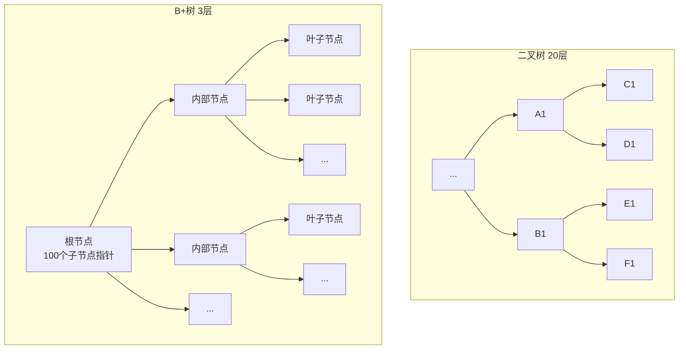
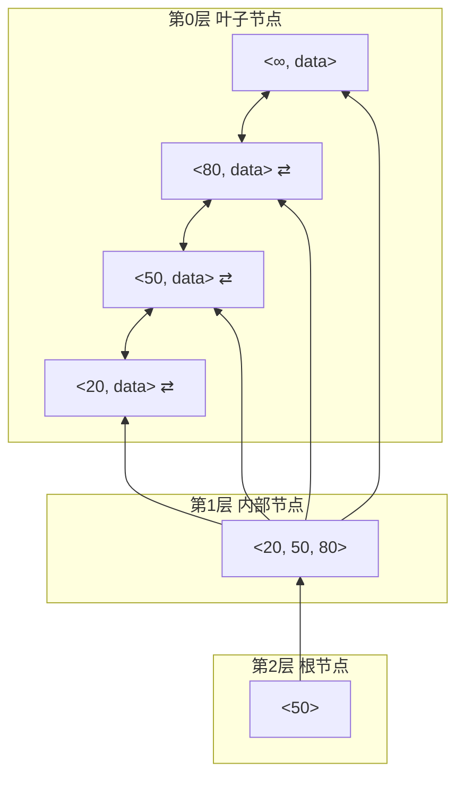
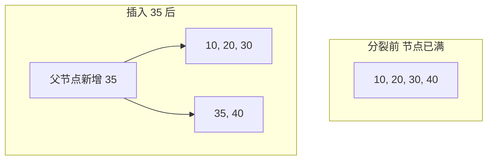

## 为什么需要索引？

假设一张 `users` 表有 100 万条记录，我们想查询 `name = "董向阳"` 的用户。如果**没有索引**，数据库只能**全表扫描**——依次检查每一条记录，平均需要检查 50 万行。

如果**有索引**，我们可以在 $O(\log n)$ 次磁盘 I/O 内找到目标行——对于 100 万条数据，只需要大约 $\log_2(10^6) \approx 20$ 次比较，考虑到树的扇出（fan-out）很大，实际只需要 3-4 次磁盘读取。

这就是索引的意义：**以空间换时间，把全表扫描变成树的查找**。

---

## 为什么是 B+ 树，不是二叉搜索树？

既然索引本质是"加速查找的数据结构"，为什么数据库几乎一致选择 **B+ 树**，而不是二叉搜索树、AVL 树、红黑树？

核心原因：**磁盘 I/O 是数据库性能的瓶颈**。

| 存储层次 | 访问速度 | 典型延迟 |
|---------|---------|---------|
| CPU 缓存 | 极快 | ~1ns |
| 内存 | 快 | ~100ns |
| SSD | 较慢 | ~100,000ns (0.1ms) |
| 机械硬盘 | 很慢 | ~10,000,000ns (10ms) |

从磁盘读一个 4KB 页和读一个 16KB 页，**时间差别不大**——主要开销在**寻道**和**旋转延迟**。所以数据库索引的设计目标是：

> **尽量减少磁盘 I/O 次数**。每次 I/O 多读一些数据，用高扇出的矮树代替低扇出的高树。

二叉树的扇出是 2，100 万数据需要 $\log_2(10^6) \approx 20$ 层 = 20 次磁盘 I/O。

B+ 树的扇出通常是 100-1000，100 万数据只需要 $\log_{100}(10^6) \approx 3$ 层 = 3 次磁盘 I/O。



---

## B+ 树的结构

B+ 树是一种**多路平衡搜索树**，它的特点是：

### 1. 非叶子节点只存索引（key + 指针），不存数据

内部节点只存储键值和子节点指针，数据只存在叶子节点。这意味着：

- 非叶子节点非常小，可以容纳大量 key → **树很矮**
- 每次查找都必须走到叶子节点 → **查找路径长度一致，性能稳定**

### 2. 叶子节点通过双向链表串联

所有叶子节点按 key 顺序用双向链表连接。这意味着：

- **范围查询极快**：找到起始 key 后，顺着链表遍历即可
- **顺序扫描极快**：数据库的全索引扫描就是遍历叶子链表



### 3. 每个节点对应一个磁盘页

B+ 树的节点大小通常等于操作系统的页大小（4KB、8KB）或数据库的页大小（MySQL InnoDB 默认 16KB）。

**以 InnoDB 为例**（页大小 16KB）：

- 假设主键是 `BIGINT` (8 字节)，指针是 6 字节
- 每个内部节点可存储约 $\frac{16384}{8+6} \approx 1170$ 个 key
- 高度为 2 的 B+ 树可存储 $1170 \times 16 = 18,720$ 行（叶子节点每行 1KB）
- 高度为 3 的 B+ 树可存储 $1170 \times 1170 \times 16 = 21,902,400$ 行 ≈ **2000 万行**
- 高度为 4 的 B+ 树可存储约 **25 亿行**

> 这就是为什么**几千万行的表只需要 3-4 层 B+ 树**，主键查询只需要 3 次磁盘读。如果根节点常驻内存，实际只需要 2 次甚至 1 次磁盘读。
{: .prompt-info }

---

## B+ 树 vs B 树

B 树是 B+ 树的前身，主要区别：

| 特性 | B 树 | B+ 树 |
|------|------|-------|
| 非叶子节点 | **也存储数据** | 只存索引 key + 指针 |
| 叶子节点 | 不相连 | **双向链表串联** |
| 查询路径 | 可能在非叶节点命中 | **必须走到叶子节点** |
| 范围查询 | 需要回退遍历树 | 顺着叶子链表直接扫 |
| 节点大小 | 数据占空间，扇出小 | 索引紧凑，**扇出大，树更矮** |

**B+ 树的优势总结**：

1. **更少的 I/O**：非叶节点不存数据 → 每个节点容纳更多 key → 树更矮
2. **稳定的查询性能**：任何查询都走到叶子节点，路径长度一致
3. **天然支持范围/顺序查询**：叶子链表让范围扫描极其高效
4. **缓存友好**：叶子节点连续存储，预读命中率高

---

## InnoDB 的 B+ 树索引

InnoDB 是 MySQL 默认的存储引擎，它有两种索引类型：

### 1. 聚簇索引（Clustered Index）

**聚簇索引 = 索引 + 数据，合二为一**。

- 每张表**有且仅有一个**聚簇索引
- 叶子节点直接存储完整的行数据
- 按主键顺序物理组织数据（因此主键最好自增，避免中间插入导致页分裂）

```mermaid
graph BT
    subgraph 聚簇索引的叶子节点 = 数据行
        L1["id=1, name='A', age=20"]
        L2["id=2, name='B', age=25"]
        L3["id=3, name='C', age=30"]
        L4[...]
    end
    I1["<2, 4, 6>"] --> L1 & L2 & L3 & L4
    R["根节点"] --> I1
```

### 2. 二级索引（Secondary Index）

二级索引也叫非聚簇索引。

- 一张表可以有**多个**二级索引
- 叶子节点存储的不是完整数据，而是**主键值**
- 通过二级索引查询时，需要**回表（Bookmark Lookup）**：先找到主键，再去聚簇索引查完整行

```mermaid
graph TB
    subgraph 二级索引 (name列)
        A["叶子: 'A' → id=1"]
        B["叶子: 'B' → id=2"]
        C["叶子: 'C' → id=3"]
    end
    subgraph 聚簇索引 (主键)
        D["id=1 → 完整行数据"]
        E["id=2 → 完整行数据"]
        F["id=3 → 完整行数据"]
    end
    A --> D
    B --> E
    C --> F
```

> **回表是二级索引的额外开销**。如果查询只需要索引列本身，可以触发**覆盖索引（Covering Index）**，不需要回表。
{: .prompt-tip }

### 示例：覆盖索引 vs 回表

```sql
CREATE TABLE users (
    id BIGINT PRIMARY KEY,
    name VARCHAR(50),
    age INT,
    INDEX idx_name_age(name, age)
);

-- 覆盖索引: 只需扫 idx_name_age 的叶子节点, 无需回表
SELECT name, age FROM users WHERE name = '董向阳';

-- 需要回表: 从二级索引找到id, 再去聚簇索引查email
SELECT * FROM users WHERE name = '董向阳';
```

---

## B+ 树的插入与分裂

插入操作可能导致节点超过最大容量，需要**分裂（Split）**：



**插入流程**：

1. 从根节点开始，找到 key 应插入的**叶子节点**
2. 如果叶子节点未满，直接插入，保持有序
3. 如果叶子节点已满，**分裂**成两个节点，把中间 key 上推到父节点
4. 父节点也可能因此溢出，递归向上分裂
5. 极端情况：根节点也分裂，**树高度 +1**

> **为什么推荐自增主键？** 自增主键的插入总是在索引的**最右侧**，不会频繁触发中间页的分裂和重组，写入性能最好。而 UUID 这样的随机主键会导致大量随机写入和页分裂。
{: .prompt-warning }

---

## B+ 树的删除与合并

删除操作可能导致节点数据过少，需要**合并（Merge）**或**借键（Rotate）**：

```mermaid
graph TD
    subgraph 删除前
        A["5, 10"] --> B["1, 3"] & C["6, 8"]
    end
    subgraph 删除 6, 8 后 C 太空
        D["5, 10"]
        E["1, 3"]
        F["10, 12"] -- "可以从兄弟节点借"
    end
    D --> E & F
```

**删除流程**：

1. 找到 key 所在的叶子节点，删除对应记录
2. 如果节点仍满足最小填充率（通常 50%），结束
3. 否则尝试向**兄弟节点借一个 key**（rotate）
4. 如果兄弟也不够，**与兄弟节点合并**，同时父节点减少一个 key
5. 父节点可能递归触发合并

---

## 实战：EXPLAIN 看索引使用

```sql
EXPLAIN SELECT * FROM users WHERE name = '董向阳';
```

输出中关注这些列：

| 列 | 含义 | 好的迹象 |
|----|------|---------|
| `type` | 访问类型 | `ref`, `range` 好；`ALL`（全表扫描）差 |
| `key` | 实际使用的索引 | 显示你期望的索引名 |
| `rows` | 预计扫描行数 | 越小越好 |
| `Extra` | 额外信息 | `Using index` = 覆盖索引，极好；`Using filesort` = 需要优化 |

---

## 常见面试问题

**Q1：B 树和 B+ 树的核心区别？为什么数据库选 B+ 树？**

> 1) B+ 树非叶节点不存数据，节点更小 → 扇出更大 → 树更矮 → I/O 更少；
> 2) B+ 树叶子节点用链表串联 → 范围查询极高效；
> 3) B+ 树查询路径稳定，任何查询都到叶子，性能可预测。

**Q2：聚簇索引和非聚簇索引的区别？**

> 聚簇索引叶子节点是**完整数据行**，二级索引叶子节点是**主键值**。每张表只有一个聚簇索引，但可以有多个二级索引。通过二级索引查询通常需要回表（除非是覆盖索引）。

**Q3：为什么推荐自增 ID 作为主键？**

> 自增主键保证新数据总是插入在 B+ 树的最右侧，避免随机插入导致的大量页分裂和记录移动，写入性能好。UUID 之类的随机主键会导致频繁的页分裂和碎片。

**Q4：什么是覆盖索引？有什么用？**

> 查询所需的列**全部在索引中**就能找到，不需要回表去聚簇索引查完整行。可以大幅减少 I/O，是优化查询的重要手段。可以用联合索引实现。

**Q5：联合索引的最左匹配原则？**

> 联合索引 `(a, b, c)` 只能用于查询条件包含 `a` 的情况。查询 `WHERE a=? AND b=?` 可以用索引，查询 `WHERE b=? AND c=?` 用不上（因为 a 缺失）。原理是 B+ 树按索引列顺序组织 key。

---

## 小结

| 概念 | 核心要点 |
|------|---------|
| **B+ 树本质** | 多路平衡搜索树，以减少磁盘 I/O 为核心设计目标 |
| **结构特点** | 非叶节点只存索引 key；叶子节点双向链表串联 |
| **聚簇索引** | 索引即数据，叶子是完整行，表只有一个 |
| **二级索引** | 叶子存主键值，通过二级索引查询通常需要回表 |
| **覆盖索引** | 查询列全在索引中，不需要回表，性能最好 |
| **插入/删除** | 溢出时分裂，过少时合并或借键 |
| **自增主键好处** | 顺序写入，避免页分裂，写入性能最优 |

索引优化是数据库性能调优的重中之重。理解 B+ 树的原理，才能设计出合理的索引结构，写出高效的 SQL。

下一篇我们将讨论 **SQL 查询优化与执行计划分析**。
