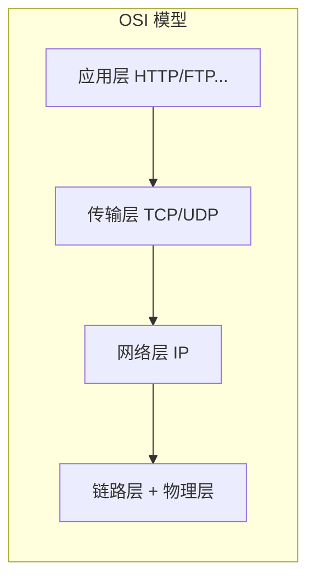
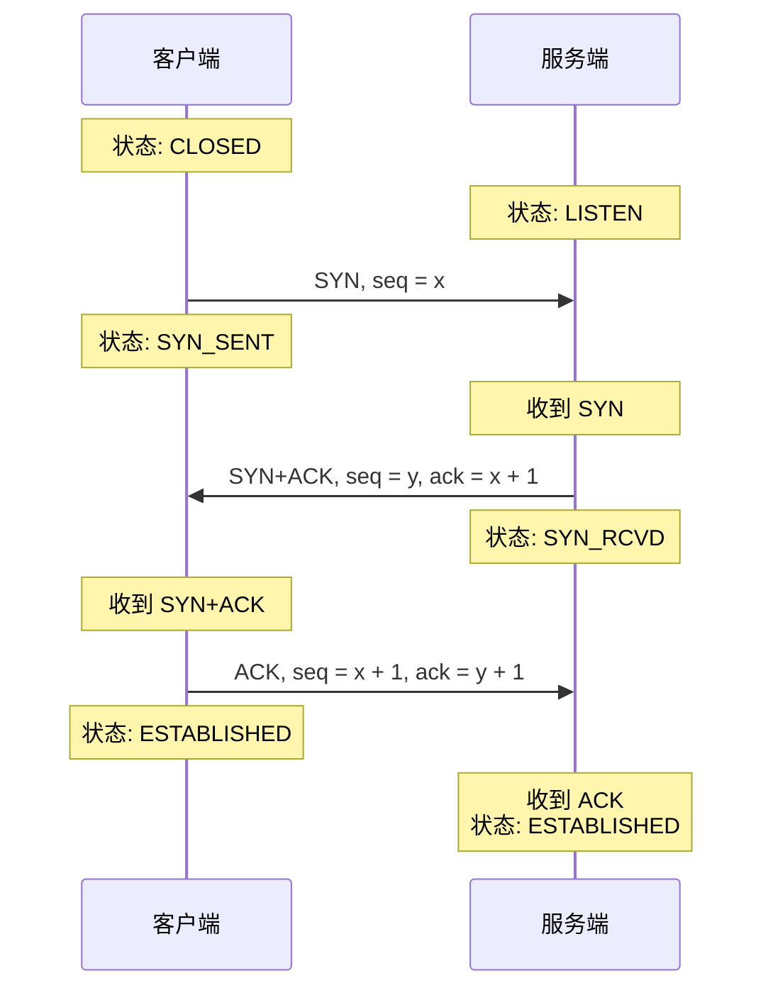
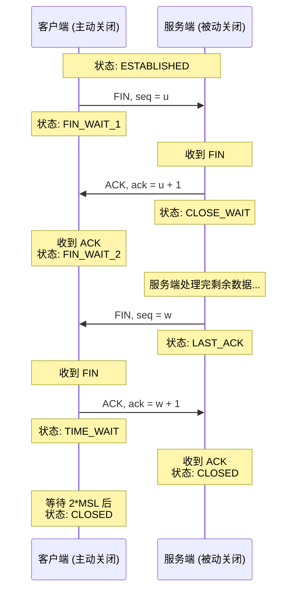
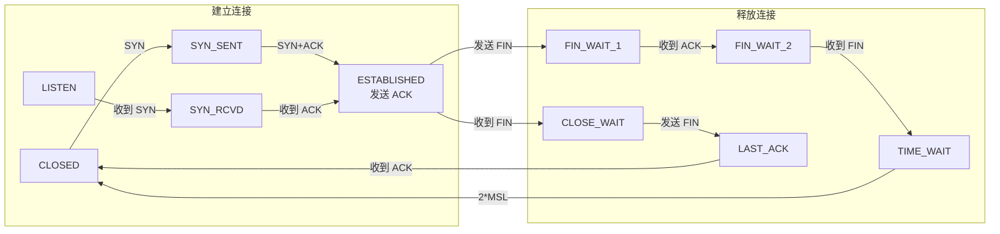

## TCP 是什么？

**TCP（Transmission Control Protocol，传输控制协议）** 是一种**面向连接的、可靠的、基于字节流的**传输层协议。

它的核心特性：

- ✅ **面向连接**：通信前必须先建立连接
- ✅ **可靠传输**：保证数据按序到达，丢包自动重传
- ✅ **流量控制**：发送方不超过接收方的处理能力
- ✅ **拥塞控制**：在网络拥堵时降低发送速率



本文重点讨论 TCP 连接的**建立**（三次握手）和**释放**（四次挥手）。

---

## TCP 报文段头部

在讨论握手/挥手之前，先认识 TCP 报文段的关键字段：

```
0                   1                   2                   3
0 1 2 3 4 5 6 7 8 9 0 1 2 3 4 5 6 7 8 9 0 1 2 3 4 5 6 7 8 9 0 1
+-+-+-+-+-+-+-+-+-+-+-+-+-+-+-+-+-+-+-+-+-+-+-+-+-+-+-+-+-+-+-+-+
|          源端口号            |         目的端口号             |
+-+-+-+-+-+-+-+-+-+-+-+-+-+-+-+-+-+-+-+-+-+-+-+-+-+-+-+-+-+-+-+-+
|                        序号 (seq)                             |
+-+-+-+-+-+-+-+-+-+-+-+-+-+-+-+-+-+-+-+-+-+-+-+-+-+-+-+-+-+-+-+-+
|                      确认号 (ack)                             |
+-+-+-+-+-+-+-+-+-+-+-+-+-+-+-+-+-+-+-+-+-+-+-+-+-+-+-+-+-+-+-+-+
| 长度|  保留  |U|A|P|R|S|F|                                    |
|     |        |R|C|S|S|Y|I|            窗口大小                |
|     |        |G|K|H|T|N|N|                                    |
+-+-+-+-+-+-+-+-+-+-+-+-+-+-+-+-+-+-+-+-+-+-+-+-+-+-+-+-+-+-+-+-+
|         校验和               |          紧急指针              |
+-+-+-+-+-+-+-+-+-+-+-+-+-+-+-+-+-+-+-+-+-+-+-+-+-+-+-+-+-+-+-+-+
```

对握手/挥手最重要的**标志位**：

| 标志位 | 含义 |
|--------|------|
| **SYN** (Synchronize) | 建立连接时使用，同步序号 |
| **ACK** (Acknowledgment) | 确认收到的数据 |
| **FIN** (Finish) | 关闭连接 |
| **seq** (Sequence Number) | 本报文段数据的第一个字节的序号 |
| **ack** (Acknowledgment Number) | 期望收到对方下一个报文段的序号 |

---

## 三次握手（Three-way Handshake）

TCP 连接的建立需要三次报文交换。假设**客户端主动发起连接**，**服务端被动监听**。



### 详细过程

| 步骤 | 方向 | 标志位 | 发送方状态 | 接收方状态 |
|------|------|--------|-----------|-----------|
| ① | 客户端 → 服务端 | `SYN, seq=x` | SYN_SENT | - |
| ② | 服务端 → 客户端 | `SYN+ACK, seq=y, ack=x+1` | - | SYN_RCVD |
| ③ | 客户端 → 服务端 | `ACK, seq=x+1, ack=y+1` | ESTABLISHED | ESTABLISHED |

### 为什么是三次，不是两次？

这是最经典的面试问题。主要有两个原因：

**原因 1：确认双方的收发能力**

三次握手可以确认**双方都有发送和接收的能力**：

- 客户端发送 SYN → 服务端收到：证明客户端**发送**正常、服务端**接收**正常
- 服务端回 SYN+ACK → 客户端收到：证明服务端**发送**正常、客户端**接收**正常
- 客户端回 ACK → 服务端收到：证明双向通路都正常

如果只有两次握手，**客户端无法确认自己的接收能力是否正常**（因为客户端从未收到过服务端的回应）。

**原因 2：防止历史连接的干扰**

考虑这个场景：客户端之前发送过一个 SYN，因网络延迟迟迟未到。客户端超时重发了一个新的 SYN，成功建立连接并关闭。此时第一个迟到的 SYN 才到达服务端。

- 如果是**两次握手**：服务端收到旧 SYN 后直接进入 ESTABLISHED 状态，开始等待接收数据——但客户端根本不想要这条连接
- 如果是**三次握手**：客户端收到服务端对旧 SYN 的 ACK 后，发现 ack 号不正确，会发送 **RST** 重置连接

> RFC 793 明确指出：三次握手的主要目的是**防止旧的重复连接初始化造成的混乱**。
{: .prompt-info }

### 为什么不是四次？

四次当然可以建立连接，但**三次已经足够**了。服务端把自己的 SYN 和对客户端的 ACK **合并**在同一个报文中发送（即 SYN+ACK），所以三次就够了。

---

## 四次挥手（Four-way Handshake）

TCP 连接的关闭需要四次报文交换。这是因为 TCP 是**全双工**的，每个方向的关闭都需要独立确认。



### 详细过程

| 步骤 | 方向 | 标志位 | 发送方状态 | 接收方状态 |
|------|------|--------|-----------|-----------|
| ① | 主动方 → 被动方 | `FIN, seq=u` | FIN_WAIT_1 | - |
| ② | 被动方 → 主动方 | `ACK, ack=u+1` | FIN_WAIT_2 | CLOSE_WAIT |
| ③ | 被动方 → 主动方 | `FIN, seq=w` | - | LAST_ACK |
| ④ | 主动方 → 被动方 | `ACK, ack=w+1` | TIME_WAIT | CLOSED |

### 为什么关闭需要四次，建立只需要三次？

建立连接时，服务端把 **SYN + ACK 合并**在一个报文里发送。

但关闭连接时，服务端收到 FIN 后**可能还有数据要发送**，不能立即发送 FIN。所以必须先回一个 ACK 告诉客户端"我知道你要关了"，等服务端把剩余数据发完后，再发送 FIN。这两个步骤**不能合并**，所以需要四次。

### TIME_WAIT 状态

主动关闭方发送最后一个 ACK 后，会进入 **TIME_WAIT** 状态，等待 **2×MSL**（Maximum Segment Lifetime，最大报文段生存时间，通常 1-2 分钟）才真正关闭。

**为什么需要 TIME_WAIT？**

**1. 保证最后一个 ACK 能被对方收到**

如果最后一个 ACK 丢了，被动方会超时重发 FIN。TIME_WAIT 给我们足够的时间去重发 ACK。否则如果直接 CLOSED，被动方收不到 ACK，永远无法正常关闭。

**2. 防止"迷失的重复报文段"干扰新连接**

网络中可能残留旧连接的报文段（迟到的重复分组）。TIME_WAIT 确保这些报文段在新连接建立前全部消亡，避免被新连接错误接收。

> 这也是为什么频繁短连接的服务器需要注意 **TIME_WAIT 堆积**问题——大量 TIME_WAIT 连接会占用系统资源。可以通过开启 `net.ipv4.tcp_tw_reuse`（复用 TIME_WAIT 连接用于新的出站连接）来缓解。
{: .prompt-warning }

---

## 常见面试问题

**Q1：三次握手可以携带数据吗？**

> 理论上第三个 ACK 报文可以携带数据（RFC 允许），但大多数实现不这样做。前两次握手通常不携带数据。

**Q2：如果三次握手中第二个报文（SYN+ACK）丢了会怎样？**

> 服务端超时后会重传 SYN+ACK，默认重试 5 次（指数退避，大约 1 分钟）。如果仍无响应，服务端放弃并释放已分配的资源。

**Q3：SYN Flood 攻击是什么？**

> 攻击者伪造大量源 IP，向服务端发送 SYN 报文但不回 ACK。服务端为每个 SYN 分配资源并维护半连接队列，很快被耗尽无法处理正常请求。防御手段包括 **SYN Cookies**、**SYN Proxy** 等。

**Q4：CLOSE_WAIT 堆积意味着什么？**

> CLOSE_WAIT 是被动关闭方在等待本地应用调用 `close()`。如果大量连接停留在 CLOSE_WAIT，通常意味着代码中存在 **socket 关闭逻辑的 bug**——收到对方 FIN 后没有及时关闭自己的 socket。

---

## 一张图总结



TCP 的连接管理虽然看起来复杂，但每条规则背后都有清晰的工程考量——**可靠性优先于效率**。理解这些设计取舍，是深入掌握网络协议的关键。

下一篇我们将讨论 **TCP 的滑动窗口与流量控制**。
