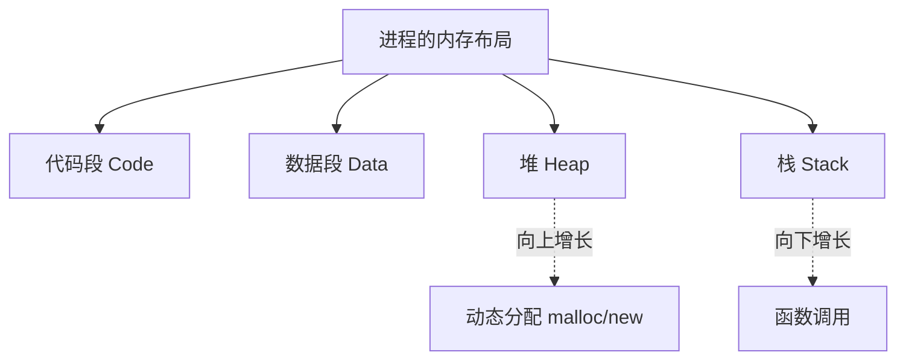
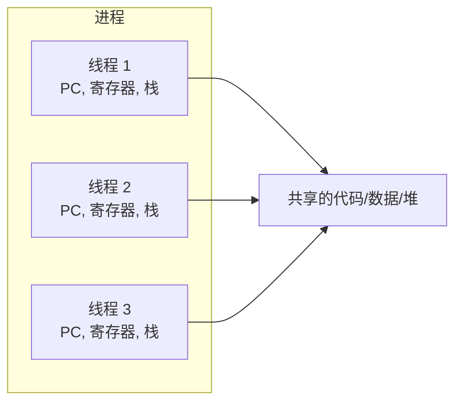
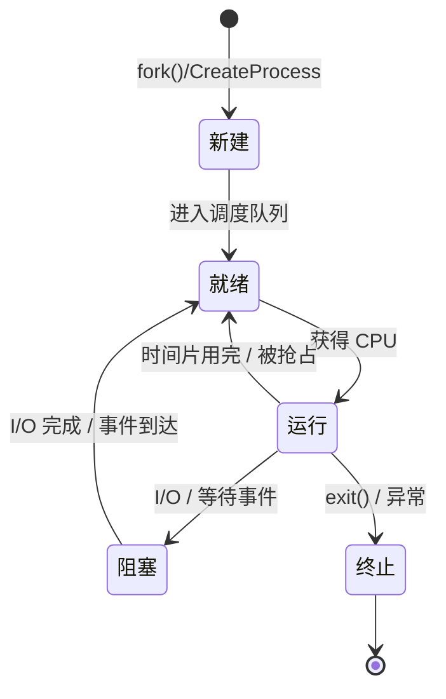
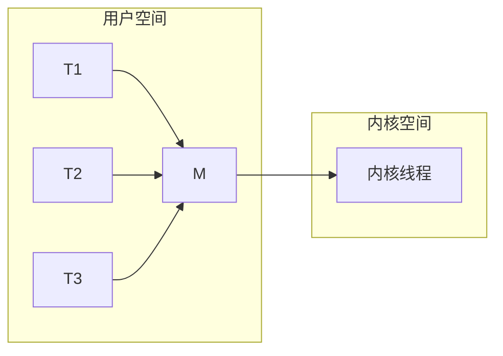
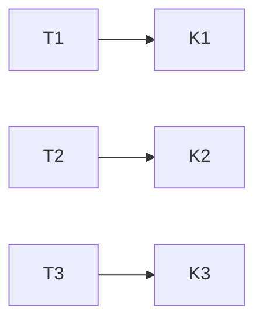

## 什么是进程？

**进程（Process）** 是操作系统进行资源分配和调度的基本单位。你可以把它理解为一个**正在运行中的程序**。

一个进程至少包含：

- **代码段（Code）**：程序的机器指令
- **数据段（Data）**：全局变量和静态变量
- **堆（Heap）**：动态分配的内存
- **栈（Stack）**：函数调用、局部变量
- **进程控制块（PCB）**：操作系统用来管理进程的数据结构



> **关键点**：每个进程拥有独立的地址空间，一个进程崩溃不会影响其他进程。
{: .prompt-info }

---

## 什么是线程？

**线程（Thread）** 是进程内部的执行单元，是 CPU 调度的最小单位。

一个进程可以包含多个线程，它们**共享**进程的代码、数据、堆空间，但**各自拥有**独立的：

- 程序计数器（PC）
- 寄存器集合
- 调用栈



| 维度 | 进程 | 线程 |
|------|------|------|
| **资源拥有者** | 拥有独立内存空间 | 共享进程内存 |
| **切换开销** | 大（需切换页表） | 小（只切换寄存器和栈） |
| **通信方式** | 管道、消息队列、共享内存 | 共享变量（需同步） |
| **健壮性** | 进程间互不影响 | 一个线程崩溃，整个进程挂掉 |

---

## 进程的生命周期

一个进程从创建到消亡，通常经历以下状态：



| 状态 | 含义 |
|------|------|
| **新建** | 进程正在被创建，PCB 已分配但尚未进入就绪队列 |
| **就绪** | 进程已准备好运行，等待 CPU 调度 |
| **运行** | 进程正在 CPU 上执行指令 |
| **阻塞** | 进程因等待某个事件（如 I/O 完成）而暂停运行 |
| **终止** | 进程执行完毕或被强制结束 |

---

## 上下文切换（Context Switch）

当 CPU 从一个进程（或线程）切换到另一个时，需要保存当前进程的**上下文**（寄存器、PC、页表基址等），并加载新进程的上下文。这个过程称为**上下文切换**。

```
切换前 (进程 A 在运行)

  ┌─────────────────────────────┐
  │  PC = 0x12345               │
  │  R0 = 42, R1 = 100          │  ──► 保存到 A 的 PCB
  │  栈指针 SP = 0x7FFE0        │
  └─────────────────────────────┘

          ▼  上下文切换

切换后 (进程 B 开始运行)

  ┌─────────────────────────────┐
  │  PC = 0x8000                 │  ◄── 从 B 的 PCB 恢复
  │  R0 = 7,  R1 = 99           │
  │  栈指针 SP = 0x6FFE0        │
  └─────────────────────────────┘
```

上下文切换的**开销**包括：

1. **保存/恢复寄存器**：纯 CPU 操作，较快
2. **切换页表（进程切换才需要）**：可能导致 TLB 失效，后续内存访问变慢
3. **内核态/用户态切换**：进入和退出内核有开销

> 这就是为什么**线程切换比进程切换快得多**——线程切换不需要切换页表，同一个进程内的线程共享地址空间。
{: .prompt-tip }

---

## 多线程模型

操作系统管理线程有几种常见模型：

### 1. 多对一模型（用户级线程）

多个用户线程映射到一个内核线程。



- **优点**：线程切换在用户态完成，速度快
- **缺点**：一个线程阻塞，整个进程都阻塞；无法利用多核 CPU

### 2. 一对一模型（内核级线程）

每个用户线程对应一个内核线程。



- **优点**：一个线程阻塞不影响其他线程；可真正并行运行在多个 CPU 上
- **缺点**：线程切换需要陷入内核，开销较大

### 3. 多对多模型（混合模型）

多个用户线程多路复用映射到多个内核线程。这是现代操作系统（如 Linux 的 NPTL）采用的思路。

---

## Linux 下的线程实现

在 Linux 中，线程的实现非常有趣——Linux 内核实际上**没有"线程"这个概念**，它把所有执行单元都称为 **task**（任务）。

通过 `clone()` 系统调用可以创建一个新 task，并选择性地共享：

```
CLONE_VM     → 共享地址空间 (内存)
CLONE_FS     → 共享文件系统信息
CLONE_FILES  → 共享打开的文件描述符表
CLONE_SIGHAND→ 共享信号处理器
...
```

- **进程** = 调用 `clone()` 时**不共享**这些资源
- **线程** = 调用 `clone()` 时**共享**这些资源

这就是为什么说 Linux 中进程和线程的区别是**程度问题**，而不是本质区别。

---

## 常见面试问题

**Q1：进程和线程的核心区别是什么？**

> 进程是资源分配的最小单位，线程是 CPU 调度的最小单位。进程拥有独立地址空间，线程共享进程地址空间但拥有独立的栈和寄存器。

**Q2：为什么线程切换比进程切换快？**

> 线程切换不需要切换页表（TLB 不需要刷新），只需要保存和恢复寄存器和栈。而进程切换需要切换整个地址空间，TLB 全部失效导致后续内存访问变慢。

**Q3：多线程一定比单线程快吗？**

> 不一定。如果任务是 CPU 密集型的，且计算量不大，多线程的上下文切换开销可能超过收益。而且如果线程之间存在大量同步操作（锁竞争），反而可能更慢。

**Q4：什么情况下会使用多进程而不是多线程？**

> 当任务之间需要强隔离（例如 Web 服务器的 worker 进程，一个崩溃不影响其他），或者需要利用 fork 的 copy-on-write 语义时，多进程更合适。

---

## 小结

| 概念 | 核心要点 |
|------|---------|
| **进程** | 资源分配单位，独立地址空间 |
| **线程** | CPU 调度单位，共享地址空间 |
| **上下文切换** | 保存/恢复寄存器，进程切换额外需切换页表 |
| **Linux 实现** | 通过 `clone()` 控制资源共享程度，进程/线程都是 task |

理解进程与线程是深入理解并发编程、操作系统内核的基石。下一篇我们将讨论**进程调度算法**。
