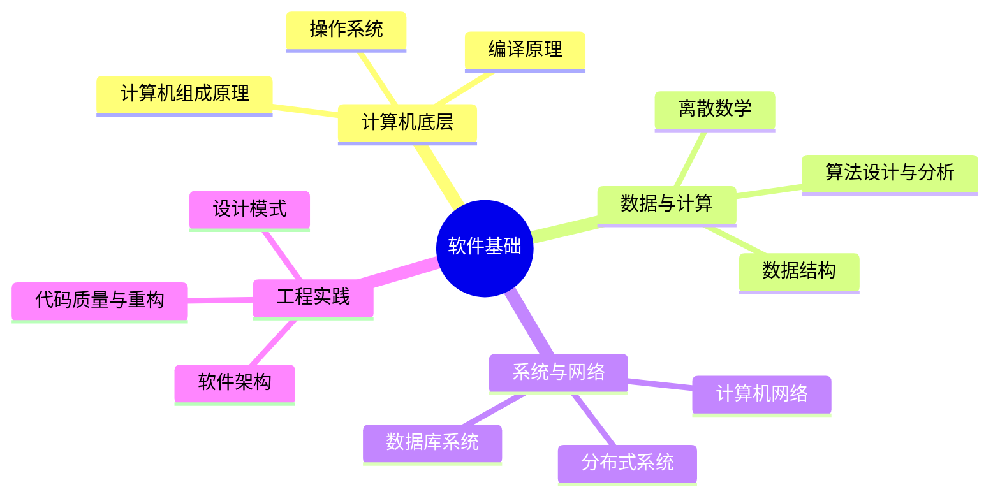
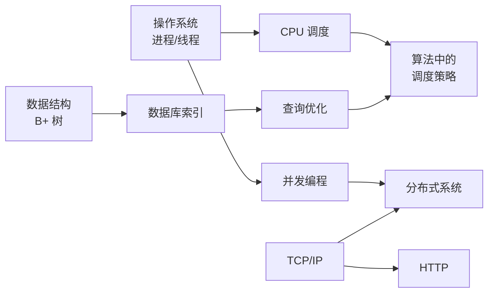

## 为什么要夯实软件基础？

在快速变化的技术浪潮中，框架和工具可能几年就会被淘汰，但那些**底层原理和核心概念**却是几十年不变的。掌握好软件基础，意味着你能：

- **快速上手任何新技术**：所有上层技术都建立在相同的底层原理之上
- **做出更合理的技术决策**：理解 trade-off，而非盲目跟风
- **深入定位和解决复杂问题**：从根源理解，而非停留在表象

> "Treat the root cause, not the symptom." — 找到问题的根源，而不是治标。
{: .prompt-info }

---

## 知识体系总览

软件基础的知识体系可以分为以下几个核心层次：

---

## 入门学习路径

以下是按学习顺序整理的入门文章，建议从上往下依次阅读：

### Step 1：数据结构基础

1. [什么是数据结构](/software-fundamentals/posts/数据结构入门-什么是数据结构/) — 理解数据结构的基本概念和分类
2. [List、Map、Set 三大容器详解](/software-fundamentals/posts/数据结构入门-List与Map和Set/) — 认识最常用的数据结构
3. [C语言结构体与数据嵌套](/software-fundamentals/posts/数据结构入门-C语言结构体与数据嵌套/) — 从底层理解数据组织
4. [数据结构的嵌套与组合](/software-fundamentals/posts/数据结构入门-数据结构的嵌套与组合/) — 复杂数据的组织方式

### Step 2：数据库基础

5. [理解数据库的基本概念](/software-fundamentals/posts/数据库入门-理解数据库的基本概念/) — 什么是数据库？从通讯录说起
6. [三范式与数据库设计](/software-fundamentals/posts/数据库入门-三范式与数据库设计/) — 如何设计合理的数据库表结构
7. [电商系统数据库设计实战](/software-fundamentals/posts/数据库入门-电商系统数据库设计实战/) — 从需求到表结构的完整实践

### Step 3：扩展阅读

完成上述入门内容后，可以深入学习各领域的进阶文章：

| 领域 | 推荐学习方向 |
|------|-------------|
| 数据结构 | 链表 → 栈与队列 → 二叉树 → 哈希表 → 图算法 |
| 数据库 | MySQL架构 → 索引原理 → 事务隔离 → 性能优化 |
| 操作系统 | 进程线程 → 内存管理 → 文件系统 → 网络IO |
| 计算机网络 | TCP/IP模型 → HTTP → HTTPS → TCP深入 |

---

## 学习方法论

### 1. 费曼学习法

用最简单的语言解释复杂概念。如果你无法用几句话让一个外行听懂，说明你自己还没真正理解。

### 2. 做中学（Learning by Doing）

- **动手实现**：手写一个简单的哈希表、一个迷你 HTTP 服务器、一个玩具数据库
- **阅读源码**：从经典项目中学习架构设计
- **写博客**：教是最好的学

### 3. 刻意练习

> 重复的经验不等于有效的练习。
{: .prompt-warning }

- 针对薄弱环节专项训练
- 跳出舒适区，挑战略高于当前水平的问题
- 获得及时反馈（代码评审、算法题提交结果）

### 4. 建立知识网络

知识不是孤立的点，而是相互连接的网络。例如：

---

## 学习资源推荐

### 书籍（经典中的经典）

| 领域 | 书名 | 特点 |
|------|------|------|
| 操作系统 | 《深入理解计算机系统》(CSAPP) | 从程序员视角理解系统 |
| 算法 | 《算法导论》(CLRS) | 理论严谨，数学推导详尽 |
| 算法 | 《算法》(Sedgewick) | 更工程导向，Java 实现 |
| 网络 | 《计算机网络：自顶向下方法》 | 从应用层开始，容易入门 |
| 数据库 | 《数据库系统概念》 | 全面的数据库理论教材 |
| 编译原理 | 《编译原理》(Dragon Book) | 编译原理的"圣经" |
| 工程 | 《设计数据密集型应用》(DDIA) | 现代系统设计的必读 |
| 工程 | 《重构》| 改善既有代码的设计 |
| 工程 | 《代码大全》| 软件构建的百科全书 |

### 在线课程

- **MIT 6.828** — 操作系统工程
- **MIT 6.824** — 分布式系统
- **Stanford CS 144** — 计算机网络（实现 TCP）
- **CMU 15-445** — 数据库系统（实现一个简单数据库）

### 练习平台

- **LeetCode** — 数据结构与算法练习
- **代码随想录** — 结构化的算法题路线
- **Lab 练习** — 各类开源课程的 Lab 作业

---

## 时间管理建议

### 每日节奏

- **30 分钟阅读**：精读经典书籍的一小节
- **30 分钟练习**：1-2 道算法题或动手实验
- **30 分钟写作**：用自己的话总结当天所学

### 长期规划

| 时间 | 目标 |
|------|------|
| 第 1-3 个月 | 数据结构与算法打基础 |
| 第 2-6 个月 | 操作系统 + 计算机网络 |
| 第 4-9 个月 | 数据库系统 + 编译原理 |
| 第 6-12 个月 | 分布式系统 + 软件架构 |

> 学习没有捷径，但有方法。坚持比冲刺更重要。
{: .prompt-tip }

---

## 写在最后

本站是我的学习笔记整理，也是我的费曼输出。每一篇文章都是我试图用自己的语言解释一个概念的过程。

如果你发现错误或有不同的见解，欢迎通过邮件或 GitHub 与我交流。让我们一起夯实根基，理解本质。

<a class='context-link prev' href='/software-fundamentals/posts/数据结构入门-数据结构的嵌套与组合/'>上一篇数据结构入门：数据结构的嵌套与组合</a>
<a class='context-link next disabled'>下一篇暂无</a>

