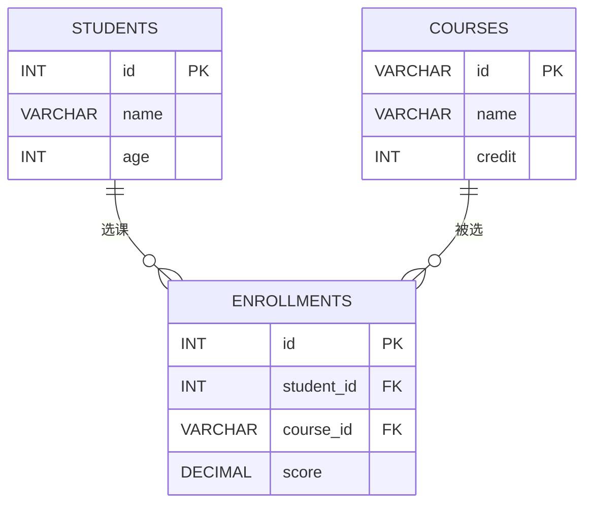
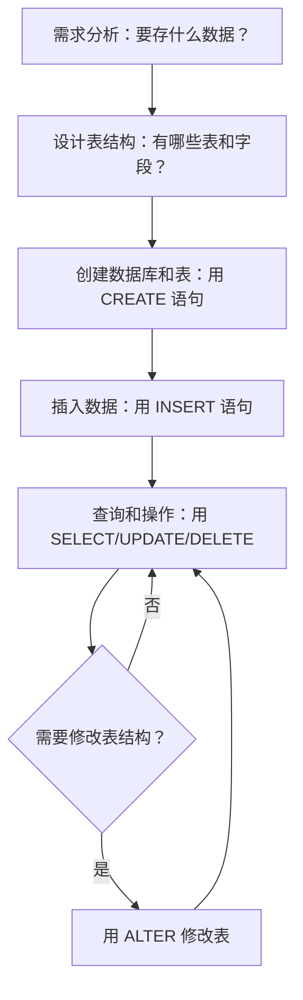

## 什么是数据库？从通讯录说起

你手机里一定有一个通讯录吧？里面存着每个联系人的姓名、电话、备注等信息。通讯录就是一个最简单的"数据库"——它**有组织地存储数据**，方便你随时查找、添加、修改和删除。

再想想你用过的 Excel 表格。比如你用一张表格记录自己的月度开销：

| 日期       | 类别   | 金额  | 备注     |
| ---------- | ------ | ----- | -------- |
| 2026-06-01 | 餐饮   | 35.5  | 午餐     |
| 2026-06-02 | 交通   | 6.0   | 地铁     |
| 2026-06-03 | 购物   | 199.0 | 买书     |

Excel 表格也是一种"数据库"的雏形。但当我们需要应对更复杂的场景时，Excel 就力不从心了。

**数据库（Database）** 就是一个有组织地存储和管理数据的系统，它能高效地处理大量数据，并支持多人同时使用。

## 数据库 vs Excel：为什么不用表格就够了？

很多人会问：我直接用 Excel 存数据不就行了吗？确实，对于个人小项目，Excel 完全够用。但当数据量变大、使用人数变多时，数据库的优势就体现出来了：

| 对比维度   | Excel                          | 数据库                              |
| ---------- | ------------------------------ | ----------------------------------- |
| 多人并发   | 一个人编辑时别人只能只读        | 支持成百上千人同时读写              |
| 数据量     | 几万行就开始卡顿               | 百万、千万行也能快速查询            |
| 查询速度   | 全表扫描，越查越慢             | 有索引机制，秒级返回结果            |
| 安全性     | 文件容易被复制、误删           | 有权限控制、备份恢复机制            |
| 数据一致性 | 手动输入容易出错               | 有约束和校验，保证数据准确          |
| 自动化     | 需要手动操作                   | 可以用程序自动增删改查              |

打个比方：Excel 就像一个小本子，你自己记东西没问题；数据库就像一个图书馆系统，有成千上万的人同时借书还书，还能保证不乱套。

## 关系型数据库的核心概念

目前最常用的数据库类型叫**关系型数据库**（Relational Database），它的核心思想是用"表"来组织数据，表与表之间通过"关系"连接。

### 表（Table）—— 就像一张 Excel 工作表

表是存储数据的基本单位。比如"学生表"：

| 学号   | 姓名 | 性别 | 年龄 |
| ------ | ---- | ---- | ---- |
| 1001   | 小明 | 男   | 20   |
| 1002   | 小红 | 女   | 19   |
| 1003   | 小刚 | 男   | 21   |

### 行（Row）和列（Column）

- **行**（也叫记录 Record）：表中的一行数据，比如"1001, 小明, 男, 20"就是一条记录
- **列**（也叫字段 Field）：表中的一列，比如"姓名"就是一个字段

类比一下：如果把表比作一个通讯录，每一行就是一个人的信息卡片，每一列就是卡片上的一个栏目（姓名、电话等）。

### 主键（Primary Key）—— 每条记录的"身份证号"

主键是表中用来**唯一标识**每一行记录的字段。就像每个人的身份证号不会重复一样，主键的值也不能重复。

在上面的学生表中，**学号**就是主键，因为每个学生的学号是唯一的。姓名不能做主键，因为可能有重名。

### 外键（Foreign Key）—— 表与表之间的"桥梁"

外键是用来建立表与表之间关联的字段。它指向另一张表的主键，就像你通讯录里存了朋友的手机号，通过手机号就能找到那个人的详细信息。

## 实战场景：学生选课系统

让我们用"学生选课"这个场景来理解这些概念。一个学校需要管理学生、课程和选课信息，我们需要三张表：

**学生表（students）**

| 学号 (id) | 姓名 (name) | 年龄 (age) |
| --------- | ----------- | ---------- |
| 1001      | 小明        | 20         |
| 1002      | 小红        | 19         |

**课程表（courses）**

| 课程号 (id) | 课程名 (name) | 学分 (credit) |
| ----------- | ------------- | ------------- |
| C01         | 高等数学      | 4             |
| C02         | 英语          | 3             |

**选课表（enrollments）**

| 选课id (id) | 学号 (student_id) | 课程号 (course_id) | 成绩 (score) |
| ----------- | ----------------- | ------------------ | ------------ |
| 1           | 1001              | C01                | 85           |
| 2           | 1001              | C02                | 90           |
| 3           | 1002              | C02                | 88           |

选课表中的 `student_id` 指向学生表的学号，`course_id` 指向课程表的课程号，这就是**外键**的作用——把三张表关联起来。

下面是学生与课程的 ER 图（实体关系图）：



## SQL：和数据库对话的语言

**SQL**（Structured Query Language，结构化查询语言）就是你和数据库"说话"的方式。你用 SQL 告诉数据库你想做什么，数据库就会执行并返回结果。

SQL 有四种最基本的操作，简称 **CRUD**：

| 操作         | SQL关键字  | 生活类比           |
| ------------ | ---------- | ------------------ |
| 查（Read）   | SELECT     | 在通讯录里找人     |
| 增（Create） | INSERT     | 在通讯录里加新人   |
| 改（Update） | UPDATE     | 修改联系人的电话   |
| 删（Delete） | DELETE     | 从通讯录删掉某人   |

### SELECT —— 查询数据

```sql
-- 查询所有学生
SELECT * FROM students;

-- 查询年龄大于19的学生
SELECT name, age FROM students WHERE age > 19;

-- 查询小明选了哪些课
SELECT c.name, e.score
FROM enrollments e
JOIN courses c ON e.course_id = c.id
JOIN students s ON e.student_id = s.id
WHERE s.name = '小明';
```

### INSERT —— 插入数据

```sql
-- 添加一个新学生
INSERT INTO students (id, name, age)
VALUES (1003, '小刚', 21);

-- 小红选了高等数学
INSERT INTO enrollments (id, student_id, course_id, score)
VALUES (4, 1002, 'C01', 92);
```

### UPDATE —— 修改数据

```sql
-- 小明过生日了，年龄+1
UPDATE students SET age = 21 WHERE id = 1001;

-- 修改小红的英语成绩
UPDATE enrollments SET score = 95
WHERE student_id = 1002 AND course_id = 'C02';
```

### DELETE —— 删除数据

```sql
-- 小刚退学了，删除他的记录
DELETE FROM students WHERE id = 1003;

-- 删除所有不及格的选课记录
DELETE FROM enrollments WHERE score < 60;
```

> ⚠️ **注意**：DELETE 和 UPDATE 一定要加 WHERE 条件！不加 WHERE 就是删除或修改全部数据，这是新手最容易犯的错误。
{: .prompt-danger }

## 常见数据库对比

市面上有很多数据库产品，它们各有特点：

| 数据库       | 特点                           | 适用场景                       | 是否免费   |
| ------------ | ------------------------------ | ------------------------------ | ---------- |
| MySQL        | 最流行的开源数据库，社区活跃    | Web应用、中小型项目            | ✅ 免费    |
| PostgreSQL   | 功能最强大的开源数据库          | 复杂查询、地理数据、大型项目   | ✅ 免费    |
| SQLite       | 轻量级，整个数据库就是一个文件  | 手机App、小型工具、嵌入式设备  | ✅ 免费    |
| Oracle       | 企业级数据库，功能最全          | 银行、电信等大型企业系统       | ❌ 收费    |

打个比方：
- **SQLite** 像自行车——轻便、免费、随骑随走，适合短途
- **MySQL** 像家用轿车——经济实惠、用途广泛、大多数人首选
- **PostgreSQL** 像越野车——功能强大、能应对复杂路况
- **Oracle** 像豪华大巴——贵但可靠，适合大规模运输

对于初学者，推荐从 **MySQL** 或 **SQLite** 开始学习。

## 数据类型入门

数据库中每个字段都需要指定数据类型，就像 Excel 中你可以设置某列是"数字"还是"日期"一样。常见的数据类型有：

| 数据类型       | 说明           | 例子                     |
| -------------- | -------------- | ------------------------ |
| INT            | 整数           | 年龄：20，数量：100      |
| VARCHAR(n)     | 变长字符串     | 姓名：'小明'，最多n个字符 |
| DATE           | 日期           | 生日：2005-03-15         |
| DECIMAL(p,s)   | 精确小数       | 价格：19.99，p位总长s位小数 |
| BOOLEAN        | 布尔值         | 是否会员：TRUE/FALSE     |
| TEXT           | 长文本         | 文章内容、备注           |

```sql
-- 创建学生表时指定数据类型
CREATE TABLE students (
    id INT PRIMARY KEY,
    name VARCHAR(50) NOT NULL,
    age INT,
    birthday DATE,
    gpa DECIMAL(3, 2)
);
```

选择正确的数据类型很重要，它决定了：
1. **存储空间**：用 INT 存年龄只需4字节，用 VARCHAR 就浪费空间
2. **查询效率**：类型正确才能利用索引加速查询
3. **数据校验**：类型本身就能防止一些错误输入（比如往年龄字段写"abc"会被拒绝）

## 数据库操作的整体流程

让我们用一个流程图来总结一下使用数据库的完整过程：



## 小结

这篇文章我们学习了：

1. **数据库**是有组织地存储和管理数据的系统，比 Excel 更强大
2. **关系型数据库**用"表"来组织数据，核心概念包括表、行、列、主键、外键
3. **SQL**是与数据库对话的语言，四种基本操作：SELECT、INSERT、UPDATE、DELETE
4. **常见数据库**各有特点，初学者推荐 MySQL 或 SQLite
5. **数据类型**帮助数据库高效存储和校验数据

> 💡 **学习建议**：光看不练是学不会的！建议安装一个 MySQL 或 SQLite，把本文的 SQL 语句都敲一遍，亲手操作才能加深理解。
{: .prompt-tip }

下一篇我们将学习**三范式与数据库设计**，看看如何设计出"不乱套"的表结构。
