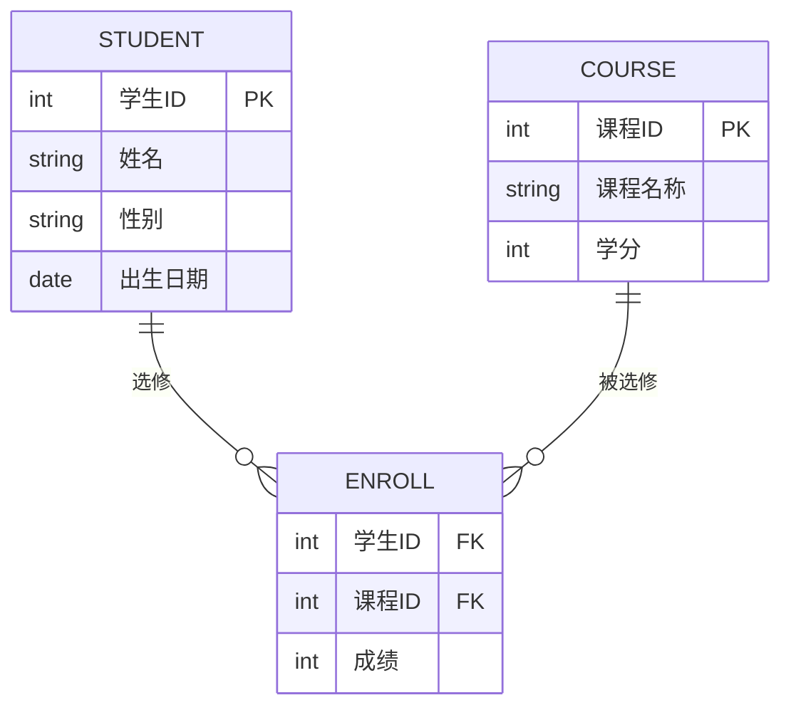
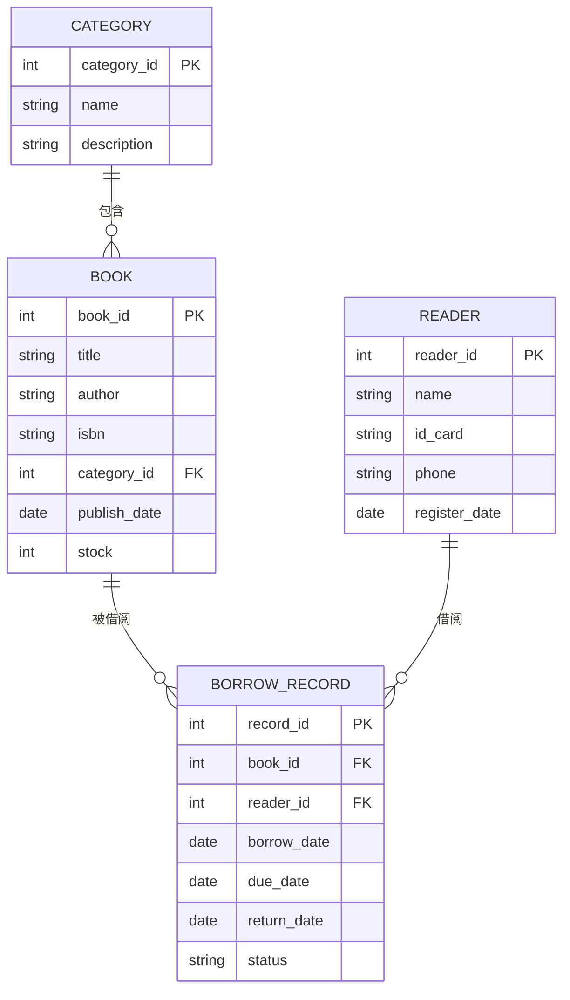

## 数据库设计基础

数据库设计是构建高效、可维护数据库系统的核心环节。一个好的数据库设计可以避免数据冗余、保证数据一致性，并提高查询效率。

## 一、数据库设计的基本原则

### 1.1 数据完整性

数据完整性是指数据库中的数据必须准确、一致且符合预期。主要包括：

- **实体完整性**：每个表必须有主键，主键值唯一且非空
- **域完整性**：列的数据类型、格式、范围必须符合定义
- **参照完整性**：外键必须引用存在的主键值
- **用户定义完整性**：根据业务规则定义的约束

### 1.2 规范化与反规范化

- **规范化**：通过分解表消除数据冗余，提高数据一致性
- **反规范化**：为了提高查询性能，有意引入冗余数据

## 二、三大范式详解

### 2.1 第一范式 (1NF)

**定义**：每个列都是原子的，不可再分。

**要求**：
- 每一列的值必须是单一值
- 同一列不能有多个值
- 不能有重复的列组

**反例**：

| 学生ID | 姓名 | 课程 |
|--------|------|------|
| 1 | 张三 | 数学,英语 |

**正例**：

| 学生ID | 姓名 | 课程 |
|--------|------|------|
| 1 | 张三 | 数学 |
| 1 | 张三 | 英语 |

### 2.2 第二范式 (2NF)

**定义**：在第一范式的基础上，非主键列必须完全依赖于整个主键。

**要求**：
- 满足1NF
- 非主键列必须依赖于整个主键，而不是主键的一部分

**反例**（复合主键：学生ID + 课程ID）：

| 学生ID | 课程ID | 学生姓名 | 课程名称 | 成绩 |
|--------|--------|----------|----------|------|
| 1 | 101 | 张三 | 数学 | 90 |

**问题**：学生姓名只依赖于学生ID，课程名称只依赖于课程ID，不满足2NF。

**正例**：

**学生表**：

| 学生ID | 学生姓名 |
|--------|----------|
| 1 | 张三 |

**课程表**：

| 课程ID | 课程名称 |
|--------|----------|
| 101 | 数学 |

**成绩表**：

| 学生ID | 课程ID | 成绩 |
|--------|--------|------|
| 1 | 101 | 90 |

### 2.3 第三范式 (3NF)

**定义**：在第二范式的基础上，非主键列不能依赖于其他非主键列（消除传递依赖）。

**要求**：
- 满足2NF
- 非主键列之间不能有依赖关系

**反例**：

| 学生ID | 学生姓名 | 班级ID | 班级名称 |
|--------|----------|--------|----------|
| 1 | 张三 | 1 | 一班 |

**问题**：班级名称依赖于班级ID，而班级ID是非主键列，存在传递依赖。

**正例**：

**学生表**：

| 学生ID | 学生姓名 | 班级ID |
|--------|----------|--------|
| 1 | 张三 | 1 |

**班级表**：

| 班级ID | 班级名称 |
|--------|----------|
| 1 | 一班 |

## 三、BC范式 (BCNF)

### 3.1 定义

BCNF是第三范式的增强版本，要求在关系模式中，每一个决定因素都包含候选键。

### 3.2 与3NF的区别

3NF只要求非主键列不能依赖于其他非主键列，但BCNF要求所有依赖关系的左边都必须是候选键。

**示例**：

假设有关系模式：教师(教师ID, 课程ID, 系别)

如果一个教师只属于一个系，一个系有多个教师，一门课程只由一个系的教师教授。

- 函数依赖：教师ID → 系别，课程ID → 系别
- 候选键：(教师ID, 课程ID)

这个关系满足3NF，但不满足BCNF，因为系别依赖于教师ID或课程ID，而教师ID和课程ID都不是候选键。

## 四、数据库设计步骤

### 4.1 需求分析

- 确定业务需求
- 识别实体和属性
- 确定业务规则

### 4.2 概念设计

使用ER图表示实体、属性和关系：

### 4.3 逻辑设计

将ER图转换为关系模式，应用规范化规则。

### 4.4 物理设计

- 选择存储引擎
- 创建索引
- 优化表结构

## 五、设计示例：图书馆管理系统

### 5.1 需求分析

图书馆需要管理：
- 图书信息（书名、作者、ISBN、分类）
- 读者信息（姓名、身份证号、联系方式）
- 借阅记录（借阅日期、归还日期、状态）

### 5.2 关系模式

**图书表 (books)**：

| 字段名 | 类型 | 约束 | 说明 |
|--------|------|------|------|
| book_id | INT | PRIMARY KEY, AUTO_INCREMENT | 图书ID |
| title | VARCHAR(200) | NOT NULL | 书名 |
| author | VARCHAR(100) | NOT NULL | 作者 |
| isbn | VARCHAR(20) | UNIQUE | ISBN号 |
| category_id | INT | FOREIGN KEY | 分类ID |
| publish_date | DATE | | 出版日期 |
| stock | INT | DEFAULT 0 | 库存数量 |

**分类表 (categories)**：

| 字段名 | 类型 | 约束 | 说明 |
|--------|------|------|------|
| category_id | INT | PRIMARY KEY, AUTO_INCREMENT | 分类ID |
| name | VARCHAR(50) | NOT NULL | 分类名称 |
| description | VARCHAR(200) | | 分类描述 |

**读者表 (readers)**：

| 字段名 | 类型 | 约束 | 说明 |
|--------|------|------|------|
| reader_id | INT | PRIMARY KEY, AUTO_INCREMENT | 读者ID |
| name | VARCHAR(50) | NOT NULL | 姓名 |
| id_card | VARCHAR(18) | UNIQUE | 身份证号 |
| phone | VARCHAR(20) | | 联系电话 |
| register_date | DATE | NOT NULL | 注册日期 |

**借阅记录表 (borrow_records)**：

| 字段名 | 类型 | 约束 | 说明 |
|--------|------|------|------|
| record_id | INT | PRIMARY KEY, AUTO_INCREMENT | 记录ID |
| book_id | INT | FOREIGN KEY | 图书ID |
| reader_id | INT | FOREIGN KEY | 读者ID |
| borrow_date | DATE | NOT NULL | 借阅日期 |
| due_date | DATE | NOT NULL | 应还日期 |
| return_date | DATE | | 实际归还日期 |
| status | ENUM | DEFAULT 'borrowed' | 状态 |

### 5.3 ER图

## 六、常见设计误区

### 6.1 误区一：过度规范化

过度规范化会导致查询时需要多次JOIN，降低查询性能。

### 6.2 误区二：忽视索引

没有索引或索引过多都会影响性能。

### 6.3 误区三：缺乏备份策略

没有备份或备份策略不完善会导致数据丢失风险。

### 6.4 误区四：忽视扩展性

没有考虑未来业务扩展会导致后期重构困难。

## 七、总结

数据库设计是一个平衡的艺术，需要在规范化与性能之间找到平衡点：

1. **遵循三大范式**可以保证数据一致性，减少冗余
2. **适当反规范化**可以提高查询性能
3. **合理设计索引**可以显著提升查询速度
4. **考虑扩展性**可以避免后期重构的痛苦

好的数据库设计是系统成功的基础，需要仔细分析需求、理解业务，并应用规范化原则。

<a class='context-link prev disabled'>上一篇暂无</a>
<a class='context-link next' href='/software-fundamentals/posts/数据库入门-理解数据库的基本概念/'>下一篇数据库入门：理解数据库的基本概念</a>

