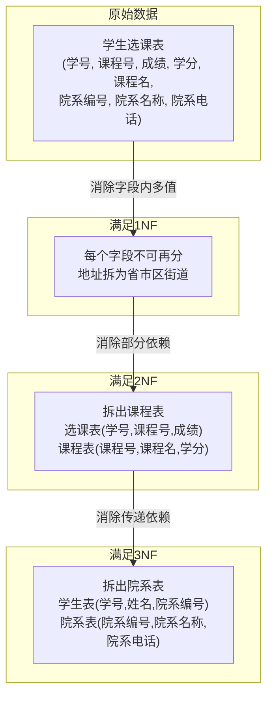

## 为什么需要范式？从"重复写地址"说起

想象这样一个场景：你在一家公司上班，公司有一个员工信息表，每个人的地址是这么记录的——

| 员工编号 | 姓名 | 地址                           |
| -------- | ---- | ------------------------------ |
| E001     | 张三 | 北京市海淀区中关村大街1号       |
| E002     | 李四 | 北京市海淀区中关村大街1号       |
| E003     | 王五 | 北京市海淀区中关村大街1号       |
| E004     | 赵六 | 北京市朝阳区建国门外大街2号     |

发现问题了吗？张三、李四、王五住在同一个地址，但这个地址被**写了三遍**！

这会带来什么麻烦？

1. **浪费空间**：同样的地址存了好几遍
2. **更新困难**：如果公司搬家了，你要把三行的地址都改掉，万一漏改了一行呢？
3. **数据不一致**：张三的地址改了，李四的忘了改，两个人的地址就不一样了

这就是**数据冗余**带来的问题。**数据库范式**就是一套规则，帮我们设计出"不冗余、不混乱"的表结构。

## 三范式的递进关系

三范式是一层一层递进的，满足后面的范式必须先满足前面的：


下面我们逐个讲解。

## 第一范式（1NF）：字段不可再分

### 核心规则

**每个字段只能存储一个值，不能再拆分成更小的部分。**

就像你去填表格，"姓名"栏只能写一个名字，不能写"张三、李四、王五"三个人的名字。

### 反例1：地址字段存了多个信息

❌ **错误设计**：

| 员工编号 | 姓名 | 地址                           |
| -------- | ---- | ------------------------------ |
| E001     | 张三 | 北京市海淀区中关村大街1号       |

"地址"这个字段实际上包含了省、市、区、街道四个信息，混在一起了。如果你只想查"海淀区有多少员工"，就很难查。

✅ **正确设计**：

| 员工编号 | 姓名 | 省   | 市   | 区     | 街道           |
| -------- | ---- | ---- | ---- | ------ | -------------- |
| E001     | 张三 | 北京 | 北京 | 海淀区 | 中关村大街1号   |

拆分后，你可以轻松地按省、市、区来查询和统计。

### 反例2：爱好字段存了多个值

❌ **错误设计**：

| 学号 | 姓名 | 爱好               |
| ---- | ---- | ------------------ |
| 1001 | 小明 | 篮球,足球,游泳     |
| 1002 | 小红 | 画画               |

"爱好"字段存了用逗号分隔的多个值。如果你想查"喜欢篮球的有几个人"，就得用模糊匹配，既慢又不准确。

✅ **正确设计**（方案一：拆成多行）：

| 学号 | 姓名 | 爱好   |
| ---- | ---- | ------ |
| 1001 | 小明 | 篮球   |
| 1001 | 小明 | 足球   |
| 1001 | 小明 | 游泳   |
| 1002 | 小红 | 画画   |

✅ **正确设计**（方案二：单独建爱好表）：

**学生表**

| 学号 | 姓名 |
| ---- | ---- |
| 1001 | 小明 |
| 1002 | 小红 |

**爱好表**

| 学号 | 爱好   |
| ---- | ------ |
| 1001 | 篮球   |
| 1001 | 足球   |
| 1001 | 游泳   |
| 1002 | 画画   |

方案二更规范，也是实际项目中更常用的做法。

### 1NF 小结

> **1NF 的核心**：一个格子只存一个值，不要把多个信息塞进一个字段里。

## 第二范式（2NF）：不部分依赖

### 核心规则

**在满足1NF的基础上，非主键字段必须完全依赖主键，不能只依赖主键的一部分。**

这条规则只对**复合主键**（由多个字段组成的主键）有意义。如果表只有一个主键字段，天然就满足2NF。

### 生活类比

想象你的身份证号是由"省份代码+出生日期+顺序码"组成的。如果你的某个属性只跟"省份代码"有关，而跟"出生日期"无关，那就是"部分依赖"——它只依赖了主键的一部分。

### 反例：学生选课表

❌ **错误设计**：

| 学号 (student_id) | 课程号 (course_id) | 成绩 (score) | 学分 (credit) | 课程名 (course_name) |
| ----------------- | ------------------ | ------------ | ------------- | -------------------- |
| 1001              | C01                | 85           | 4             | 高等数学              |
| 1001              | C02                | 90           | 3             | 英语                 |
| 1002              | C01                | 78           | 4             | 高等数学              |

这个表的主键是 **(学号, 课程号)** 的组合，因为只有同时知道学号和课程号才能确定一条记录。

问题分析：
- **成绩**：既依赖学号又依赖课程号 → ✅ 完全依赖主键
- **学分**：只依赖课程号，跟学号无关 → ❌ 部分依赖！
- **课程名**：只依赖课程号，跟学号无关 → ❌ 部分依赖！

这会导致什么问题？
- 高等数学的学分是4，但在表中出现了两次（1001选C01和1002选C01），如果学分要改成3.5，你得改两行
- 如果没人选某门课，那门课的学分就无处记录了

✅ **正确设计**：拆成两张表

**选课表**（主键：学号+课程号）

| 学号 (student_id) | 课程号 (course_id) | 成绩 (score) |
| ----------------- | ------------------ | ------------ |
| 1001              | C01                | 85           |
| 1001              | C02                | 90           |
| 1002              | C01                | 78           |

**课程表**（主键：课程号）

| 课程号 (course_id) | 课程名 (course_name) | 学分 (credit) |
| ------------------ | -------------------- | ------------- |
| C01                | 高等数学              | 4             |
| C02                | 英语                 | 3             |

拆分后，学分和课程名只存一份，修改也只需改一行。

### 2NF 小结

> **2NF 的核心**：如果主键是多个字段组合，那其他字段必须跟主键的所有部分都有关，不能只跟一部分有关。

## 第三范式（3NF）：不传递依赖

### 核心规则

**在满足2NF的基础上，非主键字段不能间接依赖主键（即不能A→B→C，其中A是主键）。**

### 生活类比

你认识张三，张三认识李四，但你并不直接认识李四。你通过张三才能找到李四，这就是"传递依赖"。

### 反例：学生表

❌ **错误设计**：

| 学号 (id) | 姓名 (name) | 院系编号 (dept_id) | 院系名称 (dept_name) | 院系电话 (dept_phone) |
| --------- | ----------- | ------------------ | -------------------- | --------------------- |
| 1001      | 小明        | D01                | 计算机学院            | 010-1234              |
| 1002      | 小红        | D01                | 计算机学院            | 010-1234              |
| 1003      | 小刚        | D02                | 数学学院              | 010-5678              |

问题分析：
- 学号 → 院系编号 → 院系名称、院系电话
- 院系名称和院系电话是通过院系编号**间接依赖**学号的
- 计算机学院的信息出现了两次，如果学院改名或换电话，要改多行

✅ **正确设计**：拆成两张表

**学生表**

| 学号 (id) | 姓名 (name) | 院系编号 (dept_id) |
| --------- | ----------- | ------------------ |
| 1001      | 小明        | D01                |
| 1002      | 小红        | D01                |
| 1003      | 小刚        | D02                |

**院系表**

| 院系编号 (id) | 院系名称 (name) | 院系电话 (phone) |
| ------------- | --------------- | ---------------- |
| D01           | 计算机学院       | 010-1234         |
| D02           | 数学学院         | 010-5678         |

拆分后，院系信息只存一份，修改也只需改一行。

### 3NF 小结

> **3NF 的核心**：非主键字段必须直接依赖主键，不能通过另一个非主键字段间接依赖。

## 三范式完整对比

| 范式 | 核心要求           | 生活类比                       | 解决的问题     |
| ---- | ------------------ | ------------------------------ | -------------- |
| 1NF  | 字段不可再分       | 一个格子只填一个答案           | 消除字段内冗余 |
| 2NF  | 不部分依赖主键     | 不能只跟身份证号的一部分有关   | 消除部分冗余   |
| 3NF  | 不传递依赖主键     | 不能通过中间人找到信息         | 消除间接冗余   |

下面用一个图来展示从原始数据到满足三范式的演进过程：



## 什么时候可以违反范式？

范式是指导原则，不是铁律。在实际项目中，有时候为了**性能**，我们会故意违反范式，这叫**反范式设计（Denormalization）**。

### 适合反范式的场景

| 场景               | 说明                                       | 例子                                 |
| ------------------ | ------------------------------------------ | ------------------------------------ |
| 读多写少           | 查询频繁但修改很少，冗余可以减少JOIN操作    | 电商商品列表直接存分类名称           |
| 性能优先           | 高并发场景下，减少表关联能大幅提升速度      | 论坛帖子直接存作者昵称               |
| 统计报表           | 复杂统计查询需要关联很多表，冗余可以加速    | 订单表冗余用户名用于报表             |
| 历史快照           | 需要保留某个时间点的数据状态                | 订单明细冗余下单时的商品价格         |

### 反范式的代价

反范式不是免费的午餐，它带来的代价包括：

1. **更新复杂**：冗余数据需要在多处同步更新
2. **存储增加**：同样的数据存了多份，占用更多空间
3. **一致性风险**：如果更新遗漏，会导致数据不一致

> 💡 **建议**：先按范式设计，遇到性能瓶颈时再考虑反范式。就像盖房子，先按规范建好，再根据需要改造。
{: .prompt-tip }

## 三范式核心口诀

最后，记住这个口诀，三范式就不难了：

> **1NF 不可拆，2NF 不部分依赖，3NF 不传递依赖**

用代码来回顾一下三范式的拆分过程：

```sql
-- ❌ 违反所有范式的原始表
CREATE TABLE bad_design (
    student_id INT,
    student_name VARCHAR(50),
    course_id VARCHAR(10),
    course_name VARCHAR(100),
    credit INT,
    score DECIMAL(5,2),
    dept_id VARCHAR(10),
    dept_name VARCHAR(100),
    dept_phone VARCHAR(20),
    -- 复合主键
    PRIMARY KEY (student_id, course_id)
);

-- ✅ 满足3NF的拆分设计

-- 学生表
CREATE TABLE students (
    id INT PRIMARY KEY,
    name VARCHAR(50) NOT NULL,
    dept_id VARCHAR(10),
    FOREIGN KEY (dept_id) REFERENCES departments(id)
);

-- 院系表（解决3NF传递依赖）
CREATE TABLE departments (
    id VARCHAR(10) PRIMARY KEY,
    name VARCHAR(100) NOT NULL,
    phone VARCHAR(20)
);

-- 课程表（解决2NF部分依赖）
CREATE TABLE courses (
    id VARCHAR(10) PRIMARY KEY,
    name VARCHAR(100) NOT NULL,
    credit INT NOT NULL,
    dept_id VARCHAR(10),
    FOREIGN KEY (dept_id) REFERENCES departments(id)
);

-- 选课表
CREATE TABLE enrollments (
    student_id INT,
    course_id VARCHAR(10),
    score DECIMAL(5,2),
    PRIMARY KEY (student_id, course_id),
    FOREIGN KEY (student_id) REFERENCES students(id),
    FOREIGN KEY (course_id) REFERENCES courses(id)
);
```

## 小结

这篇文章我们学习了：

1. **数据冗余**会导致更新困难、数据不一致等问题
2. **1NF**：字段不可再分，一个格子只存一个值
3. **2NF**：非主键字段必须完全依赖主键，不能只依赖一部分
4. **3NF**：非主键字段必须直接依赖主键，不能间接依赖
5. **反范式设计**在特定场景下是合理的，但要清楚它的代价

> 🎯 **核心口诀**：1NF 不可拆、2NF 不部分依赖、3NF 不传递依赖

下一篇我们将用三范式的知识来**实战设计一个电商系统的数据库**，敬请期待！
