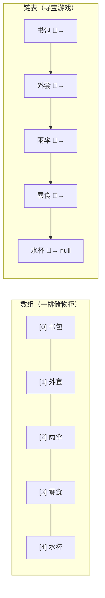
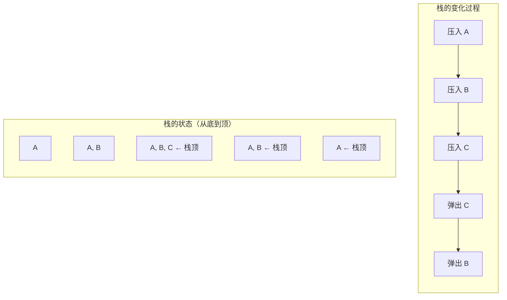
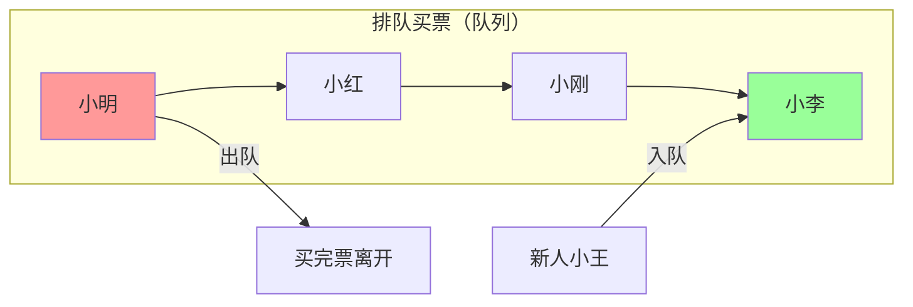
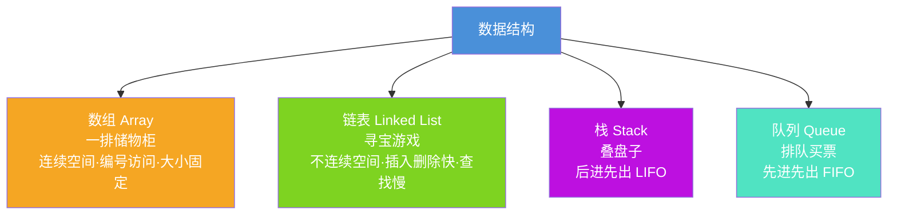

## 从超市货架说起

想象你走进一家超市，想买一瓶酱油。如果所有商品都堆在一起，找一瓶酱油可能要翻遍整个超市；但如果调味品放在A区3号货架，你几秒钟就能找到。**同样的商品，不同的摆放方式，找东西的速度天差地别。**

这就是数据结构的核心思想——**数据怎么组织，决定了操作数据的效率。**

> 数据结构 = 数据的组织方式 + 操作方法

就像超市货架：
- **组织方式**：商品按类别分区、按编号排列
- **操作方法**：上架、查找、下架

在编程中，数据结构就是研究**如何高效地存储和操作数据**的学问。

---

## 最基础的数据结构：数组（Array）

### 一排储物柜

数组就像一排**连续编号的储物柜**：

- 每个柜子大小一样
- 柜子紧紧挨着，中间没有空隙
- 每个柜子都有编号（从0开始）
- 想找几号柜，直接按编号走过去就行

```python
# Python中的数组（列表）
lockers = ["书包", "外套", "雨伞", "零食", "水杯"]

# 直接按编号访问——瞬间找到
print(lockers[0])  # 输出：书包
print(lockers[3])  # 输出：零食
```

```java
// Java中的数组
String[] lockers = {"书包", "外套", "雨伞", "零食", "水杯"};

// 按编号访问
System.out.println(lockers[0]);  // 书包
System.out.println(lockers[3]);  // 零食
```

### 数组的优缺点

**优点**：按编号访问特别快，就像知道柜子号直接走过去。

**缺点**：
1. **大小固定**——储物柜建好了就不能再加格子了
2. **插入删除麻烦**——想在中间加一个柜子？后面的柜子全得往后挪

---

## 链表（Linked List）

### 寻宝游戏

如果说数组是"一排储物柜"，那链表就是一场**寻宝游戏**：

你拿到第一张纸条，上面写着"去大树下"，到了大树下找到第二张纸条写着"去喷泉旁"，到了喷泉旁又找到第三张纸条……

每张纸条包含两个信息：
1. **宝藏**（数据本身）
2. **下一张纸条在哪**（指向下一个节点的指针）

```c
// C语言中的链表节点
struct Node {
    int data;          // 宝藏（数据）
    struct Node* next;  // 下一张纸条在哪（指针）
};
```

```python
# Python中的链表节点
class Node:
    def __init__(self, data):
        self.data = data   # 数据
        self.next = None   # 下一个节点的位置
```

### 链表的优缺点

**优点**：
1. **大小不固定**——想加多少纸条就加多少
2. **插入删除快**——只需要改纸条上的地址，不用挪动其他纸条

**缺点**：**查找慢**——必须从第一张纸条开始，一张一张找下去

---

## 数组 vs 链表：一图胜千言



### 详细对比表

| 对比项 | 数组（Array） | 链表（Linked List） |
|:---:|:---:|:---:|
| **内存布局** | 连续空间（一排储物柜） | 不连续空间（散落的纸条） |
| **按编号访问** | ⚡ 极快 O(1) | 🐢 很慢 O(n) |
| **插入/删除** | 🐢 很慢 O(n)，要挪元素 | ⚡ 很快 O(1)，改指针即可 |
| **内存占用** | 较少（只存数据） | 较多（还要存指针） |
| **大小** | 固定，创建时确定 | 动态，随时可以增减 |
| **适用场景** | 查询多、改动少 | 频繁插入删除 |

> 💡 **生活类比**：数组像电影院座位——编号固定、一排挨着；链表像寻宝游戏——线索串起来、位置随意。

---

## 栈（Stack）：叠盘子

### 后进先出（LIFO）

食堂里的盘子是怎么放的？**后放上去的盘子，先被拿走。** 这就是栈的核心规则——**后进先出**（Last In, First Out）。

栈只有两个核心操作：
- **压栈（push）**：往栈顶放一个盘子
- **弹栈（pop）**：从栈顶拿走一个盘子



### 栈的应用

1. **撤销操作（Undo）**：每次操作压栈，撤销就弹栈
2. **函数调用**：程序调用函数时，把当前状态压栈；函数返回时弹栈恢复
3. **浏览器后退**：访问的页面依次压栈，点后退就弹栈
4. **括号匹配**：遇到左括号压栈，遇到右括号弹栈检查

### Python实现栈

```python
class Stack:
    """用列表实现一个栈"""
    def __init__(self):
        self.items = []

    def push(self, item):
        """压栈：往栈顶放一个元素"""
        self.items.append(item)

    def pop(self):
        """弹栈：从栈顶拿走一个元素"""
        if not self.is_empty():
            return self.items.pop()

    def peek(self):
        """查看栈顶元素（不拿走）"""
        if not self.is_empty():
            return self.items[-1]

    def is_empty(self):
        """栈是否为空"""
        return len(self.items) == 0

    def size(self):
        """栈中元素个数"""
        return len(self.items)


# 使用示例：撤销操作模拟
undo_stack = Stack()
undo_stack.push("输入：你好")
undo_stack.push("输入：世界")
undo_stack.push("删除：世界")

print(f"当前栈顶：{undo_stack.peek()}")  # 删除：世界
print(f"撤销操作：{undo_stack.pop()}")    # 撤销"删除：世界"
print(f"撤销操作：{undo_stack.pop()}")    # 撤销"输入：世界"
```

---

## 队列（Queue）：排队买票

### 先进先出（FIFO）

排队买票，**先来的人先买到，后到的人排后面。** 这就是队列的核心规则——**先进先出**（First In, First Out）。

队列只有两个核心操作：
- **入队（enqueue）**：从队尾加入一个人
- **出队（dequeue）**：从队头离开一个人



### 队列的应用

1. **打印队列**：先发送的文档先打印
2. **消息队列**：先发送的消息先处理
3. **任务调度**：先提交的任务先执行
4. **广度优先搜索（BFS）**：图算法中逐层探索

### Python实现队列

```python
from collections import deque

class Queue:
    """用deque实现一个队列"""
    def __init__(self):
        self.items = deque()

    def enqueue(self, item):
        """入队：从队尾加入"""
        self.items.append(item)

    def dequeue(self):
        """出队：从队头离开"""
        if not self.is_empty():
            return self.items.popleft()

    def front(self):
        """查看队头元素（不出队）"""
        if not self.is_empty():
            return self.items[0]

    def is_empty(self):
        """队列是否为空"""
        return len(self.items) == 0

    def size(self):
        """队列中元素个数"""
        return len(self.items)


# 使用示例：打印队列模拟
print_queue = Queue()
print_queue.enqueue("文档1.pdf")
print_queue.enqueue("文档2.docx")
print_queue.enqueue("照片.jpg")

print(f"正在打印：{print_queue.dequeue()}")  # 文档1.pdf
print(f"下一个打印：{print_queue.front()}")   # 文档2.docx
print(f"等待打印的数量：{print_queue.size()}")  # 2
```

---

## 四种数据结构总览



### 四种数据结构对比

| 特性 | 数组 | 链表 | 栈 | 队列 |
|:---:|:---:|:---:|:---:|:---:|
| **生活类比** | 储物柜 | 寻宝游戏 | 叠盘子 | 排队买票 |
| **核心规则** | 编号访问 | 指针串联 | 后进先出 | 先进先出 |
| **访问方式** | 按编号直接访问 | 从头逐个遍历 | 只能访问栈顶 | 只能访问队头 |
| **插入/删除** | 中间操作慢 | 中间操作快 | 只能操作栈顶 | 队尾入、队头出 |
| **典型应用** | 随机查询多 | 频繁增删 | 撤销、函数调用 | 排队、消息处理 |

---

## 小结

数据结构并不神秘，它就是**组织数据的方式**。选择合适的数据结构，就像选择合适的容器——装水用水杯，装衣服用衣柜，装文件用文件夹。

记住这几个类比，你就记住了四种最基础的数据结构：

- **数组** = 一排储物柜 → 按编号找，快！但大小固定
- **链表** = 寻宝游戏 → 插入删除快！但查找要一个个来
- **栈** = 叠盘子 → 后放上去的先拿走
- **队列** = 排队买票 → 先来的先服务

下一篇文章，我们将学习编程中最常用的三大容器：List、Map、Set，它们就是基于这些基础数据结构构建的！
