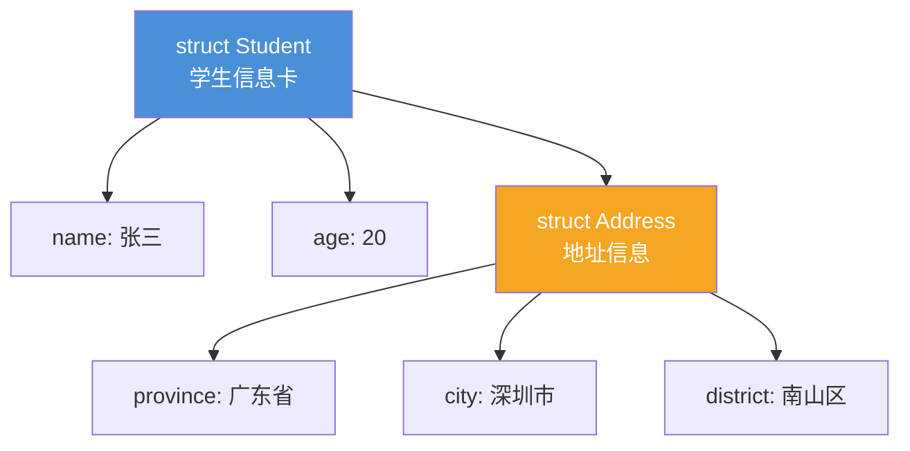
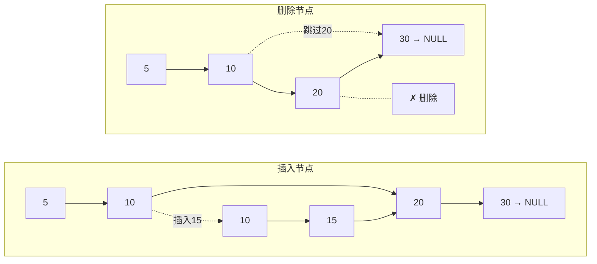
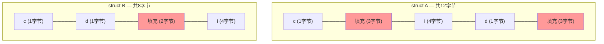
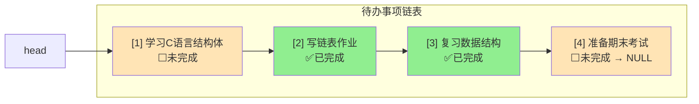

## 为什么需要结构体？

### 学生信息卡的烦恼

假设你要管理一个班级的学生信息：姓名、年龄、成绩。如果用单独的变量：

```c
// 😫 太乱了！10个学生就要30个变量
char name1[] = "张三"; int age1 = 20; float score1 = 89.5;
char name2[] = "李四"; int age2 = 21; float score2 = 92.0;
char name3[] = "王五"; int age3 = 19; float score3 = 85.5;
// ... 还有几十个学生呢？
```

这就像把一个人的姓名、年龄、成绩分别写在三张不同的纸上，想找"张三的年龄"得在三堆纸里翻。

**结构体**就是把这些相关信息**打包在一起**——就像一张"学生信息卡"，姓名、年龄、成绩都在同一张卡上。

---

## struct的基本语法

### 定义结构体

```c
// 定义一个"学生信息卡"的模板
struct Student {
    char name[50];   // 姓名
    int age;         // 年龄
    float score;     // 成绩
};
```

> 💡 **类比**：`struct Student` 就像设计了一张信息卡的模板，上面有"姓名栏""年龄栏""成绩栏"。模板本身不是卡片，只是规定了卡片长什么样。

### 创建和初始化

```c
#include <stdio.h>
#include <string.h>

struct Student {
    char name[50];
    int age;
    float score;
};

int main() {
    // 方式1：先创建再赋值
    struct Student stu1;
    strcpy(stu1.name, "张三");
    stu1.age = 20;
    stu1.score = 89.5;

    // 方式2：创建时初始化
    struct Student stu2 = {"李四", 21, 92.0};

    // 方式3：指定成员初始化（C99）
    struct Student stu3 = {.name = "王五", .age = 19, .score = 85.5};

    // 访问成员：用 . 运算符
    printf("姓名：%s，年龄：%d，成绩：%.1f\n", stu1.name, stu1.age, stu1.score);
    printf("姓名：%s，年龄：%d，成绩：%.1f\n", stu2.name, stu2.age, stu2.score);

    return 0;
}
```

> 💡 **点运算符（.）** 就像打开信息卡看某个栏目——`stu1.name` 就是"打开stu1这张卡，看姓名栏"。

---

## 结构体数组：花名册

一个学生用一张卡，多个学生怎么办？**把卡片装订成册**——这就是结构体数组。

```c
#include <stdio.h>

struct Student {
    char name[50];
    int age;
    float score;
};

int main() {
    // 花名册：结构体数组
    struct Student class1[3] = {
        {"张三", 20, 89.5},
        {"李四", 21, 92.0},
        {"王五", 19, 85.5}
    };

    // 遍历花名册
    printf("===== 班级花名册 =====\n");
    for (int i = 0; i < 3; i++) {
        printf("第%d位：%s，%d岁，%.1f分\n",
               i + 1, class1[i].name, class1[i].age, class1[i].score);
    }

    // 找最高分
    int max_idx = 0;
    for (int i = 1; i < 3; i++) {
        if (class1[i].score > class1[max_idx].score) {
            max_idx = i;
        }
    }
    printf("最高分：%s，%.1f分\n", class1[max_idx].name, class1[max_idx].score);

    return 0;
}
```

---

## 结构体指针：用 -> 访问成员

当拿到的是一张卡的**位置**（指针），而不是卡本身时，用 `->` 运算符访问成员：

```c
#include <stdio.h>

struct Student {
    char name[50];
    int age;
    float score;
};

int main() {
    struct Student stu = {"张三", 20, 89.5};
    struct Student *p = &stu;  // p指向stu

    // 两种访问方式等价
    printf("方式1（.）：  %s，%d岁\n", stu.name, stu.age);
    printf("方式2（->）： %s，%d岁\n", p->name, p->age);
    // 方式3（*p.）： (*p).name  等价于 p->name，但写起来麻烦

    // 通过指针修改
    p->score = 95.0;
    printf("修改后成绩：%.1f\n", stu.score);  // 95.0

    return 0;
}
```

> 💡 **记忆口诀**：拿到卡用 `.`，拿到位置用 `->`。

---

## 结构体嵌套：俄罗斯套娃

### 学生信息里包含地址

一个学生有姓名、年龄，还有家庭住址。而地址本身又包含省、市、区——这就是**嵌套**。

```c
#include <stdio.h>

// 内层：地址结构体
struct Address {
    char province[20];
    char city[20];
    char district[20];
};

// 外层：学生结构体（包含地址）
struct Student {
    char name[50];
    int age;
    struct Address addr;  // 嵌套！地址是学生的一部分
};

int main() {
    struct Student stu = {
        "张三",
        20,
        {"广东省", "深圳市", "南山区"}
    };

    // 像俄罗斯套娃一样，一层层打开
    printf("姓名：%s\n", stu.name);
    printf("省份：%s\n", stu.addr.province);
    printf("城市：%s\n", stu.addr.city);
    printf("区县：%s\n", stu.addr.district);

    return 0;
}
```

### 嵌套结构层次图



> 💡 **俄罗斯套娃**：大娃（Student）里面套着小娃（Address），小娃里面还有更小的娃（province、city、district）。访问时要一层层打开：`stu.addr.province`。

---

## 链表实现：结构体指向自身

### 最经典的结构体应用

链表节点就是一个结构体，里面包含数据和一个**指向同类型结构体的指针**：

```c
#include <stdio.h>
#include <stdlib.h>
#include <string.h>

// 链表节点
struct Node {
    int data;           // 数据
    struct Node *next;  // 指向下一个节点的指针
};
```

> 💡 **类比**：每个节点就是一张纸条，上面写着数据，还写着"下一张纸条在哪"。

### 完整的单链表操作

```c
#include <stdio.h>
#include <stdlib.h>

// 链表节点
struct Node {
    int data;
    struct Node *next;
};

// 创建新节点
struct Node* createNode(int data) {
    struct Node *newNode = (struct Node*)malloc(sizeof(struct Node));
    newNode->data = data;
    newNode->next = NULL;
    return newNode;
}

// 在头部插入
struct Node* insertHead(struct Node *head, int data) {
    struct Node *newNode = createNode(data);
    newNode->next = head;  // 新节点指向原来的头
    return newNode;         // 新节点成为新的头
}

// 在尾部插入
struct Node* insertTail(struct Node *head, int data) {
    struct Node *newNode = createNode(data);
    if (head == NULL) {
        return newNode;
    }
    struct Node *p = head;
    while (p->next != NULL) {
        p = p->next;
    }
    p->next = newNode;
    return head;
}

// 删除指定值的节点
struct Node* deleteNode(struct Node *head, int data) {
    if (head == NULL) return NULL;

    // 要删除的是头节点
    if (head->data == data) {
        struct Node *temp = head;
        head = head->next;
        free(temp);
        return head;
    }

    // 找到要删除节点的前一个
    struct Node *p = head;
    while (p->next != NULL && p->next->data != data) {
        p = p->next;
    }

    if (p->next != NULL) {
        struct Node *temp = p->next;
        p->next = temp->next;
        free(temp);
    }

    return head;
}

// 遍历打印
void printList(struct Node *head) {
    struct Node *p = head;
    printf("链表：");
    while (p != NULL) {
        printf("%d -> ", p->data);
        p = p->next;
    }
    printf("NULL\n");
}

int main() {
    struct Node *head = NULL;

    // 尾部插入
    head = insertTail(head, 10);
    head = insertTail(head, 20);
    head = insertTail(head, 30);
    printList(head);  // 链表：10 -> 20 -> 30 -> NULL

    // 头部插入
    head = insertHead(head, 5);
    printList(head);  // 链表：5 -> 10 -> 20 -> 30 -> NULL

    // 删除
    head = deleteNode(head, 20);
    printList(head);  // 链表：5 -> 10 -> 30 -> NULL

    return 0;
}
```

### 链表操作示意图



---

## typedef：给结构体取个短名

每次写 `struct Student` 太长了，用 `typedef` 取个短名：

```c
// 方式1：定义时取别名
typedef struct {
    char name[50];
    int age;
    float score;
} Student;

// 方式2：先定义struct，再取别名
struct Node {
    int data;
    struct Node *next;  // 这里还得用struct Node
};
typedef struct Node Node;  // 之后就可以用Node了

// 使用：不用再写struct了
Student stu = {"张三", 20, 89.5};
Node *head = NULL;
```

> 💡 **类比**：`typedef` 就像给"中华人民共和国"取个简称"中国"——意思一样，写起来方便多了。

---

## 内存对齐：sizeof可能比你想象的大

### 为什么会有对齐？

计算机读取内存时，喜欢按"整块"来读（比如一次读4字节或8字节），就像你读书时喜欢一行一行看，而不是一个字一个字看。

```c
#include <stdio.h>

struct A {
    char c;     // 1字节
    int i;      // 4字节
    char d;     // 1字节
};
// 你以为：1 + 4 + 1 = 6字节？
// 实际上：sizeof(struct A) = 12字节！

struct B {
    char c;     // 1字节
    char d;     // 1字节
    int i;      // 4字节
};
// 调整顺序后：sizeof(struct B) = 8字节
```

### 内存布局图



> 💡 **红色部分是"填充"**——为了让 `int` 对齐到4的倍数地址，编译器自动填充了空白字节。**把占空间小的成员放在一起**可以减少填充，节省内存。

---

## 实战：待办事项列表

用结构体+链表实现一个简单的待办事项管理器：

```c
#include <stdio.h>
#include <stdlib.h>
#include <string.h>

// 待办事项结构体
typedef struct Todo {
    int id;              // 编号
    char content[100];   // 内容
    int done;            // 是否完成（0未完成，1已完成）
    struct Todo *next;   // 下一个待办
} Todo;

Todo *head = NULL;
int nextId = 1;

// 添加待办
void addTodo(const char *content) {
    Todo *newTodo = (Todo*)malloc(sizeof(Todo));
    newTodo->id = nextId++;
    strcpy(newTodo->content, content);
    newTodo->done = 0;
    newTodo->next = head;
    head = newTodo;
    printf("✅ 添加成功：[%d] %s\n", newTodo->id, content);
}

// 完成待办
void finishTodo(int id) {
    Todo *p = head;
    while (p != NULL) {
        if (p->id == id) {
            p->done = 1;
            printf("🎉 完成待办：[%d] %s\n", id, p->content);
            return;
        }
        p = p->next;
    }
    printf("❌ 未找到编号 %d 的待办\n", id);
}

// 显示所有待办
void showTodos() {
    printf("\n===== 待办事项列表 =====\n");
    Todo *p = head;
    while (p != NULL) {
        printf("[%d] %s %s\n", p->id, p->content,
               p->done ? "✅已完成" : "⬜未完成");
        p = p->next;
    }
    printf("========================\n\n");
}

// 删除已完成的待办
void clearDone() {
    while (head != NULL && head->done) {
        Todo *temp = head;
        head = head->next;
        free(temp);
    }
    if (head == NULL) return;

    Todo *p = head;
    while (p->next != NULL) {
        if (p->next->done) {
            Todo *temp = p->next;
            p->next = temp->next;
            free(temp);
        } else {
            p = p->next;
        }
    }
    printf("🧹 已清除所有完成的待办\n");
}

int main() {
    addTodo("学习C语言结构体");
    addTodo("写链表作业");
    addTodo("复习数据结构");
    addTodo("准备期末考试");

    showTodos();

    finishTodo(2);   // 完成"写链表作业"
    finishTodo(3);   // 完成"复习数据结构"

    showTodos();

    clearDone();     // 清除已完成的

    showTodos();

    return 0;
}
```

### 待办事项链表结构



---

## 小结

结构体是C语言中组织复杂数据的核心工具，记住这些类比：

| 概念 | 类比 | 关键点 |
|:---:|:---:|:---:|
| **struct** | 信息卡模板 | 把相关数据打包在一起 |
| **结构体数组** | 花名册 | 管理多个同类型数据 |
| **结构体指针** | 卡片的位置 | 用 `->` 访问成员 |
| **结构体嵌套** | 俄罗斯套娃 | 一层层打开访问 |
| **链表** | 寻宝游戏 | 节点包含指向自身的指针 |
| **typedef** | 取简称 | 省去写 `struct` |
| **内存对齐** | 整块读取 | 成员顺序影响内存大小 |

下一篇文章，我们将学习**数据结构的嵌套与组合**——现实世界的数据往往不是简单的平铺，而是一层套一层的！

<div class='context-nav'>
<a class='context-link prev' href='/software-fundamentals/posts/数据库入门-电商系统数据库设计实战/'><span class='context-label'>上一篇</span><span class='context-title'>数据库入门：电商系统数据库设计实战</span></a>
<a class='context-link next' href='/software-fundamentals/posts/数据结构入门-List与Map和Set/'><span class='context-label'>下一篇</span><span class='context-title'>数据结构入门：List、Map、Set 三大容器详解</span></a>
</div>
