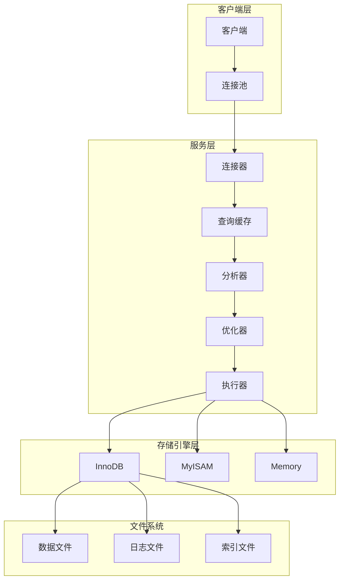
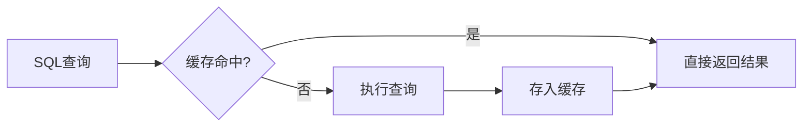
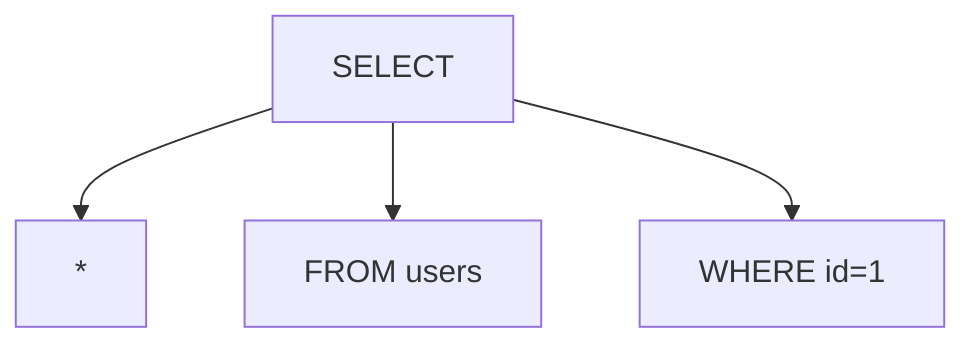
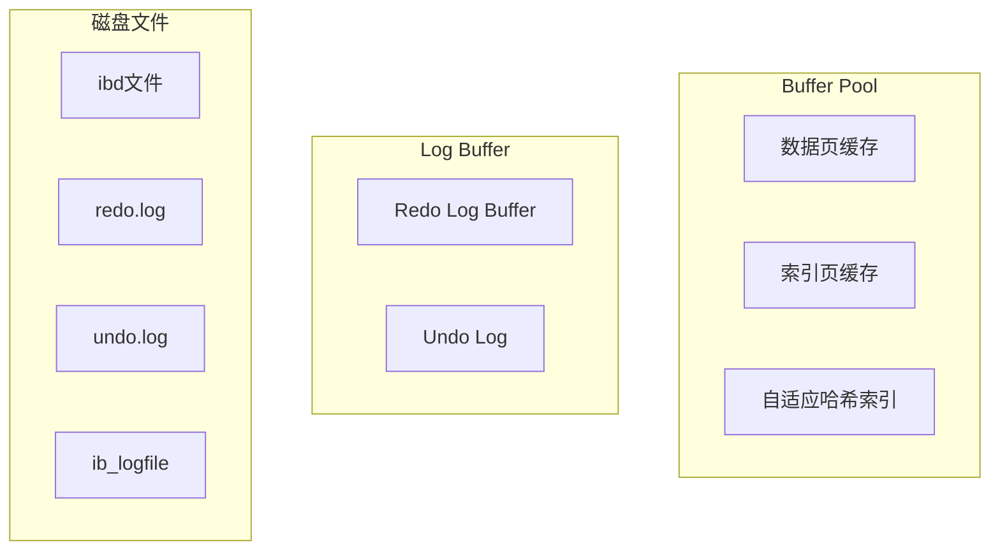

## 一、SQL是如何执行的？

想象你走进一家餐厅点餐：

1. 你对服务员说"给我来一份宫保鸡丁"——这就是你的SQL查询
2. 服务员确认你是本店会员，把菜单记下来——这是连接器和分析器的工作
3. 厨师长看了一眼菜谱说"这道菜做过，直接按配方做"——这是查询缓存（如果命中）
4. 厨师长决定先炒鸡丁还是先备调料——这是优化器在选择执行计划
5. 厨师开始做菜，传菜员把菜端给你——这是执行器执行并返回结果

## 二、MySQL架构总览

### 2.1 架构层次

MySQL采用经典的C/S架构，主要分为两层：



### 2.2 各组件职责

| 组件 | 职责 | 特点 |
|------|------|------|
| 连接器 | 管理连接、验证身份 | 支持多种认证方式 |
| 查询缓存 | 缓存查询结果 | MySQL 8.0已移除 |
| 分析器 | 解析SQL语法 | 生成语法树 |
| 优化器 | 选择最优执行计划 | 基于成本估算 |
| 执行器 | 执行SQL语句 | 调用存储引擎API |

## 三、连接器

### 3.1 连接管理

连接器负责建立和管理客户端连接：

```sql
-- 客户端连接命令
mysql -h host -u username -p password
```

### 3.2 连接状态

连接状态包括：

- **Sleep**：空闲状态，等待客户端发送命令
- **Query**：正在执行查询
- **Locked**：等待表锁
- **Copying to tmp table**：正在复制到临时表

### 3.3 连接数限制

```sql
-- 查看当前连接数
SHOW STATUS LIKE 'Threads_connected';

-- 查看最大连接数
SHOW VARIABLES LIKE 'max_connections';

-- 设置最大连接数
SET GLOBAL max_connections = 1000;
```

## 四、查询缓存（MySQL 8.0已移除）

### 4.1 工作原理

查询缓存以SQL语句为key，查询结果为value进行缓存：



### 4.2 缓存失效场景

- 表数据发生变化（INSERT/UPDATE/DELETE）
- 表结构发生变化（ALTER TABLE）
- 缓存内存不足

## 五、分析器

### 5.1 词法分析

将SQL语句分解为token：

```sql
SELECT * FROM users WHERE id = 1;
-- token: SELECT, *, FROM, users, WHERE, id, =, 1
```

### 5.2 语法分析

验证SQL语法正确性，生成语法树：



## 六、优化器

### 6.1 优化策略

优化器会选择最优的执行计划：

1. **索引选择**：选择哪个索引
2. **表连接顺序**：多表JOIN的顺序
3. **条件简化**：常量折叠、条件合并
4. **子查询优化**：转为JOIN或物化

### 6.2 执行计划

```sql
-- 查看执行计划
EXPLAIN SELECT * FROM users WHERE id = 1;
```

执行计划输出示例：

| id | select_type | table | type | key | rows | Extra |
|----|-------------|-------|------|-----|------|-------|
| 1 | SIMPLE | users | const | PRIMARY | 1 | Using index |

### 6.3 索引优化案例

```sql
-- 未优化：全表扫描
SELECT * FROM orders WHERE status = 'completed';

-- 优化：创建索引
CREATE INDEX idx_status ON orders(status);

-- 优化后：索引扫描
EXPLAIN SELECT * FROM orders WHERE status = 'completed';
```

## 七、执行器

### 7.1 执行流程

执行器调用存储引擎API执行SQL：


### 7.2 权限检查

执行前会检查用户权限：

```sql
-- 权限验证流程
SHOW GRANTS FOR 'user'@'host';
```

## 八、存储引擎

### 8.1 存储引擎对比

| 特性 | InnoDB | MyISAM | Memory |
|------|--------|--------|--------|
| 事务支持 | 支持 | 不支持 | 不支持 |
| 行级锁 | 支持 | 表级锁 | 表级锁 |
| 外键 | 支持 | 不支持 | 不支持 |
| MVCC | 支持 | 不支持 | 不支持 |
| 崩溃恢复 | 支持 | 不支持 | 数据丢失 |
| 全文索引 | 支持 | 支持 | 不支持 |

### 8.2 InnoDB架构



### 8.3 InnoDB关键特性

**1. 缓冲池（Buffer Pool）**

```sql
-- 查看缓冲池大小
SHOW VARIABLES LIKE 'innodb_buffer_pool_size';

-- 设置缓冲池大小（建议为内存的50%-70%）
SET GLOBAL innodb_buffer_pool_size = 4G;
```

**2. 事务日志（Redo Log）**

- 保证事务的持久性
- 采用WAL（Write-Ahead Logging）策略

**3. 回滚日志（Undo Log）**

- 支持事务回滚
- 支持MVCC（多版本并发控制）

## 九、SQL执行案例分析

### 9.1 简单查询

```sql
SELECT name, age FROM users WHERE id = 1;
```

执行流程：

1. 连接器建立连接
2. 分析器解析SQL
3. 优化器选择主键索引
4. 执行器调用InnoDB读取数据
5. 返回结果

### 9.2 复杂查询

```sql
SELECT u.name, COUNT(o.id) as order_count
FROM users u
LEFT JOIN orders o ON u.id = o.user_id
WHERE u.age > 18
GROUP BY u.id
HAVING order_count > 5
ORDER BY order_count DESC
LIMIT 10;
```

执行流程：

1. 优化器确定表连接顺序
2. 选择合适的索引
3. 执行器分步执行：
   - 扫描users表筛选age>18
   - 与orders表进行JOIN
   - 分组统计
   - 筛选HAVING条件
   - 排序并返回

## 十、性能优化建议

### 10.1 配置优化

```ini
# my.cnf 关键配置
innodb_buffer_pool_size = 4G
innodb_log_file_size = 2G
innodb_flush_log_at_trx_commit = 1
query_cache_type = OFF  # MySQL 8.0已移除
max_connections = 1000
```

### 10.2 SQL优化

1. **使用索引**：为WHERE、JOIN、ORDER BY字段创建索引
2. **避免SELECT ***：只查询需要的字段
3. **合理使用JOIN**：避免不必要的JOIN
4. **使用LIMIT**：限制返回行数

### 10.3 架构优化

1. **读写分离**：主库写，从库读
2. **分库分表**：处理大数据量
3. **缓存策略**：使用Redis缓存热点数据

## 十一、总结

MySQL的执行流程是一个复杂而精妙的系统：

1. **连接器**：建立连接，验证身份
2. **分析器**：解析SQL，生成语法树
3. **优化器**：选择最优执行计划
4. **执行器**：执行SQL，返回结果
5. **存储引擎**：负责数据的存储和读取

理解MySQL的执行原理对于优化SQL性能至关重要。通过合理的索引设计、SQL优化和配置调整，可以显著提升MySQL的性能。
