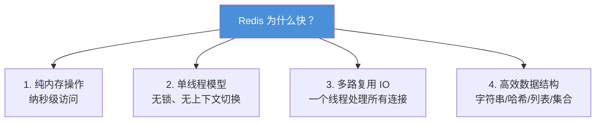

## 为什么需要 NoSQL？

关系型数据库（MySQL）很好，但它有几个天生的弱点：

1. **查询速度有限**：磁盘 IO 是瓶颈，读热点数据太慢
2. **扩展性有限**：单机容量有限，分库分表很复杂
3. **数据模型太死板**：必须先建表，字段不能灵活扩展

NoSQL（Not Only SQL）解决的就是这些问题——**速度快、容量大、模型灵活**。

### 四大类 NoSQL

| 类型 | 代表 | 数据模型 | 适用场景 |
|:---:|:---:|:---|:---|
| **键值数据库** | Redis、Memcached | key → value | 缓存、会话存储、计数器 |
| **文档数据库** | MongoDB、CouchDB | JSON/BSON 文档 | 灵活 schema、日志、配置 |
| **列族数据库** | HBase、Cassandra | 列 → 列族 → 行 | 大数据分析、海量写入 |
| **图数据库** | Neo4j、JanusGraph | 节点 + 边 | 社交关系、推荐、知识图谱 |

---

## Redis：最流行的键值数据库

### Redis 为什么这么快？



> 💡 **单线程不代表慢**。Redis 的单线程指的是**执行命令的线程只有一个**，这样避免了多线程的锁竞争和上下文切换开销。而接收网络请求用的是 IO 多路复用，可以同时处理上千个连接。
{: .prompt-tip }

### Redis 能做什么？

| 用途 | 示例 | 数据类型 |
|:---|:---|:---:|
| **缓存** | 缓存热点数据（商品详情、用户信息） | string |
| **计数器** | 点赞数、浏览量、下载量 | string（INCR） |
| **分布式锁** | 防止重复下单、防止重复提交 | string（SETNX） |
| **排行榜** | 游戏排行榜、热门商品榜单 | sorted set |
| **社交关系** | 关注/粉丝列表、共同好友 | set |
| **消息队列** | 简单的异步任务通知 | list（LPUSH/RPOP） |
| **会话存储** | 登录态 Session、Token | hash / string |
| **限流** | 接口访问频率控制 | string（INCR + EXPIRE） |

---

## Redis 五大基本数据类型

### 1. String（字符串）

最基本的类型，一个 key 对应一个 value。value 可以是字符串、数字，甚至图片/序列化对象（最大 512MB）。

```
SET user:1001:name "小明"
SET user:1001:age 18

GET user:1001:name → "小明"

INCR user:1001:age  → 19
DECR user:1001:age  → 18

SETNX lock:order "1"  → 成功返回1（如果key不存在）
                       → 失败返回0（如果key已存在）
```

**典型用途**：
- 缓存对象（JSON 序列化）
- 计数器（点赞、浏览量）
- 分布式锁（SETNX + EXPIRE）
- Session 存储

### 2. Hash（哈希）

一个 key 对应一个"小 Map"——适合存储对象的多个字段。

```
HSET user:1001 name "小明" age 18 phone "13800001234"

HGET user:1001 name    → "小明"
HGETALL user:1001       → 所有字段和值
HINCRBY user:1001 age 1 → age = 19
```

**对比 String + JSON**：
| 方案 | 优点 | 缺点 |
|:---:|:---|:---|
| **Hash** | 可以单独修改某个字段，节省空间 | 不支持嵌套，查询不太灵活 |
| **String + JSON** | 灵活，支持任意嵌套 | 每次都要反序列化全量，单个字段修改要读全量 |

> 📖 **经验法则**：对象字段简单（扁平化）且需要单独修改 → 用 Hash；结构复杂嵌套 → 用 String + JSON。
{: .prompt-info }

### 3. List（列表）

双向链表——可以当栈用，也可以当队列用。

```
LPUSH queue:task "task1"   → 左侧推入
LPUSH queue:task "task2"   → 现在是 ["task2", "task1"]

RPOP queue:task            → 右侧弹出 "task1"
LPOP queue:task            → 左侧弹出 "task2"

LRANGE queue:task 0 -1     → 查看全部元素
```

**典型用途**：
- **消息队列**：LPUSH + RPOP（简单队列）
- **时间线**：最新动态（LPUSH + LRANGE）
- **栈**：LPUSH + LPOP

### 4. Set（集合）

无序、去重的集合——支持交集、并集、差集运算。

```
SADD follow:1001 2001 2002 2003     → 小明关注了 3 个人
SADD follow:1002 2002 2003 2004     → 小红关注了 3 个人

SISMEMBER follow:1001 2002          → 1（存在）
SINTER follow:1001 follow:1002      → {2002, 2003}（共同关注）
SUNION follow:1001 follow:1002      → {2001, 2002, 2003, 2004}（并集）
SCARD follow:1001                   → 3（元素个数）
```

**典型用途**：
- 标签系统（给商品/文章打标签）
- 社交关系（关注、粉丝、共同好友）
- 去重（UV 统计、抽奖不重复）

### 5. Sorted Set（有序集合/ZSet）

Set 的升级版——每个元素带一个分数（score），按分数自动排序。

```
ZADD rank:hot 10000 "商品A" 8500 "商品B" 5000 "商品C"

ZRANGE rank:hot 0 -1            → 从低到高排
ZREVRANGE rank:hot 0 2          → Top 3（从高到低）
ZSCORE rank:hot "商品A"         → 10000
ZRANK rank:hot "商品B"          → 1（排名，从0开始）

ZINCRBY rank:hot 100 "商品C"    → 商品C分数+100
```

**典型用途**：
- 排行榜（游戏、热门商品、热搜）
- 带权重的任务队列
- 时间窗口（score = 时间戳，实现滑动窗口）

---

## 三大核心问题：穿透、击穿、雪崩

### 1. 缓存穿透（Cache Penetration）

**问题**：查一个**永远不存在**的数据，缓存里没有，每次都打到数据库。

```
请求不存在的 user_id = 999999
        ↓
查 Redis → 不存在
        ↓
查 MySQL → 不存在，返回 NULL
        ↓
下次同样请求，又走一遍 → MySQL 被打爆
```

**解决方案**：
| 方案 | 做法 | 特点 |
|:---:|:---|:---|
| **缓存空值** | 数据库查不到时，在缓存写一个 NULL（短过期，如 1 分钟） | 简单，有少量内存占用 |
| **布隆过滤器** | 把所有存在的 key 存进布隆过滤器，请求先过过滤器 | 省内存，但有误判率 |

### 2. 缓存击穿（Cache Breakdown）

**问题**：某个**热点 key 过期**的瞬间，成千上万的请求同时打到数据库。

```
秒杀活动商品详情 → 热点 key，1000 QPS
        ↓
key 过期了（Redis 里没有了）
        ↓
1000 个请求同时去查 MySQL → 数据库挂了
```

**解决方案**：
| 方案 | 做法 | 特点 |
|:---:|:---|:---|
| **互斥锁** | 第一个请求去查库并回写缓存，其他请求等待 | 一致性好，有少量等待 |
| **热点 key 永不过期** | 逻辑过期（在 value 里存过期时间），后台异步更新 | 简单，适合热点 |

### 3. 缓存雪崩（Cache Avalanche）

**问题**：**大量 key 同时过期**，或者 **Redis 挂了**，海量请求瞬间打到数据库。

```
大量 key 同时过期（比如都设了 1 小时过期）
        ↓
成千上万请求同时打到 MySQL → 数据库挂了
```

**解决方案**：
| 方案 | 做法 |
|:---:|:---|
| **过期时间加随机值** | 在基础过期时间上加 ±10% 随机，避免同时过期 |
| **多级缓存** | 本地缓存 + Redis 缓存 + 降级 |
| **Redis 高可用** | 主从 + 哨兵 + 集群，避免单点故障 |
| **限流降级** | 服务层加限流，防止请求淹没数据库 |

---

## Redis 持久化：数据怎么不丢？

Redis 是内存数据库——服务器重启，数据就没了。Redis 提供两种持久化方式：

| 方式 | 原理 | 优点 | 缺点 |
|:---:|:---|:---|:---|
| **RDB** | 定时把整个内存快照写到磁盘 | 文件小，恢复快，性能影响小 | 两次快照之间的数据会丢 |
| **AOF** | 每条写命令都追加到日志文件 | 数据安全（最多丢 1 秒），可读性好 | 文件大，恢复慢，写入有开销 |

> 📖 **默认策略**：Redis 4.0 之后有 **混合持久化**——RDB 做基础（快），AOF 存增量（安全）。重启时先加载 RDB，再重放 AOF。
{: .prompt-info }

---

## 分布式锁：Redis 的经典应用

### 为什么需要分布式锁？

单机应用里，用 Java 的 `synchronized` 就够了。但分布式环境下，多台服务器共享同一个资源——必须有一个**全局的协调者**。

### Redis 分布式锁的实现

```
-- 最基础的版本（有缺陷）
SETNX lock:order "1"     -- 如果 key 不存在，设置成功=拿到锁
EXPIRE lock:order 10     -- 10秒后自动过期，防止死锁

问题：SETNX 和 EXPIRE 不是原子操作！
      如果 SETNX 成功后程序崩溃，锁就永远不会过期。
```

```
-- 正确的原子版本（Redis 2.6.12+ 支持）
SET lock:order "random_value" NX EX 10

参数说明：
  NX = 只有 key 不存在时才设置
  EX 10 = 10 秒后自动过期
```

```
-- 释放锁（必须判断是不是自己加的锁，用Lua脚本保证原子性）
EVAL "if redis.call('get', KEYS[1]) == ARGV[1] then return redis.call('del', KEYS[1]) else return 0 end" 1 lock:order "random_value"
```

> 💡 **Redisson 的 RLock**：生产环境别自己造轮子，用 Redisson 库——它实现了自动续期（看门狗）、可重入、公平锁等高级特性。
{: .prompt-tip }

---

## Redis vs Memcached

| 特性 | Redis | Memcached |
|:---:|:---:|:---:|
| 数据类型 | 丰富（5 大类型 + 扩展） | 只有 string |
| 持久化 | ✅ RDB + AOF | ❌ 纯内存 |
| 主从复制 | ✅ 支持 | ❌ 不支持 |
| 最大 value | 512MB | 1MB |
| 多线程 | ❌ 单线程 | ✅ 多线程（多核更快） |
| 适用场景 | 通用、功能丰富 | 简单缓存场景 |

> 📖 **经验法则**：99% 的场景选 Redis 就对了——功能强大、生态成熟。只有在极其简单的纯缓存场景且需要多核扩展时才考虑 Memcached。
{: .prompt-info }

---

## 小结

NoSQL 是关系型数据库的重要补充：

- **Redis**：内存键值数据库，速度极快，支持丰富的数据结构
- **5 大类型**：String（缓存/计数器/锁）、Hash（对象存储）、List（队列）、Set（社交/标签）、ZSet（排行榜）
- **三大缓存问题**：穿透（查不存在的）、击穿（热点 key 过期）、雪崩（大量过期/Redis 挂）
- **持久化**：RDB（快照快）+ AOF（日志安全），推荐混合模式
- **分布式锁**：SET key value NX EX seconds + Lua 脚本释放

Redis 不是万能的——它是关系型数据库的加速器而不是替代品。用好 Redis，能让你的系统性能提升一个数量级。
