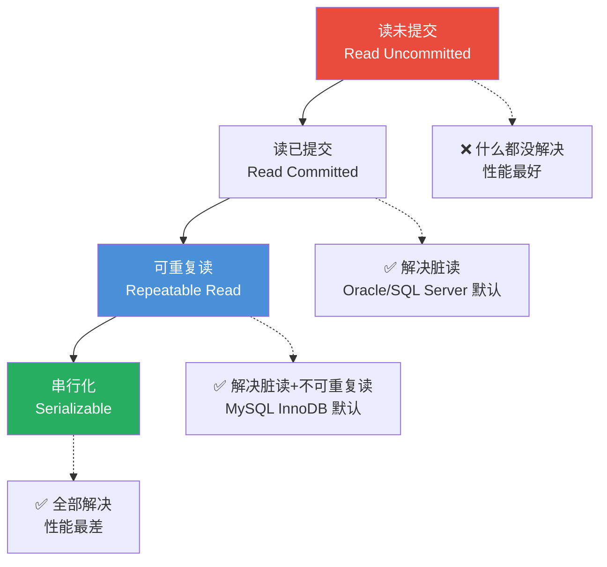
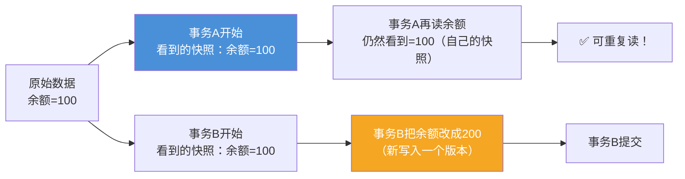
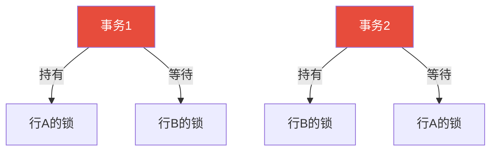

## 事务是什么？

想象你给朋友转账 100 元：

1. 你的账户扣 100 元
2. 朋友的账户加 100 元

这两步必须**要么都成功，要么都失败**——如果第一步成功但第二步失败，你的 100 元就凭空消失了。

**事务**就是把这两步打包成一个"原子操作"——要么全部执行，要么全部不执行。

> 📖 **ACID 四特性**：
> - **A（Atomicity 原子性）**：事务中的操作要么全部成功，要么全部回滚
> - **C（Consistency 一致性）**：事务前后，数据保持一致状态（比如总额不变）
> - **I（Isolation 隔离性）**：多个事务同时执行时互不干扰
> - **D（Durability 持久性）**：事务提交后，修改永久保存在数据库中
{: .prompt-info }

---

## 并发事务会出什么问题？

### 问题 1：脏读（Dirty Read）

事务 A 修改了数据但还没提交，事务 B 读到了 A 修改后的数据。然后 A 回滚了——B 读到的就是"脏数据"。

```
时间轴：
T1 → 事务A：把小明的余额从100改成200（未提交）
T2 → 事务B：读取小明的余额 = 200 ✨ 脏读！
T3 → 事务A：回滚（余额又变回100）
T4 → 事务B：用200继续操作（但实际只有100）
```

### 问题 2：不可重复读（Non-repeatable Read）

同一个事务内，读取同一个字段两次，得到不同的值。

```
时间轴：
T1 → 事务A：读取小明余额 = 100
T2 → 事务B：把小明余额改成200（并提交）
T3 → 事务A：再次读取小明余额 = 200
     ↑ 同一个事务内，同一字段值变了！
```

### 问题 3：幻读（Phantom Read）

同一个事务内，两次查询得到的**行数**不一样。

```
时间轴：
T1 → 事务A：SELECT * FROM users WHERE age > 18 → 得到3行
T2 → 事务B：INSERT 一行 age=25 的用户（并提交）
T3 → 事务A：再次执行相同查询 → 得到4行
     ↑ 凭空多出一行！像幻觉一样
```

### 三者的区别

| 问题 | 现象 | 核心区别 |
|:---:|:---:|:---:|
| **脏读** | 读到未提交的修改 | 读到了"不存在"的数据（别人还没确认） |
| **不可重复读** | 同一字段两次值不同 | 别人 UPDATE 了这一行 |
| **幻读** | 同一个查询行数不同 | 别人 INSERT/DELETE 了行 |

---

## 四种隔离级别

SQL 标准定义了 4 种隔离级别，解决不同的并发问题。



### 级别 1：读未提交（Read Uncommitted）

- **实现**：基本不加锁
- **问题**：脏读、不可重复读、幻读都可能发生
- **用途**：几乎不用——除非你对数据准确性完全无所谓

### 级别 2：读已提交（Read Committed）

- **实现**：写数据时加行锁（直到事务结束释放），读数据时不加锁但只能读到已提交的版本
- **解决**：脏读 ✅
- **仍有**：不可重复读、幻读
- **Oracle、SQL Server 的默认级别**

### 级别 3：可重复读（Repeatable Read）

- **实现**：MVCC（多版本并发控制）——每个事务看到自己启动时的数据快照
- **解决**：脏读 ✅ 不可重复读 ✅
- **MySQL InnoDB 的默认级别**
- **幻读呢？** 标准定义中 RR 级别仍有幻读，但 InnoDB 通过 Next-Key Lock（间隙锁 + 行锁）**在大多数情况下避免了幻读**

### 级别 4：串行化（Serializable）

- **实现**：所有事务排队执行，读加共享锁，写加排他锁
- **解决**：脏读 ✅ 不可重复读 ✅ 幻读 ✅
- **代价**：性能最差，并发能力几乎为 0

---

## 对比表

| 隔离级别 | 脏读 | 不可重复读 | 幻读 | 锁机制 |
|:---:|:---:|:---:|:---:|:---|
| 读未提交 | ❌ 可能 | ❌ 可能 | ❌ 可能 | 几乎无锁 |
| 读已提交 | ✅ 不会 | ❌ 可能 | ❌ 可能 | 写加行锁，读用快照 |
| 可重复读 | ✅ 不会 | ✅ 不会 | ✅ 基本不会 | MVCC + Next-Key Lock |
| 串行化 | ✅ 不会 | ✅ 不会 | ✅ 不会 | 读共享锁 + 写排他锁 |

> ⚠️ **如何选择？** 大多数情况用默认级别（MySQL = RR，Oracle = RC）就好。级别越高越安全但性能越差，要根据业务场景权衡。
{: .prompt-warning }

---

## MVCC：多版本并发控制

### 为什么需要 MVCC？

如果数据库只有锁这一种手段：

- 有人写 → 其他人都不能读（读写阻塞）
- 有人读 → 其他人都不能写（写写阻塞）
- 性能极差，几乎没有并发能力

**MVCC 解决了"读写不冲突"的问题**——读的时候可以写，写的时候可以读。

### 核心思想：每个事务看到自己的快照



### 实现机制

InnoDB 在每行数据后藏了两个隐藏字段：

| 隐藏字段 | 作用 |
|:---:|:---|
| **DB_TRX_ID** | 最后修改这行的事务 ID |
| **DB_ROLL_PTR** | 指向 undo log 中这行的上一个版本 |

**可见性规则**：事务启动时，记录当前活跃事务列表。查询某行时：

- 如果这行的 `DB_TRX_ID` 在自己启动之前 → ✅ 可见
- 如果 `DB_TRX_ID` 在自己启动之后 → ❌ 不可见，顺着 `DB_ROLL_PTR` 找上一个版本
- 直到找到一个"可见"的版本，或者找不到返回空

---

## 锁的分类

### 1. 按锁的粒度分

| 锁类型 | 粒度 | 并发性能 | 典型场景 |
|:---:|:---:|:---:|:---|
| **表锁** | 整张表 | 最差（读读不冲突，读写/写写全阻塞） | MyISAM、DDL 语句 |
| **行锁** | 单行 | 最好（只锁修改的那一行） | InnoDB 按主键更新 |
| **间隙锁** | 两个索引之间的"间隙" | 中等 | 防止幻读（Next-Key Lock 的一部分） |

### 2. 按锁的兼容性分

| 锁类型 | 别名 | 兼容性 | 典型语句 |
|:---:|:---:|:---:|:---|
| **共享锁（S锁）** | 读锁 | 与 S 兼容，与 X 冲突 | `SELECT ... LOCK IN SHARE MODE` |
| **排他锁（X锁）** | 写锁 | 与所有锁都冲突 | `UPDATE / DELETE / INSERT` |

### 兼容性矩阵

| 请求 ↓ 持有 → | S 锁 | X 锁 |
|:---:|:---:|:---:|
| **S 锁** | ✅ 兼容 | ❌ 冲突 |
| **X 锁** | ❌ 冲突 | ❌ 冲突 |

---

## 死锁

### 什么是死锁？

两个事务互相等待对方释放锁，谁都无法继续：

```
T1 → 锁住行 A，然后试图锁行 B
T2 → 锁住行 B，然后试图锁行 A
      ↓
    互相等待 → 永远等下去
```



### 如何检测和处理？

| 方法 | 做法 | 问题 |
|:---:|:---:|:---:|
| **超时检测** | 等待超时就回滚（`innodb_lock_wait_timeout`） | 超时时间难定，可能有"误伤" |
| **等待图检测** | InnoDB 默认方式：构造锁等待图，检测环 | 一旦发现死锁，回滚代价较小的事务 |

### 如何避免死锁？

1. **统一加锁顺序**：所有事务都按相同顺序加锁（比如先锁小 id，再锁大 id）
2. **缩小事务范围**：事务要小，不要在事务里等外部操作
3. **用更低的隔离级别**：RC 级别比 RR 死锁概率低（因为 Next-Key Lock 更少）
4. **合理使用索引**：没有索引会升级为表锁，死锁概率大增

---

## 小结

事务和锁是数据库处理并发的核心：

- **ACID**：事务的四大特性，是数据库可靠性的基石
- **四个隔离级别**：读未提交 → 读已提交 → 可重复读 → 串行化（越靠右越安全但越慢）
- **MVCC**：通过多版本实现读写不冲突——读读永远不冲突，读写也不冲突
- **锁**：解决写写冲突——行锁粒度最细，表锁粒度最粗；S 锁是共享锁，X 锁是排他锁
- **死锁**：两个事务互相等待，数据库会检测并回滚其中一个；最好的办法是统一加锁顺序

理解了这些，你就能看懂线上数据库的锁等待日志，设计出高并发且安全的业务系统了。
