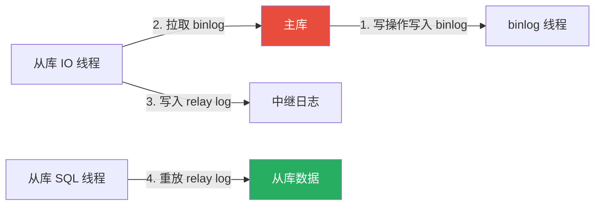

## 索引相关

### 题 1：索引为什么这么快？

**核心答案**：索引用 **B+ 树**结构。

```
普通查询（全表扫描）：从第一行开始，一行一行比较
                        → O(n)，100 万数据扫 100 万次

索引查询：从根节点开始，二分查找定位数据
                        → O(log n)，100 万数据只需 3 次比较
```

**更完整的回答**：
1. B+ 树是多路平衡搜索树，树很矮（100 万数据只有 3 层）
2. 非叶子节点只存索引值，不存数据，一个节点能存很多索引项
3. 叶子节点是链表相连的，范围查询可以顺着链表扫，不用回溯
4. 相比二叉树，B+ 树大大减少了磁盘 IO 次数

### 题 2：聚簇索引和非聚簇索引有什么区别？

| 对比项 | 聚簇索引（主键索引） | 非聚簇索引（二级索引） |
|:---:|:---|:---|
| 叶子节点存什么 | **完整的行数据** | **主键的值** |
| 一张表几个 | 只能有 1 个（数据只能一种物理排列） | 可以有多个 |
| 查询是否回表 | 不需要（叶子就是数据） | 需要（查到主键还要再查聚簇索引） |
| 插入顺序影响 | 按主键顺序插入最快（避免页分裂） | 影响较小 |

### 题 3：覆盖索引是什么？

**定义**：查询的字段刚好都在索引里，不需要回表去聚簇索引取数据。

```sql
-- 有索引 (name, age)
SELECT id, name, age FROM users WHERE name='小明';  -- ✅ 覆盖索引，不用回表
SELECT * FROM users WHERE name='小明';                -- ❌ 需要回表（还有其他字段）
```

**好处**：减少 IO 次数，查询更快。

### 题 4：什么情况下索引会失效？

| 场景 | 示例 |
|:---:|:---|
| 索引列做运算/函数 | `WHERE YEAR(created_at) = 2026` |
| 隐式类型转换 | `phone` 是字符串但传了数字 `13800001234` |
| 模糊查询前导 % | `WHERE name LIKE '%明'` |
| OR 条件中有未索引列 | `WHERE name='小明' OR status=1`（status 没索引） |
| 不等于判断 | `WHERE name != '小明'` |
| IS NULL 判断 | `WHERE name IS NULL`（取决于优化器） |
| 索引选择性太低 | 性别、状态字段（优化器觉得全表扫更快） |

---

## 事务相关

### 题 5：ACID 是什么？

- **A（Atomicity 原子性）**：事务中的操作要么全部成功，要么全部回滚（由 undo log 保证）
- **C（Consistency 一致性）**：事务前后，数据保持一致状态（业务约束，需要应用层+数据库共同保证）
- **I（Isolation 隔离性）**：多个事务并发执行时互不干扰（由 MVCC + 锁机制保证）
- **D（Durability 持久性）**：事务提交后，修改永久保存（由 redo log 保证）

### 题 6：四个隔离级别是什么？

| 级别 | 脏读 | 不可重复读 | 幻读 | 说明 |
|:---:|:---:|:---:|:---:|:---|
| 读未提交 | ❌ 可能 | ❌ 可能 | ❌ 可能 | 几乎不用 |
| 读已提交 | ✅ 不会 | ❌ 可能 | ❌ 可能 | Oracle 默认 |
| 可重复读 | ✅ 不会 | ✅ 不会 | ✅ 基本不会 | MySQL 默认（InnoDB 用 Next-Key Lock 避免幻读） |
| 串行化 | ✅ 不会 | ✅ 不会 | ✅ 不会 | 最慢，但最安全 |

### 题 7：MVCC 是什么？

**多版本并发控制**（Multi-Version Concurrency Control）—— 让读写不冲突。

**实现原理**：
1. 每行数据有两个隐藏字段：`DB_TRX_ID`（最后修改的事务ID）、`DB_ROLL_PTR`（指向上一版本）
2. 事务启动时，记录当前活跃事务列表（Read View）
3. 查询时，只看 `DB_TRX_ID` 在 Read View 之前可见的数据，看不到就顺着 `DB_ROLL_PTR` 找旧版本

**好处**：
- 读不加锁，读写不冲突
- 提升并发性能
- 实现了"可重复读"

### 题 8：Next-Key Lock 是什么？

InnoDB 在可重复读级别下，**用 Next-Key Lock 防止幻读**。

Next-Key Lock = 行锁 + 间隙锁

```
假设表里有 id = 10, 20, 30 三行数据
间隙锁锁定的"间隙"是：(-∞,10), (10,20), (20,30), (30,+∞)

当执行 UPDATE ... WHERE id = 20 时：
  → 锁定 id=20 这一行（行锁）
  → 同时锁定 (10,20] 和 (20,30] 这两个间隙（间隙锁）
  → 其他事务无法在这些间隙中插入新数据
  → 从而避免幻读
```

---

## MySQL 架构相关

### 题 9：一条 SQL 的执行过程？

```
客户端 → 连接器（认证、权限、连接管理）
       → 查询缓存（命中直接返回，MySQL 8.0 已移除）
       → 分析器（词法分析、语法分析、语义分析）
       → 优化器（选择执行计划、决定用哪个索引）
       → 执行器（调用存储引擎接口）
       → 存储引擎（InnoDB：从 Buffer Pool / 磁盘取数据）
       → 返回结果
```

### 题 10：Buffer Pool 是什么？

**缓冲池**——InnoDB 用来缓存磁盘数据页的内存区域。

- 读操作：先查 Buffer Pool，命中直接返回；不命中则从磁盘加载到 Buffer Pool 再返回
- 写操作：先写 Buffer Pool（变成脏页），再由后台线程刷到磁盘
- 大小：通常占服务器内存的 50%~70%

**好处**：把"慢的磁盘操作"变成"快的内存操作"。

### 题 11：redo log、undo log、binlog 有什么区别？

| 日志 | 作用 | 是谁的 | 内容 |
|:---:|:---|:---:|:---|
| **redo log** | 崩溃恢复（WAL 机制） | InnoDB | 物理日志："某页做了什么修改" |
| **undo log** | 回滚 + MVCC | InnoDB | 逻辑日志："反向操作是什么" |
| **binlog** | 主从复制 + 归档 | Server 层 | 逻辑日志：SQL 语句或行变化 |

**两阶段提交**：`prepare → 写 binlog → commit`，保证 redo log 和 binlog 的一致性。

---

## 性能优化相关

### 题 12：怎么定位慢 SQL？

1. **开启慢查询日志**：`SET GLOBAL slow_query_log = ON;`
2. **设置阈值**：`SET GLOBAL long_query_time = 1;`
3. **分析日志**：`mysqldumpslow` 或 `pt-query-digest`
4. **EXPLAIN 执行计划**：看 `type`、`key`、`rows`、`Extra`
5. **SHOW PROCESSLIST**：看当前正在执行的慢查询
6. **PROFILING**：精确看每个阶段的耗时（`SET profiling = 1;`）

### 题 13：EXPLAIN 各列的含义？

| 列 | 含义 | 关注点 |
|:---:|:---|:---|
| **id** | 查询编号 | id 越大越先执行 |
| **select_type** | 查询类型 | SIMPLE / PRIMARY / SUBQUERY / DERIVED |
| **type** | 访问类型 | `system > const > eq_ref > ref > range > index > ALL` |
| **possible_keys** | 可能用到的索引 | 优化器评估可选索引 |
| **key** | 实际用到的索引 | 核心——是否走了期望的索引？ |
| **rows** | 预估扫描行数 | 越少越好 |
| **Extra** | 额外信息 | `Using index`（覆盖索引 ✅）、`Using filesort`（文件排序 ❌）、`Using temporary`（临时表 ❌） |

### 题 14：深分页问题怎么解决？

```sql
-- ❌ 深分页极慢（LIMIT 1000000, 10 需要扫 100 万行）
SELECT * FROM orders ORDER BY id LIMIT 1000000, 10;

-- ✅ 方案 1：游标分页（记录上一页最后一个 id）
SELECT * FROM orders WHERE id > 1000010 ORDER BY id LIMIT 10;

-- ✅ 方案 2：延迟关联（先在索引上定位 id，再回表）
SELECT o.* FROM orders o
JOIN (SELECT id FROM orders ORDER BY id LIMIT 1000000, 10) t ON o.id = t.id;
```

---

## 数据库架构相关

### 题 15：主从复制的原理？



**三种模式**：
- **异步**（默认）：主库写完就返回，不关心从库是否收到
- **半同步**：至少一个从库确认收到 binlog 后才返回
- **全同步**：所有从库都确认才返回（性能差，几乎不用）

### 题 16：主从延迟大怎么解决？

| 原因 | 解决 |
|:---:|:---|
| 大事务 | 拆成小事务，避免长时间阻塞 |
| 大 DDL（ALTER TABLE） | 用在线 DDL 工具（pt-online-schema-change、gh-ost） |
| 从库硬件差 | 提升从库配置，或用更强的机器 |
| 网络延迟 | 主从库放在同一内网 |
| 读写分离压力大 | 增加从库数量，分摊读压力 |

### 题 17：分库分表后怎么查询？

| 查询类型 | 解决办法 |
|:---:|:---|
| 带分片键的查询 | 直接路由到对应分片（最快） |
| 不带分片键的查询 | 广播到所有分片查询，再合并（慢） |
| 跨库 JOIN | 应用层做 JOIN（多次查询+内存合并）或冗余字段 |
| 全局唯一 ID | 雪花算法（Snowflake）、UUID、号段模式 |

> ⚠️ **分库分表的代价**：增加系统复杂度——跨库 JOIN、分布式事务、扩容迁移都很麻烦。**能用缓存+索引解决的就不要分库分表**。
{: .prompt-warning }

---

## Redis 相关

### 题 18：Redis 为什么这么快？

1. **纯内存操作**：内存访问速度是纳秒级
2. **单线程**：避免多线程锁竞争和上下文切换开销
3. **IO 多路复用**：一个线程处理所有连接请求（epoll）
4. **高效数据结构**：SDS、跳表、压缩列表等优化

### 题 19：缓存穿透/击穿/雪崩的区别和解决？

| 问题 | 定义 | 解决 |
|:---:|:---|:---|
| **穿透** | 查**永远不存在**的数据，每次都打到 DB | 缓存空值、布隆过滤器 |
| **击穿** | 某个**热点 key 过期**，大量请求打到 DB | 互斥锁、热点 key 永不过期 |
| **雪崩** | **大量 key 同时过期**，或 Redis 挂了 | 过期时间加随机值、多级缓存、Redis 高可用 |

### 题 20：Redis 分布式锁怎么实现？

```
-- 加锁（原子操作）
SET lock:resource "random_value" NX EX 10
  NX = key 不存在才设置成功
  EX 10 = 10 秒自动过期

-- 释放锁（必须判断是不是自己加的锁，用Lua保证原子性）
EVAL "if redis.call('get',KEYS[1])==ARGV[1] then return redis.call('del',KEYS[1]) else return 0 end"
     1 lock:resource "random_value"
```

**关键点**：
1. SET NX EX 必须是原子操作（防止加锁后崩溃导致死锁）
2. 释放锁必须校验 value（防止误删别人的锁）
3. value 用随机值（区分不同请求加的锁）
4. 生产环境用 Redisson 的 RLock（自动续期、可重入）

---

## 小结

数据库面试题的核心脉络：

**索引**：B+ 树、聚簇/非聚簇、覆盖索引、索引失效、最左前缀

**事务**：ACID、隔离级别、MVCC、Next-Key Lock、死锁

**MySQL 架构**：执行流程、Buffer Pool、三大日志

**性能优化**：慢 SQL 定位、EXPLAIN 解读、深分页解决

**架构**：主从复制、读写分离、分库分表

**Redis**：为什么快、数据结构、缓存三大问题、分布式锁

理解这些核心问题，再结合项目经验讲出来——数据库面试基本无压力。
