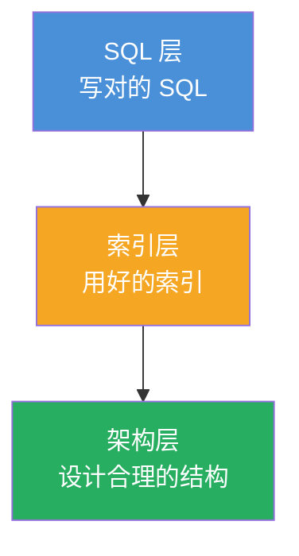
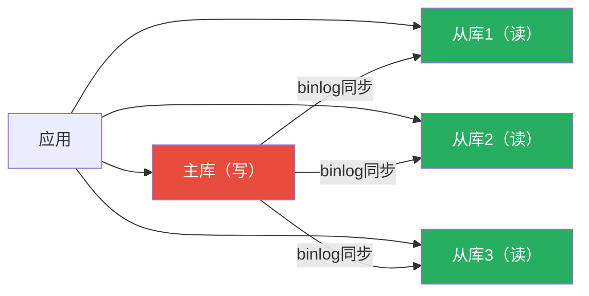

## 为什么你的 SQL 这么慢？

系统上线后，用户抱怨"页面卡"、"加载半天"。定位到数据库，发现一条 SQL 跑了 3 秒——这就是典型的性能问题。

数据库性能优化可以分成三层：



---

## 第一层：SQL 优化

### 1. 避免 SELECT \*

**原因**：
- 可能查了一堆不需要的字段，浪费网络传输
- 如果有大字段（TEXT/BLOB），代价尤其高
- 无法利用覆盖索引（需要回表）

```sql
-- ❌ 不要这么写
SELECT * FROM users WHERE id = 1;

-- ✅ 明确指定字段
SELECT id, name, phone FROM users WHERE id = 1;
```

### 2. LIMIT 分页优化

翻页翻到第 100 页时：

```sql
-- ❌ 深层分页极慢（跳过 10000 行也要扫）
SELECT * FROM orders ORDER BY id LIMIT 10000, 10;

-- ✅ 用游标分页（记录上一页最后一个 id）
SELECT * FROM orders WHERE id > 10010 ORDER BY id LIMIT 10;

-- ✅ 或用 JOIN 延迟关联
SELECT o.* FROM orders o
JOIN (SELECT id FROM orders ORDER BY id LIMIT 10000, 10) t
ON o.id = t.id;
```

### 3. 用 UNION ALL 代替 OR

```sql
-- ❌ OR 可能导致索引失效
SELECT * FROM users WHERE name='小明' OR phone='13800001234';

-- ✅ UNION ALL 让两边都能走索引
SELECT * FROM users WHERE name='小明'
UNION ALL
SELECT * FROM users WHERE phone='13800001234';
```

### 4. 避免在索引列上做运算

```sql
-- ❌ 索引失效
SELECT * FROM users WHERE DATE(created_at) = '2026-06-01';
SELECT * FROM users WHERE id + 1 = 100;
SELECT * FROM users WHERE LEFT(name, 2) = '小明';

-- ✅ 改写为范围查询（让索引列"裸露"）
SELECT * FROM users WHERE created_at >= '2026-06-01' AND created_at < '2026-06-02';
SELECT * FROM users WHERE id = 99;
SELECT * FROM users WHERE name LIKE '小明%';
```

### 5. JOIN 小表驱动大表

```sql
-- 假设 users 只有 1 万行，orders 有 1000 万行
-- ✅ MySQL 优化器通常会自动选择小表驱动
SELECT u.name, o.amount
FROM users u
JOIN orders o ON u.id = o.user_id
WHERE u.id = 1001;
```

> 💡 **JOIN 原理**：MySQL 用的是"嵌套循环连接"（Nested-Loop Join）——从驱动表取一行，去被驱动表查匹配行。驱动表越小，循环次数越少。
{: .prompt-tip }

### 6. GROUP BY / ORDER BY 优化

- **尽量让排序字段走索引**，避免 `Using filesort`
- **分组字段尽量加索引**，避免 `Using temporary`

```sql
-- 如果有 (user_id, created_at) 索引，下列查询可能走索引排序
SELECT DATE(created_at), COUNT(*)
FROM orders
WHERE user_id = 1001
GROUP BY DATE(created_at);
```

---

## 第二层：索引优化

### EXPLAIN 怎么看？

执行 `EXPLAIN` 后，重点看这几列：

| 列 | 好的情况 | 坏的情况 |
|:---:|:---|:---|
| **type** | `const`、`eq_ref`、`ref`、`range` | `ALL`（全表扫描） |
| **key** | 显示你期望的索引名 | `NULL`（没用到索引） |
| **rows** | 小数字（几十、几百） | 大数字（几万、几十万） |
| **Extra** | `Using index`（覆盖索引） | `Using filesort`、`Using temporary` |

### 慢查询定位

1. **开启慢查询日志**：`SET GLOBAL slow_query_log = ON;`
2. **设置阈值**：`SET GLOBAL long_query_time = 1;`（超过 1 秒就记录）
3. **分析日志**：用 `mysqldumpslow` 或 `pt-query-digest` 工具汇总

### 常见索引坑

| 坑 | 说明 | 解决 |
|:---:|:---|:---|
| **隐式类型转换** | `phone` 是字符串但传了数字 | 加引号：`phone='13800001234'` |
| **字符集不匹配** | JOIN 的两个表字段字符集不同（utf8 vs utf8mb4） | 统一字符集 |
| **索引字段为 NULL** | `IS NULL` 可能不走索引 | 字段设为 NOT NULL + 默认值 |
| **索引太多** | 写入变慢，优化器选择困难 | 合并冗余索引，控制在 5 个以内 |

---

## 第三层：架构优化

### 1. 读写分离

**场景**：读多写少的业务（90% 是查询，10% 是写入）



> 💡 **主从延迟**：写入主库后立即查从库，可能读到旧数据。解决办法：① 关键查询强制查主库；② 等半同步复制；③ 业务上容忍短暂延迟。
{: .prompt-tip }

### 2. 分库分表

**场景**：单表超过 1000 万行，或者单库磁盘空间不够。

| 分表方式 | 做法 | 适用场景 |
|:---:|:---|:---|
| **水平分表** | 把大表按某个字段（如 user_id）拆成多张相同结构的表 | 数据量大，查询有明确分片键 |
| **垂直分表** | 把大字段（如 TEXT/BLOB）拆到另一张表 | 表字段太多，冷热数据分离 |
| **垂直分库** | 按业务模块拆分不同数据库 | 微服务架构，业务隔离 |

> ⚠️ **分库分表的代价**：跨库 JOIN 困难、事务复杂、扩容困难。**不到万不得已不要做**，很多问题用缓存和索引就能解决。
{: .prompt-warning }

### 3. 缓存层（Redis）

**场景**：热点数据（商品详情、用户信息），或者计算量大的结果。

```
应用请求
    ↓
查 Redis 缓存
    ├─ 命中 ✅ → 直接返回（1ms）
    └─ 未命中 ❌ → 查 MySQL（100ms），把结果写入 Redis，下次命中
```

> 📖 **缓存穿透/击穿/雪崩**：<br>- 穿透：查一个不存在的数据，每次都打到数据库<br>- 击穿：热点 key 过期瞬间，大量请求打到数据库<br>- 雪崩：大量 key 同时过期，或者 Redis 挂了
{: .prompt-info }

### 4. 连接池

**场景**：高并发 Web 应用。

| 参数 | 作用 | 典型值 |
|:---:|:---|:---:|
| 最大连接数 | 控制并发上限 | 通常 50~100 |
| 最小空闲连接 | 保持预热的连接 | 通常 5~10 |
| 超时时间 | 连接用完自动回收 | 30 秒 |

---

## 优化优先级

| 优先级 | 手段 | 收益 | 代价 |
|:---:|:---|:---:|:---:|
| 🔝 最高 | **SQL 重写 + 建索引** | 10~1000× 提速 | 低 |
| ⭐ 高 | **加缓存** | 10~100× 提速 | 中（需处理一致性） |
| ⭐ 中 | **读写分离** | 2~10× 提升读能力 | 中（需处理主从延迟） |
| ⭐ 低 | **分库分表** | 扩容能力 | 高（系统复杂度暴增） |

> 🎯 **核心原则**：先用低成本手段，再考虑高成本手段。**大多数性能问题，一个合适的索引就能解决**。
{: .prompt-tip }

---

## 常见性能问题诊断清单

| 症状 | 可能原因 | 检查点 |
|:---|:---|:---|
| 查询很慢 | 没走索引 | EXPLAIN 看 type 和 key |
| CPU 100% | 大量排序/临时表 | EXPLAIN 看 Extra 是否有 Using filesort / temporary |
| 磁盘 IO 高 | 大量全表扫描 | 慢查询日志 + SHOW PROCESSLIST |
| 连接数爆满 | 慢查询堵塞了连接 | 看等待中的查询，kill 慢查询 |
| 主从延迟大 | 大事务 / 大 DDL | 检查 binlog 大小、避免大事务 |
| 死锁频繁 | 加锁顺序不一致 | 死锁日志分析事务加锁顺序 |

---

## 小结

数据库性能优化是一条从"写好 SQL"到"用好索引"再到"合理架构"的路径：

- **SQL 层**：明确字段、避免索引列运算、优化 JOIN、用 LIMIT 正确分页
- **索引层**：用 EXPLAIN 诊断、覆盖索引、避免索引失效
- **架构层**：读写分离、分库分表、缓存层（Redis）、连接池

记住两个原则：
1. **先优化 SQL 和索引**——这是最低成本最高收益的手段
2. **用数据说话**——用 EXPLAIN、慢查询日志、监控定位问题，而不是靠直觉猜
