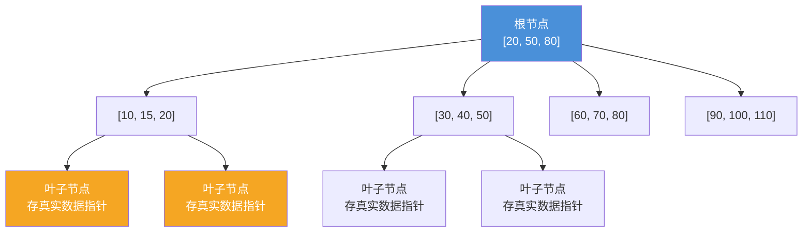
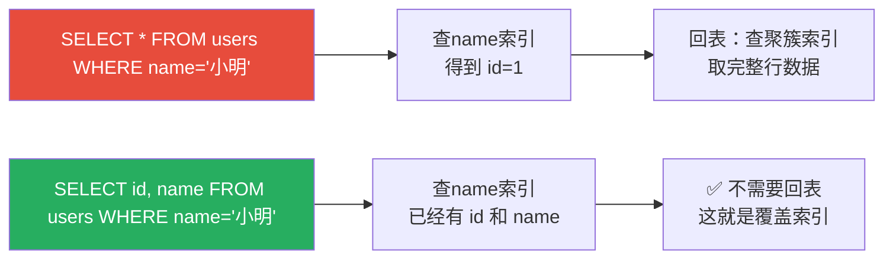

## 索引是什么？

想象你想在《新华字典》里找"数"字：

- **笨方法**：从第1页开始翻，一页一页找——可能要翻几百页
- **聪明方法**：先查拼音目录（shù → 第320页），直接翻到那一页

索引就是**字典的拼音目录**——它告诉你要找的数据在什么位置，避免你一页一页地翻。

> 💡 **核心认知**：索引的本质是"空间换时间"。用额外的存储空间（索引文件）来换取更快的查询速度。
{: .prompt-tip }

---

## 索引的底层结构：B+树

### 为什么不用二叉搜索树？

二叉搜索树的问题很明显：

1. **树太高**：100 万条数据，树高约 20 层——每次查询要读 20 次磁盘
2. **不稳定**：如果数据是顺序插入的，会退化成链表，查询变成 O(n)

### B+树：矮胖的多路搜索树

B+树把每个节点做得很大（MySQL 中每个节点 = 16KB），这样每个节点能存很多索引值，**树就会很矮**。



### B+树的两大优点

| 优点 | 解释 |
|:---:|:---|
| **树很矮** | 100 万条数据只需要 3 层树——查询只需 2~3 次磁盘 IO |
| **叶子节点相连** | 叶子节点是链表结构，范围查询（如 `WHERE id > 100`）可以顺着链表扫，不用再从根节点找 |

> 📖 **具体算一下**：每个索引值 8 字节（BIGINT），每个指针 6 字节，一个节点 = 16KB。<br>一个节点可以存 ≈ 16KB / (8+6)B ≈ **1170 个索引值**。<br>3 层 B+树可以存 1170 × 1170 × 16（叶子节点存数据）≈ **2000 万** 条数据。
{: .prompt-info }

---

## 索引的分类

### 1. 聚簇索引（主键索引）

**聚簇索引 = 索引和数据放在一起**——叶子节点存的是**完整的一行数据**。

```
聚簇索引叶子节点 → | id=1 | name=小明 | age=18 | phone=... |
                 → | id=2 | name=小红 | age=20 | phone=... |
```

特点：

- 一张表**只有一个**聚簇索引（因为数据只能有一种物理排列方式）
- 如果你不建主键，InnoDB 会悄悄帮你建一个隐藏的主键（ROW_ID）
- **按主键查询最快**——直接在聚簇索引就能拿到完整数据

### 2. 二级索引（普通索引）

**二级索引 = 索引和数据分开存**——叶子节点存的是**主键的值**。

```
name 索引叶子节点 → | "小明" | 主键id=1 |
                 → | "小红" | 主键id=2 |
```

按 name 查询的过程：

1. 查 name 索引，找到 `"小明"` 对应的主键 `id=1`
2. 用 `id=1` 再去查聚簇索引，拿到完整数据

**这两步叫做"回表"**——这是二级索引查询的核心代价。

### 回表 vs 不回表



> 💡 **覆盖索引**：如果你的查询字段刚好都在索引里，就不需要回表——这是性能优化的核心技巧之一。
{: .prompt-tip }

---

## 最左前缀原则

### 什么是联合索引？

在多个字段上建一个索引：

```sql
CREATE INDEX idx_name_age ON users(name, age);
```

这个索引的内部结构是**先按 name 排序，name 相同的再按 age 排序**：

```
(name=Alice, age=18) → id=5
(name=Alice, age=25) → id=8
(name=Bob, age=20)   → id=3
(name=Bob, age=35)   → id=12
(name=Carol, age=22) → id=7
```

### 最左前缀原则

**只能利用索引的最左边N个字段**。以 `(name, age)` 为例：

| 查询语句 | 是否用到索引？ | 用到了哪个部分 |
|:---|:---:|:---:|
| `WHERE name='小明'` | ✅ | name 部分 |
| `WHERE name='小明' AND age=18` | ✅ | name + age |
| `WHERE age=18` | ❌ | 完全用不到 |
| `WHERE name LIKE '小%'` | ✅ | name 的前缀匹配 |
| `WHERE name LIKE '%明'` | ❌ | 中间/后缀无法利用 |

> 📖 **类比**：联合索引像按"姓→名"排序的电话簿。你能快速找到"姓张的"，也能找到"姓张且名叫三的"，但你无法在按姓排序的簿子里快速找到"名叫三的所有人"。
{: .prompt-info }

### 索引选择性

不是所有字段都适合建索引。**索引选择性** = 不重复的值 / 总行数。

| 字段 | 选择性 | 是否适合建索引？ |
|:---:|:---:|:---:|
| 手机号 | ~1.0（几乎每个人不同） | ✅ 非常适合 |
| 姓名 | ~0.5 | ✅ 适合 |
| 性别 | 2 / N ≈ 0 | ❌ 不适合（索引不会更快） |
| 状态（只有3种） | 3 / N ≈ 0 | ❌ 通常不适合 |

> ⚠️ **索引不是越多越好**。索引会：<br>① 占用存储空间（索引文件可能比数据文件还大）<br>② 减慢写入速度（每次 INSERT/UPDATE 要更新所有索引）<br>③ 让优化器选择困难
{: .prompt-warning }

---

## 索引失效的常见场景

### 场景 1：在索引列上做函数/运算

```sql
-- ❌ 索引失效：对索引列做了运算
SELECT * FROM users WHERE YEAR(created_at) = 2026;

-- ✅ 改写为范围查询
SELECT * FROM users WHERE created_at >= '2026-01-01' AND created_at < '2027-01-01';
```

### 场景 2：字符串不加引号（隐式类型转换）

```sql
-- ❌ 索引失效：phone 是字符串，但你传了数字
SELECT * FROM users WHERE phone = 13800001234;

-- ✅ 加引号
SELECT * FROM users WHERE phone = '13800001234';
```

### 场景 3：模糊查询以 % 开头

```sql
-- ❌ 索引失效
SELECT * FROM users WHERE name LIKE '%明';

-- ✅ 前缀匹配可以用索引
SELECT * FROM users WHERE name LIKE '小%';
```

### 场景 4：OR 条件中有未建索引的列

```sql
-- ❌ 如果 age 没有索引，整个查询会走全表扫描
SELECT * FROM users WHERE name='小明' OR age=18;

-- ✅ 改写成 UNION
SELECT * FROM users WHERE name='小明'
UNION ALL
SELECT * FROM users WHERE age=18;
```

### 场景 5：不等于（!= 或 <>）

```sql
-- ❌ 通常索引失效（优化器可能觉得全表扫更快）
SELECT * FROM users WHERE name != '小明';
```

---

## 索引设计实践

### 实战 1：用户表怎么建索引？

```sql
CREATE TABLE users (
    id BIGINT PRIMARY KEY,           -- ✅ 主键自动是聚簇索引
    username VARCHAR(50) NOT NULL,   -- ✅ 建唯一索引
    phone VARCHAR(20),               -- ✅ 建普通索引（按手机号登录）
    email VARCHAR(100),              -- ✅ 建唯一索引
    status TINYINT,                  -- ❌ 不建（选择性太低）
    created_at DATETIME              -- ✅ 建索引（按时间范围查询）
);

CREATE UNIQUE INDEX uk_username ON users(username);
CREATE INDEX idx_phone ON users(phone);
CREATE INDEX idx_created_at ON users(created_at);
```

### 实战 2：订单表怎么建索引？

```sql
CREATE TABLE orders (
    id BIGINT PRIMARY KEY,
    user_id BIGINT,
    order_no VARCHAR(32),
    status TINYINT,
    amount DECIMAL(10,2),
    created_at DATETIME
);

-- ✅ 组合索引：先按用户查，再按时间查
CREATE INDEX idx_userid_created ON orders(user_id, created_at);

-- ✅ 订单号唯一
CREATE UNIQUE INDEX uk_orderno ON orders(order_no);

-- ❌ 不要单独建 status 索引（选择性太低）
-- 但如果需要查"待付款订单"且这类订单不多，可以考虑前缀索引
```

### 实战 3：覆盖索引优化

```sql
-- 需求：查某用户在2026年的订单总数和总金额

-- ❌ 需要回表
CREATE INDEX idx_userid ON orders(user_id);
SELECT COUNT(*), SUM(amount) FROM orders WHERE user_id = 1001 AND created_at LIKE '2026%';

-- ✅ 覆盖索引：把经常查的字段放到索引里，避免回表
CREATE INDEX idx_userid_created_amount ON orders(user_id, created_at, amount);
-- 现在查询只需扫索引，不需要回表！
```

---

## 索引使用的黄金法则

| 原则 | 解释 |
|:---:|:---|
| **索引要有选择性** | 性别、状态这种低选择性字段别建索引 |
| **不要建太多索引** | 每张表索引控制在 5 个以内 |
| **避免索引失效** | 不在索引列上做函数、运算、隐式转换 |
| **利用最左前缀** | 联合索引把最常用的字段放最左边 |
| **覆盖索引优先** | 能不回表就不回表 |
| **索引长度要短** | 字符串优先用前缀索引 `idx(col(20))` |
| **避免索引冗余** | 已有 `(a, b)` 就不需要单独的 `(a)` |

> 🎯 **口诀**：最左前缀要遵守，索引莫用函数逗；覆盖索引来加速，回表操作说拜拜。
{: .prompt-tip }

---

## 小结

索引是数据库性能的灵魂，核心要点：

1. **底层结构**：B+ 树——矮胖、多路搜索、叶子节点链表相连
2. **两大类型**：聚簇索引（数据和索引在一起）、二级索引（叶子存主键，需要回表）
3. **最左前缀**：联合索引只能利用左边部分，顺序很重要
4. **索引失效**：函数、隐式转换、前导 %、OR 条件中的未索引列都会让索引失效
5. **覆盖索引**：把查询字段放到索引里，避免回表——这是最常用的优化手段
6. **不滥用索引**：索引占用空间、减慢写入，选择性太低的字段别建索引

理解这些原则，你就能从"瞎建索引"进化到"有目的地设计索引"。
