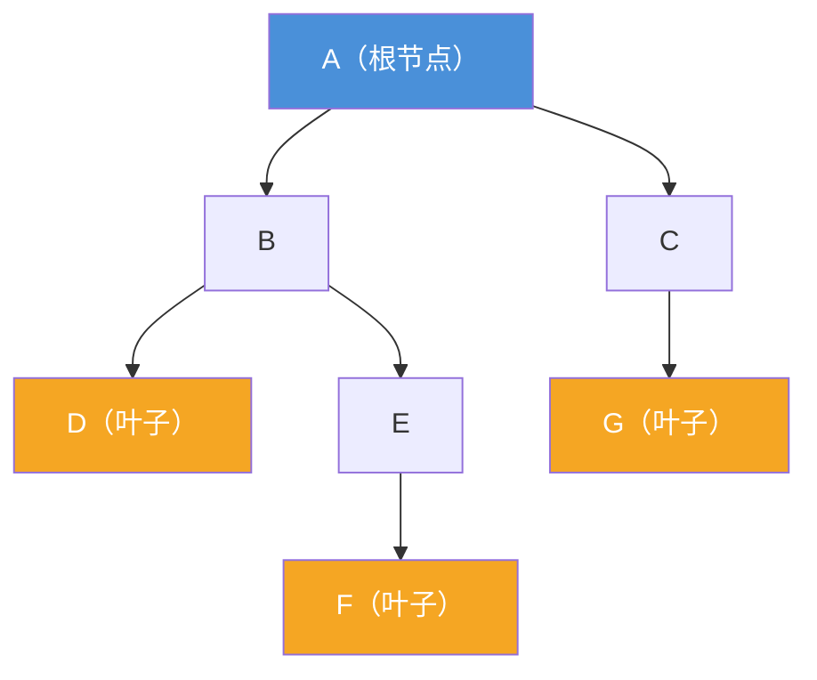
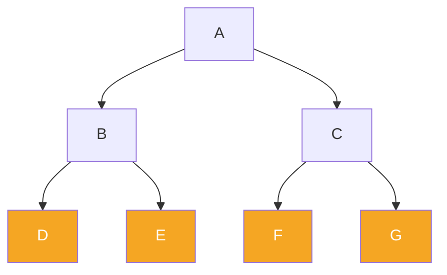
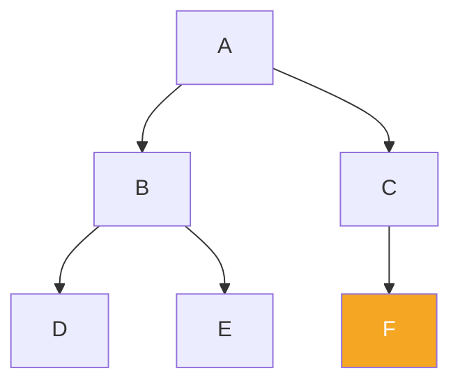
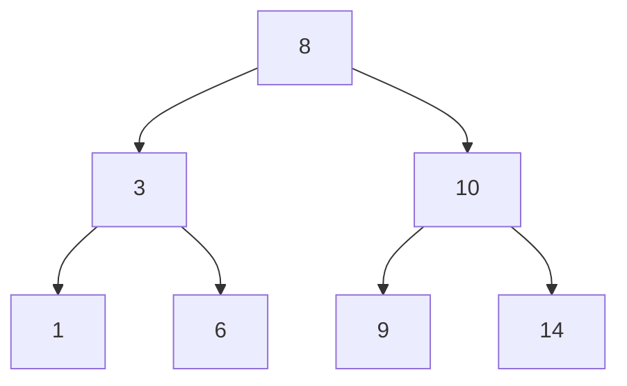
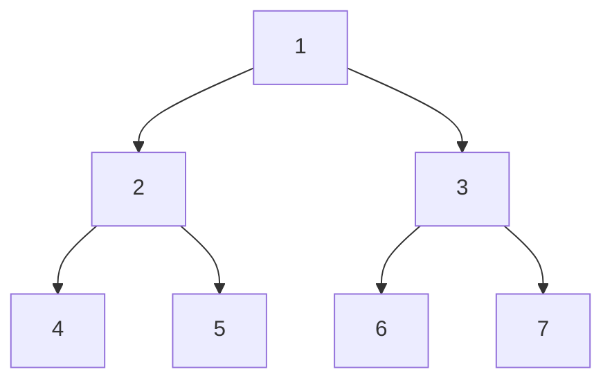
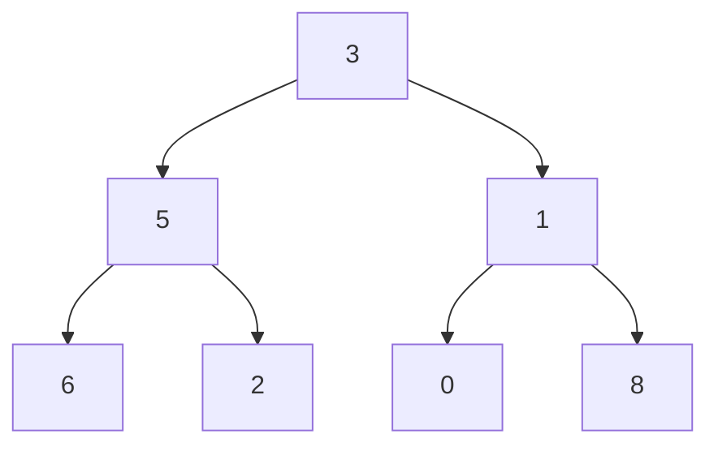

## 树是什么？

想象公司的组织架构：

```
            CEO
           /   \
         CTO   CFO
        /  \      \
      前端组 后端组  财务组
```

- 最上面的是**根节点**（CEO）
- 每个节点下面可以有多个**子节点**
- 没有子节点的叫**叶子节点**（前端组、后端组、财务组）
- 根到叶子经过的节点数 = **树的高度**

这就是**树**——一种层级结构，天然表示"一对多"的关系。

### 基本术语



| 术语 | 含义 | 示例 |
|:---:|:---|:---|
| **根节点** | 最顶层的节点，没有父节点 | A |
| **叶子节点** | 没有子节点的节点 | D, F, G |
| **父节点 / 子节点** | 相邻两层的关系 | B 是 D 的父节点，D 是 B 的子节点 |
| **兄弟节点** | 同一个父节点的节点 | D 和 E 是兄弟 |
| **高度** | 从根到最深叶子的节点数 | 高度 = 4（A→B→E→F） |
| **深度** | 从根到某个节点的路径长度 | F 的深度 = 3 |
| **度** | 一个节点有几个子节点 | B 的度 = 2 |

---

## 二叉树：最常用的树

**二叉树**：每个节点最多有两个子节点（左孩子、右孩子）。

### 节点结构

```python
class TreeNode:
    def __init__(self, val):
        self.val = val
        self.left = None    # 左孩子
        self.right = None   # 右孩子
```

### 几种特殊的二叉树

#### 1. 满二叉树（Perfect Binary Tree）

除叶子节点外，每个节点都有两个孩子，且所有叶子在同一层。



#### 2. 完全二叉树（Complete Binary Tree）

除最后一层外，其他层都是满的；最后一层的节点**从左到右连续排列**。



> 📖 **完全二叉树的重要性质**：可以用数组紧凑存储。如果节点在 `i` 位置：
> - 左孩子在 `2*i+1`
> - 右孩子在 `2*i+2`
> - 父节点在 `(i-1)//2`
>
> 堆排序就是基于完全二叉树实现的！
{: .prompt-info }

#### 3. 二叉搜索树（BST, Binary Search Tree）

**左子树所有节点 < 根节点 < 右子树所有节点**



**BST 的好处**：查找时每次排除一半节点，O(log n)。

```python
def search(root, target):
    if not root or root.val == target:
        return root
    if target < root.val:
        return search(root.left, target)   # 去左边找
    return search(root.right, target)      # 去右边找
```

#### 4. 平衡二叉搜索树（AVL / 红黑树）

BST 的问题：如果数据是有序插入的（1→2→3→4→5），树会退化成链表，查找变成 O(n)。

**平衡树**：每次插入后自动调整，保证左右子树高度差 ≤ 1。

| 树 | 特点 | 用途 |
|:---:|:---|:---|
| **AVL 树** | 严格平衡（高度差 ≤ 1），旋转多 | 读多写少场景 |
| **红黑树** | 近似平衡，旋转少，性能更稳定 | C++ 的 map/set、Java 的 TreeMap |

---

## 二叉树的四种遍历方式

**遍历**：按某种规则访问树中每个节点一次。

以下面这棵树为例：



### 1. 前序遍历（Preorder）：根 → 左 → 右

访问顺序：**1 → 2 → 4 → 5 → 3 → 6 → 7**

```python
def preorder(root):
    if not root:
        return
    print(root.val)       # 1. 先访问根
    preorder(root.left)   # 2. 再遍历左子树
    preorder(root.right)  # 3. 再遍历右子树
```

**用途**：复制一棵树、计算表达式的前缀表示（波兰式）。

### 2. 中序遍历（Inorder）：左 → 根 → 右

访问顺序：**4 → 2 → 5 → 1 → 6 → 3 → 7**

```python
def inorder(root):
    if not root:
        return
    inorder(root.left)    # 1. 先遍历左子树
    print(root.val)       # 2. 再访问根
    inorder(root.right)   # 3. 再遍历右子树
```

**特殊性质**：对 BST 做中序遍历，得到**有序数组**！

```
BST 的中序遍历：1 → 3 → 6 → 8 → 9 → 10 → 14（从小到大）
```

### 3. 后序遍历（Postorder）：左 → 右 → 根

访问顺序：**4 → 5 → 2 → 6 → 7 → 3 → 1**

```python
def postorder(root):
    if not root:
        return
    postorder(root.left)   # 1. 先遍历左子树
    postorder(root.right)  # 2. 再遍历右子树
    print(root.val)        # 3. 最后访问根
```

**用途**：删除整棵树、计算表达式的后缀表示（逆波兰式）。

### 4. 层序遍历（Level-order）：一层一层从左到右

访问顺序：**1 → 2 → 3 → 4 → 5 → 6 → 7**

```python
from collections import deque

def levelorder(root):
    if not root:
        return
    queue = deque([root])
    while queue:
        node = queue.popleft()
        print(node.val)          # 1. 访问当前节点
        if node.left:
            queue.append(node.left)   # 2. 左孩子入队
        if node.right:
            queue.append(node.right)  # 3. 右孩子入队
```

> 💡 **层序遍历 = BFS**：用队列实现，一层一层向外扩展。
{: .prompt-tip }

### 四种遍历对比

| 遍历方式 | 顺序 | 数据结构 | 典型用途 |
|:---:|:---:|:---:|:---|
| 前序 | 根→左→右 | 栈（递归） | 复制树、前缀表达式 |
| 中序 | 左→根→右 | 栈（递归） | BST 输出有序序列 |
| 后序 | 左→右→根 | 栈（递归） | 删除树、后缀表达式、自底向上计算 |
| 层序 | 一层一层 | 队列（BFS） | 按层输出、求树宽、最短路 |

---

## 非递归遍历（迭代法）

递归虽然简洁，但如果树很高可能栈溢出。面试常考非递归版本。

### 前序遍历（迭代）

```python
def preorder_iter(root):
    if not root:
        return []
    result, stack = [], [root]
    while stack:
        node = stack.pop()
        result.append(node.val)
        # 注意：先把右孩子压栈（因为栈是后进先出）
        if node.right:
            stack.append(node.right)
        if node.left:
            stack.append(node.left)
    return result
```

### 中序遍历（迭代）

```python
def inorder_iter(root):
    result, stack = [], []
    curr = root
    while curr or stack:
        # 一路向左走到底
        while curr:
            stack.append(curr)
            curr = curr.left
        curr = stack.pop()
        result.append(curr.val)   # 访问根
        curr = curr.right         # 转向右子树
    return result
```

### 后序遍历（迭代）

技巧：后序 = 前序遍历"根→右→左"，然后反转结果。

```python
def postorder_iter(root):
    if not root:
        return []
    result, stack = [], [root]
    while stack:
        node = stack.pop()
        result.append(node.val)
        if node.left:
            stack.append(node.left)
        if node.right:
            stack.append(node.right)
    return result[::-1]  # 反转得到后序
```

---

## 二叉树的经典问题

### 题 1：树的最大深度

```python
def maxDepth(root):
    if not root:
        return 0
    return 1 + max(maxDepth(root.left), maxDepth(root.right))
```

**思路**：空树深度为 0，否则 = 1（根节点） + 左右子树深度的较大值。

### 题 2：验证二叉搜索树（BST）

**思路**：中序遍历应该是严格递增的。

```python
def isValidBST(root):
    prev = float('-inf')

    def inorder(node):
        nonlocal prev
        if not node:
            return True
        if not inorder(node.left):
            return False
        if node.val <= prev:
            return False
        prev = node.val
        return inorder(node.right)

    return inorder(root)
```

### 题 3：从前序和中序遍历还原二叉树

**输入**：前序 `[3, 9, 20, 15, 7]`，中序 `[9, 3, 15, 20, 7]`

**思路**：
1. 前序第一个元素是根 `3`
2. 在中序中找到 `3`，左边是左子树 `[9]`，右边是右子树 `[15, 20, 7]`
3. 递归构造

### 题 4：最近公共祖先（LCA）



**问题**：节点 6 和节点 8 的最近公共祖先是谁？答：3

**节点 5 和节点 6** 的 LCA 是谁？答：5

```python
def lowestCommonAncestor(root, p, q):
    if not root or root == p or root == q:
        return root
    left = lowestCommonAncestor(root.left, p, q)
    right = lowestCommonAncestor(root.right, p, q)
    if left and right:
        return root  # 左右都找到 → 当前节点就是 LCA
    return left if left else right  # 哪边找到就返回哪边
```

### 题 5：对称二叉树

判断一棵树是不是镜像对称。

```python
def isSymmetric(root):
    def isMirror(left, right):
        if not left and not right:
            return True
        if not left or not right:
            return False
        return (left.val == right.val
                and isMirror(left.left, right.right)
                and isMirror(left.right, right.left))
    return isMirror(root.left, root.right) if root else True
```

---

## 树的工程应用

| 应用 | 数据结构 | 为什么用树？ |
|:---|:---|:---|
| **文件系统** | N 叉树 | 目录嵌套结构，天然就是树 |
| **编译器语法分析** | 抽象语法树（AST） | 表达式天然有层级结构 |
| **数据库索引** | B+ 树 | 多路搜索树，减少磁盘 IO |
| **前缀匹配** | Trie（字典树） | 自动补全、路由表匹配 |
| **区间查询** | 线段树 / 树状数组 | 高效查询区间和、区间最值 |
| **优先队列** | 二叉堆 | 完全二叉树的数组实现 |

---

## 解题技巧总结

| 技巧 | 适用场景 |
|:---:|:---|
| **递归** | 树的问题 90% 用递归解决（子问题 = 子树） |
| **递归三要素** | ① 终止条件 ② 单层逻辑 ③ 返回值 |
| **BFS / 队列** | 层序遍历、按层处理、最短路 |
| **DFS / 栈** | 非递归遍历、回溯、寻找路径 |
| **中序遍历** | BST 相关问题（有序性质） |
| **后序遍历** | 需要子树信息后才能处理根（如求和、删除） |
| **虚拟节点（Dummy）** | 链表问题延伸到树（合并、连接） |

> 🎯 **树的本质是递归**：每个子问题就是一棵子树，递归天然适合树。遇到树的问题先想"这个问题能不能分解成左子树+右子树的子问题？"
{: .prompt-tip }

---

## 小结

二叉树是最基础也最重要的非线性数据结构：

- **基本概念**：根、叶子、高度、深度、度
- **特殊类型**：满二叉树、完全二叉树、BST、平衡树
- **四种遍历**：前序（根左右）、中序（左根右）、后序（左右根）、层序（BFS）
- **经典问题**：最大深度、验证 BST、LCA、对称树、从前序中序还原
- **工程应用**：文件系统、AST、B+ 树索引、Trie、堆

掌握了二叉树和递归思维，你就能看懂更多复杂数据结构（红黑树、AVL、线段树、Trie）的底层原理。
