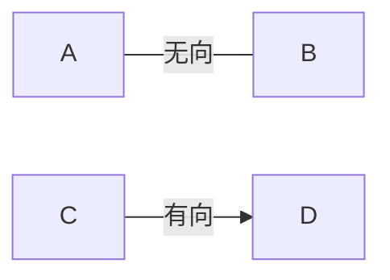
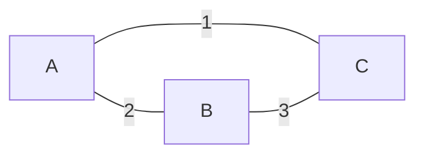
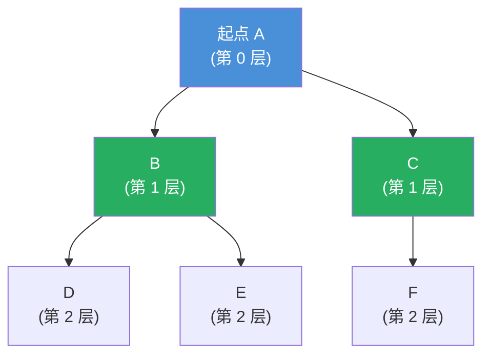
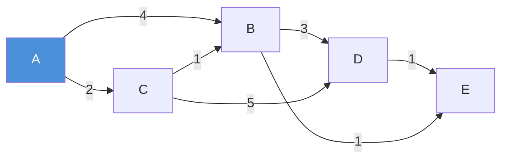
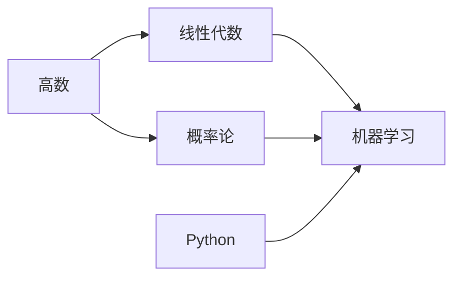

## 图是什么？

想象城市的地铁线路图：

- **站点** = 节点（Vertex）
- **站点之间的线路** = 边（Edge）
- A 站到 B 站有几站路 = 路径（Path）
- 不同线路的换乘 = 复杂连接

**图（Graph）** = 节点集合 + 边的集合 = G(V, E)

### 图的基本类型

#### 1. 有向图 vs 无向图



- **无向图**：边是双向的（社交网络：A 和 B 是朋友）
- **有向图**：边有方向（网页链接：A 页链接到 B 页，B 不一定链接到 A）

#### 2. 带权图 vs 无权图

| 类型 | 边的意义 | 例子 |
|:---:|:---|:---|
| **无权图** | 只有"是否连通" | 社交网络（只有是否认识） |
| **带权图** | 边有数值（权重） | 地图（两点间的距离）、网络（带宽、延迟） |

#### 3. 稀疏图 vs 稠密图

- **稀疏图**：边数远小于 V²（大多数真实网络，如地铁线路、社交网络）
- **稠密图**：边数接近 V²（几乎每两个节点之间都有边）

---

## 图的存储方式

### 1. 邻接矩阵（Adjacency Matrix）

用一个二维矩阵表示：`matrix[i][j] = 边的权重（或 1/0）`



```
矩阵：
     A  B  C
  A [0, 2, 1]
  B [2, 0, 3]
  C [1, 3, 0]
```

**优点**：判断两点是否相连 O(1)

**缺点**：空间 O(V²)，稀疏图太浪费；遍历一个节点的邻居需要 O(V)

### 2. 邻接表（Adjacency List）

每个节点维护一个链表/数组，存它的邻居节点。

```python
# 用字典实现邻接表
graph = {
    'A': [('B', 2), ('C', 1)],
    'B': [('A', 2), ('C', 3)],
    'C': [('A', 1), ('B', 3)]
}

# 或者用列表（节点编号用 0, 1, 2...）
graph2 = [
    [(1, 2), (2, 1)],   # 节点 0 的邻居
    [(0, 2), (2, 3)],   # 节点 1 的邻居
    [(0, 1), (1, 3)]    # 节点 2 的邻居
]
```

**优点**：空间 O(V + E)，稀疏图很省空间；遍历邻居 O(degree(v))

**缺点**：判断两点是否相连 O(degree(v))，不如矩阵快

> 💡 **工程实践**：绝大多数情况用邻接表。只有当图非常稠密（边数接近 V²）时才考虑邻接矩阵。
{: .prompt-tip }

---

## 图的两种遍历：BFS & DFS

### BFS（广度优先搜索）：一层一层扩散

**核心思想**：从起点开始，先访问所有邻居（第一层），再访问邻居的邻居（第二层）...



**数据结构**：队列（Queue）

```python
from collections import deque

def bfs(graph, start):
    visited = {start}           # 已访问集合（去重）
    queue = deque([start])      # 队列存待访问节点

    while queue:
        node = queue.popleft()  # 出队
        print(node)             # 访问当前节点

        for neighbor in graph[node]:
            if neighbor not in visited:
                visited.add(neighbor)
                queue.append(neighbor)  # 邻居入队
```

**复杂度**：每个节点入队一次，每条边检查一次 → O(V + E)

**BFS 的性质**：在无权图中，BFS 找到的路径是**最短路径**（按边数计算）。

### DFS（深度优先搜索）：一路走到底再回头

**核心思想**：从起点开始，沿着一条路走到黑，走不通就回溯。

**数据结构**：栈（Stack），或递归（用系统的调用栈）

```python
# 递归版本（最简洁）
def dfs(graph, start, visited=None):
    if visited is None:
        visited = set()
    visited.add(start)
    print(start)

    for neighbor in graph[start]:
        if neighbor not in visited:
            dfs(graph, neighbor, visited)  # 递归深入
```

```python
# 迭代版本（避免递归深度限制）
def dfs_iterative(graph, start):
    visited = set()
    stack = [start]

    while stack:
        node = stack.pop()
        if node in visited:
            continue
        visited.add(node)
        print(node)
        # 注意：反序压入栈，保持访问顺序与递归一致
        for neighbor in reversed(graph[node]):
            if neighbor not in visited:
                stack.append(neighbor)
```

**复杂度**：O(V + E)

### BFS vs DFS 对比

| 维度 | BFS | DFS |
|:---:|:---|:---|
| **数据结构** | 队列 | 栈（或递归） |
| **遍历顺序** | 一层一层扩散 | 一条路走到底再回溯 |
| **空间** | 最坏 O(V)（队列可能很大） | 最坏 O(V)（递归栈深度） |
| **最短路径** | ✅ 无权图中一定找到最短 | ❌ 不能保证 |
| **状态空间搜索** | 适合求最短步数、层序信息 | 适合所有路径、找环、回溯 |
| **记忆化** | 适合逐层扩展 + 剪枝 | 适合子问题重叠（配合 memo） |

---

## 经典图算法

### 算法 1：Dijkstra 最短路径（单源最短路径）

**问题**：从起点 S 出发，到所有其他节点的最短路径。边权**非负**。

**核心思想**：贪心 + 最小堆。每次选"距离起点最近的未访问节点"，然后用它更新邻居。



```python
import heapq

def dijkstra(graph, start):
    # graph 是邻接表：graph[u] = [(v, weight), ...]
    n = len(graph)
    dist = [float('inf')] * n    # 距离数组，初始无穷大
    dist[start] = 0              # 起点到自己距离为 0
    heap = [(0, start)]          # (距离, 节点)

    while heap:
        d, u = heapq.heappop(heap)  # 取距离最小的节点

        if d > dist[u]:
            continue                # 已经找到更短路径，跳过

        for v, w in graph[u]:
            if dist[u] + w < dist[v]:
                dist[v] = dist[u] + w   # 找到更短路径
                heapq.heappush(heap, (dist[v], v))

    return dist
```

**复杂度**：用最小堆实现 → O(E log V)

**Dijkstra 的限制**：边权必须 ≥ 0。如果有负权边，可能出错（贪心选择后，后续发现更短路径）。

### 算法 2：Bellman-Ford（可处理负权）

**核心思想**：每条边最多需要松弛 V-1 次。如果第 V 次还能松弛 → 存在**负环**。

```python
def bellman_ford(n, edges, start):
    # edges = [(u, v, w), ...]
    dist = [float('inf')] * n
    dist[start] = 0

    for i in range(n - 1):   # 做 V-1 轮松弛
        updated = False
        for u, v, w in edges:
            if dist[u] + w < dist[v]:
                dist[v] = dist[u] + w
                updated = True
        if not updated:
            break   # 提前结束

    # 第 V 轮：如果还能松弛 → 有负环
    for u, v, w in edges:
        if dist[u] + w < dist[v]:
            return None   # 有负环，最短路径无意义

    return dist
```

**复杂度**：O(V × E)，比 Dijkstra 慢，但能处理负权。

### 算法 3：Floyd-Warshall（多源最短路径）

**问题**：求任意两点之间的最短路径。

**核心思想**：动态规划。`dist[k][i][j]` = 经过节点 {1..k} 时，i 到 j 的最短距离。

```python
def floyd_warshall(n, graph):
    # 初始化距离矩阵
    dist = [[float('inf')] * n for _ in range(n)]
    for i in range(n):
        dist[i][i] = 0

    for u, v, w in graph:
        dist[u][v] = w

    # 动态规划
    for k in range(n):          # 经过中间节点 k
        for i in range(n):      # 起点 i
            for j in range(n):  # 终点 j
                dist[i][j] = min(
                    dist[i][j],
                    dist[i][k] + dist[k][j]
                )

    return dist
```

**复杂度**：O(V³)，空间 O(V²)

**适用场景**：节点数不多（< 500）、需要任意两点距离的矩阵。

### 算法 4：拓扑排序（Topological Sort）

**问题**：有向无环图（DAG）中，找出一个"合理顺序"——所有边都是从前面的节点指向后面的节点。

**例子**：选课依赖关系



你不能先学机器学习再学高数。拓扑排序给出一个合法的学习顺序。

**Kahn 算法（BFS 方式）**：

```python
from collections import deque

def topological_sort(n, graph):
    # graph: 邻接表；indegree: 每个节点的入度
    indegree = [0] * n
    for u in range(n):
        for v in graph[u]:
            indegree[v] += 1

    queue = deque([i for i in range(n) if indegree[i] == 0])
    result = []

    while queue:
        node = queue.popleft()
        result.append(node)
        for neighbor in graph[node]:
            indegree[neighbor] -= 1
            if indegree[neighbor] == 0:
                queue.append(neighbor)

    return result if len(result) == n else None  # None = 有环
```

**复杂度**：O(V + E)

**应用**：课程表、任务依赖调度、编译顺序、事件流处理。

### 算法 5：最小生成树（Minimum Spanning Tree）

**问题**：给一个带权无向图，选若干边使得所有节点连通，且总权重最小。

#### Kruskal 算法（按边排序 + 并查集）

```
步骤：
  1. 把所有边按权重从小到大排序
  2. 依次取边，如果这条边连接了两个不同的连通分量 → 加入
  3. 直到选了 V-1 条边
```

需要用**并查集（Union-Find / Disjoint Set）**判断两个节点是否在同一集合。

```python
class UnionFind:
    def __init__(self, n):
        self.parent = list(range(n))
        self.rank = [0] * n

    def find(self, x):
        if self.parent[x] != x:
            self.parent[x] = self.find(self.parent[x])  # 路径压缩
        return self.parent[x]

    def union(self, x, y):
        px, py = self.find(x), self.find(y)
        if px == py:
            return False
        # 按秩合并
        if self.rank[px] < self.rank[py]:
            self.parent[px] = py
        else:
            self.parent[py] = px
            if self.rank[px] == self.rank[py]:
                self.rank[px] += 1
        return True

def kruskal(n, edges):
    # edges = [(w, u, v), ...]
    edges.sort()
    uf = UnionFind(n)
    total_weight = 0
    mst = []

    for w, u, v in edges:
        if uf.union(u, v):
            mst.append((u, v, w))
            total_weight += w
            if len(mst) == n - 1:
                break

    return total_weight, mst
```

**复杂度**：排序 O(E log E) + 并查集几乎 O(1) → O(E log E)

#### Prim 算法（类似 Dijkstra）

从一个节点开始，每次选"连接当前树和外部节点的最小权重边"。

**复杂度**：用最小堆 → O(E log V)

**Kruskal vs Prim**：

| 算法 | 思路 | 适用场景 |
|:---:|:---|:---|
| **Kruskal** | 按边排序，从小到大选（不形成环的） | 稀疏图，代码简洁 |
| **Prim** | 从一个点扩展，每次选最小边连接外部 | 稠密图（尤其邻接矩阵） |

---

## 图算法总结表

| 问题 | 算法 | 时间复杂度 | 空间复杂度 | 适用条件 |
|:---|:---|:---:|:---:|:---|
| 单源最短路（正权） | **Dijkstra** | O(E log V) | O(V + E) | 边权 ≥ 0 |
| 单源最短路（负权） | **Bellman-Ford** | O(V × E) | O(V) | 可以有负权，检测负环 |
| 多源最短路 | **Floyd-Warshall** | O(V³) | O(V²) | 节点数少，需要距离矩阵 |
| 拓扑排序 | **Kahn / DFS** | O(V + E) | O(V + E) | DAG（有向无环图） |
| 最小生成树 | **Kruskal** | O(E log E) | O(E) | 无向图，稀疏图 |
| 最小生成树 | **Prim** | O(E log V) | O(V + E) | 无向图，稠密图 |
| 遍历 | **BFS / DFS** | O(V + E) | O(V) | 通用 |

---

## 图在工程中的应用

| 应用场景 | 用了什么 | 为什么用图 |
|:---|:---|:---|
| **导航系统（高德/百度地图）** | 最短路径（A\*、Dijkstra） | 道路 = 边，路口 = 节点 |
| **社交网络推荐** | 连通分量、中心性算法 | 用户 = 节点，关系 = 边 |
| **网页排名（Google PageRank）** | 有向图 + 特征向量 | 网页 = 节点，超链接 = 边 |
| **网络路由（OSPF）** | 最短路径（Dijkstra） | 路由器 = 节点，链路 = 边 |
| **课程/任务依赖** | 拓扑排序 | 依赖关系 = 有向边 |
| **电路设计** | 最小生成树 | 连线成本最小化 |
| **编译器优化** | 数据流图、控制流图 | 指令依赖关系 |
| **AI 路径规划** | A\* 搜索 | 游戏地图、机器人导航 |

---

## 解题技巧总结

| 看到关键词 | 想到什么算法 |
|:---|:---|
| "最短路径"、"最少步数"、"距离" | Dijkstra（正权）、BFS（无权）、Floyd-Warshall（多源） |
| "依赖关系"、"先后顺序"、"课程安排" | 拓扑排序（Kahn 或 DFS） |
| "连通分量"、"分组"、"岛屿数量" | 并查集 / DFS / BFS |
| "最小代价连接所有节点"、"最小成本" | 最小生成树（Kruskal / Prim） |
| "所有路径"、"全部方案" | DFS + 回溯 |
| "层序"、"最短步数"、"最短步数" | BFS |
| "判断是否有环" | 拓扑排序（有向图）、并查集（无向图） |

> 🎯 **图的本质 = 关系建模**。遇到问题，先想：谁是节点？谁是边？边有没有方向？有没有权重？—— 一旦确定建模方式，剩下的就是套算法了。
{: .prompt-tip }

---

## 小结

图是最灵活的数据结构，能建模各种"关系"问题：

- **存储**：邻接表（稀疏图首选）、邻接矩阵（稠密图）
- **遍历**：BFS（层序、最短路）、DFS（深入、回溯）
- **最短路径**：Dijkstra（正权 O(E log V)）、Bellman-Ford（负权 O(V×E)）、Floyd-Warshall（多源 O(V³)）
- **拓扑排序**：Kahn 算法（BFS）、处理 DAG 的依赖关系
- **最小生成树**：Kruskal（排序 + 并查集）、Prim（从节点扩展）
- **并查集**：判断连通性、实现 Kruskal、近乎 O(1) 的操作

掌握图算法，你就能解决从导航、社交推荐、电路设计到任务调度等一大堆现实问题了。
