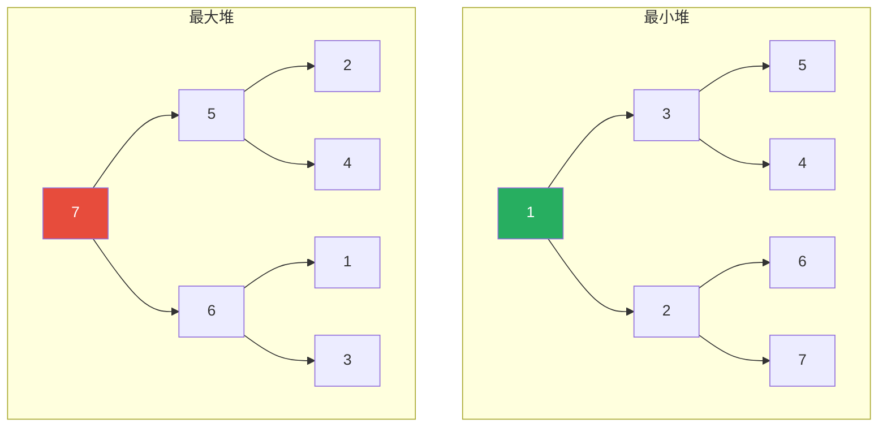
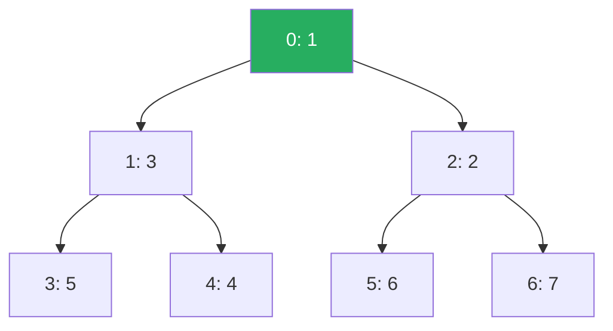
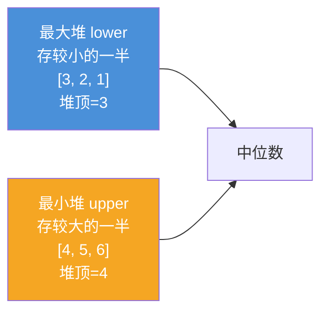

## 堆是什么？

想象一个公司的紧急任务列表：

- 有很多任务排队，每个任务有不同的优先级
- 你每次取**优先级最高**的任务先做
- 新任务来了，放到合适的位置

**堆（Heap）** 就是解决这种"每次取最大值/最小值"问题的数据结构。

### 堆的两个性质

1. **完全二叉树**：除最后一层外，其他层都满；最后一层的节点从左到右连续
2. **堆性质**：
   - **最小堆**：每个节点的值 ≤ 其子节点的值（根是最小值）
   - **最大堆**：每个节点的值 ≥ 其子节点的值（根是最大值）



> 💡 **重要**：堆只保证"父节点 ≤ 子节点"（最小堆），但**不保证左右子节点的大小关系**。上面的最小堆中，3 > 2（左孩子 > 右孩子），这是允许的。
{: .prompt-tip }

---

## 堆的数组存储

堆是完全二叉树，可以**用数组紧凑存储**（不需要指针！）。

```
节点位置 = i
  左孩子 = 2*i + 1
  右孩子 = 2*i + 2
  父节点 = (i-1) // 2
```



**数组**：`[1, 3, 2, 5, 4, 6, 7]`

| 索引 | 0 | 1 | 2 | 3 | 4 | 5 | 6 |
|:---:|:---:|:---:|:---:|:---:|:---:|:---:|:---:|
| 值 | 1 | 3 | 2 | 5 | 4 | 6 | 7 |

> 📖 **为什么用数组？**
> - 不需要存指针，节省空间
> - 通过下标计算定位，O(1) 找到父/子节点
> - 缓存友好（连续内存）
{: .prompt-info }

---

## 堆的两个核心操作：上浮 & 下沉

### 1. 上浮（Heapify Up / Sift Up）

**场景**：插入新元素时，把元素放到数组末尾，然后"上浮"到正确位置。

**规则**：如果新元素 < 父节点（最小堆），就和父节点交换，继续向上比较。

```
插入 0 到最小堆 [1, 3, 2, 5, 4, 6, 7]

步骤 1：放到末尾
  [1, 3, 2, 5, 4, 6, 7, 0]
              0 的父节点是 (7-1)//2 = 3 → 值是 5

步骤 2：0 < 5，交换
  [1, 3, 2, 0, 4, 6, 7, 5]
              0 的父节点是 (3-1)//2 = 1 → 值是 3

步骤 3：0 < 3，交换
  [1, 0, 2, 3, 4, 6, 7, 5]
              0 的父节点是 (1-1)//2 = 0 → 值是 1

步骤 4：0 < 1，交换
  [0, 1, 2, 3, 4, 6, 7, 5]
              0 已经是根了，停止

✅ 完成！0 上浮到了正确位置（根）
```

### 2. 下沉（Heapify Down / Sift Down）

**场景**：删除堆顶元素时，把最后一个元素放到堆顶，然后"下沉"到正确位置。

**规则**：如果当前节点 > 两个子节点中较小的那个（最小堆），就和较小的子节点交换，继续向下。

```
删除堆顶（最小堆 [1, 3, 2, 5, 4, 6, 7]）

步骤 1：移除堆顶 1，把最后一个元素 7 放到堆顶
  [7, 3, 2, 5, 4, 6]
              7 的两个孩子：3（左）、2（右），较小的是 2

步骤 2：7 > 2，和右孩子交换
  [2, 3, 7, 5, 4, 6]
              7 的两个孩子：6（左）、无（右），较小的是 6

步骤 3：7 > 6，和左孩子交换
  [2, 3, 6, 5, 4, 7]
              7 现在是叶子，停止

✅ 完成！新的堆顶是 2
```

### 代码实现（最小堆）

```python
class MinHeap:
    def __init__(self):
        self.heap = []

    # 辅助：交换两个元素
    def _swap(self, i, j):
        self.heap[i], self.heap[j] = self.heap[j], self.heap[i]

    # 辅助：获取父节点索引
    def _parent(self, i):
        return (i - 1) // 2

    # 辅助：获取左右孩子索引
    def _left(self, i):
        return 2 * i + 1

    def _right(self, i):
        return 2 * i + 2

    # 上浮：从 i 向上调整
    def _sift_up(self, i):
        while i > 0 and self.heap[i] < self.heap[self._parent(i)]:
            self._swap(i, self._parent(i))
            i = self._parent(i)

    # 下沉：从 i 向下调整
    def _sift_down(self, i):
        n = len(self.heap)
        while True:
            smallest = i
            left, right = self._left(i), self._right(i)

            # 找三个节点（自己 + 两个孩子）中最小的
            if left < n and self.heap[left] < self.heap[smallest]:
                smallest = left
            if right < n and self.heap[right] < self.heap[smallest]:
                smallest = right

            if smallest == i:
                break  # 已经在正确位置
            self._swap(i, smallest)
            i = smallest

    # 插入元素
    def push(self, x):
        self.heap.append(x)
        self._sift_up(len(self.heap) - 1)

    # 弹出堆顶（最小值）
    def pop(self):
        if not self.heap:
            return None
        top = self.heap[0]
        # 把最后一个元素放到堆顶
        self.heap[0] = self.heap[-1]
        self.heap.pop()
        self._sift_down(0)
        return top

    # 查看堆顶
    def peek(self):
        return self.heap[0] if self.heap else None
```

### 时间复杂度

| 操作 | 复杂度 | 说明 |
|:---:|:---:|:---|
| push（插入） | O(log n) | 最多上浮 log n 层 |
| pop（弹出堆顶） | O(log n) | 最多下沉 log n 层 |
| peek（查看堆顶） | O(1) | 直接看第一个元素 |
| 建堆（heapify） | O(n) | 不是 O(n log n)！见下文 |

---

## 建堆（Heapify）：从无序数组到堆

给一个无序数组，如何把它变成堆？

**朴素方法**：一个元素一个元素 push → O(n log n)

**更好的方法**：从最后一个非叶子节点开始，从后向前逐个做下沉操作 → **O(n)**

```
数组：[3, 1, 4, 1, 5, 9, 2, 6]

最后一个非叶子节点的索引 = (n//2 - 1) = 3

步骤 1：对索引 3（值=1）做下沉 → 已经满足堆性质，不变
  [3, 1, 4, 1, 5, 9, 2, 6]

步骤 2：对索引 2（值=4）做下沉 → 4 和 2 交换
  [3, 1, 2, 1, 5, 9, 4, 6]

步骤 3：对索引 1（值=1）做下沉 → 已经满足堆性质，不变
  [3, 1, 2, 1, 5, 9, 4, 6]

步骤 4：对索引 0（值=3）做下沉 → 3 和 1 交换，再和 1 交换
  [1, 1, 2, 3, 5, 9, 4, 6]

✅ 完成！现在是一个最小堆
```

```python
def heapify(arr):
    n = len(arr)
    # 从最后一个非叶子节点开始，向前遍历
    for i in range(n // 2 - 1, -1, -1):
        # 对 arr[i] 做下沉
        while True:
            smallest = i
            left, right = 2*i+1, 2*i+2
            if left < n and arr[left] < arr[smallest]:
                smallest = left
            if right < n and arr[right] < arr[smallest]:
                smallest = right
            if smallest == i:
                break
            arr[i], arr[smallest] = arr[smallest], arr[i]
            i = smallest
```

> 📖 **为什么建堆是 O(n)？** 直觉证明：
> - 树的倒数第一层（叶子）：n/2 个节点，下沉 0 步 → O(n/2 × 0)
> - 倒数第二层：n/4 个节点，最多下沉 1 步 → O(n/4 × 1)
> - 倒数第三层：n/8 个节点，最多下沉 2 步 → O(n/8 × 2)
> - ...
> - 总和：n × (0/2 + 1/4 + 2/8 + 3/16 + ...) = n × 2 = O(n)
{: .prompt-info }

---

## 堆排序（Heap Sort）

**思路**：
1. 把数组建成一个最大堆
2. 每次把堆顶（最大值）和最后一个元素交换，然后把堆顶下沉
3. 数组从后往前逐渐有序

```python
def heap_sort(arr):
    n = len(arr)

    # 1. 建最大堆
    def sift_down(i, end):
        while True:
            largest = i
            left, right = 2*i+1, 2*i+2
            if left < end and arr[left] > arr[largest]:
                largest = left
            if right < end and arr[right] > arr[largest]:
                largest = right
            if largest == i:
                break
            arr[i], arr[largest] = arr[largest], arr[i]
            i = largest

    # 建堆
    for i in range(n//2 - 1, -1, -1):
        sift_down(i, n)

    # 2. 排序：堆顶和末尾交换，然后堆缩小 1
    for i in range(n - 1, 0, -1):
        arr[0], arr[i] = arr[i], arr[0]  # 最大值放到末尾
        sift_down(0, i)                  # 堆大小变为 i（不包括已排序部分）

    return arr
```

**复杂度**：建堆 O(n) + n 次下沉 O(log n) = **O(n log n)**

**特点**：
- 原地排序，空间复杂度 O(1)
- 不稳定排序（相同元素的相对位置可能改变）
- 最坏、平均、最好情况都是 O(n log n)

### 三种排序算法对比

| 算法 | 平均时间 | 最坏时间 | 空间 | 稳定性 | 适用场景 |
|:---:|:---:|:---:|:---:|:---:|:---|
| **快排** | O(n log n) | O(n²) | O(log n) | 不稳定 | 大多数情况，实际最快 |
| **归并** | O(n log n) | O(n log n) | O(n) | 稳定 | 需要稳定排序、链表 |
| **堆排** | O(n log n) | O(n log n) | O(1) | 不稳定 | 空间受限、Top-K |

---

## 优先队列：堆的直接应用

**优先队列 = 按优先级出队，而不是按先进先出**。

最常见的实现就是用堆。

### Python 的 heapq 模块

```python
import heapq

heap = [3, 1, 4, 1, 5, 9, 2, 6]
heapq.heapify(heap)       # 原地建堆（最小堆）
print(heap)               # [1, 1, 2, 3, 5, 9, 4, 6]

heapq.heappush(heap, 0)   # 插入元素
heapq.heappop(heap)       # 弹出最小值 → 0
heapq.heappop(heap)       # 弹出最小值 → 1

# Top-K 问题
nums = [3, 1, 4, 1, 5, 9, 2, 6, 5, 3, 5]
heapq.nlargest(3, nums)   # → [9, 6, 5]
heapq.nsmallest(3, nums)  # → [1, 1, 2]
```

### 经典问题 1：Top-K（找出最大的 K 个数）

```python
def top_k(nums, k):
    heap = []
    for x in nums:
        heapq.heappush(heap, x)
        if len(heap) > k:
            heapq.heappop(heap)  # 堆里只有 k 个元素，pop 掉最小的
    return heap  # 堆里就是最大的 k 个（顺序不一定）
```

**复杂度**：O(n log k)，空间 O(k)

**为什么好？** 如果 n 是 1 亿，k 是 100：
- 全排序需要 O(n log n) ≈ 1 亿 × 27 ≈ 27 亿操作
- 用堆需要 O(n log k) ≈ 1 亿 × 7 ≈ 7 亿操作
- 而且内存只需要 O(k) = 100 个元素，可以流式处理（不需要全读进内存）

### 经典问题 2：合并 K 个有序链表

```
链表1：1 → 4 → 5
链表2：1 → 3 → 4
链表3：2 → 6

合并后：1 → 1 → 2 → 3 → 4 → 4 → 5 → 6
```

**思路**：维护一个大小为 K 的最小堆，存每个链表的当前头节点。

```python
import heapq

class ListNode:
    def __init__(self, val=0, next=None):
        self.val = val
        self.next = next

def merge_k_lists(lists):
    heap = []
    # 把每个链表的头节点入堆（加上索引避免值相同的比较问题）
    for i, node in enumerate(lists):
        if node:
            heapq.heappush(heap, (node.val, i, node))

    dummy = ListNode(0)
    curr = dummy

    while heap:
        val, i, node = heapq.heappop(heap)
        curr.next = node
        curr = curr.next
        if node.next:
            heapq.heappush(heap, (node.next.val, i, node.next))

    return dummy.next
```

**复杂度**：O(n log k)，每个元素入堆出堆一次。

### 经典问题 3：数据流的中位数

**设计**：一个最大堆存较小的一半（lower），一个最小堆存较大的一半（upper）。



**规则**：
- 如果元素总数是奇数，lower 比 upper 多 1 个元素 → 中位数 = lower 的堆顶
- 如果元素总数是偶数 → 中位数 = (lower堆顶 + upper堆顶) / 2

**插入逻辑**：
1. 新元素先入 lower
2. 如果 lower 的最大值 > upper 的最小值，把 lower 的堆顶移到 upper（保证有序）
3. 如果 lower 的大小超过 upper + 1，把 lower 的堆顶移到 upper（保证数量平衡）

**复杂度**：插入 O(log n)，查询中位数 O(1)

---

## 堆的其他变种

| 变种 | 特点 | 用途 |
|:---:|:---|:---|
| **二叉堆** | 完全二叉树 + 数组存储 | 通用优先队列（最简单） |
| **斐波那契堆** | 平摊 O(1) 插入和 decrease-key | Dijkstra 算法理论优化 |
| **二项堆** | 支持 O(log n) 合并 | 可合并的优先队列 |
| **配对堆** | 实际性能接近斐波那契堆 | 实际工程使用 |
| **左式堆 / 斜堆** | 支持高效合并 | 合并优先队列 |

---

## 小结

堆是一种"隐形冠军"的数据结构——你可能不直接用它，但很多系统的核心都依赖它：

- **核心性质**：完全二叉树 + 堆性质（父节点 ≤ 子节点）
- **核心操作**：上浮（sift up）、下沉（sift down），都是 O(log n)
- **建堆**：从后向前逐个下沉 → **O(n)**
- **堆排序**：建堆 + 交换堆顶和末尾 → O(n log n)，原地，不稳定
- **优先队列**：堆的直接应用，O(log n) 插入删除，O(1) 取最值
- **经典问题**：Top-K、合并 K 个有序链表、数据流中位数

掌握了堆，你就能看懂操作系统的进程调度、数据库的查询优化器、推荐系统的排序——这些地方都在用优先队列！
