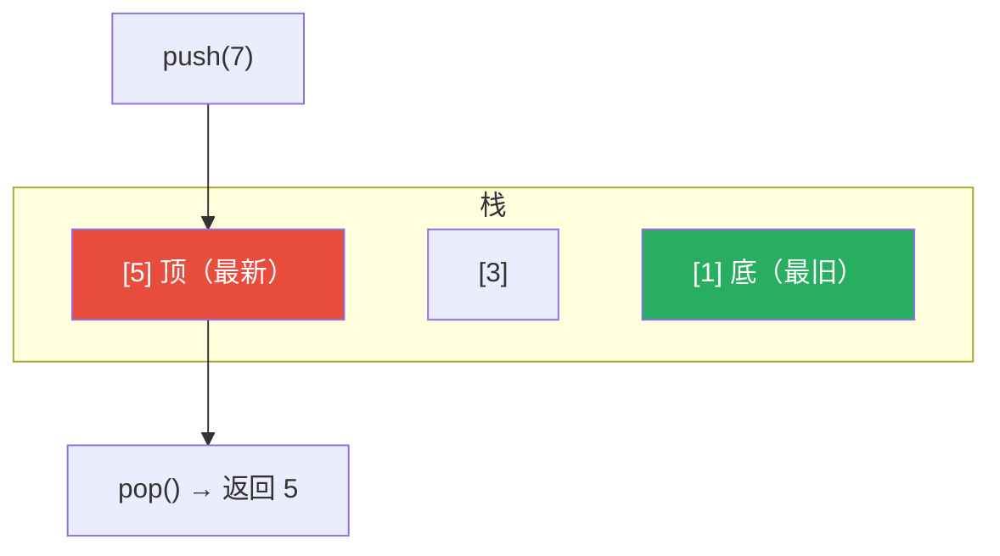
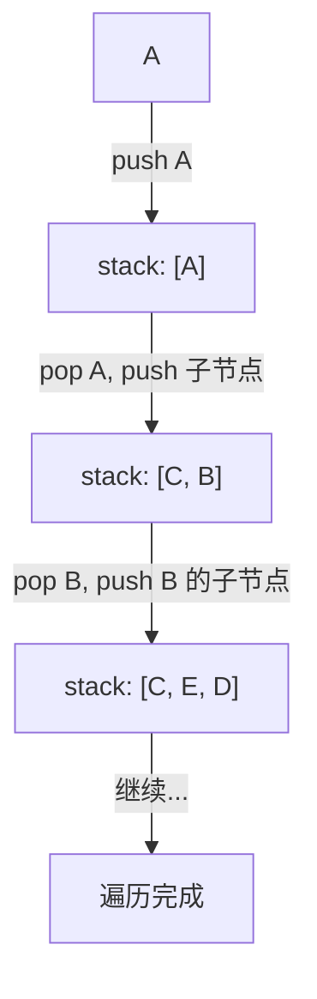
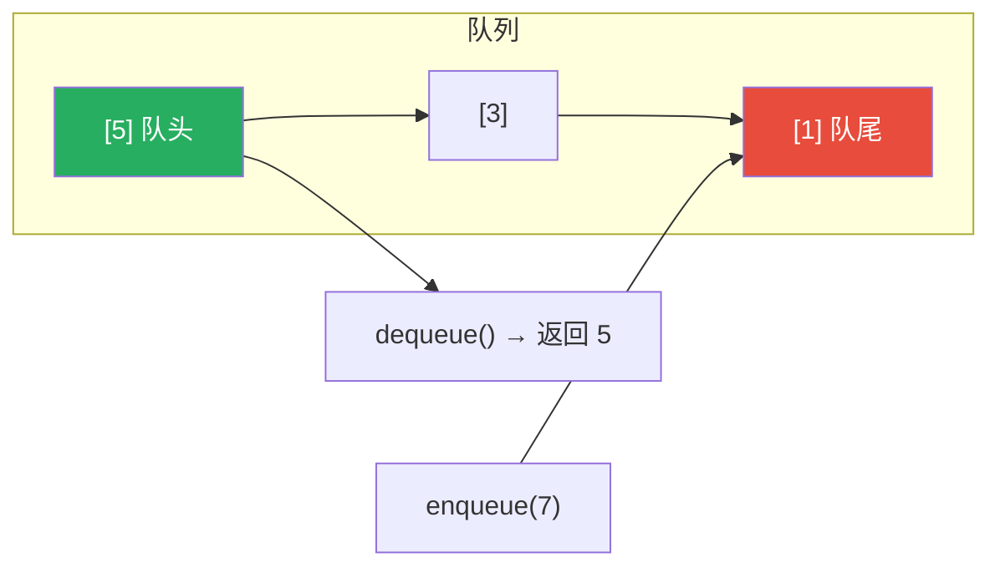
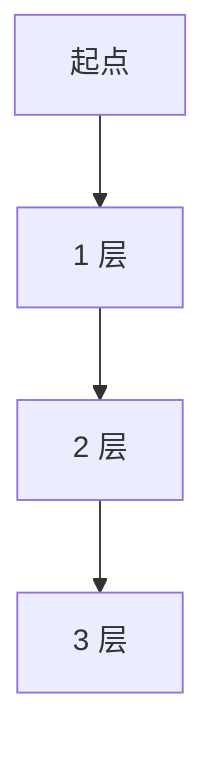
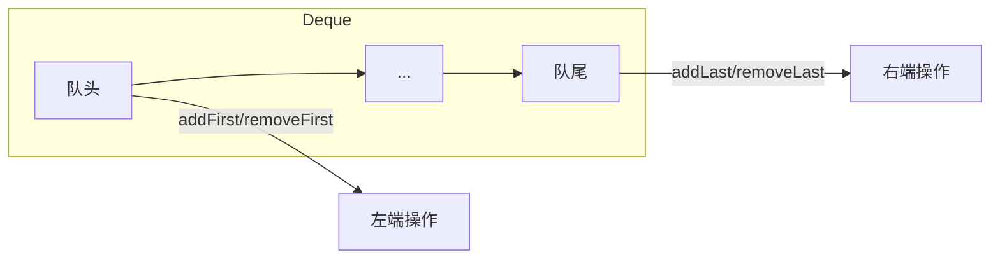
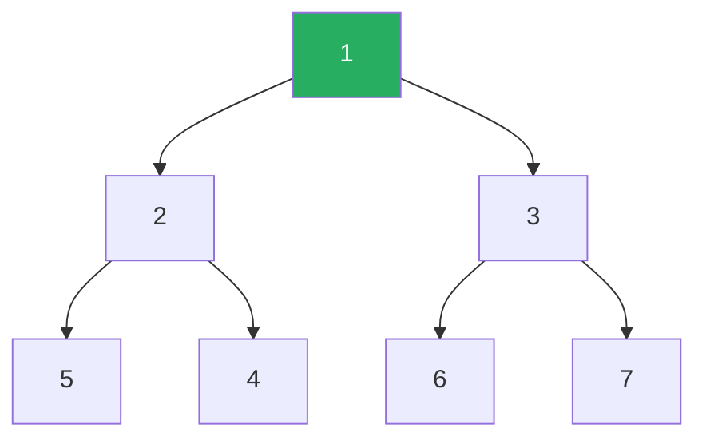

## 栈（Stack）：后进先出

想象一摞盘子：

- 放盘子：只能放在最上面
- 拿盘子：只能从最上面拿
- **最后放上去的，最先被拿下来**

这就是栈——**后进先出（LIFO, Last In First Out）**。



### 基本操作

| 操作 | 含义 | 复杂度 |
|:---:|:---|:---:|
| **push(x)** | 把 x 放到栈顶 | O(1) |
| **pop()** | 弹出栈顶元素 | O(1) |
| **peek() / top()** | 看一眼栈顶元素（不弹出） | O(1) |
| **isEmpty()** | 栈是否为空 | O(1) |

### 用数组实现栈

```python
class ArrayStack:
    def __init__(self):
        self.items = []

    def push(self, x):
        self.items.append(x)

    def pop(self):
        return self.items.pop()

    def peek(self):
        return self.items[-1] if self.items else None

    def isEmpty(self):
        return len(self.items) == 0
```

### 用链表实现栈

在链表头部插入/删除 = 栈的 push/pop

```python
class LinkedStack:
    class Node:
        def __init__(self, val):
            self.val = val
            self.next = None

    def __init__(self):
        self.head = None

    def push(self, x):      # 在头部插入
        new_node = self.Node(x)
        new_node.next = self.head
        self.head = new_node

    def pop(self):          # 弹出头部
        if not self.head:
            return None
        val = self.head.val
        self.head = self.head.next
        return val
```

---

## 栈的经典应用

### 应用 1：括号匹配

**题目**：判断字符串的括号是否合法（`()[]{} ` 都要正确配对）

```
"()[]{}"    → ✅ 合法
"([)]"      → ❌ 不合法（顺序错了）
"((()))"    → ✅ 合法
"({[]})"    → ✅ 合法
```

**思路**：遇到左括号就 push，遇到右括号就 pop 检查是否匹配。

```python
def isValid(s):
    stack = []
    mapping = {')': '(', ']': '[', '}': '{'}

    for char in s:
        if char in '([{':
            stack.append(char)           # 左括号入栈
        else:
            if not stack or stack[-1] != mapping[char]:
                return False             # 栈空或不匹配 → 不合法
            stack.pop()                   # 匹配成功，弹出

    return len(stack) == 0                # 栈必须全空才合法
```

**模拟过程**：
```
输入："({[]})"
  '(' → stack = ['(']
  '{' → stack = ['(', '{']
  '[' → stack = ['(', '{', '[']
  ']' → 弹出 '['，匹配 ✅ → stack = ['(', '{']
  '}' → 弹出 '{'，匹配 ✅ → stack = ['(']
  ')' → 弹出 '('，匹配 ✅ → stack = []
最终栈空 → 返回 True
```

### 应用 2：表达式求值（逆波兰表达式）

**中缀表达式**（人类习惯）：`(3 + 4) × 5 - 6`

**后缀表达式**（计算机友好）：`3 4 + 5 × 6 -`

**求值过程**：遇到数字 push，遇到运算符 pop 两个数计算，结果 push。

```
3 4 + 5 × 6 -

  3 → stack = [3]
  4 → stack = [3, 4]
  + → pop 4, pop 3 → 3+4=7 → stack = [7]
  5 → stack = [7, 5]
  × → pop 5, pop 7 → 7×5=35 → stack = [35]
  6 → stack = [35, 6]
  - → pop 6, pop 35 → 35-6=29 → stack = [29]

结果 = 29 ✅
```

### 应用 3：函数调用栈（操作系统核心）

你写的每一段递归代码，背后都是栈在工作：

```python
def factorial(n):
    if n == 0:
        return 1
    return n * factorial(n - 1)

factorial(3)
```

**调用栈**：
```
进入 factorial(3) → stack.push(3)
  进入 factorial(2) → stack.push(2)
    进入 factorial(1) → stack.push(1)
      进入 factorial(0) → stack.push(0)
      返回 1 → stack.pop()
    返回 1×1=1 → stack.pop()
  返回 2×1=2 → stack.pop()
返回 3×2=6 → stack.pop()
```

> ⚠️ **栈溢出**：递归太深（比如 n=10000），调用栈超过系统限制 → Stack Overflow。解决：迭代、尾递归优化、增大栈空间。
{: .prompt-warning }

### 应用 4：深度优先搜索（DFS）

DFS 本质就是用栈（或递归调用栈）存"下一步要探索的节点"。



### 应用 5：撤销（Undo）

编辑器的撤销功能：每一步操作都 push 到栈里，撤销时 pop 出来还原。

```
输入 "hello" → stack.push(每次操作记录)
撤销 → stack.pop() → "hell"
撤销 → stack.pop() → "hel"
```

---

## 队列（Queue）：先进先出

想象排队买奶茶：

- 新来的人站在队尾
- 最先来的人最先买到奶茶离开
- **最先进入队列的，最先出来**

这就是队列——**先进先出（FIFO, First In First Out）**。



### 基本操作

| 操作 | 含义 | 复杂度 |
|:---:|:---|:---:|
| **enqueue(x)** | 把 x 放到队尾 | O(1) |
| **dequeue()** | 弹出队头元素 | O(1) |
| **front()** | 看一眼队头元素 | O(1) |
| **isEmpty()** | 队列是否为空 | O(1) |

### 用数组实现队列：循环队列

普通数组实现队列有个问题：dequeue 从前面删元素，前面的空间就浪费了。

**循环队列**：把数组"弯成一个环"，front 和 rear 指针绕圈走。

```
初始：[_, _, _, _, _]     front=0, rear=0

入队 5：[5, _, _, _, _]   front=0, rear=1
入队 3：[5, 3, _, _, _]   front=0, rear=2
出队：  [_, 3, _, _, _]   front=1, rear=2
入队 7：[_, 3, 7, _, _]   front=1, rear=3
...
rear 到末尾后，从 0 开始继续（取模运算）
```

```python
class CircularQueue:
    def __init__(self, k):
        self.items = [None] * k
        self.front = 0
        self.count = 0      # 当前元素个数（代替 rear）
        self.capacity = k

    def enqueue(self, x):
        if self.count == self.capacity:
            return False
        rear = (self.front + self.count) % self.capacity
        self.items[rear] = x
        self.count += 1
        return True

    def dequeue(self):
        if self.count == 0:
            return None
        val = self.items[self.front]
        self.front = (self.front + 1) % self.capacity
        self.count -= 1
        return val
```

---

## 队列的经典应用

### 应用 1：广度优先搜索（BFS）

BFS 用队列存"当前层要探索的节点"，一层一层向外扩散。



```python
def bfs(graph, start):
    queue = [start]
    visited = {start}

    while queue:
        node = queue.pop(0)          # dequeue
        for neighbor in graph[node]:
            if neighbor not in visited:
                visited.add(neighbor)
                queue.append(neighbor)  # enqueue
```

### 应用 2：任务调度 / 消息队列

- **操作系统进程调度**：就绪队列排队等待 CPU
- **消息队列（Kafka/RabbitMQ）**：消息按顺序处理，先进先出
- **打印队列**：先发送的打印任务先打印

### 应用 3：滑动窗口最大值

**题目**：给一个数组和窗口大小 k，求每个窗口的最大值。

```
数组：[1, 3, -1, -3, 5, 3, 6, 7], k = 3
窗口1：[1, 3, -1] → max = 3
窗口2：[3, -1, -3] → max = 3
窗口3：[-1, -3, 5] → max = 5
...
```

**O(n) 解法：双端队列**，队列存索引，保证队头永远是当前窗口最大值的索引。

### 应用 4：缓冲区（Buffer）

- **键盘输入缓冲**：你打字比处理快，先存在队列里
- **数据流处理**：生产者-消费者模型，队列作为缓冲

---

## 双端队列（Deque）

**Deque = Double-ended Queue**——两端都可以入队和出队。



**Python 的 deque** 是工程中最常用的双端队列实现：

```python
from collections import deque

d = deque()
d.append(3)        # 右端加 → [3]
d.append(5)        # 右端加 → [3, 5]
d.appendleft(1)    # 左端加 → [1, 3, 5]
d.pop()            # 右端弹 → 返回 5，剩下 [1, 3]
d.popleft()        # 左端弹 → 返回 1，剩下 [3]
```

> 💡 **什么时候用 deque？**
> - 需要两端都 O(1) 插入/删除 → 用 deque
> - Python 中 `list.pop(0)` 是 O(n)，但 `deque.popleft()` 是 O(1)！
{: .prompt-tip }

---

## 优先队列（Priority Queue）

不是先进先出，而是**优先级高的先出**。

**典型实现**：二叉堆（Binary Heap）



> 这是一个最小堆：父节点的值 ≤ 子节点的值。每次出队返回堆顶（最小值）。

| 操作 | 复杂度 |
|:---:|:---:|
| 插入元素 | O(log n) |
| 删除最小/最大元素 | O(log n) |
| 查看最小/最大元素 | O(1) |

### 优先队列的应用

| 应用 | 场景 |
|:---|:---|
| **任务优先级调度** | 紧急任务优先处理（操作系统、线程池） |
| **Top-K 问题** | "找出前 10 个最热话题" |
| **合并 K 个有序链表** | 每次从 K 个链表中取最小值 |
| **Dijkstra 最短路径** | 每次选距离最短的节点 |
| **哈夫曼编码** | 每次选两个频率最小的节点合并 |

### Python 实现：heapq

```python
import heapq

heap = []
heapq.heappush(heap, 3)
heapq.heappush(heap, 1)
heapq.heappush(heap, 2)

heapq.heappop(heap)  # 返回 1（最小值）
heapq.heappop(heap)  # 返回 2
heapq.heappop(heap)  # 返回 3

# Top-K 问题：找出数组中最大的 3 个
nums = [3, 1, 4, 1, 5, 9, 2, 6]
heapq.nlargest(3, nums)   # → [9, 6, 5]
heapq.nsmallest(3, nums)  # → [1, 1, 2]
```

---

## 四种线性结构对比

| 结构 | 出入规则 | 典型场景 | 插入/删除 |
|:---:|:---|:---|:---:|
| **数组** | 随机访问 | 需要快速按下标取数据 | 尾部 O(1)，中间 O(n) |
| **栈** | LIFO 后进先出 | 括号匹配、调用栈、撤销、DFS | 栈顶 O(1) |
| **队列** | FIFO 先进先出 | 任务调度、BFS、消息队列 | 头尾 O(1) |
| **双端队列** | 两端都可操作 | 滑动窗口、需要两端操作的场景 | 两端 O(1) |
| **优先队列** | 优先级高的先出 | Top-K、最短路径、任务调度 | O(log n) |

---

## 小结

栈和队列是最简单但应用最广泛的数据结构：

- **栈（LIFO）**：括号匹配、表达式求值、函数调用、DFS、撤销操作
- **队列（FIFO）**：BFS、任务调度、消息队列、缓冲区
- **双端队列（Deque）**：两端都能 O(1) 操作，滑动窗口问题常用
- **优先队列**：按优先级出队，核心实现是堆（heap）

它们的共同点：**只在端点操作**，不涉及中间元素的随机访问——这也是为什么它们的插入删除都这么快。
