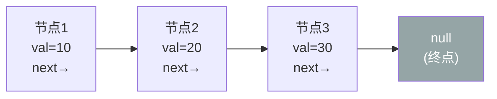
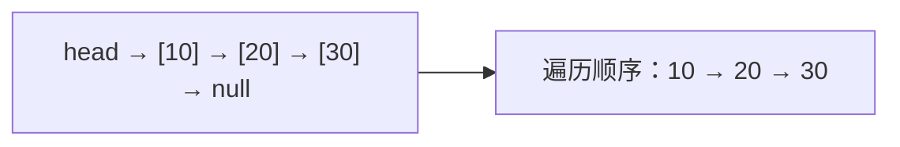
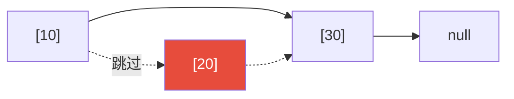
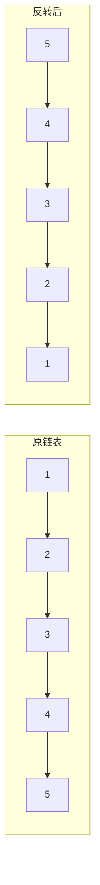
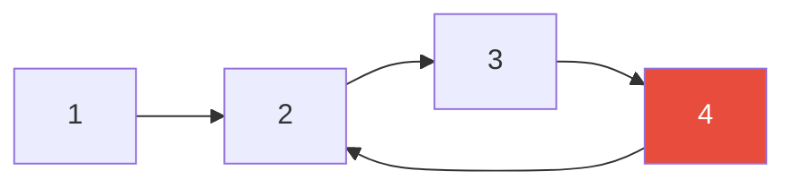
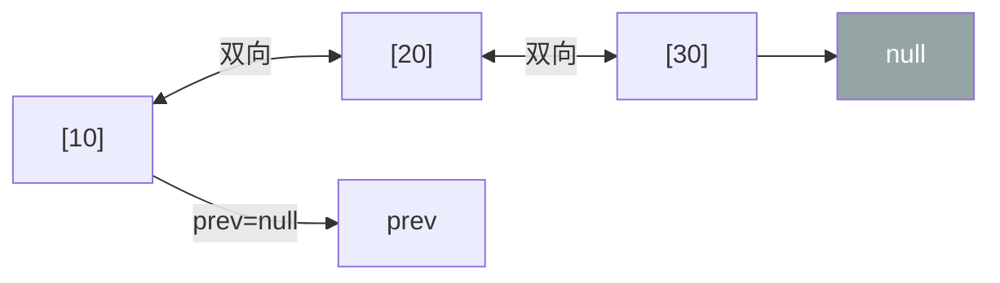
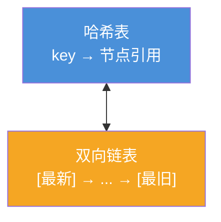

## 链表是什么？

想象你在玩一个寻宝游戏：

- 你在**位置 A** 找到一张纸条，上面写着"去 B 点"
- 你到 **B 点** 又找到一张纸条，上面写着"去 C 点"
- 你到 **C 点** 找到宝藏，纸条写着"这是终点"

**链表**就是这样——每个节点存着数据，以及"下一个节点在哪"的指针。



### 链表 vs 数组

| 特性 | 数组 | 链表 |
|:---:|:---|:---|
| 内存 | **连续**的内存块 | **分散**的内存块，靠指针相连 |
| 随机访问 | ✅ O(1)（按下标直接取） | ❌ O(n)（必须从头遍历） |
| 插入/删除 | ❌ O(n)（需要移动元素） | ✅ O(1)（只需修改指针） |
| 空间浪费 | 可能有预留空间浪费 | 每个节点多存一个指针 |

> 💡 **核心区别**：数组擅长"随机访问"，链表擅长"动态插入删除"。
{: .prompt-tip }

---

## 单链表

### 节点结构

```
struct Node {
    int val;        // 数据
    Node* next;     // 指向下一个节点的指针
};
```

### 常见操作

#### 1. 遍历链表

```
从头节点开始：
  当前节点 = head
  while 当前节点 ≠ null:
    访问当前节点的值
    当前节点 = 当前节点.next
```



#### 2. 在头部插入

```
新节点.next = head      // 新节点指向原来的头
head = 新节点            // head 指向新节点
```


#### 3. 在尾部插入

```
// 先找到最后一个节点
尾节点 = head
while 尾节点.next ≠ null:
    尾节点 = 尾节点.next

// 把新节点接上去
尾节点.next = 新节点
新节点.next = null
```

#### 4. 删除节点



```
要删除节点 B：
  找到 B 的前一个节点 A
  A.next = B.next    // A 直接指向 C，B 就从链上断开了
  (B 的内存回收——取决于语言)
```

### 时间复杂度

| 操作 | 复杂度 | 说明 |
|:---:|:---:|:---|
| 查找 | O(n) | 必须从头遍历 |
| 头部插入 | O(1) | 直接修改 head |
| 尾部插入 | O(n) | 需要先遍历到尾（如果没有尾指针） |
| 已知位置插入 | O(1) | 只需改两个指针 |
| 删除已知节点 | O(1) | 只需改指针（如果有前置节点引用） |

---

## 单链表的经典问题

### 题 1：反转链表

**题目**：把 `1 → 2 → 3 → 4 → 5` 变成 `5 → 4 → 3 → 2 → 1`

**思路**：遍历一遍，每个节点的 next 指向前一个节点



```python
def reverseList(head):
    prev = None
    curr = head
    while curr:
        next_node = curr.next    # 保存下一个节点
        curr.next = prev         # 当前节点指向前一个（反转）
        prev = curr              # 前一个指针前进
        curr = next_node         # 当前指针前进
    return prev
```

**关键技巧**：用三个指针 `prev → curr → next_node`，每次反转 curr 的 next，然后整体右移。

### 题 2：检测链表有没有环

**题目**：判断链表是否有环（某个节点的 next 指向了前面的节点）



**思路**：快慢指针（Floyd 判圈算法）

```
慢指针每次走 1 步，快指针每次走 2 步
如果有环，快指针一定会追上慢指针（就像跑步套圈）
如果没环，快指针会先到达终点（null）
```

```python
def hasCycle(head):
    slow = fast = head
    while fast and fast.next:
        slow = slow.next        # 慢的走 1 步
        fast = fast.next.next   # 快的走 2 步
        if slow == fast:
            return True         # 相遇 = 有环
    return False
```

> 📖 **为什么一定能追上？** 如果有环，快慢指针都进入环后，两者距离每次减少 1 步，最终一定会相遇。如果两者初始距离为 n，n 步后必然相遇。
{: .prompt-info }

### 题 3：找到链表的中间节点

**思路**：同样用快慢指针

```
慢指针走 1 步，快指针走 2 步
当快指针到终点时，慢指针正好在中间
```

```python
def middleNode(head):
    slow = fast = head
    while fast and fast.next:
        slow = slow.next
        fast = fast.next.next
    return slow  # slow 现在在中间位置
```

### 题 4：删除倒数第 n 个节点

**思路**：双指针——先让快指针领先 n 步，再一起走。

```
n = 2（删除倒数第 2 个）
  1 → 2 → 3 → 4 → 5
      删除 ↑ 这个

步骤：
  ① fast 先走 2 步 → fast 现在指向 3
  ② slow 和 fast 同时走，直到 fast 到末尾
  ③ slow 此时指向 3（倒数第 2 个节点的前一个）
  ④ slow.next = slow.next.next（删除目标节点）
```

```python
def removeNthFromEnd(head, n):
    dummy = Node(0)    # 虚拟头节点，简化删除头节点的情况
    dummy.next = head
    slow = fast = dummy

    for _ in range(n):
        fast = fast.next

    while fast.next:
        slow = slow.next
        fast = fast.next

    slow.next = slow.next.next  # 删除 slow 的下一个节点
    return dummy.next
```

### 题 5：合并两个有序链表

**题目**：把 `1 → 3 → 5` 和 `2 → 4 → 6` 合并成 `1 → 2 → 3 → 4 → 5 → 6`

**思路**：归并排序的归并步骤——两个指针分别遍历两个链表，每次取较小的。

```python
def mergeTwoLists(l1, l2):
    dummy = Node(0)
    curr = dummy

    while l1 and l2:
        if l1.val < l2.val:
            curr.next = l1
            l1 = l1.next
        else:
            curr.next = l2
            l2 = l2.next
        curr = curr.next

    curr.next = l1 if l1 else l2  # 接上剩余部分
    return dummy.next
```

---

## 双向链表（双链表）

### 节点结构

```
struct DNode {
    int val;
    DNode* prev;    // 指向前一个节点
    DNode* next;    // 指向下一个节点
};
```



### 双链表 vs 单链表

| 操作 | 单链表 | 双向链表 |
|:---:|:---:|:---:|
| 遍历方向 | 只能从头到尾 | 可以向前也可以向后 |
| 删除已知节点 | O(n)（需要找到前驱） | O(1)（有 prev 指针） |
| 插入节点前后 | 需要遍历找前驱 | 直接操作 |
| 空间开销 | 每个节点 1 个指针 | 每个节点 2 个指针 |

### 双链表的典型应用：LRU 缓存

**LRU（Least Recently Used）**：缓存满了，就删掉最久没用的那个。



**核心操作**：
- **查询**：命中 → 把节点移到链表头部（标记为最新）
- **插入**：新节点放头部；如果超过容量，删除尾部节点（最久没用的）
- **删除**：因为是双链表，删除操作 O(1)

```
初始缓存：[3] ↔ [1] ↔ [2]   （3 是最新，2 是最旧）

查询 key=1 → 命中，把 1 移到最前面：
  [1] ↔ [3] ↔ [2]

插入 key=4 → 放到最前面：
  [4] ↔ [1] ↔ [3] ↔ [2]
  如果超过容量，删除尾部的 2
```

---

## 链表在实际工程中的应用

| 应用 | 为什么用链表？ |
|:---|:---|
| **LRU 缓存** | 双链表 O(1) 支持"移动到头部"和"删除尾部" |
| **操作系统内存分配** | 空闲内存块链表，支持快速合并和拆分 |
| **文件系统** | 文件数据块链表（FAT 文件系统就是链表） |
| **跳表** | 在链表上加多级索引，实现 O(log n) 查找（Redis 的 ZSet 用跳表） |
| **邻接表** | 图的表示——每个节点的邻居用链表存 |

---

## 解题技巧总结

| 技巧 | 解决的问题 |
|:---:|:---|
| **虚拟头节点（dummy）** | 删除头节点、合并链表等需要操作 head 的场景 |
| **快慢指针** | 检测环、找中间节点、判断环的入口 |
| **双指针** | 倒数第 n 个节点、相交链表的交点 |
| **递归** | 反转链表、合并链表（代码简洁） |
| **哈希表 + 双链表** | LRU 缓存、O(1) 查询 + O(1) 删除 |

> 🎯 **链表题的黄金法则**：画图！把链表结构画出来，标清楚每个指针怎么变，代码自然就写出来了。
{: .prompt-tip }

---

## 小结

链表是最基础的动态数据结构：

- **单链表**：单向的节点链，擅长头部插入删除，遍历只能向前
- **双链表**：双向的节点链，删除/插入任意位置都是 O(1)
- **核心算法**：反转链表、快慢指针（判环/找中间）、双指针（倒数第 n）、归并有序链表
- **经典应用**：LRU 缓存 = 哈希表 + 双向链表

链表是理解更复杂数据结构（树、图、跳表）的基础——掌握了链表，你就掌握了"用指针串联数据"的核心思想。
