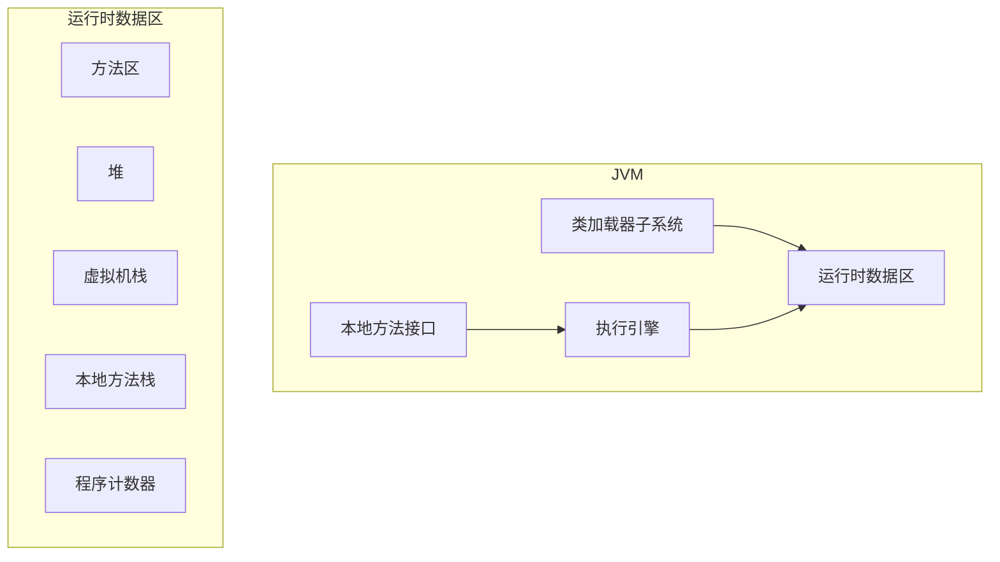
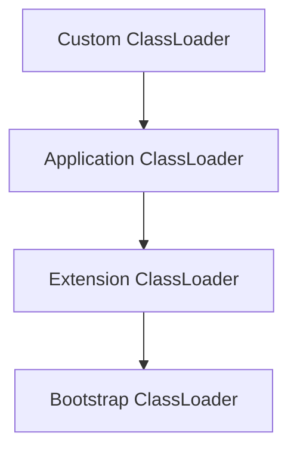
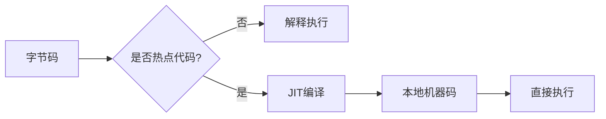

## JVM虚拟机核心总结

Java虚拟机（JVM）是Java平台的核心，它实现了"一次编写，到处运行"的理念。理解JVM的工作原理对于编写高效、稳定的Java代码至关重要。

## 一、JVM架构概览



## 二、类加载器子系统

### 2.1 类加载流程


### 2.2 类加载器层次

| 加载器 | 职责 | 加载路径 |
|--------|------|----------|
| Bootstrap ClassLoader | 加载核心类库 | JAVA_HOME/lib |
| Extension ClassLoader | 加载扩展类 | JAVA_HOME/lib/ext |
| Application ClassLoader | 加载应用类 | classpath |
| Custom ClassLoader | 自定义加载 | 自定义路径 |

### 2.3 双亲委派模型



## 三、运行时数据区

### 3.1 方法区

- 存储类的元数据
- 静态变量和常量池
- 运行时常量池

### 3.2 堆

- 最大的内存区域
- 所有对象实例的分配场所
- 垃圾回收的主要区域

### 3.3 虚拟机栈

- 每个线程一个栈
- 存储栈帧（局部变量表、操作数栈、动态链接、返回地址）
- 栈溢出异常（StackOverflowError）

### 3.4 本地方法栈

- 为本地方法服务
- 与虚拟机栈类似

### 3.5 程序计数器

- 当前线程执行的字节码行号指示器
- 线程私有

## 四、执行引擎

### 4.1 解释器

- 逐行解释执行字节码
- 启动速度快

### 4.2 JIT编译器

- 热点代码编译为机器码
- 提高执行效率



### 4.3 垃圾回收器

**常见垃圾回收算法：**

| 算法 | 特点 | 适用场景 |
|------|------|----------|
| 标记-清除 | 简单但产生碎片 | 老年代 |
| 标记-复制 | 无碎片但浪费空间 | 新生代 |
| 标记-整理 | 无碎片但耗时 | 老年代 |

**垃圾收集器对比：**

| 收集器 | 新生代 | 老年代 | 特点 |
|--------|--------|--------|------|
| Serial | 串行 | - | 单线程，适合小内存 |
| Parallel | 并行 | - | 多线程，吞吐量优先 |
| CMS | - | 并发 | 低延迟 |
| G1 | 分区收集 | 分区收集 | 兼顾吞吐量和延迟 |
| ZGC | 分区收集 | 分区收集 | 极低延迟 |

## 五、JVM参数调优

### 5.1 内存参数

```bash
# 堆内存
-Xms2G          # 初始堆大小
-Xmx4G          # 最大堆大小
-Xmn512M        # 新生代大小

# 栈内存
-Xss1M          # 线程栈大小

# 方法区
-XX:MetaspaceSize=256M
-XX:MaxMetaspaceSize=512M
```

### 5.2 垃圾回收参数

```bash
# 使用G1收集器
-XX:+UseG1GC

# 设置停顿时间目标
-XX:MaxGCPauseMillis=200

# 设置新生代比例
-XX:NewRatio=2
```

## 六、常见JVM面试题

### Q1: 什么是JVM？为什么需要JVM？

**A:** JVM是Java虚拟机，它是Java跨平台的核心。它负责将字节码解释或编译为本地机器码执行。

### Q2: 类加载的过程是什么？

**A:** 加载 → 验证 → 准备 → 解析 → 初始化

### Q3: 什么是双亲委派模型？

**A:** 类加载器在加载类时，先委托给父加载器，只有父加载器无法加载时才自己加载。

### Q4: 垃圾回收的过程是什么？

**A:** 标记 → 清除/复制/整理 → 回收内存

### Q5: 新生代和老年代的区别？

**A:** 新生代存放年轻对象，使用复制算法；老年代存放存活时间长的对象，使用标记-清除或标记-整理算法。

## 七、总结

JVM是Java生态的基石，理解其内部机制对于：
- 编写高效代码
- 排查性能问题
- 解决内存泄漏
- 通过面试

掌握JVM知识是每个Java开发者的必备技能。

---
> 参考来源：[JavaGuide](https://javaguide.cn/java/jvm/java-jvm.html)

<div class='context-nav'>
<a class='context-link prev disabled'><span class='context-label'>上一篇</span><span class='context-title'>暂无</span></a>
<a class='context-link next' href='/software-fundamentals/posts/Java-JVM面试题/'><span class='context-label'>下一篇</span><span class='context-title'>Java虚拟机面试题</span></a>
</div>
