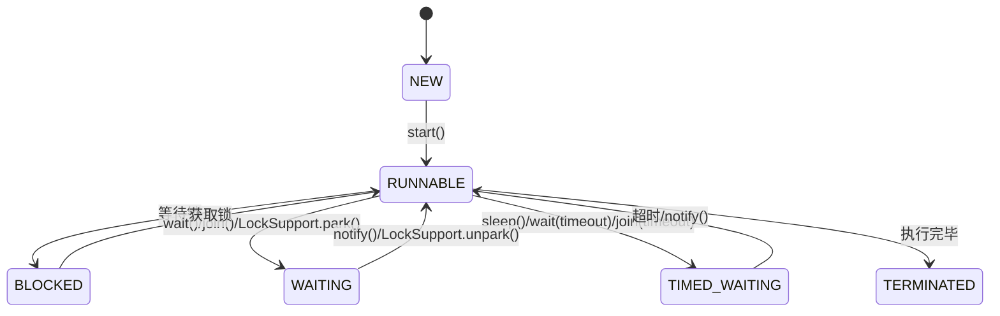
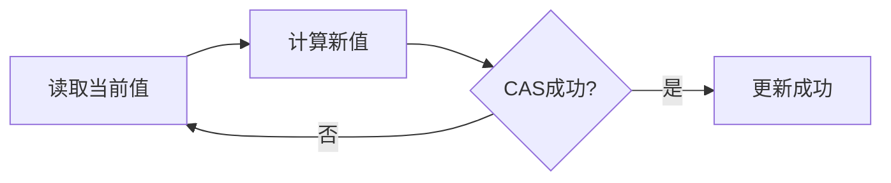
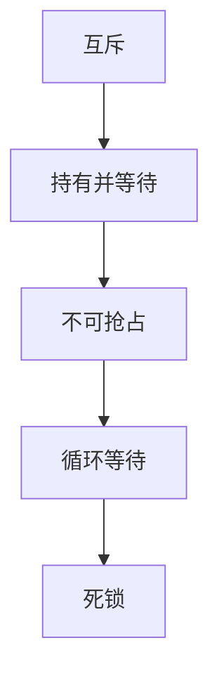

## Java并发编程核心总结

Java并发编程是Java高级开发的核心技能之一，掌握并发编程可以编写出高效、稳定的多线程应用程序。

## 一、并发编程基础

### 1.1 进程与线程

| 对比维度 | 进程 | 线程 |
|----------|------|------|
| 资源分配 | 资源分配的基本单位 | 资源调度的基本单位 |
| 内存空间 | 独立地址空间 | 共享进程地址空间 |
| 开销 | 大 | 小 |
| 通信 | 复杂（IPC） | 简单（共享内存） |

### 1.2 线程的状态



## 二、同步机制

### 2.1 synchronized关键字

```java
// 同步方法
public synchronized void method() {
    // 临界区代码
}

// 同步代码块
public void method() {
    synchronized (lock) {
        // 临界区代码
    }
}
```

### 2.2 Lock接口

```java
Lock lock = new ReentrantLock();
lock.lock();
try {
    // 临界区代码
} finally {
    lock.unlock();
}
```

### 2.3 volatile关键字

```java
public class VolatileExample {
    private volatile boolean flag = false;
    
    public void toggle() {
        flag = true;
    }
}
```

## 三、线程池

### 3.1 线程池类型

| 线程池类型 | 特点 | 适用场景 |
|------------|------|----------|
| FixedThreadPool | 固定大小 | 稳定的并发场景 |
| CachedThreadPool | 动态扩容 | 短期任务 |
| SingleThreadExecutor | 单线程 | 顺序执行 |
| ScheduledThreadPool | 定时任务 | 定时/周期性任务 |

### 3.2 线程池参数

```java
ThreadPoolExecutor executor = new ThreadPoolExecutor(
    2,              // corePoolSize
    5,              // maximumPoolSize
    60,             // keepAliveTime
    TimeUnit.SECONDS,
    new LinkedBlockingQueue<>(100),  // workQueue
    new ThreadFactory() { ... },     // threadFactory
    new ThreadPoolExecutor.CallerRunsPolicy()  // handler
);
```

## 四、并发容器

### 4.1 常用并发容器

| 容器 | 线程安全 | 特点 |
|------|----------|------|
| ConcurrentHashMap | 是 | 分段锁，高并发 |
| CopyOnWriteArrayList | 是 | 写时复制，读多写少 |
| ConcurrentLinkedQueue | 是 | 无锁队列 |
| BlockingQueue | 是 | 阻塞队列 |

### 4.2 阻塞队列

```java
BlockingQueue<String> queue = new ArrayBlockingQueue<>(10);

// 生产者
queue.put("data");

// 消费者
String data = queue.take();
```

## 五、原子操作

### 5.1 Atomic类

```java
AtomicInteger count = new AtomicInteger(0);

// 原子递增
count.incrementAndGet();

// 原子比较交换
count.compareAndSet(0, 1);
```

### 5.2 CAS原理



## 六、并发工具类

### 6.1 CountDownLatch

```java
CountDownLatch latch = new CountDownLatch(3);

// 等待所有任务完成
latch.await();

// 每个任务完成时计数减1
latch.countDown();
```

### 6.2 CyclicBarrier

```java
CyclicBarrier barrier = new CyclicBarrier(3, () -> {
    // 所有线程到达后执行
});

// 等待其他线程
barrier.await();
```

### 6.3 Semaphore

```java
Semaphore semaphore = new Semaphore(5);

// 获取许可
semaphore.acquire();

// 释放许可
semaphore.release();
```

## 七、线程安全问题

### 7.1 常见问题

- **竞态条件**：多个线程同时访问共享资源
- **死锁**：线程互相等待对方释放锁
- **活锁**：线程不断重复相同操作
- **饥饿**：某些线程永远得不到执行机会

### 7.2 死锁条件



## 八、并发编程面试题

### Q1: synchronized和Lock的区别？

**A:** synchronized是关键字，自动加锁解锁；Lock是接口，需要手动加锁解锁，功能更强大。

### Q2: volatile的作用？

**A:** 保证可见性和禁止指令重排序，但不保证原子性。

### Q3: 什么是线程池？为什么使用线程池？

**A:** 线程池是管理线程的工具，可以复用线程、控制并发数、提供监控。

### Q4: 什么是CAS？

**A:** Compare-And-Swap，无锁编程的核心，通过比较并交换实现原子操作。

### Q5: 如何避免死锁？

**A:** 破坏死锁的四个条件之一：按顺序获取锁、设置超时、使用tryLock()。

## 九、总结

并发编程是Java开发的高级技能，需要掌握：
- 线程的基本概念和状态
- 同步机制（synchronized、Lock、volatile）
- 线程池的使用和配置
- 并发容器和原子操作
- 并发工具类的使用

---
> 参考来源：[JavaGuide](https://javaguide.cn/java/concurrent/)

<div class='context-nav'>
<a class='context-link prev' href='/software-fundamentals/posts/Java-Java基础面试题/'><span class='context-label'>上一篇</span><span class='context-title'>Java基础面试</span></a>
<a class='context-link next' href='/software-fundamentals/posts/Java-Java并发面试题/'><span class='context-label'>下一篇</span><span class='context-title'>Java并发编程面试</span></a>
</div>
