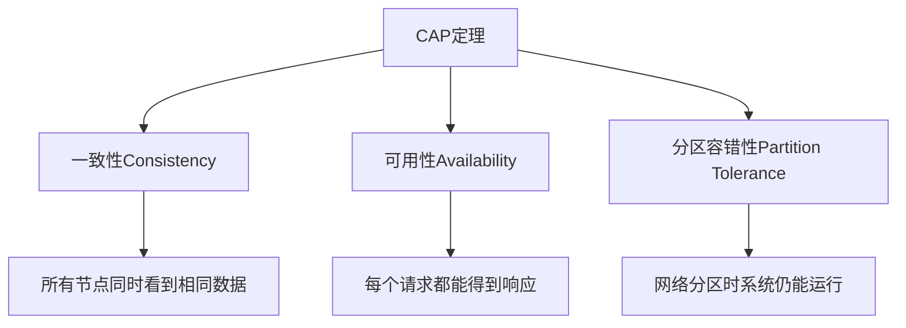
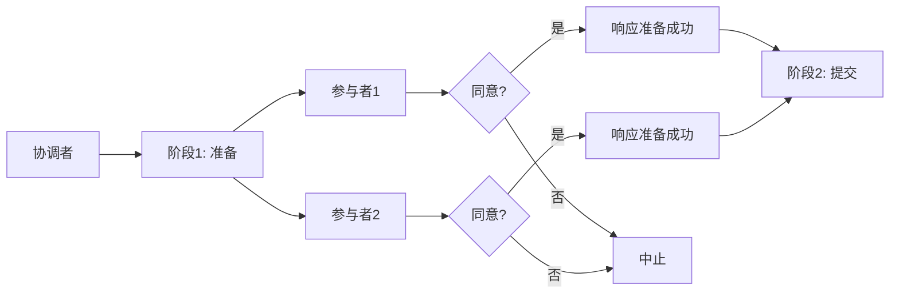
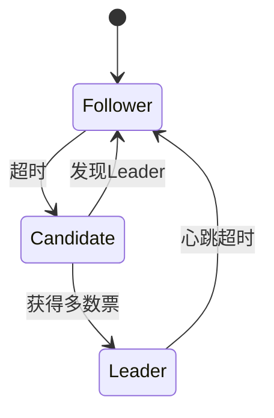
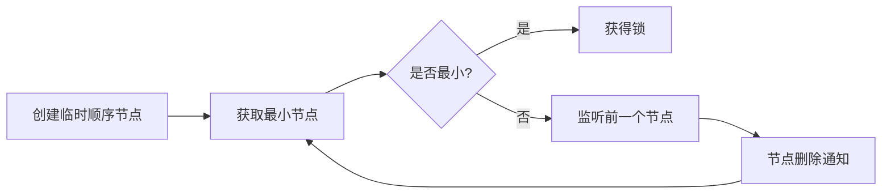
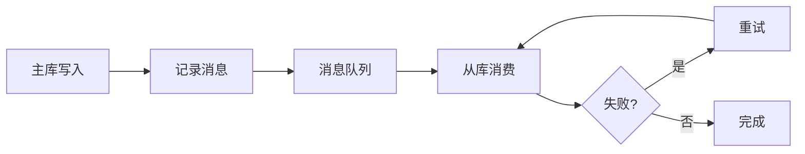
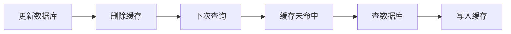
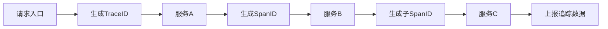

## 分布式系统核心总结

分布式系统是现代大型互联网应用的基础架构，它将计算任务分布在多个节点上，实现高可用、高性能和可扩展性。

## 一、分布式系统基础

### 1.1 什么是分布式系统

分布式系统是一组独立计算机的集合，它们通过网络协作完成共同的任务，对用户来说像是一个单一的系统。

### 1.2 分布式系统的特点

| 特性 | 说明 |
|------|------|
| 分布性 | 多个节点通过网络连接 |
| 并发性 | 多个节点可以同时操作 |
| 透明性 | 用户感知不到分布 |
| 容错性 | 部分节点故障不影响整体 |
| 一致性 | 数据在多个节点保持一致 |

### 1.3 CAP定理



**CAP权衡：**
- **CP**：一致性+分区容错性（如银行系统）
- **AP**：可用性+分区容错性（如社交网络）
- **CA**：理论上不存在

## 二、分布式一致性协议

### 2.1 两阶段提交（2PC）



### 2.2 Paxos协议

Paxos是一种分布式一致性协议，保证在分布式环境下达成一致。

**角色：**
- **Proposer**：提出提案
- **Acceptor**：接受或拒绝提案
- **Learner**：学习最终决定

### 2.3 Raft协议

Raft是Paxos的简化版，更容易理解和实现。



## 三、分布式锁

### 3.1 基于Redis的分布式锁

```java
// 获取锁
String result = jedis.set(lockKey, requestId, "NX", "PX", expireTime);

// 释放锁
String script = "if redis.call('get', KEYS[1]) == ARGV[1] then return redis.call('del', KEYS[1]) else return 0 end";
jedis.eval(script, Collections.singletonList(lockKey), Collections.singletonList(requestId));
```

### 3.2 基于ZooKeeper的分布式锁



## 四、分布式事务

### 4.1 事务解决方案

| 方案 | 适用场景 | 复杂度 |
|------|----------|--------|
| 2PC | 强一致性要求 | 高 |
| TCC | 异步场景 | 中 |
| 本地消息表 | 最终一致性 | 低 |
| 可靠消息 | 异步场景 | 中 |

### 4.2 最终一致性



## 五、分布式ID生成

### 5.1 常见方案

| 方案 | 特点 | 适用场景 |
|------|------|----------|
| UUID | 全局唯一，无序 | 无顺序要求 |
| 数据库自增 | 有序，单点瓶颈 | 中小规模 |
| Snowflake | 有序，高可用 | 大规模分布式 |
| Redis自增 | 有序，高可用 | 高并发场景 |

### 5.2 Snowflake算法

```
1位符号位 + 41位时间戳 + 10位机器ID + 12位序列号
```

## 六、分布式缓存

### 6.1 缓存策略

| 策略 | 说明 |
|------|------|
| Cache-Aside | 先查缓存，再查数据库 |
| Write-Through | 同步更新缓存和数据库 |
| Write-Behind | 异步更新数据库 |

### 6.2 缓存一致性



## 七、分布式追踪

### 7.1 追踪系统

| 系统 | 特点 |
|------|------|
| Zipkin | Twitter开源，轻量 |
| Jaeger | Uber开源，功能强大 |
| SkyWalking | 国产，全链路追踪 |

### 7.2 追踪原理



## 八、分布式系统面试题

### Q1: CAP定理是什么？

**A:** 一致性(Consistency)、可用性(Availability)、分区容错性(Partition Tolerance)，三者不可兼得。

### Q2: 什么是Paxos协议？

**A:** 一种分布式一致性协议，通过多轮投票达成一致。

### Q3: 分布式锁的实现方式有哪些？

**A:** Redis、ZooKeeper、数据库等。

### Q4: 如何保证分布式事务的一致性？

**A:** 2PC、TCC、本地消息表、可靠消息等方案。

### Q5: 分布式ID如何生成？

**A:** UUID、数据库自增、Snowflake、Redis自增等。

## 九、总结

分布式系统是构建大型应用的基石，需要掌握：
- CAP定理和一致性模型
- 分布式一致性协议
- 分布式锁和事务
- 分布式ID和缓存
- 分布式追踪和监控

---
> 参考来源：[JavaGuide](https://javaguide.cn/distributed-system/)
