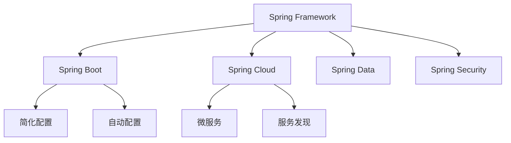
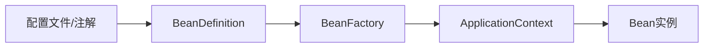
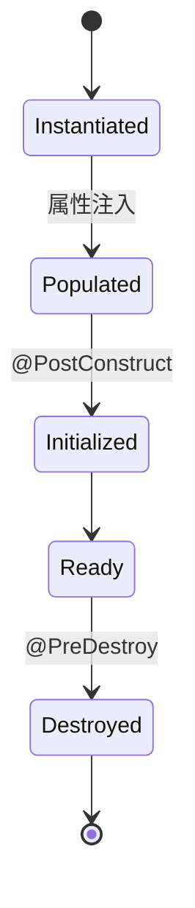
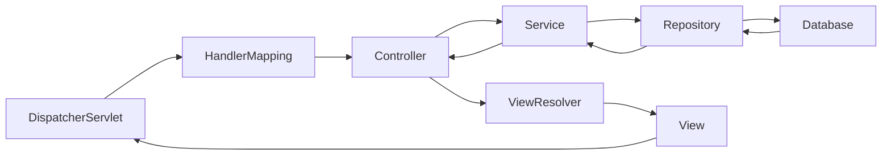

## Spring框架核心总结

Spring框架是Java生态中最流行的企业级应用框架，它提供了全面的基础设施支持，帮助开发者构建高质量的应用程序。

## 一、Spring框架概述

### 1.1 Spring的核心特性

| 特性 | 说明 |
|------|------|
| 控制反转(IoC) | 对象的创建和依赖由Spring容器管理 |
| 面向切面(AOP) | 横切关注点的模块化 |
| 依赖注入(DI) | 自动注入依赖对象 |
| 声明式事务 | 简化事务管理 |
| 轻量级 | 无侵入性，易于集成 |

### 1.2 Spring家族



## 二、IoC容器

### 2.1 IoC原理



### 2.2 Bean的生命周期



### 2.3 Bean的作用域

| 作用域 | 说明 |
|--------|------|
| singleton | 单例（默认） |
| prototype | 每次请求创建新实例 |
| request | 每个HTTP请求一个实例 |
| session | 每个会话一个实例 |

## 三、依赖注入

### 3.1 注入方式

```java
// 构造器注入
@Autowired
public UserService(UserRepository repository) {
    this.repository = repository;
}

// Setter注入
@Autowired
public void setRepository(UserRepository repository) {
    this.repository = repository;
}

// 字段注入
@Autowired
private UserRepository repository;
```

### 3.2 注入注解

| 注解 | 说明 |
|------|------|
| @Autowired | Spring提供，按类型注入 |
| @Resource | JSR-250，按名称注入 |
| @Inject | JSR-330，按类型注入 |

## 四、面向切面编程(AOP)

### 4.1 AOP概念

| 术语 | 说明 |
|------|------|
| Aspect | 切面 |
| Join Point | 连接点 |
| Pointcut | 切点 |
| Advice | 通知 |
| Target | 目标对象 |

### 4.2 通知类型

```java
@Aspect
@Component
public class LogAspect {
    
    @Before("execution(* com.example.service.*.*(..))")
    public void before() { ... }
    
    @AfterReturning("execution(* com.example.service.*.*(..))")
    public void afterReturning() { ... }
    
    @AfterThrowing("execution(* com.example.service.*.*(..))")
    public void afterThrowing() { ... }
    
    @Around("execution(* com.example.service.*.*(..))")
    public Object around(ProceedingJoinPoint pjp) throws Throwable { ... }
}
```

## 五、Spring Boot

### 5.1 自动配置原理

```mermaid
flowchart LR
    A[@SpringBootApplication] --> B[@EnableAutoConfiguration]
    B --> C[AutoConfigurationImportSelector]
    C --> D[扫描META-INF/spring.factories]
    D --> E[加载自动配置类]
```

### 5.2 常用注解

| 注解 | 说明 |
|------|------|
| @SpringBootApplication | 启动类注解 |
| @RestController | REST控制器 |
| @RequestMapping | 请求映射 |
| @GetMapping/@PostMapping | HTTP方法映射 |
| @Value | 注入配置值 |
| @ConfigurationProperties | 绑定配置 |

### 5.3 配置文件

```yaml
server:
  port: 8080

spring:
  datasource:
    url: jdbc:mysql://localhost:3306/example
    username: admin
    password: password
```

## 六、Spring事务

### 6.1 事务传播行为

| 传播行为 | 说明 |
|----------|------|
| REQUIRED | 默认，需要事务 |
| REQUIRES_NEW | 创建新事务 |
| SUPPORTS | 支持事务 |
| NOT_SUPPORTED | 不支持事务 |
| NEVER | 必须无事务 |

### 6.2 事务隔离级别

| 隔离级别 | 说明 |
|----------|------|
| READ_UNCOMMITTED | 读未提交 |
| READ_COMMITTED | 读已提交（默认） |
| REPEATABLE_READ | 可重复读 |
| SERIALIZABLE | 串行化 |

```java
@Transactional(propagation = Propagation.REQUIRED, isolation = Isolation.READ_COMMITTED)
public void transfer(Long fromId, Long toId, BigDecimal amount) {
    // 转账逻辑
}
```

## 七、Spring MVC

### 7.1 请求处理流程



### 7.2 Controller示例

```java
@RestController
@RequestMapping("/api/users")
public class UserController {
    
    @Autowired
    private UserService userService;
    
    @GetMapping("/{id}")
    public ResponseEntity<User> getUser(@PathVariable Long id) {
        return ResponseEntity.ok(userService.findById(id));
    }
    
    @PostMapping
    public ResponseEntity<User> createUser(@RequestBody User user) {
        return ResponseEntity.created(...).body(userService.save(user));
    }
}
```

## 八、Spring面试题

### Q1: 什么是IoC和DI？

**A:** IoC是控制反转，DI是依赖注入。IoC将对象的创建权交给容器，DI是容器将依赖注入到对象中。

### Q2: Spring Bean的生命周期？

**A:** 实例化 → 属性注入 → 初始化(@PostConstruct) → 使用 → 销毁(@PreDestroy)

### Q3: 什么是AOP？

**A:** 面向切面编程，将横切关注点（如日志、事务）模块化。

### Q4: Spring Boot自动配置原理？

**A:** 通过@EnableAutoConfiguration扫描META-INF/spring.factories中的配置类。

### Q5: @Autowired和@Resource的区别？

**A:** @Autowired按类型注入，@Resource按名称注入。

## 九、总结

Spring框架是Java开发的必备技能，掌握以下核心知识：
- IoC容器和Bean管理
- 依赖注入的方式
- AOP面向切面编程
- Spring Boot自动配置
- Spring事务管理
- Spring MVC请求处理

---
> 参考来源：[JavaGuide](https://javaguide.cn/spring/)

<div class='context-nav'>
<a class='context-link prev' href='/software-fundamentals/posts/Java集合-集合分类与体系/'><span class='context-label'>上一篇</span><span class='context-title'>Java中的集合类有哪些？如何分类的</span></a>
<a class='context-link next disabled'><span class='context-label'>下一篇</span><span class='context-title'>暂无</span></a>
</div>
