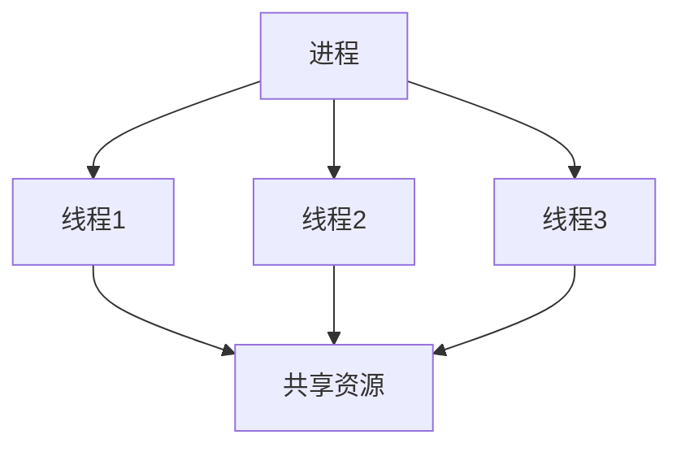
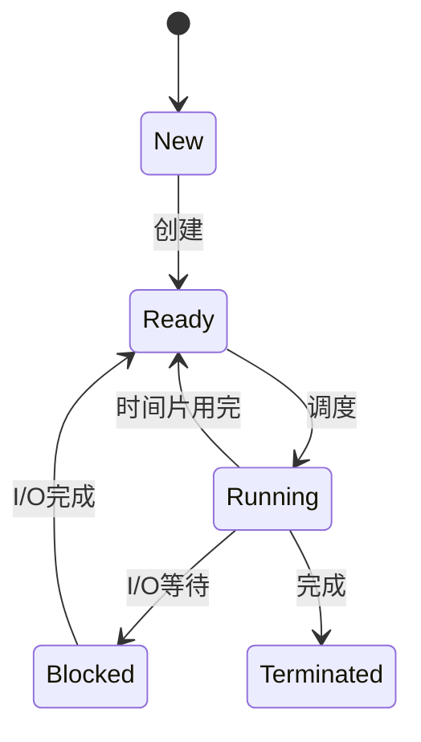
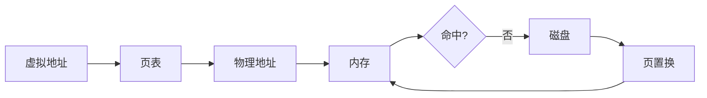
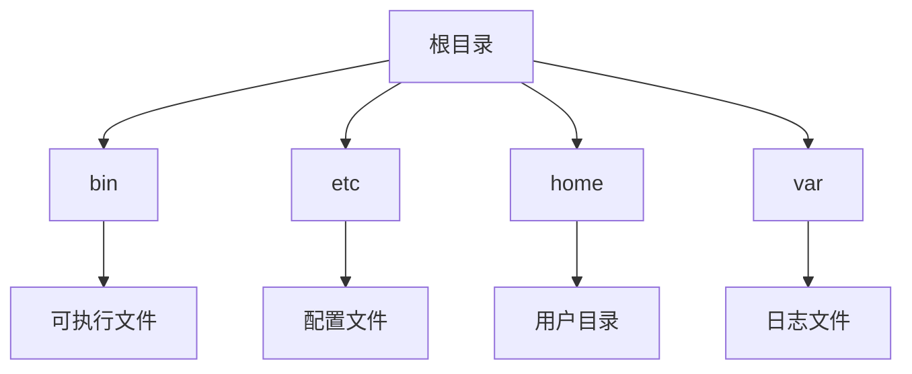
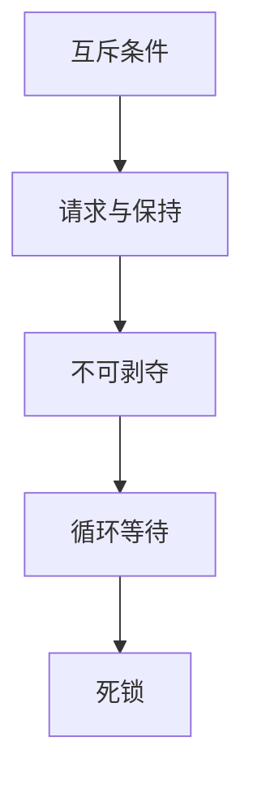

## 操作系统核心总结

操作系统是计算机系统的核心软件，它管理计算机的硬件资源和软件资源，为用户和应用程序提供一个友好的交互界面。

## 一、操作系统概述

### 1.1 操作系统的定义

操作系统（Operating System，简称OS）是管理计算机硬件与软件资源的计算机程序，同时也是计算机系统的内核与基石。

### 1.2 操作系统的功能

| 功能 | 说明 |
|------|------|
| 进程管理 | 进程的创建、调度、同步、通信 |
| 内存管理 | 内存分配、回收、虚拟内存 |
| 文件管理 | 文件的创建、删除、读写、保护 |
| 设备管理 | 设备驱动、I/O控制 |
| 用户接口 | 命令行、图形界面 |

### 1.3 常见操作系统

| 操作系统 | 特点 | 应用场景 |
|----------|------|----------|
| Windows | 图形界面友好 | 个人电脑 |
| Linux | 开源、稳定 | 服务器、嵌入式 |
| macOS | 流畅体验 | 苹果设备 |
| Unix | 历史悠久 | 企业级服务器 |

## 二、进程管理

### 2.1 进程与线程



### 2.2 进程状态



### 2.3 进程调度算法

| 算法 | 特点 | 适用场景 |
|------|------|----------|
| FCFS | 先来先服务 | 批处理系统 |
| SJF | 短作业优先 | 短任务多的场景 |
| RR | 时间片轮转 | 分时系统 |
| Priority | 优先级调度 | 实时系统 |
| MLFQ | 多级反馈队列 | 通用系统 |

## 三、内存管理

### 3.1 内存管理策略

| 策略 | 说明 |
|------|------|
| 连续分配 | 一次性分配连续空间 |
| 分页管理 | 内存分成固定大小页 |
| 分段管理 | 按逻辑分段 |
| 段页式 | 分段+分页 |

### 3.2 虚拟内存



### 3.3 页面置换算法

| 算法 | 特点 |
|------|------|
| FIFO | 先进先出 |
| LRU | 最近最少使用 |
| OPT | 最优置换 |
| LFU | 最不经常使用 |

## 四、文件系统

### 4.1 文件系统结构



### 4.2 文件分配方式

| 方式 | 特点 |
|------|------|
| 连续分配 | 顺序存储，速度快 |
| 链式分配 | 非连续，空间利用率高 |
| 索引分配 | 支持随机访问 |

### 4.3 Linux文件权限

```bash
-rw-r--r-- 1 user group 1024 Jun 1 10:00 file.txt
# 所有者: rw- (读写)
# 组用户: r-- (只读)
# 其他用户: r-- (只读)
```

## 五、设备管理

### 5.1 I/O控制方式

| 方式 | 特点 |
|------|------|
| 程序直接控制 | CPU等待I/O完成 |
| 中断驱动 | I/O完成时中断CPU |
| DMA | 直接内存访问 |
| 通道控制 | 专用通道处理 |

### 5.2 设备分类

| 类型 | 例子 |
|------|------|
| 块设备 | 硬盘、U盘 |
| 字符设备 | 键盘、鼠标 |
| 网络设备 | 网卡 |

## 六、死锁

### 6.1 死锁条件



### 6.2 死锁处理

| 策略 | 说明 |
|------|------|
| 预防 | 破坏死锁条件 |
| 避免 | 银行家算法 |
| 检测 | 定期检测死锁 |
| 解除 | 资源剥夺或进程终止 |

## 七、进程间通信

### 7.1 通信方式

| 方式 | 说明 |
|------|------|
| 管道 | 半双工通信 |
| 消息队列 | 消息传递 |
| 共享内存 | 最快的IPC |
| 信号量 | 同步原语 |
| 套接字 | 网络通信 |

### 7.2 同步机制

```java
// 信号量
semaphore.wait();
// 临界区
semaphore.signal();

// 互斥锁
mutex.lock();
// 临界区
mutex.unlock();
```

## 八、操作系统面试题

### Q1: 进程和线程的区别？

**A:** 进程是资源分配的基本单位，线程是CPU调度的基本单位。线程共享进程的资源。

### Q2: 什么是死锁？如何避免？

**A:** 死锁是多个进程互相等待对方资源的状态。可以通过破坏死锁的四个条件之一来避免。

### Q3: 虚拟内存的作用？

**A:** 虚拟内存扩展了可用的内存空间，允许程序使用比物理内存更多的内存。

### Q4: 页面置换算法有哪些？

**A:** FIFO、LRU、OPT、LFU等。

### Q5: 进程调度算法有哪些？

**A:** FCFS、SJF、RR、Priority、MLFQ等。

## 九、总结

操作系统是计算机系统的核心，掌握以下知识至关重要：
- 进程和线程的管理
- 内存管理和虚拟内存
- 文件系统和设备管理
- 死锁的概念和处理
- 进程间通信和同步

---
> 参考来源：[小林coding](https://xiaolincoding.com/os/)

<div class='context-nav'>
<a class='context-link prev' href='/software-fundamentals/posts/操作系统-悲观锁与乐观锁/'><span class='context-label'>上一篇</span><span class='context-title'>什么是悲观锁、乐观锁</span></a>
<a class='context-link next' href='/software-fundamentals/posts/操作系统-操作系统面试题/'><span class='context-label'>下一篇</span><span class='context-title'>操作系统面试</span></a>
</div>
