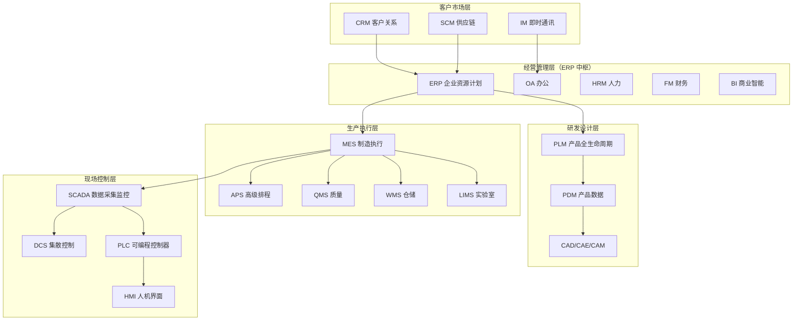
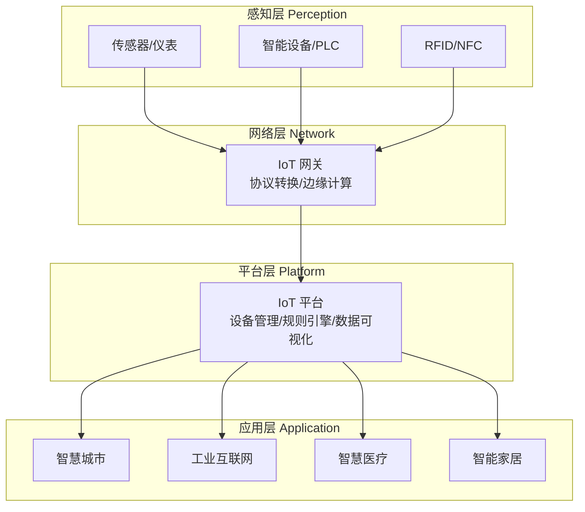
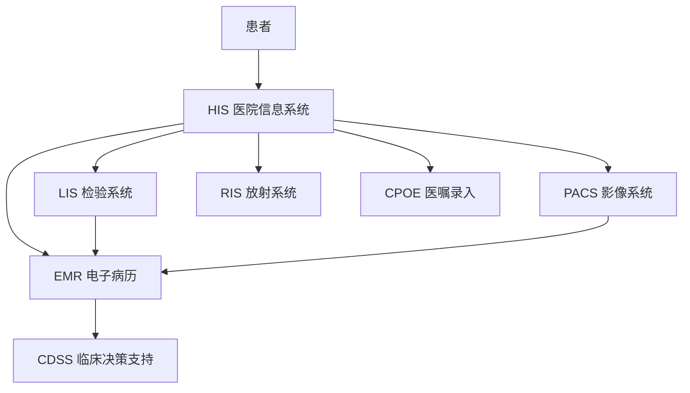
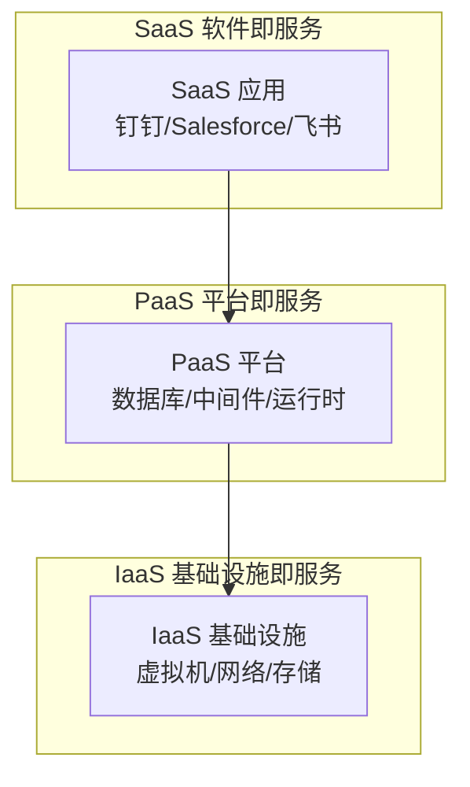
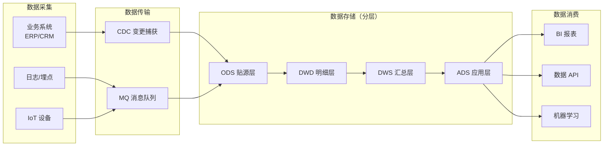
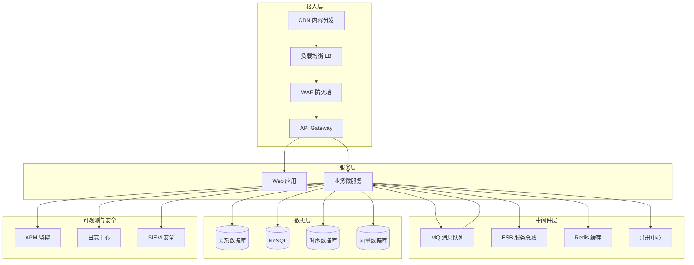

> 在企业数字化、工业 4.0、智慧医疗等场景中，每天都能听到 ERP、MES、SCADA、HIS、IoT 这些缩写。本文按领域系统整理国内外主流**软件系统/产品类型**缩写（不含通信协议、技术原理、业务指标），方便快速查阅。

---

## 一、企业经营管理类

| 缩写 | 英文全称 | 中文含义 | 说明 |
|:---:|:---|:---|:---|
| **ERP** | Enterprise Resource Planning | 企业资源计划 | 企业经营中枢，覆盖财务/采购/销售/库存/人资 |
| **CRM** | Customer Relationship Management | 客户关系管理 | 客户全生命周期管理 |
| **SCRM** | Social Customer Relationship Management | 社会化客户关系管理 | 融合社交渠道的 CRM |
| **SRM** | Supplier Relationship Management | 供应商关系管理 | 供应商全生命周期管理 |
| **SCM** | Supply Chain Management | 供应链管理 | 从供应商到客户的端到端协同 |
| **HRM / HCM** | Human Resource / Capital Management | 人力资源 / 人力资本管理 | 招聘/薪酬/绩效/培训 |
| **OA** | Office Automation | 办公自动化 | 审批/协同/考勤/公文 |
| **IM** | Instant Messaging | 即时通讯 | 企业内部沟通，代表：钉钉、企微、飞书 |
| **BI** | Business Intelligence | 商业智能 | 报表/多维分析/数据可视化 |
| **EAM** | Enterprise Asset Management | 企业资产管理 | 设备资产全生命周期 |
| **FM** | Financial Management | 财务管理 | 总账/应收应付/预算 |
| **LMS** | Learning Management System | 学习管理系统 | 企业培训/在线学习平台 |
| **TM** | Talent Management | 人才管理 | 人才盘点/继任/发展 |
| **DAM** | Digital Asset Management | 数字资产管理 | 图片/视频/文档统一管理 |
| **CMS** | Content Management System | 内容管理系统 | 网站/门户内容发布 |
| **ITSM** | IT Service Management | IT 服务管理 | ITIL 框架，代表：ServiceNow、Jira Service Desk |
| **CSM** | Customer Success Management | 客户成功管理 | SaaS 续费/增购/健康度 |

---

## 二、工业制造类（工业软件核心）

### 2.1 研发设计类（CAX）

| 缩写 | 英文全称 | 中文含义 | 说明 |
|:---:|:---|:---|:---|
| **CAD** | Computer Aided Design | 计算机辅助设计 | 代表：AutoCAD、SolidWorks、CATIA |
| **CAE** | Computer Aided Engineering | 计算机辅助工程 | 仿真分析（结构/流体/热） |
| **CAM** | Computer Aided Manufacturing | 计算机辅助制造 | 生成数控加工代码 |
| **CAPP** | Computer Aided Process Planning | 计算机辅助工艺规划 | 工艺路线/工序设计 |
| **EDA** | Electronic Design Automation | 电子设计自动化 | 芯片/PCB 设计，代表：Cadence、Synopsys |
| **PDM** | Product Data Management | 产品数据管理 | 设计文档/BOM 管理 |

### 2.2 生产管理类

| 缩写 | 英文全称 | 中文含义 | 说明 |
|:---:|:---|:---|:---|
| **PLM** | Product Lifecycle Management | 产品全生命周期管理 | 从需求到退役的产品数据协同 |
| **MES** | Manufacturing Execution System | 制造执行系统 | 车间级生产调度/报工/质量追溯 |
| **MOM** | Manufacturing Operations Management | 制造运营管理 | MES 的扩展，含质量/维护/库存 |
| **APS** | Advanced Planning and Scheduling | 高级计划与排程 | 有限产能排产优化 |
| **MRP / MRPII** | Material Requirements / Manufacturing Resource Planning | 物料需求 / 制造资源计划 | ERP 的前身/核心模块 |
| **MPS** | Master Production Schedule | 主生产计划 | 产线产能与需求平衡 |
| **BOM** | Bill of Materials | 物料清单 | 产品结构数据 |
| **QMS** | Quality Management System | 质量管理系统 | IQC/IPQC/FQC/SPC |
| **LIMS** | Laboratory Information Management System | 实验室信息管理系统 | 检测业务/样品/报告 |
| **WMS** | Warehouse Management System | 仓储管理系统 | 库位/出入库/盘点 |
| **TMS** | Transportation Management System | 运输管理系统 | 车辆/线路/运费 |
| **CMMS** | Computerized Maintenance Management System | 计算机化维护管理系统 | 设备点检/保养/维修工单 |

### 2.3 自动化控制类

| 缩写 | 英文全称 | 中文含义 | 说明 |
|:---:|:---|:---|:---|
| **SCADA** | Supervisory Control and Data Acquisition | 数据采集与监控系统 | 上位机监控+数据采集 |
| **DCS** | Distributed Control System | 分布式控制系统 | 化工/电力连续过程控制 |
| **PLC** | Programmable Logic Controller | 可编程逻辑控制器 | 现场控制核心 |
| **PAC** | Programmable Automation Controller | 可编程自动化控制器 | PLC+IPC 融合 |
| **FCS** | Fieldbus Control System | 现场总线控制系统 | 基于现场总线的分布式控制 |
| **CNC** | Computer Numerical Control | 计算机数字控制 | 数控机床控制系统 |
| **HMI** | Human-Machine Interface | 人机界面 | 操作员交互界面 |
| **SIS** | Safety Instrumented System | 安全仪表系统 | 紧急停车/联锁保护 |

### 2.4 制造业软件系统集成全景

> **口诀**：ERP（计划）→ MES（执行）→ SCADA/DCS/PLC（控制），制造业数字化三层架构。

---

## 三、物联网与工业互联网类

| 缩写 | 英文全称 | 中文含义 | 说明 |
|:---:|:---|:---|:---|
| **IoT** | Internet of Things | 物联网 | 万物互联的网络与应用 |
| **IIoT** | Industrial Internet of Things | 工业物联网 | 工业场景的物联网 |
| **CPS** | Cyber-Physical System | 信息物理系统 | 虚拟+实体双向映射 |
| **Digital Twin** | Digital Twin | 数字孪生 | 实体的数字化镜像 |
| **Edge Computing** | Edge Computing | 边缘计算 | 在靠近数据源处计算 |
| **OT** | Operational Technology | 运营技术 | 工业现场控制技术 |
| **IT** | Information Technology | 信息技术 | 企业信息系统 |

### 3.1 物联网经典分层架构

> **口诀**：感知层（设备/传感器）→ 网络层（网关）→ 平台层（IoT 平台）→ 应用层（行业应用）。

---

## 四、医疗行业信息系统

| 缩写 | 英文全称 | 中文含义 | 说明 |
|:---:|:---|:---|:---|
| **HIS** | Hospital Information System | 医院信息管理系统 | 挂号/收费/药房/住院 |
| **LIS** | Laboratory Information System | 实验室（检验科）信息系统 | 检验申请/结果/质控 |
| **PACS** | Picture Archiving and Communication System | 影像归档和通信系统 | CT/MRI/DR 影像存储调阅 |
| **RIS** | Radiology Information System | 放射科信息管理系统 | 检查预约/报告/排班 |
| **EMR** | Electronic Medical Record | 电子病历 | 医生书写的病历记录 |
| **EHR** | Electronic Health Record | 电子健康档案 | 跨机构的健康记录 |
| **CIS** | Clinical Information System | 临床信息系统 | 临床决策支持 |
| **CPOE** | Computerized Provider Order Entry | 医生医嘱录入系统 | 电子开单/医嘱 |
| **CDSS** | Clinical Decision Support System | 临床决策支持系统 | 用药提醒/诊断辅助 |

### 4.1 医疗系统集成关系

> **口诀**：HIS 为中枢，LIS（检验）+ PACS（影像）+ EMR（病历）为三大核心。

---

## 五、互联网与云服务类

### 5.1 云服务模式

| 缩写 | 英文全称 | 中文含义 | 说明 |
|:---:|:---|:---|:---|
| **SaaS** | Software as a Service | 软件即服务 | 直接使用软件，代表：钉钉、Salesforce |
| **PaaS** | Platform as a Service | 平台即服务 | 提供开发/运行平台，代表：Heroku、阿里云 |
| **IaaS** | Infrastructure as a Service | 基础设施即服务 | 提供虚拟机/存储，代表：AWS EC2、阿里云 ECS |
| **DaaS** | Data as a Service | 数据即服务 | 提供数据 API |

### 5.2 中间件与基础设施

| 缩写 | 英文全称 | 中文含义 | 说明 |
|:---:|:---|:---|:---|
| **API Gateway** | API Gateway | API 网关 | 统一入口/鉴权/限流/路由 |
| **ESB** | Enterprise Service Bus | 企业服务总线 | 系统间集成的中间件 |
| **MQ** | Message Queue | 消息队列 | 异步解耦，代表：Kafka、RabbitMQ、RocketMQ |
| **K8s** | Kubernetes | 容器编排 | 容器化应用的部署/伸缩/管理 |
| **Docker** | Docker | 容器 | 应用打包与隔离运行 |
| **Service Mesh** | Service Mesh | 服务网格 | 微服务通信治理，代表：Istio |
| **DevOps** | Development + Operations | 开发运维一体化 | 打破开发与运维壁垒 |
| **CI/CD** | Continuous Integration / Delivery | 持续集成 / 持续交付 | 自动化构建/测试/部署 |
| **IaC** | Infrastructure as Code | 基础设施即代码 | 用代码管理基础设施，代表：Terraform |
| **API** | Application Programming Interface | 应用程序编程接口 | 系统间调用约定 |
| **CDN** | Content Delivery Network | 内容分发网络 | 静态资源就近分发 |
| **CMS** | Content Management System | 内容管理系统 | 同企业类，网站内容发布 |
| **OBS** | Object Storage Service | 对象存储服务 | 海量非结构化数据存储 |

### 5.3 SPI 云服务模型三层关系

> **口诀**：SPI 模型——SaaS 只管用软件，PaaS 管代码和平台，IaaS 管机器和网络。

---

## 六、数据与分析类

| 缩写 | 英文全称 | 中文含义 | 说明 |
|:---:|:---|:---|:---|
| **BI** | Business Intelligence | 商业智能 | 报表/分析/可视化 |
| **DWH** | Data Warehouse | 数据仓库 | 面向分析的集成数据存储 |
| **ODS** | Operational Data Store | 操作数据存储 | 近实时业务数据缓存层 |
| **ETL** | Extract, Transform, Load | 数据抽取/转换/加载 | 数据仓库建设核心流程 |
| **OLAP** | Online Analytical Processing | 联机分析处理 | 多维数据分析 |
| **OLTP** | Online Transaction Processing | 联机事务处理 | 高频事务处理（业务数据库） |
| **DM** | Data Mining | 数据挖掘 | 从数据中发现规律 |
| **DMP** | Data Management Platform | 数据管理平台 | 用户画像/广告投放 |
| **MDM** | Master Data Management | 主数据管理 | 核心数据统一管理 |
| **LakeHouse** | Lake House | 湖仓一体 | 数据湖+数据仓库融合 |
| **APM** | Application Performance Monitoring | 应用性能监控 | 应用链路/指标监控 |
| **SIEM** | Security Information and Event Management | 安全信息与事件管理 | 安全日志聚合分析 |

### 6.1 数据流向：采集 → 治理 → 分析 → 决策

> **口诀**：采集 → 传输 → ODS（贴源）→ DWD（明细）→ DWS（汇总）→ ADS（应用）→ 消费。

---

## 七、其他专业领域

| 缩写 | 英文全称 | 中文含义 | 说明 |
|:---:|:---|:---|:---|
| **GIS** | Geographic Information System | 地理信息系统 | 地图/空间数据分析 |
| **BMS** | Building Management System | 楼宇自控系统 | 暖通/照明/电梯监控 |
| **VMS** | Video Management System | 视频监控管理系统 | 摄像头统一管理 |
| **PMS** | Property Management System | 物业管理系统 | 酒店/公寓/园区管理 |
| **POS** | Point of Sale | 销售终端系统 | 收银/订单/库存 |
| **HSE** | Health, Safety and Environment | 健康安全环境管理系统 | 工业企业安全环保管理 |
| **WMS** | Warehouse Management System | 仓储管理系统 | 同工业类，物流仓储通用 |
| **TMS** | Transportation Management System | 运输管理系统 | 同工业类，物流运输通用 |

---

## 八、人工智能与大模型类

| 缩写 | 英文全称 | 中文含义 | 说明 |
|:---:|:---|:---|:---|
| **AI** | Artificial Intelligence | 人工智能 | 让机器具备类人智能的总称 |
| **LLM** | Large Language Model | 大语言模型 | 代表：GPT、Claude、Llama、文心一言 |
| **AIGC** | AI Generated Content | 生成式人工智能 | AI 生成文字/图片/视频/代码 |
| **RAG** | Retrieval-Augmented Generation | 检索增强生成 | 大模型+向量检索，解决知识更新 |
| **Agent** | AI Agent | AI 智能体 | 自主规划/调用工具/执行任务的 LLM 应用 |
| **MCP** | Model Context Protocol | 模型上下文协议 | LLM 接入外部工具/数据源的开放协议 |
| **MaaS** | Model as a Service | 模型即服务 | 按调用量付费的大模型 API |
| **Vector DB** | Vector Database | 向量数据库 | 存储高维向量，支持相似度检索 |

---

## 九、系统集成关系全景图

> 企业数字化不是单个系统的孤立建设，而是各业务系统围绕 ERP/MQ/API Gateway 形成的协作网络。

### 9.1 IT 基础设施与中间件集成

### 9.2 集成常见模式速记

| 模式 | 适用场景 | 代表技术 |
|:---|:---|:---|
| **点对点 P2P** | 少量系统直连 | HTTP/RPC |
| **ESB 总线** | 多系统异构集成 | MuleSoft、Oracle ESB |
| **API Gateway** | 对外统一 API 入口 | Kong、Apisix |
| **MQ 异步** | 解耦/削峰/异步 | Kafka、RabbitMQ |
| **CDC 数据同步** | 数据库变更捕获 | Canal、Debezium |

---

## 十、高频 Top 30

| 排名 | 缩写 | 中文 | 排名 | 缩写 | 中文 |
|:---:|:---:|:---|:---:|:---:|:---|
| 1 | ERP | 企业资源计划 | 16 | IoT | 物联网 |
| 2 | CRM | 客户关系管理 | 17 | IIoT | 工业物联网 |
| 3 | OA | 办公自动化 | 18 | SCADA | 数据采集监控 |
| 4 | MES | 制造执行系统 | 19 | DCS | 分布式控制 |
| 5 | PLM | 产品生命周期 | 20 | PLC | 可编程控制器 |
| 6 | WMS | 仓储管理 | 21 | CAD | 计算机辅助设计 |
| 7 | TMS | 运输管理 | 22 | HIS | 医院信息系统 |
| 8 | SCM | 供应链管理 | 23 | LIS | 检验信息系统 |
| 9 | HRM | 人力资源 | 24 | PACS | 影像系统 |
| 10 | BI | 商业智能 | 25 | EMR | 电子病历 |
| 11 | SaaS | 软件即服务 | 26 | K8s | 容器编排 |
| 12 | PaaS | 平台即服务 | 27 | MQ | 消息队列 |
| 13 | IaaS | 基础设施即服务 | 28 | API Gateway | API 网关 |
| 14 | ESB | 企业服务总线 | 29 | CDSS | 临床决策支持 |
| 15 | ETL | 数据抽取转换 | 30 | LLM | 大语言模型 |

---

## 参考来源

- Gartner Group 定义的 ERP/MES/MOM 体系
- 工业和信息化部《工业软件分类》标准
- HL7 / DICOM / FHIR 国际医疗信息化标准
- NIST 工业物联网参考架构
- CNCF Cloud Native Glossary 云原生术语
- ISC² CISSP 安全领域缩写
- ITIL v4 IT 服务管理标准
