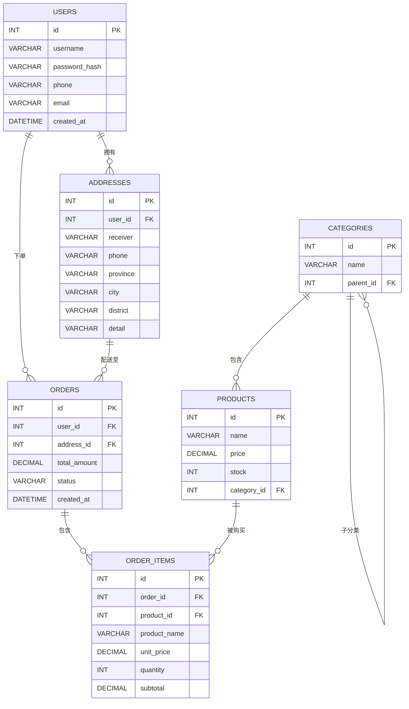
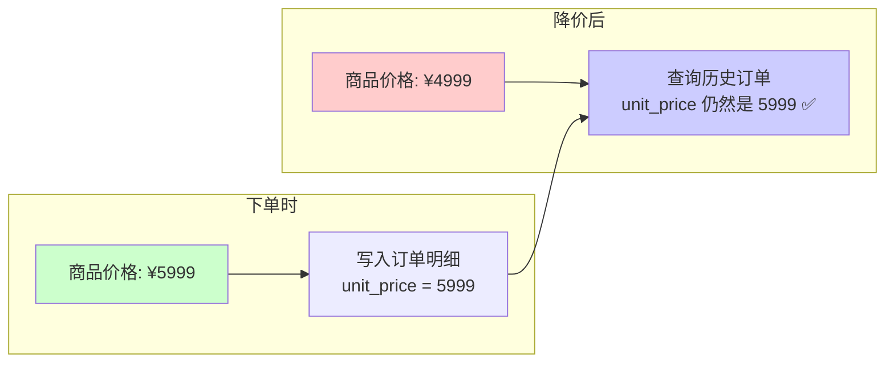
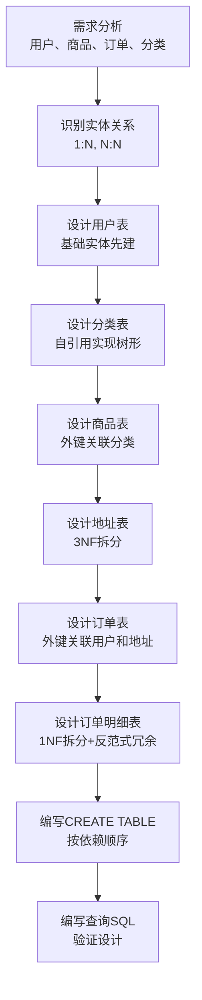

## 从需求出发：一个最简电商系统需要什么？

想象你要开一个网店，最基本需要管理哪些东西？

1. **用户**：谁来买？需要注册、登录
2. **商品**：卖什么？需要展示、分类
3. **订单**：买了什么？需要记录、追踪
4. **分类**：商品怎么组织？需要树形结构

这四个核心实体，就是一个最简电商系统的全部。让我们一步步把它们设计成数据库表。

## 第一步：识别实体和关系

在设计表之前，先搞清楚实体之间的关系：

| 关系             | 类型     | 说明                           |
| ---------------- | -------- | ------------------------------ |
| 用户 → 订单      | 一对多   | 一个用户可以有多个订单         |
| 订单 → 商品      | 多对多   | 一个订单包含多个商品，一个商品可出现在多个订单中 |
| 商品 → 分类      | 多对一   | 多个商品属于同一个分类         |
| 用户 → 收货地址  | 一对多   | 一个用户可以有多个收货地址     |

> 💡 **多对多关系的处理**：数据库无法直接表示多对多关系，需要一张"中间表"来连接。比如订单和商品之间，需要一张"订单明细表"。
{: .prompt-tip }

下面是完整的实体关系图：



## 第二步：设计用户表

用户表是最基础的表，存储用户的基本信息：

| 字段           | 类型          | 说明                     |
| -------------- | ------------- | ------------------------ |
| id             | INT           | 主键，自增               |
| username       | VARCHAR(50)   | 用户名，唯一             |
| password_hash  | VARCHAR(255)  | 密码哈希值（不存明文！） |
| phone          | VARCHAR(20)   | 手机号                   |
| email          | VARCHAR(100)  | 邮箱                     |
| created_at     | DATETIME      | 注册时间                 |

> ⚠️ **安全提醒**：永远不要在数据库中存储用户的明文密码！应该存储密码的哈希值（如 bcrypt、SHA-256），这样即使数据库泄露，攻击者也无法直接获取密码。
{: .prompt-danger }

为什么密码字段叫 `password_hash` 而不是 `password`？这是一种命名约定，提醒所有人这里存的是哈希值而非明文。

## 第三步：设计商品表和分类表

### 分类表：树形结构怎么设计？

商品分类通常是树形的，比如：

```
电子产品
├── 手机
│   ├── 苹果
│   └── 华为
├── 电脑
│   ├── 笔记本
│   └── 台式机
```

怎么在数据库中表示树形结构？最简单的方法是**自引用外键**——在表中加一个 `parent_id` 字段，指向同一张表的主键：

| 字段      | 类型         | 说明                           |
| --------- | ------------ | ------------------------------ |
| id        | INT          | 主键，自增                     |
| name      | VARCHAR(100) | 分类名称                       |
| parent_id | INT          | 父分类ID，顶级分类为NULL       |

数据示例：

| id | name     | parent_id |
| ---- | -------- | --------- |
| 1    | 电子产品 | NULL      |
| 2    | 手机     | 1         |
| 3    | 电脑     | 1         |
| 4    | 苹果     | 2         |
| 5    | 华为     | 2         |

`parent_id` 为 NULL 表示这是顶级分类，有值则表示它是某个分类的子分类。就像族谱一样，每个人记录自己父亲是谁，就能追溯整个家族关系。

### 商品表

| 字段        | 类型           | 说明               |
| ----------- | -------------- | ------------------ |
| id          | INT            | 主键，自增         |
| name        | VARCHAR(200)   | 商品名称           |
| price       | DECIMAL(10,2)  | 价格               |
| stock       | INT            | 库存数量           |
| category_id | INT            | 外键，指向分类表   |

## 第四步：设计订单表和订单明细表

### 为什么订单和商品不能放一张表？

这是初学者最常犯的错误。有人会这样设计：

❌ **错误设计**：

| 订单号 | 用户 | 商品1  | 商品2  | 商品3  | 总价  |
| ------ | ---- | ------ | ------ | ------ | ----- |
| O001   | 小明 | iPhone | AirPods| NULL   | 8999  |
| O002   | 小红 | MacBook| iPhone | iPad   | 21997 |

问题很明显：
1. **违反1NF**：商品1、商品2、商品3本质上是同一类信息，被拆成了多个字段
2. **无法扩展**：如果一个订单有10个商品怎么办？加10个字段？
3. **浪费空间**：大部分订单的商品数不到3个，多余的字段就是NULL

✅ **正确设计**：拆成订单表 + 订单明细表

**订单表（orders）**—— 记录"谁在什么时候下了单"

| 字段          | 类型           | 说明                     |
| ------------- | -------------- | ------------------------ |
| id            | INT            | 主键，自增               |
| user_id       | INT            | 外键，指向用户表         |
| address_id    | INT            | 外键，指向收货地址表     |
| total_amount  | DECIMAL(10,2)  | 订单总金额               |
| status        | VARCHAR(20)    | 订单状态                 |
| created_at    | DATETIME       | 下单时间                 |

**订单明细表（order_items）**—— 记录"这个订单买了哪些商品"

| 字段          | 类型           | 说明                       |
| ------------- | -------------- | -------------------------- |
| id            | INT            | 主键，自增                 |
| order_id      | INT            | 外键，指向订单表           |
| product_id    | INT            | 外键，指向商品表           |
| product_name  | VARCHAR(200)   | 商品名称（冗余）           |
| unit_price    | DECIMAL(10,2)  | 商品单价（冗余）           |
| quantity      | INT            | 购买数量                   |
| subtotal     | DECIMAL(10,2)  | 小计 = 单价 × 数量         |

数据示例：

**订单表**

| id  | user_id | address_id | total_amount | status |
| --- | ------- | ---------- | ------------ | ------ |
| 1   | 1001    | 1          | 8999.00      | 已付款 |
| 2   | 1002    | 2          | 21997.00     | 已发货 |

**订单明细表**

| id | order_id | product_id | product_name | unit_price | quantity | subtotal |
| -- | -------- | ---------- | ------------ | ---------- | -------- | -------- |
| 1  | 1        | 101        | iPhone 15    | 5999.00    | 1        | 5999.00  |
| 2  | 1        | 102        | AirPods Pro  | 3000.00    | 1        | 3000.00  |
| 3  | 2        | 103        | MacBook Pro  | 14999.00   | 1        | 14999.00 |
| 4  | 2        | 101        | iPhone 15    | 5999.00    | 1        | 5999.00  |
| 5  | 2        | 104        | iPad Air     | 999.00     | 1        | 999.00   |

## 第五步：设计收货地址表

### 为什么地址不直接存在订单里？

你可能会想：订单里直接存收货地址不就行了？为什么要单独建一张表？

原因有两个：

1. **一个用户有多个地址**：家里一个、公司一个，下单时选择用哪个
2. **地址可能修改**：用户搬家后要修改地址，如果地址存在订单里，历史订单的地址也会跟着变（但历史订单应该保留下单时的地址）

这其实是**3NF**的应用：地址通过用户间接依赖订单，应该拆出来。

**收货地址表（addresses）**

| 字段      | 类型          | 说明               |
| --------- | ------------- | ------------------ |
| id        | INT           | 主键，自增         |
| user_id   | INT           | 外键，指向用户表   |
| receiver  | VARCHAR(50)   | 收货人姓名         |
| phone     | VARCHAR(20)   | 收货人电话         |
| province  | VARCHAR(20)   | 省                 |
| city      | VARCHAR(20)   | 市                 |
| district  | VARCHAR(20)   | 区                 |
| detail    | VARCHAR(200)  | 详细地址           |

> 💡 注意地址字段是按1NF拆分的（省、市、区分开存），这样方便按地区统计订单。
{: .prompt-tip }

## 完整的建表 SQL

下面是完整的 CREATE TABLE 语句，按依赖顺序排列（被依赖的表先建）：

```sql
-- 1. 用户表
CREATE TABLE users (
    id INT AUTO_INCREMENT PRIMARY KEY,
    username VARCHAR(50) NOT NULL UNIQUE,
    password_hash VARCHAR(255) NOT NULL,
    phone VARCHAR(20),
    email VARCHAR(100),
    created_at DATETIME DEFAULT CURRENT_TIMESTAMP
);

-- 2. 收货地址表（依赖用户表）
CREATE TABLE addresses (
    id INT AUTO_INCREMENT PRIMARY KEY,
    user_id INT NOT NULL,
    receiver VARCHAR(50) NOT NULL,
    phone VARCHAR(20) NOT NULL,
    province VARCHAR(20) NOT NULL,
    city VARCHAR(20) NOT NULL,
    district VARCHAR(20) NOT NULL,
    detail VARCHAR(200) NOT NULL,
    FOREIGN KEY (user_id) REFERENCES users(id)
);

-- 3. 分类表（自引用，需先建再添加外键）
CREATE TABLE categories (
    id INT AUTO_INCREMENT PRIMARY KEY,
    name VARCHAR(100) NOT NULL,
    parent_id INT,
    FOREIGN KEY (parent_id) REFERENCES categories(id)
);

-- 4. 商品表（依赖分类表）
CREATE TABLE products (
    id INT AUTO_INCREMENT PRIMARY KEY,
    name VARCHAR(200) NOT NULL,
    price DECIMAL(10, 2) NOT NULL,
    stock INT NOT NULL DEFAULT 0,
    category_id INT,
    FOREIGN KEY (category_id) REFERENCES categories(id)
);

-- 5. 订单表（依赖用户表和地址表）
CREATE TABLE orders (
    id INT AUTO_INCREMENT PRIMARY KEY,
    user_id INT NOT NULL,
    address_id INT NOT NULL,
    total_amount DECIMAL(10, 2) NOT NULL,
    status VARCHAR(20) NOT NULL DEFAULT '待付款',
    created_at DATETIME DEFAULT CURRENT_TIMESTAMP,
    FOREIGN KEY (user_id) REFERENCES users(id),
    FOREIGN KEY (address_id) REFERENCES addresses(id)
);

-- 6. 订单明细表（依赖订单表和商品表）
CREATE TABLE order_items (
    id INT AUTO_INCREMENT PRIMARY KEY,
    order_id INT NOT NULL,
    product_id INT NOT NULL,
    product_name VARCHAR(200) NOT NULL,
    unit_price DECIMAL(10, 2) NOT NULL,
    quantity INT NOT NULL DEFAULT 1,
    subtotal DECIMAL(10, 2) NOT NULL,
    FOREIGN KEY (order_id) REFERENCES orders(id),
    FOREIGN KEY (product_id) REFERENCES products(id)
);
```

## 常见查询示例

### 查询某用户的所有订单

```sql
SELECT o.id, o.total_amount, o.status, o.created_at
FROM orders o
WHERE o.user_id = 1001
ORDER BY o.created_at DESC;
```

### 查询某订单的商品列表

```sql
SELECT oi.product_name, oi.unit_price, oi.quantity, oi.subtotal
FROM order_items oi
WHERE oi.order_id = 1;
```

### 查询销量 TOP 10

```sql
SELECT p.name AS 商品名称,
       SUM(oi.quantity) AS 总销量,
       SUM(oi.subtotal) AS 总销售额
FROM order_items oi
JOIN products p ON oi.product_id = p.id
GROUP BY oi.product_id, p.name
ORDER BY 总销量 DESC
LIMIT 10;
```

### 查询某用户最近3个月的消费总额

```sql
SELECT SUM(o.total_amount) AS 消费总额
FROM orders o
WHERE o.user_id = 1001
  AND o.created_at >= DATE_SUB(CURRENT_DATE, INTERVAL 3 MONTH)
  AND o.status != '已取消';
```

### 查询某个分类下所有商品（含子分类）

```sql
-- 查询"电子产品"（id=1）及其子分类下的所有商品
SELECT p.name, p.price, p.stock
FROM products p
JOIN categories c ON p.category_id = c.id
WHERE c.id = 1 OR c.parent_id = 1;
```

## 设计反思：反范式的应用

细心的你可能已经注意到，订单明细表中有两个字段看起来是"多余"的：

- `product_name`：商品名称，商品表里已经有了
- `unit_price`：商品单价，商品表里已经有了

这不是设计失误，而是**故意的反范式设计**。为什么？

### 原因：商品价格会变，但历史订单不能变

想象这个场景：

1. 小明在6月1日买了一部手机，价格5999元
2. 到了6月15日，手机降价到4999元
3. 小明查看6月1日的订单，应该显示5999元还是4999元？

**当然是5999元！** 历史订单必须保留下单时的价格，否则财务数据就对不上了。

如果订单明细只存 `product_id`，查询时去商品表取价格，那查到的永远是**当前价格**，而不是**下单时的价格**。所以我们必须在订单明细中**冗余**商品名称和单价，作为下单时的"快照"。



### 反范式总结

| 冗余字段         | 所在表       | 原因                                     |
| ---------------- | ------------ | ---------------------------------------- |
| product_name     | order_items  | 保留下单时的商品名称，防止商品改名       |
| unit_price       | order_items  | 保留下单时的价格，防止商品改价           |
| total_amount     | orders       | 避免每次查询都要重新计算，提升查询性能   |

> 💡 **原则**：历史数据（订单、流水、日志）适合反范式，因为它们写入后很少修改；而当前数据（用户信息、商品信息）应该严格遵循范式，避免冗余。
{: .prompt-tip }

## 完整设计流程回顾

让我们用一个流程图回顾整个设计过程：



## 小结

这篇文章我们通过设计一个电商系统数据库，实践了以下知识：

1. **需求分析**：从业务需求出发，识别核心实体和关系
2. **1NF应用**：订单和商品不能放一张表，需要订单明细表
3. **3NF应用**：收货地址单独建表，避免间接依赖
4. **自引用外键**：用 `parent_id` 实现分类的树形结构
5. **反范式设计**：订单明细冗余商品名称和单价，保留历史快照
6. **建表顺序**：被依赖的表先建，有外键依赖的表后建

> 🎯 **设计口诀**：先分析需求，再识别关系，然后按范式设计表，最后根据性能需要适度反范式。

三篇数据库入门文章到这里就结束了。从基本概念到三范式再到实战设计，希望这个系列能帮你建立起数据库设计的思维框架。记住，最好的学习方式是动手实践——试着设计一个你自己感兴趣的项目数据库吧！
