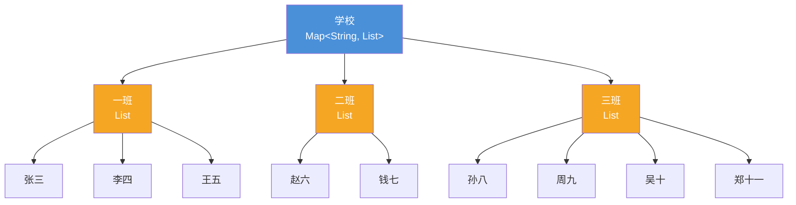
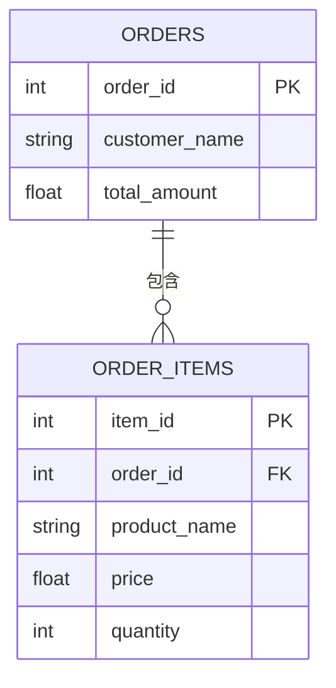
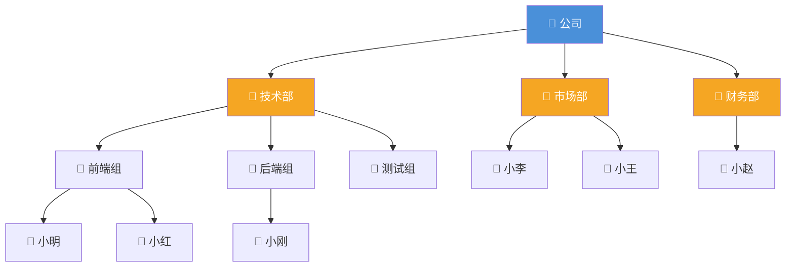
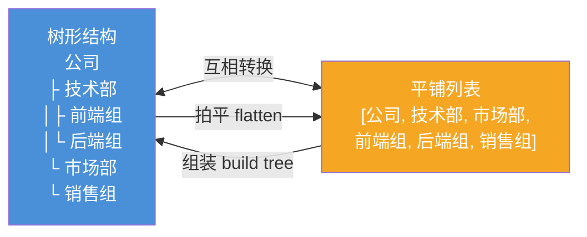

## 现实世界的数据本身就是嵌套的

想想你网购的一个订单：
- 一个**订单**包含多个**商品**
- 每个**商品**有名称、价格、数量
- 订单还有收货**地址**，地址又包含省、市、区、详细地址

数据从来不是扁平的，而是**一层套一层**的。学会处理嵌套数据，是编程的必备技能。

---

## 简单嵌套：List里面放Map

### 场景：学生成绩表

想象一张成绩表：每一行是一个学生（Map），所有行组成一个列表（List）。

```
学生列表（List）
  ├── 学生1（Map）：{姓名: "张三", 语文: 89, 数学: 95}
  ├── 学生2（Map）：{姓名: "李四", 语文: 92, 数学: 88}
  └── 学生3（Map）：{姓名: "王五", 语文: 85, 数学: 90}
```

> 💡 **类比**：List像一本花名册，Map像每个人的档案卡。花名册里夹着档案卡，就是"List套Map"。

### Java实现

```java
import java.util.*;

public class ListOfMap {
    public static void main(String[] args) {
        // List里面放Map
        List<Map<String, Object>> students = new ArrayList<>();

        // 添加学生
        Map<String, Object> stu1 = new HashMap<>();
        stu1.put("姓名", "张三");
        stu1.put("语文", 89);
        stu1.put("数学", 95);
        students.add(stu1);

        Map<String, Object> stu2 = new HashMap<>();
        stu2.put("姓名", "李四");
        stu2.put("语文", 92);
        stu2.put("数学", 88);
        students.add(stu2);

        Map<String, Object> stu3 = new HashMap<>();
        stu3.put("姓名", "王五");
        stu3.put("语文", 85);
        stu3.put("数学", 90);
        students.add(stu3);

        // 遍历：外层循环List，内层访问Map
        System.out.println("===== 学生成绩表 =====");
        for (Map<String, Object> stu : students) {
            System.out.printf("%s：语文%d，数学%d%n",
                stu.get("姓名"), stu.get("语文"), stu.get("数学"));
        }

        // 找数学最高分
        String topStudent = "";
        int maxMath = 0;
        for (Map<String, Object> stu : students) {
            int math = (int) stu.get("数学");
            if (math > maxMath) {
                maxMath = math;
                topStudent = (String) stu.get("姓名");
            }
        }
        System.out.println("数学最高分：" + topStudent + "，" + maxMath + "分");
    }
}
```

### Python实现

```python
# Python：列表里放字典
students = [
    {"姓名": "张三", "语文": 89, "数学": 95},
    {"姓名": "李四", "语文": 92, "数学": 88},
    {"姓名": "王五", "语文": 85, "数学": 90},
]

# 遍历
for stu in students:
    print(f"{stu['姓名']}：语文{stu['语文']}，数学{stu['数学']}")

# 找数学最高分（用max函数）
top = max(students, key=lambda s: s["数学"])
print(f"数学最高分：{top['姓名']}，{top['数学']}分")
```

---

## 复杂嵌套：Map里面放List

### 场景：班级学生分组

一个学校有多个班级，每个班级有多个学生——**Map的value是List**。

```
班级Map
  ├── "一班" → [张三, 李四, 王五]
  ├── "二班" → [赵六, 钱七]
  └── "三班" → [孙八, 周九, 吴十, 郑十一]
```

> 💡 **类比**：Map像学校的班级目录，key是班级名，value是学生名单（List）。翻开目录找到班级，就能看到这个班所有学生。

### Java实现

```java
import java.util.*;

public class MapOfList {
    public static void main(String[] args) {
        // Map里面放List
        Map<String, List<String>> classes = new HashMap<>();

        // 添加班级和学生
        classes.put("一班", new ArrayList<>(Arrays.asList("张三", "李四", "王五")));
        classes.put("二班", new ArrayList<>(Arrays.asList("赵六", "钱七")));
        classes.put("三班", new ArrayList<>(Arrays.asList("孙八", "周九", "吴十", "郑十一")));

        // 遍历：外层遍历Map，内层遍历List
        for (Map.Entry<String, List<String>> entry : classes.entrySet()) {
            System.out.println(entry.getKey() + "：" + entry.getValue());
        }

        // 查询：哪个班有"赵六"？
        for (Map.Entry<String, List<String>> entry : classes.entrySet()) {
            if (entry.getValue().contains("赵六")) {
                System.out.println("赵六在" + entry.getKey());
            }
        }

        // 统计：哪个班人最多？
        String biggestClass = "";
        int maxSize = 0;
        for (Map.Entry<String, List<String>> entry : classes.entrySet()) {
            if (entry.getValue().size() > maxSize) {
                maxSize = entry.getValue().size();
                biggestClass = entry.getKey();
            }
        }
        System.out.println("人数最多的班级：" + biggestClass + "，" + maxSize + "人");
    }
}
```

### Python实现

```python
# Python：字典里放列表
classes = {
    "一班": ["张三", "李四", "王五"],
    "二班": ["赵六", "钱七"],
    "三班": ["孙八", "周九", "吴十", "郑十一"],
}

# 遍历
for class_name, students in classes.items():
    print(f"{class_name}：{students}")

# 查询：哪个班有"赵六"？
for class_name, students in classes.items():
    if "赵六" in students:
        print(f"赵六在{class_name}")

# 统计：哪个班人最多？
biggest = max(classes, key=lambda k: len(classes[k]))
print(f"人数最多的班级：{biggest}，{len(classes[biggest])}人")
```

---

## 嵌套结构层次图



---

## JSON：最常见的数据嵌套格式

### 什么是JSON？

**JSON**（JavaScript Object Notation）是互联网上最流行的数据交换格式。它就是用文本表示嵌套数据的方式——几乎所有编程语言都能读懂。

> 💡 **类比**：JSON就像一份结构清晰的表格文件，人和机器都能看懂。你在网上看到的天气数据、商品信息、新闻列表，背后几乎都是JSON格式。

### 电商订单的JSON

```json
{
  "orderId": "20260616001",
  "customer": {
    "name": "张三",
    "phone": "138xxxx1234"
  },
  "items": [
    {
      "productId": "P001",
      "name": "Java编程思想",
      "price": 89.00,
      "quantity": 1
    },
    {
      "productId": "P002",
      "name": "机械键盘",
      "price": 299.00,
      "quantity": 1
    }
  ],
  "address": {
    "province": "广东省",
    "city": "深圳市",
    "district": "南山区",
    "detail": "科技园路1号"
  },
  "totalAmount": 388.00
}
```

### JSON的嵌套规则

| JSON符号 | 含义 | 对应编程语言 | 类比 |
|:---:|:---:|:---:|:---:|
| `{ }` | 对象/映射 | Map / dict | 档案卡 |
| `[ ]` | 数组/列表 | List / list | 花名册 |
| `"key": value` | 键值对 | Map的entry | 档案卡上的栏目 |

> 💡 **核心规律**：`{ }` 里面放键值对（Map），`[ ]` 里面放列表（List），两者可以互相嵌套。

---

## 数据库中的嵌套：外键关联

### 一对多关系

在数据库中，嵌套数据通常用**外键**来实现。比如"订单"和"订单明细"就是一对多关系：

```sql
-- 订单表（一）
CREATE TABLE orders (
    order_id INT PRIMARY KEY,
    customer_name VARCHAR(50),
    total_amount DECIMAL(10, 2)
);

-- 订单明细表（多）
CREATE TABLE order_items (
    item_id INT PRIMARY KEY,
    order_id INT,                    -- 外键，指向orders表
    product_name VARCHAR(100),
    price DECIMAL(10, 2),
    quantity INT,
    FOREIGN KEY (order_id) REFERENCES orders(order_id)
);
```

### 关系图



> 💡 **类比**：订单表像一张"总单"，订单明细表像"小票上的每一行"。总单和小票通过订单号（order_id）关联起来。

---

## 嵌套数据的遍历

### 双重循环遍历

最常见的嵌套遍历方式——**外层循环遍历外层容器，内层循环遍历内层容器**：

```java
// Java：遍历班级-学生嵌套结构
Map<String, List<String>> classes = new HashMap<>();
classes.put("一班", Arrays.asList("张三", "李四", "王五"));
classes.put("二班", Arrays.asList("赵六", "钱七"));

for (Map.Entry<String, List<String>> entry : classes.entrySet()) {
    String className = entry.getKey();
    for (String student : entry.getValue()) {
        System.out.println(className + " - " + student);
    }
}
```

```python
# Python：双重循环
classes = {
    "一班": ["张三", "李四", "王五"],
    "二班": ["赵六", "钱七"],
}

for class_name, students in classes.items():
    for student in students:
        print(f"{class_name} - {student}")
```

### 递归遍历

当嵌套层次不确定时，用**递归**——函数自己调用自己：

```python
# Python：递归遍历任意深度的嵌套结构
def print_nested(data, indent=0):
    """递归打印嵌套结构，indent控制缩进"""
    prefix = "  " * indent
    if isinstance(data, dict):
        for key, value in data.items():
            if isinstance(value, (dict, list)):
                print(f"{prefix}{key}:")
                print_nested(value, indent + 1)
            else:
                print(f"{prefix}{key}: {value}")
    elif isinstance(data, list):
        for i, item in enumerate(data):
            if isinstance(item, (dict, list)):
                print(f"{prefix}[{i}]:")
                print_nested(item, indent + 1)
            else:
                print(f"{prefix}[{i}]: {item}")
    else:
        print(f"{prefix}{data}")

# 测试：遍历电商订单JSON
order = {
    "orderId": "20260616001",
    "customer": {"name": "张三", "phone": "138xxxx1234"},
    "items": [
        {"name": "Java编程思想", "price": 89.0},
        {"name": "机械键盘", "price": 299.0}
    ]
}

print_nested(order)
# 输出：
# orderId: 20260616001
# customer:
#   name: 张三
#   phone: 138xxxx1234
# items:
#   [0]:
#     name: Java编程思想
#     price: 89.0
#   [1]:
#     name: 机械键盘
#     price: 299.0
```

---

## 树形结构：最经典的嵌套

### 生活中的树

树是最经典的嵌套结构，生活中到处都是：

- **文件系统**：文件夹里套文件夹
- **组织架构**：公司→部门→小组→员工
- **评论回复**：评论→回复→再回复
- **家谱**：祖先→子女→孙子女



### 用代码表示树

```python
# Python：用字典表示树形结构
company = {
    "name": "公司",
    "children": [
        {
            "name": "技术部",
            "children": [
                {"name": "前端组", "children": [
                    {"name": "小明"},
                    {"name": "小红"},
                ]},
                {"name": "后端组", "children": [
                    {"name": "小刚"},
                ]},
            ]
        },
        {
            "name": "市场部",
            "children": [
                {"name": "小李"},
                {"name": "小王"},
            ]
        },
    ]
}

# 递归遍历树
def print_tree(node, indent=0):
    print("  " * indent + "📁 " + node["name"])
    if "children" in node:
        for child in node["children"]:
            print_tree(child, indent + 1)

print_tree(company)
# 📁 公司
#   📁 技术部
#     📁 前端组
#       📁 小明
#       📁 小红
#     📁 后端组
#       📁 小刚
#   📁 市场部
#     📁 小李
#     📁 小王
```

---

## 常见面试题

### 1. 如何把嵌套结构"拍平"（flatten）？

**问题**：把 `[[1, 2], [3, 4], [5]]` 变成 `[1, 2, 3, 4, 5]`

```python
# 方法1：列表推导式
nested = [[1, 2], [3, 4], [5]]
flat = [item for sublist in nested for item in sublist]
print(flat)  # [1, 2, 3, 4, 5]

# 方法2：sum合并
flat2 = sum(nested, [])
print(flat2)  # [1, 2, 3, 4, 5]

# 方法3：处理任意深度的嵌套（递归）
def flatten(data):
    result = []
    for item in data:
        if isinstance(item, list):
            result.extend(flatten(item))  # 递归展开
        else:
            result.append(item)
    return result

deep_nested = [1, [2, [3, 4]], [5, [6, [7]]]]
print(flatten(deep_nested))  # [1, 2, 3, 4, 5, 6, 7]
```

```java
// Java：用Stream拍平
import java.util.*;
import java.util.stream.*;

List<List<Integer>> nested = Arrays.asList(
    Arrays.asList(1, 2),
    Arrays.asList(3, 4),
    Arrays.asList(5)
);

List<Integer> flat = nested.stream()
    .flatMap(Collection::stream)
    .collect(Collectors.toList());
System.out.println(flat);  // [1, 2, 3, 4, 5]
```

### 2. 如何把平铺数据组装成树？

**问题**：把部门列表（每行有id和parentId）组装成树形结构

```python
# 平铺数据：每个节点有id、name、parentId
departments = [
    {"id": 1, "name": "公司",   "parentId": None},
    {"id": 2, "name": "技术部", "parentId": 1},
    {"id": 3, "name": "市场部", "parentId": 1},
    {"id": 4, "name": "前端组", "parentId": 2},
    {"id": 5, "name": "后端组", "parentId": 2},
    {"id": 6, "name": "销售组", "parentId": 3},
]

def build_tree(items):
    """把平铺数据组装成树"""
    # 第一步：建立id到节点的映射
    node_map = {}
    for item in items:
        node_map[item["id"]] = {**item, "children": []}

    # 第二步：建立父子关系
    root = None
    for node in node_map.values():
        parent_id = node["parentId"]
        if parent_id is None:
            root = node  # 找到根节点
        else:
            node_map[parent_id]["children"].append(node)  # 挂到父节点下

    return root

tree = build_tree(departments)
print_tree(tree)
# 📁 公司
#   📁 技术部
#     📁 前端组
#     📁 后端组
#   📁 市场部
#     📁 销售组
```

### 拍平 vs 组装对比

| 操作 | 方向 | 类比 | 关键方法 |
|:---:|:---:|:---:|:---:|
| **拍平（flatten）** | 树 → 列表 | 把家谱展成名单 | 递归展开、flatMap |
| **组装（build tree）** | 列表 → 树 | 把名单排成家谱 | 建映射、找父子关系 |



---

## 嵌套层级对比表

| 嵌套类型 | 结构 | 类比 | 典型场景 |
|:---:|:---:|:---:|:---:|
| **List套Map** | `List<Map>` | 花名册夹档案卡 | 学生成绩表、商品列表 |
| **Map套List** | `Map<K, List>` | 班级目录挂名单 | 班级分组、标签分类 |
| **Map套Map** | `Map<K, Map>` | 大柜子套小抽屉 | 多级配置、省市联动 |
| **树形嵌套** | 递归结构 | 俄罗斯套娃 | 文件系统、组织架构 |
| **JSON** | 混合嵌套 | 结构化文档 | API数据、配置文件 |

---

## 小结

数据嵌套是现实世界的本来面目，掌握嵌套就是掌握真实数据的处理能力：

- **List套Map**：花名册里夹档案卡，适合"一组记录"
- **Map套List**：班级目录挂名单，适合"分组管理"
- **JSON**：互联网的通用语言，`{ }` 是Map，`[ ]` 是List
- **树形结构**：最经典的嵌套，文件系统、组织架构都是树
- **拍平与组装**：树和列表的互相转换，面试常考

记住：**嵌套不可怕，一层层剥开就好**。外层循环管外层，内层循环管内层；层次不确定就用递归，让函数自己调用自己。
